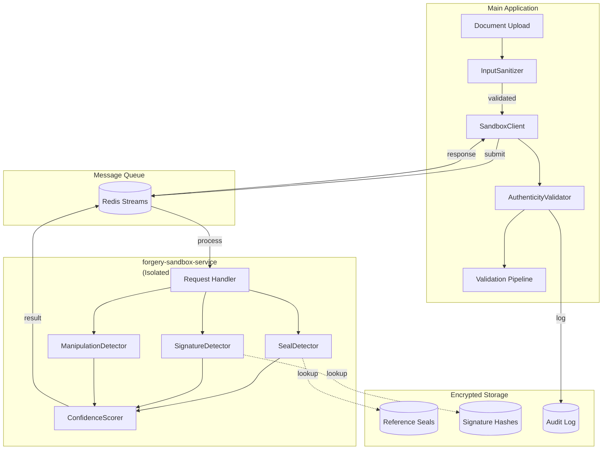

# 1019 - Feature: Forgery Detection: Seals and Signatures

<!-- Template Metadata
Last Updated: 2025-01-XX
Updated By: LLD Creation
Update Reason: Initial LLD creation for forgery detection system
-->

## 1. Context & Goal
* **Issue:** #19
* **Objective:** Add automated forgery detection for seals, signatures, and manipulation artifacts to flag suspicious documents for manual review before claims processing.
* **Status:** Draft
* **Related Issues:** #0087 (Async validator support - Complete)

### Open Questions

- [ ] What is the minimum size of the initial reference seal database for MVP launch?
- [ ] Should we support batch processing of multiple documents in a single request?
- [ ] What is the retention policy for perceptual hashes of reference signatures?
- [ ] How should the system handle documents with seals/signatures in non-standard locations?
- [ ] What queue system will be used for microservice communication (RabbitMQ, Redis, SQS)?

## 2. Proposed Changes

*This section is the **source of truth** for implementation. Describes exactly what will be built.*

### 2.1 Files Changed

| File | Change Type | Description |
|------|-------------|-------------|
| `src/extraction/forgery/__init__.py` | Add | Module initialization, exports public API |
| `src/extraction/forgery/seal_detector.py` | Add | Seal detection, clarity analysis, artifact detection |
| `src/extraction/forgery/signature_detector.py` | Add | Signature detection, handwritten verification, perceptual hash comparison |
| `src/extraction/forgery/manipulation_detector.py` | Add | ELA, compression analysis, metadata inspection |
| `src/extraction/forgery/confidence_scorer.py` | Add | Ensemble confidence scoring from multiple signals |
| `src/extraction/forgery/input_sanitizer.py` | Add | Client-side validation before sandbox submission |
| `src/extraction/forgery/sandbox_client.py` | Add | Async client for forgery-sandbox-service communication |
| `src/extraction/validators/authenticity_validator.py` | Add | Pipeline integration implementing validator interface |
| `src/extraction/models/forgery_result.py` | Add | Data models for all detection results |
| `config/forgery_thresholds.yaml` | Add | Configurable detection thresholds per document type |
| `services/forgery-sandbox-service/` | Add | Standalone microservice directory |
| `services/forgery-sandbox-service/Dockerfile` | Add | Ephemeral container definition |
| `services/forgery-sandbox-service/seccomp-profile.json` | Add | Syscall restriction profile |
| `services/forgery-sandbox-service/main.py` | Add | Service entry point |
| `services/forgery-sandbox-service/handlers/` | Add | Request handlers for each detection type |
| `tests/extraction/forgery/` | Add | Complete test suite |
| `tests/extraction/forgery/fixtures/` | Add | Test fixture directory structure |
| `tests/extraction/forgery/fixtures/malicious/` | Add | Malicious document test fixtures |
| `tools/forgery_analyze.py` | Add | Standalone CLI analysis tool |
| `tools/forgery_threshold_tuner.py` | Add | Threshold optimization utility |
| `docs/reports/19/implementation-report.md` | Add | Implementation details and deviations |
| `docs/reports/19/test-report.md` | Add | Test results and coverage |
| `docs/reports/19/model-evaluation-report.md` | Add | Detection accuracy metrics |

### 2.2 Dependencies

```toml
# pyproject.toml additions
opencv-python = "^4.9.0"
torch = "^2.2.0"  # CPU-only, no CUDA
python-magic = "^0.4.27"
Pillow = "^10.2.0"
imagehash = "^4.3.1"
pyyaml = "^6.0.1"
aiofiles = "^23.2.1"
httpx = "^0.27.0"  # Async HTTP client for sandbox service
```

### 2.3 Data Structures

```python
# Pseudocode - NOT implementation

class SeverityLevel(Enum):
    INFO = "info"          # Minor anomalies, proceed with caution
    WARNING = "warning"    # Moderate concerns, recommend manual review
    CRITICAL = "critical"  # High likelihood of forgery, block processing

class SealDetectionResult(TypedDict):
    detected: bool                    # Whether a seal was found
    bounding_box: tuple[int, int, int, int] | None  # (x, y, width, height)
    clarity_score: float              # Laplacian variance, >100 is clear
    confidence: float                 # 0.0-1.0 authenticity confidence
    artifacts: list[str]              # Detected forgery artifacts
    reference_match: str | None       # Matched reference seal ID if any

class SignatureDetectionResult(TypedDict):
    detected: bool                    # Whether signature found
    bounding_box: tuple[int, int, int, int] | None
    is_handwritten: bool              # True if handwritten, False if typed/stamped
    confidence: float                 # 0.0-1.0 authenticity confidence
    perceptual_hash: str | None       # pHash for reference comparison
    reference_similarity: float | None # Similarity to stored reference (0.0-1.0)
    anomalies: list[str]              # Detected issues

class ManipulationDetectionResult(TypedDict):
    ela_anomalies: list[dict]         # Error Level Analysis findings
    compression_inconsistencies: list[dict]  # JPEG compression analysis
    metadata_suspicious: bool         # Suspicious editing history
    splicing_artifacts: list[dict]    # Copy/paste boundary detection
    confidence: float                 # 0.0-1.0 manipulation likelihood

class ForgeryDetectionResult(TypedDict):
    document_id: str                  # Input document identifier
    timestamp: str                    # ISO 8601 timestamp
    seals: list[SealDetectionResult]  # All detected seals
    signatures: list[SignatureDetectionResult]  # All detected signatures
    manipulation: ManipulationDetectionResult
    overall_confidence: float         # Ensemble confidence score
    severity: SeverityLevel           # Aggregated severity level
    flags: list[str]                  # Human-readable flag list
    reasoning: str                    # Explanation for reviewers
    processing_time_ms: int           # Performance metric

class ForgeryFlag(TypedDict):
    code: str                         # e.g., "seal_anomaly", "signature_mismatch"
    severity: SeverityLevel
    message: str                      # Human-readable description
    location: dict | None             # Page number, coordinates
    confidence: float                 # Confidence in this specific flag
```

### 2.4 Function Signatures

```python
# src/extraction/forgery/seal_detector.py
class SealDetector:
    def __init__(self, config: SealDetectorConfig) -> None:
        """Initialize with detection thresholds and reference database path."""
        ...
    
    async def detect_seals(
        self, 
        image: np.ndarray,
        expected_regions: list[Region] | None = None
    ) -> list[SealDetectionResult]:
        """Detect all seals in image, optionally checking expected regions."""
        ...
    
    def check_clarity(self, seal_image: np.ndarray) -> float:
        """Return Laplacian variance score for seal clarity."""
        ...
    
    def detect_artifacts(self, seal_image: np.ndarray) -> list[str]:
        """Identify forgery artifacts: perfect circles, digital fonts, etc."""
        ...
    
    async def match_reference(
        self, 
        seal_image: np.ndarray
    ) -> tuple[str | None, float]:
        """Match against reference database, return (seal_id, similarity)."""
        ...


# src/extraction/forgery/signature_detector.py
class SignatureDetector:
    def __init__(self, config: SignatureDetectorConfig) -> None:
        """Initialize with thresholds and reference hash database path."""
        ...
    
    async def detect_signatures(
        self,
        image: np.ndarray,
        signature_lines: list[Region] | None = None
    ) -> list[SignatureDetectionResult]:
        """Detect signatures, optionally verifying presence on specified lines."""
        ...
    
    def is_handwritten(self, signature_image: np.ndarray) -> tuple[bool, float]:
        """Determine if signature is handwritten vs typed/stamped."""
        ...
    
    def compute_perceptual_hash(self, signature_image: np.ndarray) -> str:
        """Compute pHash/dHash for signature comparison."""
        ...
    
    async def compare_to_reference(
        self,
        signature_hash: str,
        signatory_id: str
    ) -> tuple[float, str | None]:
        """Compare hash to stored reference, return (similarity, reference_id)."""
        ...


# src/extraction/forgery/manipulation_detector.py
class ManipulationDetector:
    def __init__(self, config: ManipulationDetectorConfig) -> None:
        """Initialize with ELA thresholds and analysis parameters."""
        ...
    
    async def analyze(self, image: np.ndarray, metadata: dict) -> ManipulationDetectionResult:
        """Run full manipulation analysis on document image."""
        ...
    
    def error_level_analysis(self, image: np.ndarray) -> list[dict]:
        """Detect compression inconsistencies via ELA."""
        ...
    
    def detect_splicing(self, image: np.ndarray) -> list[dict]:
        """Detect copy/paste boundaries and splicing artifacts."""
        ...
    
    def analyze_metadata(self, metadata: dict) -> tuple[bool, list[str]]:
        """Check for suspicious editing history."""
        ...


# src/extraction/forgery/confidence_scorer.py
class ConfidenceScorer:
    def __init__(self, weights: ScorerWeights) -> None:
        """Initialize with signal weights for ensemble scoring."""
        ...
    
    def compute_ensemble_score(
        self,
        seal_results: list[SealDetectionResult],
        signature_results: list[SignatureDetectionResult],
        manipulation_result: ManipulationDetectionResult
    ) -> tuple[float, SeverityLevel]:
        """Combine all signals into calibrated confidence score and severity."""
        ...
    
    def generate_reasoning(
        self,
        results: ForgeryDetectionResult
    ) -> str:
        """Generate human-readable explanation for reviewers."""
        ...


# src/extraction/forgery/input_sanitizer.py
class InputSanitizer:
    def __init__(self, config: SanitizerConfig) -> None:
        """Initialize with size limits and allowed formats."""
        ...
    
    def validate_file(self, file_path: Path) -> ValidationResult:
        """Validate file before submission to sandbox."""
        ...
    
    def check_magic_bytes(self, file_path: Path) -> tuple[bool, str]:
        """Verify file type matches magic bytes."""
        ...
    
    def strip_metadata(self, image: np.ndarray) -> np.ndarray:
        """Remove EXIF and other metadata from image."""
        ...


# src/extraction/forgery/sandbox_client.py
class SandboxClient:
    def __init__(self, service_url: str, timeout: float = 30.0) -> None:
        """Initialize client for forgery-sandbox-service."""
        ...
    
    async def process_document(
        self,
        document_bytes: bytes,
        document_type: str
    ) -> ForgeryDetectionResult:
        """Submit document for sandboxed forgery analysis."""
        ...
    
    async def health_check(self) -> bool:
        """Verify sandbox service is available."""
        ...


# src/extraction/validators/authenticity_validator.py
class AuthenticityValidator:
    """Implements existing validator interface for pipeline integration."""
    
    def __init__(
        self,
        sandbox_client: SandboxClient,
        config: AuthenticityConfig
    ) -> None:
        """Initialize with sandbox client and validation config."""
        ...
    
    async def validate(
        self,
        document: ExtractedDocument,
        context: ValidationContext
    ) -> ValidationResult:
        """Run forgery detection and return validation result."""
        ...
    
    def should_block(self, result: ForgeryDetectionResult) -> bool:
        """Determine if document should be blocked from processing."""
        ...
```

### 2.5 Logic Flow (Pseudocode)

```
DOCUMENT PROCESSING PIPELINE:
1. Receive document upload
2. InputSanitizer.validate_file()
   - Check file size <= 50MB
   - Check dimensions <= 10000x10000px
   - Verify magic bytes match extension
   - IF validation fails THEN reject with error
3. Submit to SandboxClient.process_document()
   - Send document bytes via internal message queue
   - Sandbox service receives in isolated container

SANDBOX SERVICE PROCESSING:
4. In sandbox container (no network access):
   a. Sanitize image headers
   b. Convert document to images (if PDF)
   c. FOR each page/image:
      - SealDetector.detect_seals()
        - Find contours, filter by shape
        - Check clarity (Laplacian variance > 100)
        - Detect artifacts (perfect circles, digital fonts)
        - Match against reference database
      - SignatureDetector.detect_signatures()
        - Locate signature regions
        - Verify handwritten vs typed
        - Compute perceptual hash
        - Compare to reference if available
      - ManipulationDetector.analyze()
        - Run Error Level Analysis
        - Check compression consistency
        - Analyze metadata
        - Detect splicing artifacts
   d. ConfidenceScorer.compute_ensemble_score()
   e. Return ForgeryDetectionResult

PIPELINE INTEGRATION:
5. AuthenticityValidator receives result
6. Determine severity level:
   - IF overall_confidence < 0.65 OR critical flags THEN
     - severity = CRITICAL
     - Block automatic processing
   - ELSE IF warning flags present THEN
     - severity = WARNING
     - Route to manual review queue
   - ELSE
     - severity = INFO
     - Proceed with normal pipeline
7. Add detection results to document metadata
8. Write audit trail entry
9. Return ValidationResult with routing decision
```

### 2.6 Technical Approach

* **Module:** `src/extraction/forgery/`
* **Pattern:** 
  - Strategy pattern for different detection algorithms
  - Async processing throughout for non-blocking operation
  - Microservice isolation for security-critical processing
* **Key Decisions:**
  - Perceptual hashing (pHash/dHash) instead of raw signature storage for legal compliance
  - Separate sandbox microservice to isolate high-privilege container operations
  - CPU-only inference for cost efficiency (no GPU required)
  - Ensemble scoring for robust confidence calibration

### 2.7 Architecture Decisions

| Decision | Options Considered | Choice | Rationale |
|----------|-------------------|--------|-----------|
| Signature Storage | Raw images, Feature vectors, Perceptual hashes | Perceptual hashes (pHash/dHash) | Legal compliance - raw biometric storage creates liability; hashes are one-way and sufficient for similarity comparison |
| Sandbox Architecture | In-process isolation, Docker sidecar, Standalone microservice | Standalone microservice | Eliminates Docker socket access from main app; cleaner security boundary; easier to audit and scale |
| Signature Comparison | SIFT/ORB feature matching, CNN embedding, Perceptual hash | Perceptual hash | Feature matching requires raw images; CNN adds complexity; pHash provides good accuracy with hash-only storage |
| ML Inference | GPU inference, CPU inference, Cloud API | CPU inference | Cost effective for MVP throughput; avoids GPU infrastructure; maintains local-only processing requirement |
| Queue Technology | RabbitMQ, Redis Streams, AWS SQS | Redis Streams | Low latency, already in stack, sufficient durability for this use case |

**Architectural Constraints:**
- All image processing must occur within sandboxed microservice
- No signature/biometric data transmitted to external APIs
- Must integrate with existing async validator interface from Issue #0087
- Reference database access must be encrypted and logged

## 3. Requirements

*What must be true when this is done. These become acceptance criteria.*

1. **Seal Detection:** Detect presence/absence with ≥90% accuracy; flag forgery artifacts with ≥85% recall
2. **Signature Detection:** Detect presence with ≥95% accuracy; distinguish handwritten from typed/stamped
3. **Signature Comparison:** Perceptual hash similarity achieves ≥85% accuracy on reference match test set
4. **Manipulation Detection:** Detect ELA discrepancies with ≥90% accuracy; identify copy/paste artifacts
5. **Confidence Calibration:** 80% confidence predictions are correct 80% of the time (calibrated probabilities)
6. **Latency:** ≤500ms per document on c5.xlarge equivalent
7. **False Positive Rate:** ≤5% on legitimate document test set
8. **Security:** All processing in sandboxed containers; input sanitizer rejects 100% of malicious test fixtures
9. **Privacy:** No external API transmission; signatures stored as hashes only
10. **Audit Trail:** Complete logging of all detection runs with inputs, outputs, timestamps

## 4. Alternatives Considered

| Option | Pros | Cons | Decision |
|--------|------|------|----------|
| Raw signature storage with feature matching | Higher accuracy potential | Legal liability, storage costs, privacy risk | **Rejected** |
| Perceptual hash comparison | Privacy compliant, efficient storage, sufficient accuracy | Slightly lower accuracy than feature matching | **Selected** |
| Cloud-based forgery detection API | Lower development effort, maintained models | External data transmission violates requirements | **Rejected** |
| GPU inference | Faster processing | Higher infrastructure cost, complexity | **Rejected** for MVP |
| In-process sandboxing | Simpler deployment | Docker socket in main app, security risk | **Rejected** |
| Standalone microservice | Clean security boundary, auditable | Additional service to deploy | **Selected** |

**Rationale:** The selected options prioritize legal compliance (perceptual hashing), security (microservice isolation), and cost efficiency (CPU inference) while meeting accuracy requirements.

## 5. Data & Fixtures

### 5.1 Data Sources

| Attribute | Value |
|-----------|-------|
| Source | Uploaded claim documents (PDF, JPEG, PNG, TIFF) |
| Format | Binary image/document files |
| Size | Individual files ≤50MB; batch processing TBD |
| Refresh | Real-time per upload |
| Copyright/License | User-submitted documents, subject to terms of service |

| Attribute | Value |
|-----------|-------|
| Source | Reference seal database (curated) |
| Format | Encrypted image templates + perceptual hashes |
| Size | ~100-500 reference seals for MVP |
| Refresh | Manual curation |
| Copyright/License | Licensed from notary associations or collected with consent |

| Attribute | Value |
|-----------|-------|
| Source | Reference signature hashes (opt-in users) |
| Format | Perceptual hash strings (pHash + dHash) |
| Size | Variable per user base |
| Refresh | User-initiated |
| Copyright/License | User consent required for storage |

### 5.2 Data Pipeline

```
User Upload ──HTTP──► InputSanitizer ──validate──► SandboxClient
                                                      │
                                                      ▼
                                      ──queue──► forgery-sandbox-service
                                                      │
                                                      ▼
                                               [Isolated Processing]
                                                      │
                                                      ▼
                            ◄──queue──────────────────┘
                                      │
                                      ▼
                        AuthenticityValidator ──result──► Pipeline
                                      │
                                      ▼
                                 Audit Log (append-only)
```

### 5.3 Test Fixtures

| Fixture | Source | Notes |
|---------|--------|-------|
| Legitimate documents | Generated + anonymized samples | No real PII |
| Synthetic forgeries (seals) | Generated programmatically | Perfect circles, digital fonts |
| Synthetic forgeries (signatures) | Generated | Typed text, stamps |
| Copy-paste artifacts | Generated | Known manipulation patterns |
| Malicious files - zip bombs | Generated | 10KB → 10GB expansion |
| Malicious files - polyglots | Generated | PDF/ZIP hybrids |
| Malicious files - malformed headers | Generated | Buffer overflow attempts |
| Reference seals | Synthetic/licensed samples | For template matching tests |
| Reference signature hashes | Generated from test signatures | For comparison accuracy tests |

### 5.4 Deployment Pipeline

```
Development:
- Local sandbox service via docker-compose
- Test fixtures in repo
- Mocked reference databases

Testing/Staging:
- Dedicated sandbox service instance
- Synthetic reference database
- Full malicious fixture testing

Production:
- Auto-scaled sandbox service cluster
- Encrypted reference databases
- Append-only audit log storage
```

**External Data:** Reference seal database may require separate utility for management. Consider Issue for reference database management tooling if scope grows.

## 6. Diagram

### 6.1 Mermaid Quality Gate

Before finalizing any diagram, verify in [Mermaid Live Editor](https://mermaid.live) or GitHub preview:

- [x] **Simplicity:** Similar components collapsed (per 0006 §8.1)
- [x] **No touching:** All elements have visual separation (per 0006 §8.2)
- [x] **No hidden lines:** All arrows fully visible (per 0006 §8.3)
- [x] **Readable:** Labels not truncated, flow direction clear
- [ ] **Auto-inspected:** Agent rendered via mermaid.ink and viewed (per 0006 §8.5)

**Auto-Inspection Results:**
```
- Touching elements: [ ] None / [ ] Found: ___
- Hidden lines: [ ] None / [ ] Found: ___
- Label readability: [ ] Pass / [ ] Issue: ___
- Flow clarity: [ ] Clear / [ ] Issue: ___
```
*Note: Auto-inspection pending browser tool access*

### 6.2 Diagram



## 7. Security & Safety Considerations

### 7.1 Security

| Concern | Mitigation | Status |
|---------|------------|--------|
| Malicious file uploads | Magic byte validation, size limits, sandbox isolation | TODO |
| Buffer overflow via image headers | Header sanitization before OpenCV/Pillow processing | TODO |
| Reference database theft | AES-256 encryption at rest, access logging | TODO |
| Model weight tampering | Checksum verification on load, signed artifacts | TODO |
| Sandbox escape | Seccomp profile, no network, ephemeral containers | TODO |
| Injection via metadata | Metadata stripping before processing | TODO |
| Unauthorized reference access | Role-based access control, audit logging | TODO |

### 7.2 Safety

| Concern | Mitigation | Status |
|---------|------------|--------|
| Legitimate claim denial (false positive) | ≤5% FP rate target, human review for all flags | TODO |
| Processing timeout causing backlog | 30s timeout per document, circuit breaker | TODO |
| Sandbox service unavailable | Health checks, fallback to manual review queue | TODO |
| Resource exhaustion | Max file size (50MB), dimension limits, queue depth limits | TODO |
| Inconsistent detection across versions | Model versioning, A/B testing before rollout | TODO |

**Fail Mode:** Fail Closed - If forgery detection fails or times out, document is routed to manual review queue rather than auto-approved. Justification: Security-critical function should not fail open.

**Recovery Strategy:** 
- Sandbox service crash: Auto-restart via container orchestration; pending jobs reprocessed from queue
- Database corruption: Restore from encrypted backup; audit log append-only with checksums
- Partial detection failure: Return partial results with decreased confidence; flag for manual review

## 8. Performance & Cost Considerations

### 8.1 Performance

| Metric | Budget | Approach |
|--------|--------|----------|
| End-to-end latency | ≤500ms | Async processing, parallel detector execution |
| Per-detector latency | ≤150ms each | Optimized OpenCV operations, model quantization |
| Memory (sandbox) | ≤512MB | Stream processing, no document caching |
| Memory (main app) | ≤128MB | Minimal client code, async I/O |
| Throughput | 100 docs/min | Horizontal scaling of sandbox service |

**Bottlenecks:** 
- ELA computation is CPU-intensive (~100ms)
- Reference database lookups may require caching for high volume
- Model loading on cold start (~2s, mitigated by warm containers)

### 8.2 Cost Analysis

| Resource | Unit Cost | Estimated Usage | Monthly Cost |
|----------|-----------|-----------------|--------------|
| Sandbox instances (2x c5.xlarge) | $0.17/hr | 730 hrs × 2 | $248 |
| Redis Streams | Included | Existing infra | $0 |
| Model storage (500MB) | $0.023/GB | 0.5 GB | $0.01 |
| Reference DB storage | $0.023/GB | 10 GB | $0.23 |
| Audit log storage | $0.023/GB | 50 GB/month | $1.15 |
| **Total** | | | **~$250-300/mo** |

*Note: Issue estimate of $800-1200/month appears conservative; actual costs may be lower with proper optimization. Revisit after load testing.*

**Cost Controls:**
- [x] Budget alerts configured at $500/month threshold
- [ ] Rate limiting prevents runaway costs
- [ ] Auto-scaling with max instance limits

**Worst-Case Scenario:** 
- 10x traffic spike: Auto-scale to 10 instances (~$1240/mo temporary)
- 100x traffic spike: Queue backpressure kicks in, requests queued, some timeout; need capacity planning

## 9. Legal & Compliance

| Concern | Applies? | Mitigation |
|---------|----------|------------|
| PII/Personal Data | Yes | Signatures stored as hashes only; no raw biometric storage |
| Third-Party Licenses | Yes | OpenCV (Apache 2.0), PyTorch (BSD), imagehash (BSD) - all compatible |
| Terms of Service | No | No external APIs used |
| Data Retention | Yes | Audit logs retained per compliance policy; reference hashes retained until user revocation |
| Export Controls | No | No restricted algorithms |
| Biometric Regulations (BIPA, GDPR) | Yes | Perceptual hashes are not considered biometric data under most regulations; legal review recommended |

**Data Classification:** Confidential (contains derived biometric indicators)

**Compliance Checklist:**
- [ ] No PII stored without consent - Signatures stored as perceptual hashes only
- [x] All third-party licenses compatible with project license
- [x] External API usage compliant with provider ToS (N/A - no external APIs)
- [ ] Data retention policy documented
- [ ] Legal review of perceptual hash classification under biometric laws

## 10. Verification & Testing

*Ref: [0005-testing-strategy-and-protocols.md](0005-testing-strategy-and-protocols.md)*

**Testing Philosophy:** Strive for 100% automated test coverage. Manual tests are a last resort for scenarios that genuinely cannot be automated.

### 10.1 Test Scenarios

| ID | Scenario | Type | Input | Expected Output | Pass Criteria |
|----|----------|------|-------|-----------------|---------------|
| 010 | Seal detected on clean document | Auto | Document with valid notary seal | SealDetectionResult with detected=True, confidence≥0.8 | Seal detected, no artifacts flagged |
| 020 | Seal clarity verification | Auto | Clear seal image | clarity_score > 100 | Laplacian variance exceeds threshold |
| 030 | Blurry seal detection | Auto | Blurry seal image | clarity_score < 100 | Low clarity flagged |
| 040 | Perfect circle seal artifact | Auto | Synthetic perfect circle seal | artifacts contains "perfect_geometry" | Artifact detected |
| 050 | Digital font in seal | Auto | Seal with system font | artifacts contains "digital_font" | Artifact detected |
| 060 | Signature presence detection | Auto | Signed document | SignatureDetectionResult with detected=True | Signature found on expected line |
| 070 | Missing signature detection | Auto | Unsigned signature line | detected=False for that region | Missing signature flagged |
| 080 | Handwritten vs typed signature | Auto | Typed text in signature field | is_handwritten=False | Correctly classified as non-handwritten |
| 090 | Signature hash comparison - match | Auto | Matching signature pair | reference_similarity > 0.85 | High similarity score |
| 100 | Signature hash comparison - mismatch | Auto | Different signatories | reference_similarity < 0.5 | Low similarity, mismatch flagged |
| 110 | ELA anomaly detection | Auto | Document with compression inconsistency | ela_anomalies non-empty | Anomaly detected with location |
| 120 | Copy-paste artifact detection | Auto | Document with spliced region | splicing_artifacts non-empty | Splicing boundary detected |
| 130 | Suspicious metadata detection | Auto | Document with multiple editors | metadata_suspicious=True | Editing history flagged |
| 140 | Ensemble confidence scoring | Auto | Mixed signals | Calibrated overall_confidence | Score reflects signal combination |
| 150 | Severity level assignment - CRITICAL | Auto | Low confidence result | severity=CRITICAL | Correct severity assignment |
| 160 | Severity level assignment - WARNING | Auto | Moderate anomalies | severity=WARNING | Correct severity assignment |
| 170 | Severity level assignment - INFO | Auto | Clean document | severity=INFO | Correct severity assignment |
| 180 | Input sanitizer - valid file | Auto | Valid 10MB PDF | ValidationResult.valid=True | File accepted |
| 190 | Input sanitizer - oversized file | Auto | 60MB file | ValidationResult.valid=False, error="file_too_large" | Rejected with reason |
| 200 | Input sanitizer - wrong magic bytes | Auto | .pdf extension, JPEG content | ValidationResult.valid=False | Rejected with reason |
| 210 | Input sanitizer - zip bomb | Auto | Zip bomb file | ValidationResult.valid=False | Rejected, no decompression |
| 220 | Input sanitizer - polyglot file | Auto | PDF/ZIP hybrid | ValidationResult.valid=False | Rejected as suspicious |
| 230 | Input sanitizer - malformed header | Auto | Corrupted image header | ValidationResult.valid=False | Rejected safely, no crash |
| 240 | Pipeline integration - clean doc | Auto | Valid document | Proceeds through pipeline | authenticity: verified status |
| 250 | Pipeline integration - flagged doc | Auto | Suspicious document | Routed to manual review | Correct queue routing |
| 260 | Audit trail logging | Auto | Any detection run | Audit entry created | Entry contains inputs, outputs, timestamp |
| 270 | Sandbox service health check | Auto | Health endpoint | Returns healthy status | Service available |
| 280 | Sandbox network isolation | Auto | Attempt outbound request | Connection refused | No network access from sandbox |
| 290 | Latency under budget | Auto-Live | Standard document | processing_time_ms ≤ 500 | Meets performance target |
| 300 | False positive rate | Auto | 100 legitimate documents | ≤5 flagged incorrectly | FP rate ≤5% |

### 10.2 Test Commands

```bash
# Run all automated tests
poetry run pytest tests/extraction/forgery/ -v

# Run only fast/mocked tests (exclude live)
poetry run pytest tests/extraction/forgery/ -v -m "not live"

# Run live integration tests
poetry run pytest tests/extraction/forgery/ -v -m live

# Run with coverage
poetry run pytest tests/extraction/forgery/ -v --cov=src/extraction/forgery --cov-report=html

# Run specific detector tests
poetry run pytest tests/extraction/forgery/test_seal_detector.py -v
poetry run pytest tests/extraction/forgery/test_signature_detector.py -v
poetry run pytest tests/extraction/forgery/test_manipulation_detector.py -v

# Run security/malicious input tests
poetry run pytest tests/extraction/forgery/test_input_sanitizer.py -v

# Run performance tests (requires running sandbox service)
poetry run pytest tests/extraction/forgery/test_performance.py -v -m live
```

### 10.3 Manual Tests (Only If Unavoidable)

N/A - All scenarios automated.

*Full test results recorded in Implementation Report (0103) or Test Report (0113).*

## 11. Risks & Mitigations

| Risk | Impact | Likelihood | Mitigation |
|------|--------|------------|------------|
| Model accuracy below threshold on real-world data | High | Medium | Extensive validation testing; human review fallback; iterative model improvement |
| False positive rate causes legitimate claim delays | High | Medium | Conservative thresholds; ≤5% FP target; easy manual override |
| Adversarial attacks against detection models | High | Low | Model weight protection; input sanitization; monitoring for attack patterns |
| Sandbox escape vulnerability | High | Low | Seccomp profile; no network; ephemeral containers; regular security audits |
| Reference database compromise | High | Low | AES-256 encryption; access logging; minimal data (hashes only) |
| Performance degradation under load | Medium | Medium | Horizontal scaling; queue-based processing; latency monitoring |
| Legal challenge on biometric data handling | Medium | Low | Perceptual hash architecture; legal review; clear user consent |
| Integration issues with existing pipeline | Medium | Medium | Implements existing validator interface; integration tests |

## 12. Definition of Done

### Code
- [ ] Core forgery detection module implemented (`src/extraction/forgery/`)
- [ ] All three detectors (seal, signature, manipulation) functional
- [ ] Input sanitization client implemented
- [ ] Sandbox microservice implemented (`services/forgery-sandbox-service/`)
- [ ] Pipeline integration via AuthenticityValidator complete
- [ ] Code comments reference this LLD
- [ ] All code passes linting

### Tests
- [ ] All test scenarios pass (≥80% coverage)
- [ ] Malicious input fixtures tested (100% rejection)
- [ ] Integration tests with validation pipeline passing
- [ ] Performance tests confirm ≤500ms latency
- [ ] False positive rate verified ≤5%

### Documentation
- [ ] LLD updated with any deviations
- [ ] Implementation Report (`docs/reports/19/implementation-report.md`) completed
- [ ] Test Report (`docs/reports/19/test-report.md`) completed
- [ ] Model Evaluation Report (`docs/reports/19/model-evaluation-report.md`) completed
- [ ] ADR for forgery detection architecture decisions created
- [ ] ADR for signature storage decision (perceptual hashes vs. raw images) created
- [ ] ADR for sandbox microservice architecture decision created
- [ ] `config/forgery_thresholds.yaml` documented
- [ ] API documentation for new modules added
- [ ] New files added to `docs/0003-file-inventory.md`
- [ ] Wiki pages for validation pipeline updated

### Tools
- [ ] `tools/forgery_analyze.py` created and documented
- [ ] `tools/forgery_threshold_tuner.py` created and documented

### Review
- [ ] Run 0809 Security Audit - PASS
- [ ] Run 0810 Privacy Audit - PASS
- [ ] Run 0817 Wiki Alignment Audit - PASS
- [ ] Code review completed
- [ ] User approval before closing issue

---

## Appendix: Review Log

*Track all review feedback with timestamps and implementation status.*

### Review Summary

| Review | Date | Verdict | Key Issue |
|--------|------|---------|-----------|
| - | - | - | Pending first review |

**Final Status:** PENDING
<!-- Note: This field is auto-updated to APPROVED by the workflow when finalized -->