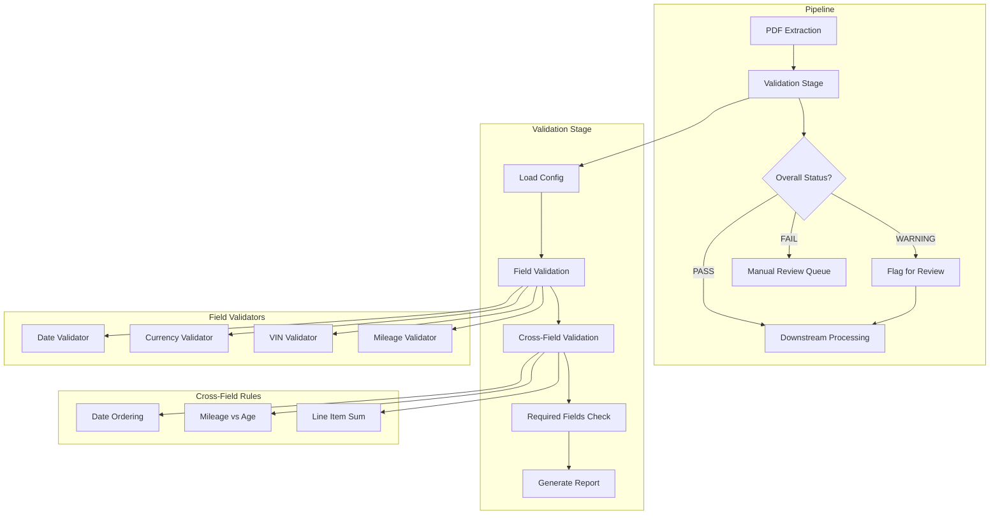

# 120 - Feature: Automated Data Validation for PDF Extraction Pipeline

<!-- Template Metadata
Last Updated: 2026-02-02
Updated By: Issue #117 fix
Update Reason: Moved Verification & Testing to Section 10 (was Section 11) to match 0702c review prompt and testing workflow expectations
Previous: Added sections based on 80 blocking issues from 164 governance verdicts (2026-02-01)
-->

## 1. Context & Goal
* **Issue:** #20
* **Objective:** Add an automated validation layer after PDF extraction that validates field formats, cross-field consistency, and flags suspicious values for review
* **Status:** Draft
* **Related Issues:** None — can be implemented independently of other pipeline work

### Open Questions
*Questions that need clarification before or during implementation. Remove when resolved.*

- [ ] Should date format validation prefer MM/DD/YYYY or ISO8601 when both could parse the same string?
- [ ] What is the expected volume of documents per day to validate (for performance testing baseline)?

## 2. Proposed Changes

*This section is the **source of truth** for implementation. Describe exactly what will be built.*

### 2.1 Files Changed

| File | Change Type | Description |
|------|-------------|-------------|
| `src/validation/__init__.py` | Add | Package initializer for validation module (parent `src/` exists) |
| `src/validation/validators.py` | Add | Core validation functions (date, VIN, currency, mileage) |
| `src/validation/schemas.py` | Add | Pydantic models for document type validation |
| `src/validation/rules.py` | Add | Cross-field validation rule engine |
| `src/validation/report.py` | Add | Validation report generation |
| `src/validation/vin_decoder.py` | Add | VIN checksum and year decoding utilities |
| `src/elementizer/__init__.py` | Modify | Register validation stage in pipeline |
| `src/validation/stages/__init__.py` | Add | Pipeline stages subpackage initializer |
| `src/validation/stages/validate.py` | Add | Pipeline stage integration |
| `config/validation_rules.yaml` | Add | Document-type-specific validation configuration (parent `config/` exists) |
| `tools/validate_extraction.py` | Add | CLI tool for running validation on extracted JSON |
| `tools/validate_config.py` | Add | CLI tool for validating configuration files |
| `tests/test_validation/__init__.py` | Add | Test package initializer (parent `tests/` exists) |
| `tests/test_validation/test_validators.py` | Add | Unit tests for core validators |
| `tests/test_validation/test_schemas.py` | Add | Unit tests for Pydantic schemas |
| `tests/test_validation/test_rules.py` | Add | Unit tests for cross-field rules |
| `tests/test_validation/test_report.py` | Add | Unit tests for report generation |
| `tests/test_validation/test_vin_decoder.py` | Add | Unit tests for VIN utilities |
| `tests/test_validation/test_pipeline_integration.py` | Add | Integration tests for pipeline stage |
| `tests/test_validation/fixtures/__init__.py` | Add | Fixtures subpackage initializer |
| `tests/test_validation/fixtures/valid_auto_claim.json` | Add | Valid auto claim fixture |
| `tests/test_validation/fixtures/valid_property_claim.json` | Add | Valid property claim fixture |
| `tests/test_validation/fixtures/invalid_vin_checksum.json` | Add | Invalid VIN checksum fixture |
| `tests/test_validation/fixtures/invalid_date_format.json` | Add | Invalid date format fixture |
| `tests/test_validation/fixtures/missing_required_fields.json` | Add | Missing required fields fixture |
| `tests/test_validation/fixtures/warning_high_mileage.json` | Add | High mileage warning fixture |
| `tests/test_validation/fixtures/warning_sum_mismatch.json` | Add | Sum mismatch within tolerance fixture |
| `docs/validation-rules-reference.md` | Add | Validation rules reference documentation |

### 2.1.1 Path Validation (Mechanical - Auto-Checked)

*Issue #277: Before human or Gemini review, paths are verified programmatically.*

Mechanical validation automatically checks:
- All "Modify" files must exist in repository
- All "Delete" files must exist in repository
- All "Add" files must have existing parent directories
- No placeholder prefixes (`src/`, `lib/`, `app/`) unless directory exists

**Path Validation Notes:**
- `src/` directory exists (verified)
- `tests/` directory exists (verified)
- `config/` directory exists (verified)
- `docs/` directory exists (verified)
- `tools/` directory exists (verified)
- `src/elementizer/__init__.py` exists (modified to register validation)
- New directories (`src/validation/`, `tests/test_validation/`) will be created as part of file addition

**If validation fails, the LLD is BLOCKED before reaching review.**

### 2.2 Dependencies

*New packages, APIs, or services required.*

```toml
# pyproject.toml additions (if any)
pydantic = "^2.0"  # Likely already present; verify version
pyyaml = "^6.0"    # For YAML configuration parsing
```

### 2.3 Data Structures

```python
# Pseudocode - NOT implementation
from enum import Enum
from typing import TypedDict

class ValidationSeverity(Enum):
    ERROR = "error"      # Blocks pipeline
    WARNING = "warning"  # Flags for review

class FieldValidationResult(TypedDict):
    field_path: str           # e.g., "vehicle.vin"
    is_valid: bool            # True if passed validation
    confidence: int           # 0-100 confidence score
    severity: ValidationSeverity | None  # Only set if is_valid=False
    message: str              # Human-readable result
    rule_name: str            # Which validation rule was applied

class ValidationReport(TypedDict):
    document_id: str                      # Reference to source document
    document_type: str                    # e.g., "auto_claim"
    timestamp: str                        # ISO8601 validation timestamp
    overall_status: str                   # "PASS", "WARNING", "FAIL"
    field_results: list[FieldValidationResult]
    cross_field_results: list[FieldValidationResult]
    error_count: int
    warning_count: int

class ValidationConfig(TypedDict):
    document_type: str
    required_fields: list[str]
    field_rules: dict[str, dict]         # Field-specific rule configs
    cross_field_rules: list[str]         # Enabled cross-field rule names
    thresholds: dict[str, float | int]   # Configurable limits
```

### 2.4 Function Signatures

```python
# src/validation/validators.py
def validate_date(value: str, formats: list[str] | None = None) -> tuple[bool, int, str]:
    """Validate date string against supported formats. Returns (valid, confidence, message)."""
    ...

def validate_currency(value: float | str, min_val: float = 0.01, max_val: float = 10_000_000) -> tuple[bool, int, str]:
    """Validate currency amount is positive and within range."""
    ...

def validate_vin(value: str) -> tuple[bool, int, str]:
    """Validate VIN is 17 characters with valid checksum."""
    ...

def validate_mileage(value: int | str, min_val: int = 0, max_val: int = 500_000) -> tuple[bool, int, str]:
    """Validate mileage is numeric and within range."""
    ...

def validate_policy_number(value: str, pattern: str) -> tuple[bool, int, str]:
    """Validate policy number against configurable regex pattern."""
    ...

# src/validation/vin_decoder.py
def calculate_vin_checksum(vin: str) -> str:
    """Calculate expected checksum digit for VIN."""
    ...

def decode_vin_year(vin: str) -> int | None:
    """Extract model year from VIN 10th digit. Returns year or None if invalid."""
    ...

def estimate_vehicle_age_years(vin: str, reference_date: str | None = None) -> int | None:
    """Calculate vehicle age in years from VIN."""
    ...

# src/validation/rules.py
def check_date_ordering(loss_date: str, effective_date: str, expiration_date: str) -> FieldValidationResult:
    """Verify loss date is within policy period."""
    ...

def check_mileage_vs_age(mileage: int, vin: str, max_miles_per_year: int = 15_000) -> FieldValidationResult:
    """Cross-validate mileage against vehicle age derived from VIN."""
    ...

def check_line_item_sum(items: list[dict], total: float, tolerance: float = 0.01) -> FieldValidationResult:
    """Verify line items sum to total within tolerance."""
    ...

def check_required_fields(data: dict, required: list[str]) -> list[FieldValidationResult]:
    """Check all required fields are present and non-empty."""
    ...

# src/validation/schemas.py
def get_schema_for_document_type(doc_type: str) -> type:
    """Return appropriate Pydantic model for document type."""
    ...

# src/validation/report.py
def generate_validation_report(
    document_id: str,
    document_type: str,
    field_results: list[FieldValidationResult],
    cross_field_results: list[FieldValidationResult]
) -> ValidationReport:
    """Generate structured validation report."""
    ...

def sanitize_report_for_logging(report: ValidationReport) -> dict:
    """Strip PII from report for non-secure logging."""
    ...

# src/validation/stages/validate.py
def validate_extraction(
    extracted_data: dict,
    document_type: str,
    config_path: str = "config/validation_rules.yaml"
) -> tuple[ValidationReport, bool]:
    """Run validation on extracted data. Returns (report, should_proceed)."""
    ...

# tools/validate_extraction.py
def main(input_file: str, document_type: str, config_path: str) -> int:
    """CLI entrypoint for validating extracted JSON files."""
    ...

# tools/validate_config.py
def main(config_path: str) -> int:
    """CLI entrypoint for validating configuration files."""
    ...
```

### 2.5 Logic Flow (Pseudocode)

```
VALIDATION PIPELINE STAGE:

1. Receive extracted_data and document_type
2. Load validation config from YAML using yaml.safe_load
3. Get Pydantic schema for document_type
4. Initialize results collectors

FIELD VALIDATION:
5. FOR each field in extracted_data:
   a. Get field-specific rules from config
   b. Run appropriate validator (date/currency/vin/mileage/policy)
   c. Collect FieldValidationResult
   d. IF validator raises Pydantic ValidationError:
      - Strip 'input' field from error before logging
      - Record as validation failure

CROSS-FIELD VALIDATION:
6. FOR each enabled cross_field_rule:
   a. IF rule is "date_ordering":
      - Check loss_date within policy period
   b. IF rule is "mileage_vs_age":
      - Decode year from VIN 10th digit
      - Calculate max expected mileage
      - Flag WARNING if exceeded
   c. IF rule is "line_item_sum":
      - Sum line items
      - Compare to total within tolerance
   d. Collect FieldValidationResult

REQUIRED FIELDS CHECK:
7. Get required_fields for document_type from config
8. Check each required field exists and non-empty
9. Collect missing field results as ERROR severity

REPORT GENERATION:
10. Count errors and warnings
11. Determine overall_status:
    - "FAIL" if error_count > 0
    - "WARNING" if warning_count > 0 and error_count = 0
    - "PASS" otherwise
12. Generate ValidationReport

PIPELINE DECISION:
13. IF overall_status = "FAIL":
    - Return (report, should_proceed=False)
    - Pipeline halts
14. ELSE:
    - Return (report, should_proceed=True)
    - Data proceeds (with warnings flagged)
```

### 2.6 Technical Approach

* **Module:** `src/validation/`
* **Pattern:** Strategy pattern for validators; Rule Engine for cross-field validation
* **Key Decisions:**
  - Pydantic v2 for schema validation with custom validators
  - Local VIN decoding (no external API) using 10th digit year chart
  - YAML configuration for flexibility without code changes
  - Composable validation functions that can be enabled/disabled per document type
  - Explicit PII stripping in error handling to prevent log leakage

### 2.7 Architecture Decisions

*Document key architectural decisions that affect the design.*

| Decision | Options Considered | Choice | Rationale |
|----------|-------------------|--------|-----------|
| Validation framework | Custom validators, Pydantic, Cerberus | Pydantic v2 | Already in stack, excellent performance, native Python type hints |
| VIN year decoding | External NHTSA API, Local lookup table | Local lookup | No network dependency, faster, sufficient for age-based mileage check |
| Configuration format | JSON, YAML, TOML, Python dicts | YAML | Human-readable, supports comments, easy to edit |
| Error severity model | Binary pass/fail, Three-tier (error/warning/info) | Two-tier (ERROR/WARNING) | Matches issue requirements; INFO adds complexity without value |
| Pipeline integration | Middleware, Discrete stage, Decorator | Discrete stage | Matches existing pipeline architecture, clear separation of concerns |

**Architectural Constraints:**
- Must integrate with existing pipeline stage pattern
- Cannot introduce external API dependencies (per issue scope)
- Validation reports with PII must not be written to application logs
- Configuration files must use safe YAML loading only

## 3. Requirements

*What must be true when this is done. These become acceptance criteria.*

1. Date fields validated for MM/DD/YYYY and ISO8601 formats
2. Currency amounts validated as positive numbers within configured range (default: $0.01 - $10,000,000)
3. VIN validated for 17-character length and valid checksum
4. Mileage validated as numeric within configured range (default: 0 - 500,000)
5. Mileage cross-validated against vehicle age derived from VIN 10th digit (WARNING if >15,000 miles/year)
6. Cross-field date ordering enforced (loss date within policy period)
7. Line item sum validation with configurable tolerance (default: $0.01)
8. Required field presence checked based on document type configuration
9. Validation report generated in structured JSON format with confidence scores
10. Issues categorized as ERROR or WARNING based on severity
11. Validation rules configurable per document type via YAML
12. Default validation values defined in `config/validation_rules.yaml`
13. Pipeline blocks on ERROR-level validation failures
14. Pipeline proceeds with WARNING-level issues flagged for review

## 4. Alternatives Considered

| Option | Pros | Cons | Decision |
|--------|------|------|----------|
| Pydantic v2 with custom validators | Native Python types, fast, already in stack | Learning curve for custom validators | **Selected** |
| Cerberus validation library | Purpose-built for validation, declarative | Another dependency, less Python-native | Rejected |
| Custom validation framework | Full control, no dependencies | More code to maintain, reinventing wheel | Rejected |
| External VIN API (NHTSA) | Authoritative data, full decode | Network dependency, rate limits, latency | Rejected |
| Local VIN 10th digit decode | No network, fast, sufficient for MVP | Limited to year only, not full decode | **Selected** |

**Rationale:** Pydantic v2 provides excellent validation capabilities with minimal overhead and is already part of the project stack. Local VIN decoding meets MVP requirements without introducing external dependencies or latency.

## 5. Data & Fixtures

*Per [0108-lld-pre-implementation-review.md](0108-lld-pre-implementation-review.md) - complete this section BEFORE implementation.*

### 5.1 Data Sources

| Attribute | Value |
|-----------|-------|
| Source | PDF extraction pipeline output (upstream) |
| Format | JSON (structured extracted data) |
| Size | Individual documents, typically 1-50KB each |
| Refresh | Real-time (per document processed) |
| Copyright/License | N/A (internal pipeline data) |

### 5.2 Data Pipeline

```
PDF Extraction Stage ──JSON output──► Validation Stage ──JSON + Report──► Downstream Processing
                                            │
                                            └──(if ERROR)──► Manual Review Queue
```

### 5.3 Test Fixtures

| Fixture | Source | Notes |
|---------|--------|-------|
| `valid_auto_claim.json` | Generated | Valid auto claim with all required fields |
| `valid_property_claim.json` | Generated | Valid property claim with all required fields |
| `invalid_vin_checksum.json` | Generated | Auto claim with deliberately invalid VIN |
| `invalid_date_format.json` | Generated | Document with malformed date strings |
| `missing_required_fields.json` | Generated | Auto claim missing VIN and mileage |
| `warning_high_mileage.json` | Generated | Valid structure but suspicious mileage value |
| `warning_sum_mismatch.json` | Generated | Line items sum differs from total by < tolerance |

**Data Hygiene:** All fixtures use synthetic data with no real PII. VINs use test patterns from NHTSA documentation.

### 5.4 Deployment Pipeline

Configuration file (`config/validation_rules.yaml`) deployed alongside application code. Changes to validation thresholds require deployment cycle.

**No external data utilities needed** — validation operates on pipeline-internal data.

## 6. Diagram

### 6.1 Mermaid Quality Gate

Before finalizing any diagram, verify in [Mermaid Live Editor](https://mermaid.live) or GitHub preview:

- [x] **Simplicity:** Similar components collapsed (per 0006 §8.1)
- [x] **No touching:** All elements have visual separation (per 0006 §8.2)
- [x] **No hidden lines:** All arrows fully visible (per 0006 §8.3)
- [x] **Readable:** Labels not truncated, flow direction clear
- [ ] **Auto-inspected:** Agent rendered via mermaid.ink and viewed (per 0006 §8.5)

**Agent Auto-Inspection (MANDATORY):**

AI agents MUST render and view the diagram before committing:
1. Base64 encode diagram → fetch PNG from `https://mermaid.ink/img/{base64}`
2. Read the PNG file (multimodal inspection)
3. Document results below

**Auto-Inspection Results:**
```
- Touching elements: [ ] None / [ ] Found: ___
- Hidden lines: [ ] None / [ ] Found: ___
- Label readability: [ ] Pass / [ ] Issue: ___
- Flow clarity: [ ] Clear / [ ] Issue: ___
```

*Reference: [0006-mermaid-diagrams.md](0006-mermaid-diagrams.md)*

### 6.2 Diagram



## 7. Security & Safety Considerations

*This section addresses security (10 patterns) and safety (9 patterns) concerns from governance feedback.*

### 7.1 Security

| Concern | Mitigation | Status |
|---------|------------|--------|
| YAML deserialization attack | Use `yaml.safe_load` exclusively; never `yaml.load` | Addressed |
| PII leakage in logs | Strip `input` field from Pydantic ValidationError before logging | Addressed |
| PII in validation reports | Store reports in secure document database only; not in CloudWatch/stdout | Addressed |
| Configuration tampering | Config files read-only in production | Addressed |
| Input injection via field values | Validation functions treat all input as untrusted data; no eval/exec | Addressed |

### 7.2 Safety

*Safety concerns focus on preventing data loss, ensuring fail-safe behavior, and protecting system integrity.*

| Concern | Mitigation | Status |
|---------|------------|--------|
| False positive blocks valid data | Two-tier severity (ERROR vs WARNING); only ERRORs block | Addressed |
| Validation crash loses data | Validation errors caught and reported; extraction data preserved | Addressed |
| Config file missing/corrupt | Fail closed with clear error; don't proceed without valid config | Addressed |
| Regex catastrophic backtracking | Use bounded regex patterns; test with pathological inputs | Addressed |

**Fail Mode:** Fail Closed - If validation cannot complete (config missing, unexpected error), pipeline halts rather than passing unvalidated data.

**Recovery Strategy:** On validation failure, extraction output is preserved. Manual review queue allows re-processing after correction. Validation can be re-run via CLI tool on saved JSON.

## 8. Performance & Cost Considerations

*This section addresses performance and cost concerns (6 patterns) from governance feedback.*

### 8.1 Performance

| Metric | Budget | Approach |
|--------|--------|----------|
| Latency | < 50ms per document | Pydantic is highly optimized; no external calls |
| Memory | < 10MB overhead | Stream processing; no large data structures |
| CPU | Negligible | Regex and arithmetic operations only |

**Bottlenecks:** None expected. Pydantic validation adds minimal overhead per document. VIN checksum calculation is O(1).

### 8.2 Cost Analysis

| Resource | Unit Cost | Estimated Usage | Monthly Cost |
|----------|-----------|-----------------|--------------|
| Compute | Negligible | Per-document validation | $0 incremental |
| Storage (reports) | Existing DB costs | ~1KB per report | Negligible |
| External APIs | N/A | None used | $0 |

**Cost Controls:**
- [x] No external API calls — zero marginal cost per validation
- [x] Reports stored in existing secure database — no new storage costs

**Worst-Case Scenario:** Even at 100x document volume, validation remains CPU-bound with sub-second overhead. No external dependencies to throttle or charge per-call.

## 9. Legal & Compliance

*This section addresses legal concerns (8 patterns) from governance feedback.*

| Concern | Applies? | Mitigation |
|---------|----------|------------|
| PII/Personal Data | Yes | Validation reports stored in secure DB only; PII stripped from logs |
| Third-Party Licenses | No | No new third-party dependencies (Pydantic/PyYAML already licensed) |
| Terms of Service | No | No external API usage |
| Data Retention | Yes | Reports inherit same retention policy as extraction outputs |
| Export Controls | No | No restricted algorithms |

**Data Classification:** Confidential (contains PII from claims)

**Compliance Checklist:**
- [x] No PII stored without consent (data already in pipeline with consent)
- [x] All third-party licenses compatible with project license
- [x] External API usage compliant with provider ToS (N/A — none used)
- [x] Data retention policy documented (inherits from extraction outputs)

## 10. Verification & Testing

*Ref: [0005-testing-strategy-and-protocols.md](0005-testing-strategy-and-protocols.md)*

**Testing Philosophy:** Strive for 100% automated test coverage. Manual tests are a last resort for scenarios that genuinely cannot be automated.

### 10.0 Test Plan (TDD - Complete Before Implementation)

**TDD Requirement:** Tests MUST be written and failing BEFORE implementation begins.

| Test ID | Test Description | Expected Behavior | Status |
|---------|------------------|-------------------|--------|
| T010 | test_validate_date_mmddyyyy | Returns (True, 100, msg) for valid MM/DD/YYYY | RED |
| T020 | test_validate_date_iso8601 | Returns (True, 100, msg) for valid ISO8601 | RED |
| T030 | test_validate_date_invalid | Returns (False, 0, msg) for invalid format | RED |
| T040 | test_validate_currency_valid | Returns (True, 100, msg) for valid amount | RED |
| T050 | test_validate_currency_negative | Returns (False, 0, msg) for negative | RED |
| T060 | test_validate_currency_out_of_range | Returns (False, 0, msg) for amount > max | RED |
| T070 | test_validate_vin_valid | Returns (True, 100, msg) for valid VIN with correct checksum | RED |
| T080 | test_validate_vin_invalid_checksum | Returns (False, 0, msg) for incorrect checksum | RED |
| T090 | test_validate_vin_wrong_length | Returns (False, 0, msg) for non-17 char VIN | RED |
| T100 | test_validate_mileage_valid | Returns (True, 100, msg) for valid mileage | RED |
| T110 | test_validate_mileage_negative | Returns (False, 0, msg) for negative mileage | RED |
| T120 | test_validate_mileage_out_of_range | Returns (False, 0, msg) for mileage > max | RED |
| T130 | test_decode_vin_year | Returns correct year from 10th digit | RED |
| T140 | test_check_date_ordering_valid | Returns valid result when loss in policy period | RED |
| T150 | test_check_date_ordering_before_effective | Returns ERROR when loss before effective | RED |
| T160 | test_check_date_ordering_after_expiration | Returns ERROR when loss after expiration | RED |
| T170 | test_check_mileage_vs_age_reasonable | Returns valid for reasonable mileage | RED |
| T180 | test_check_mileage_vs_age_high | Returns WARNING for high mileage | RED |
| T190 | test_check_line_item_sum_exact | Returns valid when sum matches | RED |
| T200 | test_check_line_item_sum_within_tolerance | Returns valid within tolerance | RED |
| T210 | test_check_line_item_sum_exceeds_tolerance | Returns ERROR when exceeds tolerance | RED |
| T220 | test_check_required_fields_present | Returns valid when all required present | RED |
| T230 | test_check_required_fields_missing | Returns ERROR for each missing field | RED |
| T240 | test_generate_report_pass | Generates PASS status report | RED |
| T250 | test_generate_report_warning | Generates WARNING status report | RED |
| T260 | test_generate_report_fail | Generates FAIL status report | RED |
| T270 | test_sanitize_report_strips_pii | Confirms PII fields removed for logging | RED |
| T280 | test_pipeline_blocks_on_error | Pipeline returns should_proceed=False on ERROR | RED |
| T290 | test_pipeline_proceeds_on_warning | Pipeline returns should_proceed=True on WARNING | RED |
| T300 | test_config_loading_safe_load | Verifies yaml.safe_load used | RED |

**Coverage Target:** ≥95% for all new code

**TDD Checklist:**
- [ ] All tests written before implementation
- [ ] Tests currently RED (failing)
- [ ] Test IDs match scenario IDs in 10.1
- [ ] Test file created at: `tests/test_validation/test_validators.py`, `tests/test_validation/test_rules.py`, etc.

### 10.1 Test Scenarios

| ID | Scenario | Type | Input | Expected Output | Pass Criteria |
|----|----------|------|-------|-----------------|---------------|
| 010 | Valid MM/DD/YYYY date | Auto | "01/15/2024" | (True, 100, "Valid date") | Returns valid tuple |
| 020 | Valid ISO8601 date | Auto | "2024-01-15" | (True, 100, "Valid date") | Returns valid tuple |
| 030 | Invalid date format | Auto | "2024/01/15" | (False, 0, "Invalid format") | Returns invalid tuple |
| 040 | Valid currency | Auto | 1500.00 | (True, 100, "Valid amount") | Returns valid tuple |
| 050 | Negative currency | Auto | -100.00 | (False, 0, "Negative") | Returns invalid tuple |
| 060 | Currency exceeds max | Auto | 50000000.00 | (False, 0, "Exceeds max") | Returns invalid tuple |
| 070 | Valid VIN with checksum | Auto | "1HGBH41JXMN109186" | (True, 100, "Valid VIN") | Returns valid tuple |
| 080 | Invalid VIN checksum | Auto | "1HGBH41JXMN109187" | (False, 0, "Invalid checksum") | Returns invalid tuple |
| 090 | VIN wrong length | Auto | "1HGBH41J" | (False, 0, "Invalid length") | Returns invalid tuple |
| 100 | Valid mileage | Auto | 50000 | (True, 100, "Valid mileage") | Returns valid tuple |
| 110 | Negative mileage | Auto | -1000 | (False, 0, "Negative") | Returns invalid tuple |
| 120 | Mileage exceeds max | Auto | 600000 | (False, 0, "Exceeds max") | Returns invalid tuple |
| 130 | VIN year decode | Auto | "1HGBH41JXMN109186" | 2021 | Returns correct year |
| 140 | Date ordering valid | Auto | loss=01/15/2024, eff=01/01/2024, exp=12/31/2024 | Valid result | Cross-field passes |
| 150 | Loss before effective | Auto | loss=12/15/2023, eff=01/01/2024 | ERROR result | Cross-field fails |
| 160 | Loss after expiration | Auto | loss=01/15/2025, exp=12/31/2024 | ERROR result | Cross-field fails |
| 170 | Reasonable mileage for age | Auto | mileage=45000, 3yr old VIN | Valid result | Cross-field passes |
| 180 | High mileage for age | Auto | mileage=100000, 3yr old VIN | WARNING result | Cross-field warns |
| 190 | Line items sum exact | Auto | items=[100,200], total=300 | Valid result | Sum matches |
| 200 | Sum within tolerance | Auto | items=[100.004,200], total=300 | Valid result | Within $0.01 |
| 210 | Sum exceeds tolerance | Auto | items=[100,200], total=301 | ERROR result | Exceeds tolerance |
| 220 | All required fields present | Auto | auto_claim fixture | Valid result | All required found |
| 230 | Missing required fields | Auto | auto_claim missing VIN | ERROR per missing | Missing flagged |
| 240 | Report status PASS | Auto | No errors/warnings | overall_status="PASS" | Report correct |
| 250 | Report status WARNING | Auto | Warnings, no errors | overall_status="WARNING" | Report correct |
| 260 | Report status FAIL | Auto | Has errors | overall_status="FAIL" | Report correct |
| 270 | PII sanitization | Auto | Report with PII | PII fields removed | Sanitized output |
| 280 | Pipeline blocks on ERROR | Auto | Invalid VIN document | should_proceed=False | Pipeline halts |
| 290 | Pipeline proceeds on WARNING | Auto | High mileage document | should_proceed=True | Pipeline continues |
| 300 | YAML safe_load used | Auto | Config file path | No unsafe load calls | Security verified |

### 10.2 Test Commands

```bash
# Run all validation tests
poetry run pytest tests/test_validation/ -v

# Run only fast/mocked tests (exclude live)
poetry run pytest tests/test_validation/ -v -m "not live"

# Run with coverage
poetry run pytest tests/test_validation/ -v --cov=src/validation --cov-report=term-missing

# Run specific test file
poetry run pytest tests/test_validation/test_validators.py -v
```

### 10.3 Manual Tests (Only If Unavoidable)

**N/A - All scenarios automated.**

## 11. Risks & Mitigations

| Risk | Impact | Likelihood | Mitigation |
|------|--------|------------|------------|
| Ambiguous date formats (01/02/2024) | Med | Med | Document format preference in config; log when ambiguous |
| VIN year decode for very old vehicles | Low | Low | Support years 1980-2030; log warning for unknown |
| False positives block valid claims | High | Low | Conservative ERROR thresholds; most edge cases are WARNINGs |
| Config file drift across environments | Med | Med | Validate config on startup; include in deployment checks |
| Pydantic v2 breaking changes | Med | Low | Pin version; test on upgrade |

## 12. Definition of Done

### Code
- [ ] Implementation complete and linted
- [ ] Code comments reference this LLD (#20)

### Tests
- [ ] All test scenarios pass
- [ ] Test coverage ≥95% for validation module

### Documentation
- [ ] LLD updated with any deviations
- [ ] Implementation Report (0103) completed
- [ ] Test Report (0113) completed if applicable
- [ ] Pipeline architecture wiki page updated with validation stage
- [ ] Validation rules reference documentation created (`docs/validation-rules-reference.md`)

### Review
- [ ] Code review completed
- [ ] User approval before closing issue

### Reports (Pre-Merge Gate)
- [ ] `docs/reports/20/implementation-report.md` created
- [ ] `docs/reports/20/test-report.md` created

### Verification
- [ ] Run 0809 Security Audit - PASS
- [ ] Run 0817 Wiki Alignment Audit - PASS

### 12.1 Traceability (Mechanical - Auto-Checked)

*Issue #277: Cross-references are verified programmatically.*

Mechanical validation automatically checks:
- Every file mentioned in this section must appear in Section 2.1
- Every risk mitigation in Section 11 should have a corresponding function in Section 2.4 (warning if not)

**If files are missing from Section 2.1, the LLD is BLOCKED.**

---

## Appendix: Review Log

*Track all review feedback with timestamps and implementation status.*

<!-- Note: Timestamps are auto-generated by the workflow. Do not fill in manually. -->

### Review Summary

| Review | Date | Verdict | Key Issue |
|--------|------|---------|-----------|
| — | — | — | Awaiting initial review |

**Final Status:** PENDING
<!-- Note: This field is auto-updated to APPROVED by the workflow when finalized -->