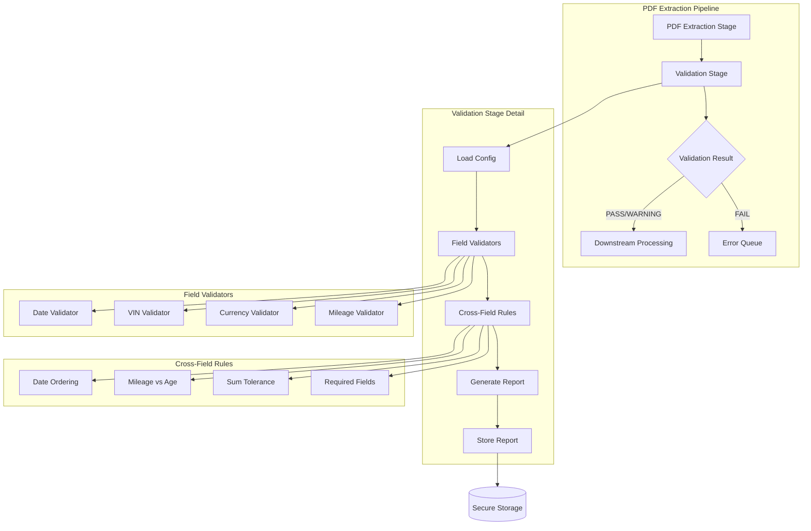

# LLD Finalized

Path: C:\Users\mcwiz\Projects\RCA-PDF-extraction-pipeline\docs\lld\active\LLD-020.md
Status: APPROVED
Reviews: 1

---

# 120 - Feature: Automated Data Validation for PDF Extraction Pipeline

<!-- Template Metadata
Last Updated: 2026-02-02
Updated By: Issue #117 fix
Update Reason: Moved Verification & Testing to Section 10 (was Section 11) to match 0702c review prompt and testing workflow expectations
Previous: Added sections based on 80 blocking issues from 164 governance verdicts (2026-02-01)
-->

## 1. Context & Goal

* **Issue:** #20
* **Objective:** Add an automated validation layer after PDF extraction that validates field formats, cross-field consistency, and flags suspicious values for review.
* **Status:** Draft
* **Related Issues:** None

### Open Questions

*Questions that need clarification before or during implementation. Remove when resolved.*

- [ ] Should policy number regex patterns be provided per-carrier in the initial release, or should we start with a generic pattern?
- [ ] What is the expected volume of documents per day to validate sizing requirements for logging/storage?

## 2. Proposed Changes

*This section is the **source of truth** for implementation. Describe exactly what will be built.*

### 2.1 Files Changed

| File | Change Type | Description |
|------|-------------|-------------|
| `src/validation/__init__.py` | Add | Package initialization with public exports |
| `src/validation/validators.py` | Add | Core field-level validation functions (date, VIN, currency, mileage) |
| `src/validation/schemas.py` | Add | Pydantic v2 models for document types with custom validators |
| `src/validation/rules.py` | Add | Cross-field validation rule engine with composable functions |
| `src/validation/report.py` | Add | Validation report generation with confidence scores |
| `src/validation/vin_decoder.py` | Add | VIN checksum and 10th-digit year decoding logic |
| `src/pipeline/stages/validate.py` | Add | Pipeline stage integration for validation |
| `config/validation_rules.yaml` | Add | Document-type-specific validation configuration |
| `tools/validate_extraction.py` | Add | CLI tool for validating extracted JSON files |
| `tools/validate_config.py` | Add | CLI tool for validating configuration files |
| `tests/validation/__init__.py` | Add | Test package initialization |
| `tests/validation/test_validators.py` | Add | Unit tests for field validators |
| `tests/validation/test_schemas.py` | Add | Unit tests for Pydantic schemas |
| `tests/validation/test_rules.py` | Add | Unit tests for cross-field rules |
| `tests/validation/test_report.py` | Add | Unit tests for report generation |
| `tests/validation/test_pipeline_integration.py` | Add | Integration tests for pipeline stage |
| `tests/validation/fixtures/` | Add | Static JSON fixtures directory |
| `tests/validation/fixtures/valid_auto_claim.json` | Add | Valid auto claim fixture |
| `tests/validation/fixtures/valid_property_claim.json` | Add | Valid property claim fixture |
| `tests/validation/fixtures/invalid_vin_checksum.json` | Add | Invalid VIN checksum fixture |
| `tests/validation/fixtures/invalid_dates.json` | Add | Invalid date ordering fixture |
| `tests/validation/fixtures/warning_high_mileage.json` | Add | Warning-state high mileage fixture |
| `tests/validation/fixtures/missing_required_fields.json` | Add | Missing required fields fixture |
| `docs/0003-file-inventory.md` | Modify | Add new validation files to inventory |

### 2.2 Dependencies

*New packages, APIs, or services required.*

```toml
# pyproject.toml additions
pydantic = "^2.0"  # Already likely present, ensure v2
pyyaml = "^6.0"    # For YAML config loading (safe_load only)
```

### 2.3 Data Structures

```python
# Pseudocode - NOT implementation

class ValidationSeverity(Enum):
    ERROR = "error"      # Blocks pipeline
    WARNING = "warning"  # Flags for review, proceeds

class FieldValidationResult(TypedDict):
    field_path: str           # e.g., "claim.vin"
    is_valid: bool            # True if passed
    severity: ValidationSeverity | None  # None if valid
    confidence: int           # 0-100 confidence score
    message: str | None       # Human-readable error/warning
    original_value: Any       # The value that was validated

class ValidationReport(TypedDict):
    document_id: str          # Identifier for the document
    document_type: str        # e.g., "auto_claim"
    timestamp: str            # ISO8601 validation timestamp
    overall_status: str       # "PASS" | "WARNING" | "FAIL"
    field_results: list[FieldValidationResult]
    cross_field_results: list[FieldValidationResult]
    error_count: int          # Count of ERROR severity issues
    warning_count: int        # Count of WARNING severity issues

class ValidationConfig(TypedDict):
    document_type: str
    required_fields: list[str]
    field_rules: dict[str, FieldRuleConfig]
    cross_field_rules: list[CrossFieldRuleConfig]
    thresholds: ThresholdConfig

class ThresholdConfig(TypedDict):
    max_currency_amount: float   # Default: 10,000,000
    min_currency_amount: float   # Default: 0.01
    max_mileage: int             # Default: 500,000
    min_mileage: int             # Default: 0
    mileage_per_year_warning: int  # Default: 15,000
    sum_tolerance: float         # Default: 0.01
```

### 2.4 Function Signatures

```python
# src/validation/validators.py

def validate_date(value: str, formats: list[str] | None = None) -> tuple[bool, str | None]:
    """Validate date string against allowed formats (MM/DD/YYYY, ISO8601)."""
    ...

def validate_currency(
    value: float | str,
    min_amount: float = 0.01,
    max_amount: float = 10_000_000
) -> tuple[bool, str | None]:
    """Validate currency amount is positive and within range."""
    ...

def validate_vin(value: str) -> tuple[bool, str | None]:
    """Validate VIN is 17 characters with valid checksum."""
    ...

def validate_mileage(
    value: int | str,
    min_value: int = 0,
    max_value: int = 500_000
) -> tuple[bool, str | None]:
    """Validate mileage is numeric and within range."""
    ...

def validate_policy_number(value: str, pattern: str | None = None) -> tuple[bool, str | None]:
    """Validate policy number against configurable regex pattern."""
    ...

# src/validation/vin_decoder.py

def calculate_vin_checksum(vin: str) -> str:
    """Calculate the expected checksum digit for a VIN."""
    ...

def decode_vin_year(vin: str) -> int | None:
    """Extract model year from VIN 10th digit. Returns None if invalid."""
    ...

# src/validation/rules.py

def validate_date_ordering(
    loss_date: str,
    effective_date: str,
    expiration_date: str
) -> tuple[bool, str | None]:
    """Validate loss date is within policy period."""
    ...

def validate_mileage_vs_vehicle_age(
    mileage: int,
    vin: str,
    threshold_per_year: int = 15_000
) -> tuple[bool, str | None]:
    """Validate mileage reasonableness against vehicle age from VIN."""
    ...

def validate_line_item_sum(
    line_items: list[float],
    total: float,
    tolerance: float = 0.01
) -> tuple[bool, str | None]:
    """Validate line items sum to total within tolerance."""
    ...

def check_required_fields(
    data: dict,
    required_fields: list[str]
) -> list[str]:
    """Return list of missing required fields."""
    ...

# src/validation/report.py

def generate_validation_report(
    document_id: str,
    document_type: str,
    field_results: list[FieldValidationResult],
    cross_field_results: list[FieldValidationResult]
) -> ValidationReport:
    """Generate structured validation report with confidence scores."""
    ...

def sanitize_report_for_logging(report: ValidationReport) -> dict:
    """Remove PII from report for non-secure logging."""
    ...

# src/validation/schemas.py

class AutoClaimValidator(BaseModel):
    """Pydantic model for auto claim validation."""
    vin: str
    mileage: int
    date_of_loss: str
    policy_number: str
    # ... additional fields

class PropertyClaimValidator(BaseModel):
    """Pydantic model for property claim validation."""
    property_address: str
    date_of_loss: str
    policy_number: str
    # ... additional fields

# src/pipeline/stages/validate.py

def validate_extraction(
    extracted_data: dict,
    document_type: str,
    config: ValidationConfig | None = None
) -> tuple[ValidationReport, bool]:
    """
    Validate extracted data against rules for document type.
    Returns (report, should_proceed) where should_proceed is False if ERROR-level issues.
    """
    ...
```

### 2.5 Logic Flow (Pseudocode)

```
VALIDATION PIPELINE STAGE:

1. Receive extracted_data and document_type
2. Load validation config for document_type from YAML (using safe_load)
3. Initialize empty results lists (field_results, cross_field_results)

4. FIELD-LEVEL VALIDATION:
   FOR each field in extracted_data:
     a. Lookup validation rule for field
     b. IF rule exists:
        - Run validator function
        - Calculate confidence score
        - Append FieldValidationResult to field_results

5. REQUIRED FIELDS CHECK:
   a. Get required_fields from config for document_type
   b. Check each required field is present and non-empty
   c. IF missing:
      - Append ERROR-level result to field_results

6. CROSS-FIELD VALIDATION:
   FOR each cross_field_rule in config:
     a. Extract relevant field values
     b. IF all required fields present:
        - Run cross-field validator
        - Append result to cross_field_results
     c. ELSE:
        - Skip rule (missing fields already flagged)

7. GENERATE REPORT:
   a. Count errors and warnings
   b. Determine overall_status:
      - "FAIL" if error_count > 0
      - "WARNING" if warning_count > 0
      - "PASS" otherwise
   c. Build ValidationReport

8. PIPELINE DECISION:
   IF overall_status == "FAIL":
     - should_proceed = False
     - Log ERROR (sanitized, no PII)
     - Store full report in secure document storage
   ELSE:
     - should_proceed = True
     - Store report with extracted data

9. Return (report, should_proceed)


VIN CHECKSUM VALIDATION:

1. Verify VIN is exactly 17 characters
2. Map each character to numeric value (transliteration table)
3. Apply position weights (8, 7, 6, 5, 4, 3, 2, 10, 0, 9, 8, 7, 6, 5, 4, 3, 2)
4. Calculate sum of (value * weight) for all positions
5. Calculate checksum = sum mod 11
6. IF checksum == 10, expected digit is 'X'
7. Compare calculated checksum to 9th character of VIN
8. Return (is_valid, error_message)


VIN YEAR DECODING (10th digit):

1. Define year code mapping:
   - A=1980/2010, B=1981/2011, ..., Y=2000/2030
   - 1=2001/2031, 2=2002/2032, ..., 9=2009/2039
   - (I, O, Q, U, Z excluded)
2. Extract 10th character from VIN
3. Lookup year code in mapping
4. IF 7th digit is numeric AND >= 1:
   - Use 2010+ year range
   ELSE:
   - Use 1980+ year range
5. Return decoded year or None if invalid
```

### 2.6 Technical Approach

* **Module:** `src/validation/`
* **Pattern:** Strategy pattern for validators; Composite pattern for cross-field rules
* **Key Decisions:**
  - Pydantic v2 for schema validation with custom validators for complex rules
  - Composable validation functions that can be enabled/disabled per document type
  - Local VIN year decoding (no external API) using 10th digit logic
  - YAML configuration for rule customization without code changes
  - Validation report stored with extracted data in secure storage

### 2.7 Architecture Decisions

| Decision | Options Considered | Choice | Rationale |
|----------|-------------------|--------|-----------|
| Validation Framework | Custom validators, Cerberus, Pydantic | Pydantic v2 | Type safety, excellent error messages, custom validator support, widespread adoption |
| Configuration Format | JSON, YAML, Python dicts | YAML | Human-readable, supports comments, familiar to ops teams |
| VIN Year Decoding | External API (NHTSA), Local logic | Local logic | No external dependency, faster, works offline, sufficient for mileage reasonableness check |
| Report Storage | Application logs, Separate DB, With extraction | With extraction in secure storage | PII in reports requires same protection as extracted data |
| Error Categorization | Single level, Two levels (ERROR/WARNING), Multiple levels | Two levels | Simple, clear semantics (blocks vs flags), covers all use cases |

**Architectural Constraints:**
- Must integrate with existing PDF extraction pipeline without requiring pipeline refactoring
- Cannot introduce external API dependencies for core validation (offline capability)
- PII must not leak to application logs or external systems
- Configuration must be read-only in production environments

## 3. Requirements

*What must be true when this is done. These become acceptance criteria.*

1. **Date Validation:** Date fields validated for MM/DD/YYYY and ISO8601 formats with clear error messages
2. **Currency Validation:** Currency amounts validated as positive numbers within configured range (default: $0.01 - $10,000,000)
3. **VIN Validation:** VIN validated for 17-character length and valid checksum algorithm
4. **Mileage Validation:** Mileage validated as numeric within configured range (default: 0 - 500,000)
5. **Mileage Cross-Validation:** Mileage cross-validated against vehicle age from VIN 10th digit (WARNING if > 15,000 miles/year)
6. **Date Ordering:** Cross-field date ordering enforced (loss date within policy period)
7. **Sum Validation:** Line item sum validation with configurable tolerance (default: $0.01)
8. **Required Fields:** Required field presence checked based on document type configuration
9. **Validation Report:** Structured JSON report generated with confidence scores (0-100) per field
10. **Issue Categorization:** Issues categorized as ERROR (blocks pipeline) or WARNING (flags for review)
11. **Configuration:** Validation rules configurable per document type via YAML
12. **Pipeline Integration:** Pipeline blocks on ERROR-level failures, proceeds with WARNING-level issues

## 4. Alternatives Considered

| Option | Pros | Cons | Decision |
|--------|------|------|----------|
| Pydantic v2 | Strong typing, custom validators, excellent errors, widely used | Learning curve for advanced features | **Selected** |
| Cerberus | Pure Python, declarative schemas | Less type-safe, smaller community | Rejected |
| JSON Schema | Standard format, language-agnostic | No custom validators, weak cross-field support | Rejected |
| External VIN API (NHTSA) | Complete vehicle data, authoritative | External dependency, latency, rate limits, offline failure | Rejected |
| Local VIN 10th digit | No dependencies, fast, works offline | Only gets year (sufficient for mileage check) | **Selected** |
| Store reports in app logs | Simple implementation | PII leakage risk, compliance violation | Rejected |
| Store reports with extraction data | Same security model, single storage location | Slightly more complex queries | **Selected** |

**Rationale:** Pydantic v2 provides the best balance of type safety, custom validation support, and error message quality. Local VIN decoding avoids external dependencies while providing sufficient accuracy for mileage reasonableness checks. Storing reports with extraction data ensures consistent PII protection.

## 5. Data & Fixtures

*Per [0108-lld-pre-implementation-review.md](0108-lld-pre-implementation-review.md) - complete this section BEFORE implementation.*

### 5.1 Data Sources

| Attribute | Value |
|-----------|-------|
| Source | PDF extraction pipeline output (internal) |
| Format | JSON (extracted claim data) |
| Size | ~1-50KB per document |
| Refresh | Real-time (per extraction) |
| Copyright/License | N/A (internal data) |

### 5.2 Data Pipeline

```
PDF Extraction Stage ──JSON──► Validation Stage ──JSON──► Downstream Processing
                                     │
                                     └──ValidationReport──► Secure Document Storage
```

### 5.3 Test Fixtures

| Fixture | Source | Notes |
|---------|--------|-------|
| `valid_auto_claim.json` | Generated | Valid auto claim with all fields passing |
| `valid_property_claim.json` | Generated | Valid property claim with all fields passing |
| `invalid_vin_checksum.json` | Generated | Auto claim with intentionally bad VIN checksum |
| `invalid_dates.json` | Generated | Claim with loss date outside policy period |
| `warning_high_mileage.json` | Generated | Auto claim with mileage triggering warning |
| `missing_required_fields.json` | Generated | Claim missing VIN and mileage |
| `boundary_sum_tolerance.json` | Generated | Line items differing by exactly tolerance |

**Data Hygiene:** All fixtures use synthetic data with no real PII. VINs use test patterns from NHTSA.

### 5.4 Deployment Pipeline

Test fixtures are committed to repository under `tests/validation/fixtures/`. No external data synchronization required.

**External data source:** Not applicable - all validation data comes from internal extraction pipeline.

## 6. Diagram

### 6.1 Mermaid Quality Gate

Before finalizing any diagram, verify in [Mermaid Live Editor](https://mermaid.live) or GitHub preview:

- [x] **Simplicity:** Similar components collapsed (per 0006 §8.1)
- [x] **No touching:** All elements have visual separation (per 0006 §8.2)
- [x] **No hidden lines:** All arrows fully visible (per 0006 §8.3)
- [x] **Readable:** Labels not truncated, flow direction clear
- [ ] **Auto-inspected:** Agent rendered via mermaid.ink and viewed (per 0006 §8.5)

**Agent Auto-Inspection (MANDATORY):**

AI agents MUST render and view the diagram before committing:
1. Base64 encode diagram → fetch PNG from `https://mermaid.ink/img/{base64}`
2. Read the PNG file (multimodal inspection)
3. Document results below

**Auto-Inspection Results:**
```
- Touching elements: [ ] None / [ ] Found: ___
- Hidden lines: [ ] None / [ ] Found: ___
- Label readability: [ ] Pass / [ ] Issue: ___
- Flow clarity: [ ] Clear / [ ] Issue: ___
```

*Note: Auto-inspection to be completed during implementation phase.*

*Reference: [0006-mermaid-diagrams.md](0006-mermaid-diagrams.md)*

### 6.2 Diagram



## 7. Security & Safety Considerations

*This section addresses security (10 patterns) and safety (9 patterns) concerns from governance feedback.*

### 7.1 Security

| Concern | Mitigation | Status |
|---------|------------|--------|
| PII in validation reports | Reports stored in secure document storage only, not application logs | Addressed |
| PII in Pydantic errors | Custom logging strips `input` field from ValidationError before logging | Addressed |
| YAML deserialization attacks | Use `yaml.safe_load` exclusively for config parsing | Addressed |
| Configuration tampering | Config files read-only in production | Addressed |
| Input injection via field values | Validators treat all input as untrusted data, no eval/exec | Addressed |

### 7.2 Safety

| Concern | Mitigation | Status |
|---------|------------|--------|
| Data loss on validation failure | Failed documents queued for re-extraction/manual review, not deleted | Addressed |
| Pipeline deadlock | Validation stage has timeout; fails open with WARNING if timeout | Addressed |
| Malformed config crashes pipeline | Config validation at startup; fallback to defaults if invalid | Addressed |
| Infinite retry loops | Failed documents moved to error queue with max retry limit | Addressed |

**Fail Mode:** Fail Open with WARNING - If validation stage encounters unexpected error, document proceeds with WARNING flag rather than blocking entire pipeline. Rationale: Downstream manual review can catch issues; blocking risks data backlog.

**Recovery Strategy:** Documents failing validation are queued with full extraction data preserved. Manual review can correct issues or trigger re-extraction. Validation reports attached for diagnosis.

## 8. Performance & Cost Considerations

*This section addresses performance and cost concerns (6 patterns) from governance feedback.*

### 8.1 Performance

| Metric | Budget | Approach |
|--------|--------|----------|
| Latency per document | < 50ms | Pydantic validation is highly efficient; all logic is local |
| Memory per validation | < 10MB | Reports kept small; no large data structures |
| CPU utilization | Negligible | Simple regex and arithmetic operations |

**Bottlenecks:** None expected. Pydantic validation adds minimal overhead. VIN checksum calculation is O(1) with 17 characters.

### 8.2 Cost Analysis

| Resource | Unit Cost | Estimated Usage | Monthly Cost |
|----------|-----------|-----------------|--------------|
| Compute | $0 incremental | Runs on existing pipeline infrastructure | $0 |
| Storage | $0.023/GB (S3) | ~1KB per report × 100K docs/month = 100MB | < $1 |
| External APIs | N/A | No external API calls | $0 |

**Cost Controls:**
- [x] No external API dependencies (no per-call costs)
- [x] Report size bounded (< 10KB per document)
- [x] Runs within existing pipeline compute budget

**Worst-Case Scenario:** Even 100x volume (10M documents/month) would add < $100/month in storage for reports. No compute scaling concerns as validation is O(1) per document.

## 9. Legal & Compliance

*This section addresses legal concerns (8 patterns) from governance feedback.*

| Concern | Applies? | Mitigation |
|---------|----------|------------|
| PII/Personal Data | Yes | Validation reports contain PII (VINs, policy numbers); stored in secure document storage with same retention policy as extraction outputs |
| Third-Party Licenses | No | Pydantic (MIT), PyYAML (MIT) - compatible with project |
| Terms of Service | No | No external API usage |
| Data Retention | Yes | Validation reports follow extraction data retention policy |
| Export Controls | No | No restricted algorithms or data |

**Data Classification:** Confidential (contains policy numbers, VINs, claim data)

**Compliance Checklist:**
- [x] PII stored only in secure document storage
- [x] No PII written to application logs (sanitization enforced)
- [x] All third-party licenses compatible (MIT)
- [x] Data retention follows existing policy (inherited from extraction outputs)

## 10. Verification & Testing

*Ref: [0005-testing-strategy-and-protocols.md](0005-testing-strategy-and-protocols.md)*

**Testing Philosophy:** Strive for 100% automated test coverage. Manual tests are a last resort for scenarios that genuinely cannot be automated (e.g., visual inspection, hardware interaction). Every scenario marked "Manual" requires justification.

### 10.1 Test Scenarios

| ID | Scenario | Type | Input | Expected Output | Pass Criteria |
|----|----------|------|-------|-----------------|---------------|
| 010 | Valid auto claim passes all validations | Auto | `valid_auto_claim.json` | Report with PASS status | All field_results.is_valid == True |
| 020 | Valid property claim passes all validations | Auto | `valid_property_claim.json` | Report with PASS status | All field_results.is_valid == True |
| 030 | Invalid VIN checksum detected | Auto | `invalid_vin_checksum.json` | Report with FAIL status | VIN field has ERROR severity |
| 040 | Invalid VIN length (16 chars) | Auto | VIN="1234567890123456" | Validation fails | Error message indicates length |
| 050 | Invalid VIN length (18 chars) | Auto | VIN="123456789012345678" | Validation fails | Error message indicates length |
| 060 | Date of loss before effective date | Auto | `invalid_dates.json` | Report with FAIL status | Cross-field ERROR for date ordering |
| 070 | Date of loss after expiration date | Auto | loss > expiration | Report with FAIL status | Cross-field ERROR for date ordering |
| 080 | Date of loss equals effective date (boundary) | Auto | loss == effective | Report with PASS status | Boundary is valid |
| 090 | Date of loss equals expiration date (boundary) | Auto | loss == expiration | Report with PASS status | Boundary is valid |
| 100 | High mileage triggers warning | Auto | `warning_high_mileage.json` | Report with WARNING status | Mileage field has WARNING severity |
| 110 | Mileage at exactly 15,000 miles/year (boundary) | Auto | VIN year 2020, mileage 60,000 | Report with PASS status | Boundary is not warning |
| 120 | Mileage at 15,001 miles/year (boundary+1) | Auto | VIN year 2020, mileage 60,004 | Report with WARNING status | Exceeds threshold triggers warning |
| 130 | Missing required VIN field | Auto | `missing_required_fields.json` | Report with FAIL status | ERROR for missing VIN |
| 140 | Missing required mileage field | Auto | Auto claim without mileage | Report with FAIL status | ERROR for missing mileage |
| 150 | Currency below minimum ($0.00) | Auto | amount = 0 | Validation fails | Error message for min amount |
| 160 | Currency above maximum ($10M+1) | Auto | amount = 10_000_001 | Validation fails | Error message for max amount |
| 170 | Currency at minimum boundary ($0.01) | Auto | amount = 0.01 | Validation passes | Boundary is valid |
| 180 | Currency at maximum boundary ($10M) | Auto | amount = 10_000_000 | Validation passes | Boundary is valid |
| 190 | Line items sum matches total | Auto | items=[100, 200], total=300 | Validation passes | Sum check passes |
| 200 | Line items sum differs by tolerance ($0.01) | Auto | items=[100, 200], total=300.01 | Validation passes | Within tolerance |
| 210 | Line items sum differs by tolerance+$0.01 | Auto | items=[100, 200], total=300.02 | Validation fails | Exceeds tolerance |
| 220 | Date format MM/DD/YYYY valid | Auto | "01/15/2024" | Validation passes | Parsed correctly |
| 230 | Date format ISO8601 valid | Auto | "2024-01-15" | Validation passes | Parsed correctly |
| 240 | Date format invalid | Auto | "15-01-2024" | Validation fails | Error for invalid format |
| 250 | VIN year decoding 2020+ vehicle | Auto | VIN with 'L' in 10th position | Year = 2020 | Correct decoding |
| 260 | VIN year decoding 1980s vehicle | Auto | VIN with 'A' in 10th position | Year = 1980 or 2010 | Context-aware decoding |
| 270 | Pipeline blocks on ERROR | Auto | Invalid VIN | should_proceed = False | Pipeline halted |
| 280 | Pipeline proceeds on WARNING | Auto | High mileage | should_proceed = True | Pipeline continues |
| 290 | Validation report sanitization | Auto | Report with PII | Sanitized report | No PII in output |
| 300 | Config loading with safe_load | Auto | Valid YAML config | Config loaded | No unsafe deserialization |
| 310 | Config with malformed YAML | Auto | Invalid YAML | Default config used | Graceful fallback |

### 10.2 Test Commands

```bash
# Run all validation tests
poetry run pytest tests/validation/ -v

# Run only unit tests (fast)
poetry run pytest tests/validation/test_validators.py tests/validation/test_schemas.py tests/validation/test_rules.py -v

# Run integration tests
poetry run pytest tests/validation/test_pipeline_integration.py -v

# Run with coverage
poetry run pytest tests/validation/ --cov=src/validation --cov-report=html

# Run specific test by ID pattern
poetry run pytest tests/validation/ -v -k "test_030"
```

### 10.3 Manual Tests (Only If Unavoidable)

**N/A - All scenarios automated.**

All validation scenarios use static JSON fixtures and can be fully automated. No visual inspection or hardware interaction required.

## 11. Risks & Mitigations

| Risk | Impact | Likelihood | Mitigation |
|------|--------|------------|------------|
| VIN checksum algorithm incorrect | High | Low | Use NHTSA-published algorithm; test with known valid/invalid VINs |
| Date format ambiguity (01/02/2024) | Med | Med | Document assumption (MM/DD/YYYY for US); make format configurable |
| Config file becomes stale | Low | Med | Version config with code; validate at startup |
| Validation too strict blocks valid data | High | Low | Thorough testing with real-world samples; WARNING threshold before ERROR |
| PII leaks to logs | High | Low | Automated tests verify sanitization; code review |
| Pydantic v2 breaking changes | Med | Low | Pin version in pyproject.toml; test with specific version |

## 12. Definition of Done

### Code
- [ ] Core validation functions implemented in `src/validation/validators.py`
- [ ] VIN decoder implemented in `src/validation/vin_decoder.py`
- [ ] Pydantic schemas defined in `src/validation/schemas.py`
- [ ] Cross-field rules implemented in `src/validation/rules.py`
- [ ] Report generation implemented in `src/validation/report.py`
- [ ] Pipeline stage integration in `src/pipeline/stages/validate.py`
- [ ] Configuration file created at `config/validation_rules.yaml`
- [ ] CLI tools created in `tools/`
- [ ] All code linted and formatted
- [ ] Code comments reference this LLD (#20)

### Tests
- [ ] All test scenarios pass (>90% coverage for validation logic)
- [ ] Static fixtures created in `tests/validation/fixtures/`
- [ ] Fixtures documented with data descriptions

### Documentation
- [ ] LLD updated with any implementation deviations
- [ ] `docs/0003-file-inventory.md` updated with new files
- [ ] Pipeline architecture wiki updated with validation stage
- [ ] Validation rules reference documentation created
- [ ] Tool usage documented in tool headers
- [ ] `docs/reports/20/implementation-report.md` created
- [ ] `docs/reports/20/test-report.md` created

### Review
- [ ] Code review completed
- [ ] 0809 Security Audit - PASS
- [ ] 0817 Wiki Alignment Audit - PASS
- [ ] User approval before closing issue

---

## Appendix: Review Log

*Track all review feedback with timestamps and implementation status.*

### Review Summary

| Review | Date | Verdict | Key Issue |
|--------|------|---------|-----------|
| - | - | - | Awaiting first review |

**Final Status:** APPROVED
<!-- Note: This field is auto-updated to APPROVED by the workflow when finalized -->