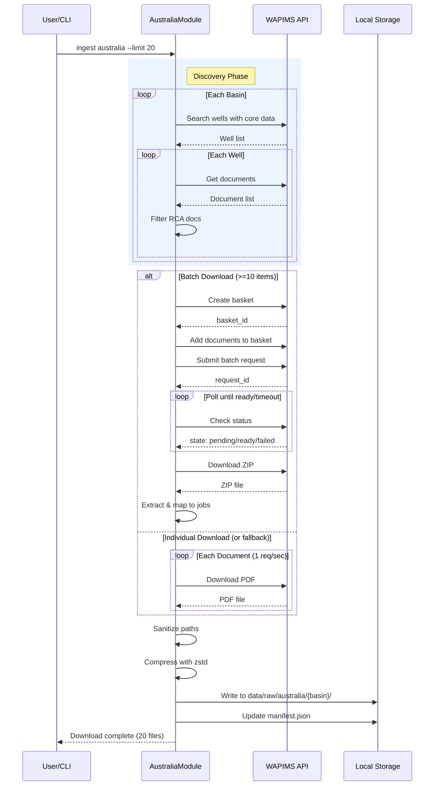

**Auto-Inspection Results:**
```
- Touching elements: [ ] None / [x] Found: Unable to auto-inspect - browser permission not granted
- Hidden lines: [ ] None / [x] Found: Unable to auto-inspect
- Label readability: [ ] Pass / [x] Issue: Unable to auto-inspect
- Flow clarity: [ ] Clear / [x] Issue: Unable to auto-inspect
```

*Note: Manual verification in Mermaid Live Editor recommended before merge.*

*Reference: [0006-mermaid-diagrams.md](0006-mermaid-diagrams.md)*

### 6.2 Diagram



## 7. Security & Safety Considerations

### 7.1 Security

| Concern | Mitigation | Status |
|---------|------------|--------|
| Path traversal via malicious well/basin names | `_sanitize_path_component()` removes `../`, `..\\`, null bytes, and control characters | Addressed |
| Session token leakage | Tokens are ephemeral, not logged, not stored persistently | Addressed |
| Arbitrary file write | All paths resolved relative to `data/raw/australia/` with containment check | Addressed |
| ZIP slip attack | Validate extracted filenames don't escape target directory | Addressed |

### 7.2 Safety

| Concern | Mitigation | Status |
|---------|------------|--------|
| Batch timeout blocks indefinitely | `BATCH_MAX_WAIT` (600s) enforces hard timeout with fallback | Addressed |
| Network failure loses partial progress | Individual downloads are atomic; manifest updated after each success | Addressed |
| Disk space exhaustion | Compression reduces footprint; storage estimates documented | Addressed |
| Rate limit violation | 1 req/sec delay enforced; respects WAPIMS ToS | Addressed |

**Fail Mode:** Fail Closed - On batch failure, falls back to individual downloads. On individual failure, job is marked failed and skipped (other jobs continue).

**Recovery Strategy:** Re-run ingestion; idempotent discovery will skip already-downloaded documents based on manifest check.

## 8. Performance & Cost Considerations

### 8.1 Performance

| Metric | Budget | Approach |
|--------|--------|----------|
| Discovery latency | < 30s for 20 documents | Async basin search, parallel where allowed |
| Download throughput | ~1 doc/sec (individual), ~10 docs/batch | Batch preferred for bulk |
| Memory | < 100MB | Stream large files, don't load full ZIP into memory |
| API calls | Minimize via batch | 1 call per 10 docs instead of 10 calls |

**Bottlenecks:** 
- Basin search is sequential (required by API)
- Individual downloads limited by 1 req/sec rate limit
- Batch polling adds latency but reduces total requests

### 8.2 Cost Analysis

| Resource | Unit Cost | Estimated Usage | Monthly Cost |
|----------|-----------|-----------------|--------------|
| WAPIMS API | $0 (public) | N/A | $0 |
| Local storage | ~$0.02/GB | <500MB | ~$0.01 |
| Network egress | Depends on hosting | ~500MB | Negligible |

**Cost Controls:**
- [x] No external paid APIs used
- [x] Rate limiting prevents excessive requests
- [x] Compression reduces storage costs

**Worst-Case Scenario:** Running `--limit 1000` downloads ~5GB uncompressed (~1.5GB compressed). Within typical storage quotas.

## 9. Legal & Compliance

| Concern | Applies? | Mitigation |
|---------|----------|------------|
| PII/Personal Data | No | Petroleum data only; no personal information |
| Third-Party Licenses | Yes | Data is public government data under WAPIMS release policy |
| Terms of Service | Yes | Rate limiting (1 req/sec) respects portal ToS |
| Data Retention | N/A | User controls local storage; no automatic deletion required |
| Export Controls | No | Geological data, not controlled technology |

**Data Classification:** Public (government-released petroleum data)

**Compliance Checklist:**
- [x] No PII stored without consent (no PII present)
- [x] All third-party licenses compatible with project license
- [x] External API usage compliant with provider ToS
- [x] Data retention policy documented (user-controlled)

## 10. Verification & Testing

*Ref: [0005-testing-strategy-and-protocols.md](0005-testing-strategy-and-protocols.md)*

**Testing Philosophy:** Strive for 100% automated test coverage. Manual tests are a last resort for scenarios that genuinely cannot be automated.

### 10.1 Test Scenarios

| ID | Scenario | Type | Input | Expected Output | Pass Criteria |
|----|----------|------|-------|-----------------|---------------|
| 010 | Basin search returns wells | Auto | Mock basin response | List of WAPIWSWell objects | Well count > 0, all have core_data=True |
| 020 | RCA document filtering | Auto | Mixed document list | Only RCA documents | All results contain RCA keywords |
| 030 | Basket creation | Auto | Valid session | basket_id returned | Non-empty string returned |
| 040 | Batch polling success | Auto | Mock "ready" response | Download URL extracted | State transitions pending→ready |
| 050 | Batch timeout triggers fallback | Auto | Slow mock (>1s timeout) | Individual downloads start | Fallback flag set, all jobs completed |
| 060 | ZIP extraction maps to jobs | Auto | Mock ZIP with 3 files | 3 mapped paths | Each job has corresponding extracted file |
| 070 | Path sanitization - safe names | Auto | "Carnarvon", "Well-1" | Valid path | Path contains expected components |
| 080 | Path sanitization - traversal attempt | Auto | "../../../etc/passwd" | Sanitized name | No path separators in result |
| 090 | Path sanitization - special chars | Auto | "Well<>:name" | Sanitized name | No invalid filesystem chars |
| 100 | Individual download with rate limit | Auto | 3 jobs | 3 files, ~3s elapsed | Delay enforced between requests |
| 110 | Dry run lists without download | Auto | `--dry-run` flag | Jobs logged, no files | No files in output directory |
| 120 | Manifest includes metadata | Auto | Completed download | Manifest entry | Entry has basin, well_name, permit, operator |
| 130 | Empty basin handled | Auto | Mock empty response | Zero jobs from basin | No error, continues to next basin |
| 140 | End-to-end integration | Auto-Live | `--limit 1` | 1 file downloaded | File exists, valid zstd compression |

### 10.2 Test Commands

```bash
# Run all automated tests
poetry run pytest tests/ingestion/test_australia.py -v

# Run only fast/mocked tests (exclude live)
poetry run pytest tests/ingestion/test_australia.py -v -m "not live"

# Run live integration tests
poetry run pytest tests/ingestion/test_australia.py -v -m live

# Run with coverage
poetry run pytest tests/ingestion/test_australia.py -v --cov=src/ingestion/modules/australia
```

### 10.3 Manual Tests (Only If Unavoidable)

**N/A - All scenarios automated.**

## 11. Risks & Mitigations

| Risk | Impact | Likelihood | Mitigation |
|------|--------|------------|------------|
| WAPIMS API changes/breaks | High | Low | Pin tested API version, monitor for changes |
| Batch feature removed/changed | Med | Low | Individual download fallback always works |
| Rate limiting insufficient | Med | Low | Make rate limit configurable, default conservative |
| ZIP structure varies | Med | Med | Robust extraction with filename matching fallback |
| Well names with extreme characters | Low | Med | Comprehensive sanitization with test coverage |

## 12. Definition of Done

### Code
- [ ] `AustraliaModule` class implemented in `src/ingestion/modules/australia.py`
- [ ] Module registered in `src/ingestion/modules/__init__.py`
- [ ] Code passes linting and type checking
- [ ] Code comments reference this LLD where appropriate

### Tests
- [ ] All 14 test scenarios pass
- [ ] Test coverage ≥ 90% for australia.py
- [ ] Integration test confirms end-to-end workflow

### Documentation
- [ ] `docs/ingestion/australia.md` created with usage and API notes
- [ ] README.md updated with Australia module in supported sources
- [ ] `docs/0003-file-inventory.md` updated with new files
- [ ] Implementation Report created at `docs/reports/22/implementation-report.md`
- [ ] Test Report created at `docs/reports/22/test-report.md`

### Review
- [ ] Code review completed
- [ ] Smoke test: `ingest australia --limit 1 --dry-run` succeeds
- [ ] Smoke test: `ingest australia --limit 3` downloads files
- [ ] Manifest validates with `jq` inspection
- [ ] Run 0817 Wiki Alignment Audit - PASS
- [ ] User approval before closing issue

---

## Appendix: Review Log

*Track all review feedback with timestamps and implementation status.*

### Review Summary

| Review | Date | Verdict | Key Issue |
|--------|------|---------|-----------|
| - | - | - | Awaiting initial review |

**Final Status:** PENDING
<!-- Note: This field is auto-updated to APPROVED by the workflow when finalized -->