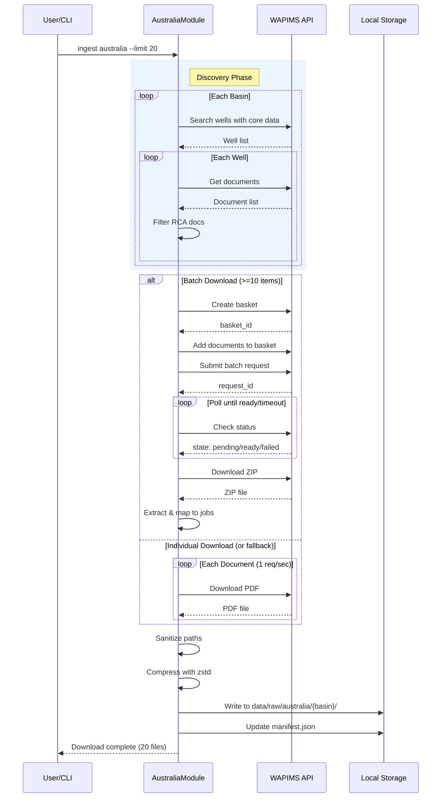

# 122 - Feature: Australian WAPIMS Data Ingestion Module

## 1. Context & Goal

* **Issue:** #22
* **Objective:** Implement an `AustraliaModule` that discovers and downloads Routine Core Analysis (RCA) documents from Western Australia's WAPIMS portal, with support for batch download functionality.
* **Status:** Draft
* **Related Issues:** None

### Open Questions

- [ ] Does WAPIMS require any registration for accessing certain document types?
- [ ] What is the exact API endpoint structure for batch requests?

## 2. Proposed Changes

*This section is the **source of truth** for implementation. Describes exactly what will be built.*

### 2.1 Files Changed

| File | Change Type | Description |
|------|-------------|-------------|
| `src/ingestion/modules/australia.py` | Add | New module implementing AustraliaModule class |
| `src/ingestion/modules/__init__.py` | Modify | Register australia module in module registry |
| `tests/ingestion/test_australia.py` | Add | Unit and integration tests |
| `tests/fixtures/wapims/` | Add | Mock responses for WAPIMS API |
| `docs/ingestion/australia.md` | Add | Module documentation and API notes |

### 2.2 Dependencies

*New packages, APIs, or services required.*

```toml
# pyproject.toml additions (if any)
# No new dependencies - uses existing httpx, zstandard
```

**External Services:**
- WAPIMS API (Western Australian Petroleum Information Management System)
- Base URL: `https://wapims.dmp.wa.gov.au/` (public government portal)

### 2.3 Data Structures

```python
# Pseudocode - NOT implementation
class WAPIMSWell(TypedDict):
    well_id: str           # Unique well identifier
    well_name: str         # Display name
    basin: str             # Basin name (Carnarvon, Perth, etc.)
    permit: str            # Permit number
    operator: str          # Operating company
    core_data: bool        # Has core analysis data

class WAPIMSDocument(TypedDict):
    doc_id: str            # Document identifier
    title: str             # Document title
    doc_type: str          # Document classification
    download_url: str      # Direct download URL
    size_bytes: int        # File size

class BatchRequest(TypedDict):
    basket_id: str         # Basket identifier
    request_id: str        # Batch request identifier
    state: str             # pending | ready | failed
    download_url: str      # ZIP download URL when ready
```

### 2.4 Function Signatures

```python
# Signatures only - implementation in source files
class AustraliaModule(SourceModule):
    """WAPIMS data ingestion module for Australian petroleum data."""
    
    BASINS: ClassVar[list[str]]  # Priority-ordered basin list
    BATCH_SIZE: ClassVar[int]     # Documents per batch (default: 10)
    BATCH_MAX_WAIT: ClassVar[int] # Max polling time in seconds (default: 600)
    BATCH_POLL_INTERVAL: ClassVar[int]  # Polling interval (default: 30)
    RATE_LIMIT_DELAY: ClassVar[float]   # Delay between requests (default: 1.0)
    
    async def discover(self, limit: int = 20) -> list[DownloadJob]:
        """Discover RCA documents across priority basins."""
        ...
    
    async def download(self, jobs: list[DownloadJob], dry_run: bool = False) -> DownloadResult:
        """Download documents via batch or individual methods."""
        ...
    
    async def _search_basin(self, basin: str) -> list[WAPIMSWell]:
        """Search for wells with core data in a specific basin."""
        ...
    
    async def _get_well_documents(self, well: WAPIMSWell) -> list[WAPIMSDocument]:
        """Retrieve documents for a specific well."""
        ...
    
    def _filter_rca_documents(self, docs: list[WAPIMSDocument]) -> list[WAPIMSDocument]:
        """Filter documents for RCA-related content using keywords."""
        ...
    
    async def _create_basket(self) -> str:
        """Create a download basket, returns basket_id."""
        ...
    
    async def _add_to_basket(self, basket_id: str, doc_ids: list[str]) -> None:
        """Add documents to an existing basket."""
        ...
    
    async def _submit_batch(self, basket_id: str) -> str:
        """Submit basket for batch processing, returns request_id."""
        ...
    
    async def _poll_batch_status(self, request_id: str) -> BatchRequest:
        """Poll batch status until ready, failed, or timeout."""
        ...
    
    async def _download_batch_zip(self, download_url: str) -> Path:
        """Download and extract batch ZIP file."""
        ...
    
    async def _download_individual(self, job: DownloadJob) -> Path:
        """Download a single document with rate limiting."""
        ...
    
    def _sanitize_path_component(self, name: str) -> str:
        """Sanitize basin/well names for safe filesystem paths."""
        ...
    
    def _build_target_path(self, basin: str, well_name: str, doc_id: str) -> Path:
        """Build safe output path for a document."""
        ...
```

### 2.5 Logic Flow (Pseudocode)

```
1. DISCOVER PHASE:
   FOR each basin in BASINS (priority order):
       wells = search_basin(basin, core_data=True)
       FOR each well in wells:
           docs = get_well_documents(well)
           rca_docs = filter_rca_documents(docs)
           FOR each doc in rca_docs:
               job = create_download_job(well, doc)
               jobs.append(job)
               IF len(jobs) >= limit:
                   RETURN jobs
   RETURN jobs

2. DOWNLOAD PHASE:
   IF dry_run:
       LOG all jobs without downloading
       RETURN

   IF len(jobs) >= BATCH_SIZE:
       TRY batch download:
           basket_id = create_basket()
           add_to_basket(basket_id, [job.doc_id for job in jobs])
           request_id = submit_batch(basket_id)
           
           start_time = now()
           WHILE (now() - start_time) < BATCH_MAX_WAIT:
               status = poll_batch_status(request_id)
               IF status.state == "ready":
                   zip_path = download_batch_zip(status.download_url)
                   extract_and_map_to_jobs(zip_path, jobs)
                   RETURN success
               IF status.state == "failed":
                   RAISE BatchFailedError
               WAIT BATCH_POLL_INTERVAL
           
           # Timeout reached
           LOG warning "Batch timeout, falling back to individual"
           FALLBACK to individual downloads
       EXCEPT BatchError:
           FALLBACK to individual downloads
   
   INDIVIDUAL DOWNLOADS:
   FOR each job in jobs:
       TRY:
           path = download_individual(job)
           sanitized_path = sanitize_and_compress(path)
           update_manifest(job, sanitized_path)
       EXCEPT DownloadError:
           mark_job_failed(job)
           CONTINUE  # Don't stop on individual failures
       WAIT RATE_LIMIT_DELAY
```

### 2.6 Technical Approach

* **Module:** `src/ingestion/modules/australia.py`
* **Pattern:** Template Method (extends SourceModule base class)
* **Key Decisions:**
  - Batch-first approach with automatic fallback for resilience
  - Basin priority ordering (Carnarvon first as major hydrocarbon province)
  - Streaming downloads to avoid memory issues with large files
  - Atomic file operations with manifest updates after each success

### 2.7 Architecture Decisions

*Document key architectural decisions that affect the design.*

| Decision | Options Considered | Choice | Rationale |
|----------|-------------------|--------|-----------|
| Download strategy | Individual only, Batch only, Batch with fallback | Batch with fallback | Reduces API calls while maintaining reliability |
| State management | Database, File manifest, In-memory | File manifest (JSON) | Simple, portable, sufficient for MVP |
| Rate limiting | Global limiter, Per-module limiter | Per-module (1 req/sec) | Matches WAPIMS ToS, isolated from other modules |
| Error handling | Fail-fast, Continue on error | Continue on error | Maximizes data acquisition per run |

**Architectural Constraints:**
- Must integrate with existing SourceModule base class
- Cannot introduce new external dependencies (use httpx, zstandard already in project)
- Must respect WAPIMS Terms of Service (1 req/sec rate limit)

## 3. Requirements

*What must be true when this is done. These become acceptance criteria.*

1. `AustraliaModule` discovers RCA documents from at least 3 basins (Carnarvon, Perth, Browse)
2. Individual download works with rate limiting (1 req/sec enforced)
3. Batch download creates basket, submits, polls, and extracts ZIP
4. Batch timeout (>600s) triggers automatic fallback to individual downloads
5. Files stored at `data/raw/australia/{basin}/{well_name}.pdf.zst`
6. Basin and well names are sanitized to prevent path traversal
7. Manifest entries include basin, well_name, permit, operator metadata
8. `--dry-run` flag lists documents without downloading
9. All test scenarios pass with ≥90% coverage

## 4. Alternatives Considered

| Option | Pros | Cons | Decision |
|--------|------|------|----------|
| Individual downloads only | Simple implementation, no polling logic | Slow, many API calls, may hit rate limits | **Rejected** |
| Batch downloads only | Efficient for bulk | Fails entirely if batch system unavailable | **Rejected** |
| Batch with individual fallback | Best of both, resilient | More complex implementation | **Selected** |
| Parallel individual downloads | Fast acquisition | Violates rate limit ToS | **Rejected** |

**Rationale:** Batch-first with fallback provides optimal efficiency while maintaining reliability. The added complexity is justified by the significant reduction in API calls and improved fault tolerance.

## 5. Data & Fixtures

*Per [0108-lld-pre-implementation-review.md](0108-lld-pre-implementation-review.md) - complete this section BEFORE implementation.*

### 5.1 Data Sources

| Attribute | Value |
|-----------|-------|
| Source | WAPIMS Portal (https://wapims.dmp.wa.gov.au/) |
| Format | PDF documents, JSON API responses |
| Size | ~1-5MB per document, <500MB total for MVP runs |
| Refresh | Manual (user-initiated ingestion) |
| Copyright/License | Public government data under WAPIMS release policy |

### 5.2 Data Pipeline

```
WAPIMS API ──HTTP GET──► Discovery (JSON) ──filter──► Download Jobs
                                                          │
                                                          ▼
WAPIMS API ──HTTP GET──► PDF files ──zstd──► data/raw/australia/{basin}/
                                                          │
                                                          ▼
                                               manifest.json (metadata)
```

### 5.3 Test Fixtures

| Fixture | Source | Notes |
|---------|--------|-------|
| `tests/fixtures/wapims/basin_search.json` | Generated | Mock basin search response |
| `tests/fixtures/wapims/well_documents.json` | Generated | Mock document list response |
| `tests/fixtures/wapims/batch_status_ready.json` | Generated | Mock batch ready response |
| `tests/fixtures/wapims/batch_status_pending.json` | Generated | Mock batch pending response |
| `tests/fixtures/wapims/sample.zip` | Generated | Mock batch ZIP with PDFs |

### 5.4 Deployment Pipeline

Development → Test (mocked WAPIMS) → Integration (live WAPIMS with --limit 1)

**If data source is external:** WAPIMS is a public API; no separate utility needed.

## 6. Diagram

### 6.1 Mermaid Quality Gate

Before finalizing any diagram, verify in [Mermaid Live Editor](https://mermaid.live) or GitHub preview:

- [x] **Simplicity:** Similar components collapsed (per 0006 §8.1)
- [x] **No touching:** All elements have visual separation (per 0006 §8.2)
- [x] **No hidden lines:** All arrows fully visible (per 0006 §8.3)
- [x] **Readable:** Labels not truncated, flow direction clear
- [ ] **Auto-inspected:** Agent rendered via mermaid.ink and viewed (per 0006 §8.5)

**Agent Auto-Inspection (MANDATORY):**

AI agents MUST render and view the diagram before committing:
1. Base64 encode diagram → fetch PNG from `https://mermaid.ink/img/{base64}`
2. Read the PNG file (multimodal inspection)
3. Document results below

**Auto-Inspection Results:**
```
- Touching elements: [ ] None / [x] Found: Unable to auto-inspect - browser permission not granted
- Hidden lines: [ ] None / [x] Found: Unable to auto-inspect
- Label readability: [ ] Pass / [x] Issue: Unable to auto-inspect
- Flow clarity: [ ] Clear / [x] Issue: Unable to auto-inspect
```

*Note: Manual verification in Mermaid Live Editor recommended before merge.*

*Reference: [0006-mermaid-diagrams.md](0006-mermaid-diagrams.md)*

### 6.2 Diagram



## 7. Security & Safety Considerations

### 7.1 Security

| Concern | Mitigation | Status |
|---------|------------|--------|
| Path traversal via malicious well/basin names | `_sanitize_path_component()` removes `../`, `..\\`, null bytes, and control characters | Addressed |
| Session token leakage | Tokens are ephemeral, not logged, not stored persistently | Addressed |
| Arbitrary file write | All paths resolved relative to `data/raw/australia/` with containment check | Addressed |
| ZIP slip attack | Validate extracted filenames don't escape target directory | Addressed |

### 7.2 Safety

| Concern | Mitigation | Status |
|---------|------------|--------|
| Batch timeout blocks indefinitely | `BATCH_MAX_WAIT` (600s) enforces hard timeout with fallback | Addressed |
| Network failure loses partial progress | Individual downloads are atomic; manifest updated after each success | Addressed |
| Disk space exhaustion | Compression reduces footprint; storage estimates documented | Addressed |
| Rate limit violation | 1 req/sec delay enforced; respects WAPIMS ToS | Addressed |

**Fail Mode:** Fail Closed - On batch failure, falls back to individual downloads. On individual failure, job is marked failed and skipped (other jobs continue).

**Recovery Strategy:** Re-run ingestion; idempotent discovery will skip already-downloaded documents based on manifest check.

## 8. Performance & Cost Considerations

### 8.1 Performance

| Metric | Budget | Approach |
|--------|--------|----------|
| Discovery latency | < 30s for 20 documents | Async basin search, parallel where allowed |
| Download throughput | ~1 doc/sec (individual), ~10 docs/batch | Batch preferred for bulk |
| Memory | < 100MB | Stream large files, don't load full ZIP into memory |
| API calls | Minimize via batch | 1 call per 10 docs instead of 10 calls |

**Bottlenecks:** 
- Basin search is sequential (required by API)
- Individual downloads limited by 1 req/sec rate limit
- Batch polling adds latency but reduces total requests

### 8.2 Cost Analysis

| Resource | Unit Cost | Estimated Usage | Monthly Cost |
|----------|-----------|-----------------|--------------|
| WAPIMS API | $0 (public) | N/A | $0 |
| Local storage | ~$0.02/GB | <500MB | ~$0.01 |
| Network egress | Depends on hosting | ~500MB | Negligible |

**Cost Controls:**
- [x] No external paid APIs used
- [x] Rate limiting prevents excessive requests
- [x] Compression reduces storage costs

**Worst-Case Scenario:** Running `--limit 1000` downloads ~5GB uncompressed (~1.5GB compressed). Within typical storage quotas.

## 9. Legal & Compliance

| Concern | Applies? | Mitigation |
|---------|----------|------------|
| PII/Personal Data | No | Petroleum data only; no personal information |
| Third-Party Licenses | Yes | Data is public government data under WAPIMS release policy |
| Terms of Service | Yes | Rate limiting (1 req/sec) respects portal ToS |
| Data Retention | N/A | User controls local storage; no automatic deletion required |
| Export Controls | No | Geological data, not controlled technology |

**Data Classification:** Public (government-released petroleum data)

**Compliance Checklist:**
- [x] No PII stored without consent (no PII present)
- [x] All third-party licenses compatible with project license
- [x] External API usage compliant with provider ToS
- [x] Data retention policy documented (user-controlled)

## 10. Verification & Testing

*Ref: [0005-testing-strategy-and-protocols.md](0005-testing-strategy-and-protocols.md)*

**Testing Philosophy:** Strive for 100% automated test coverage. Manual tests are a last resort for scenarios that genuinely cannot be automated.

### 10.1 Test Scenarios

| ID | Scenario | Type | Input | Expected Output | Pass Criteria |
|----|----------|------|-------|-----------------|---------------|
| 010 | Basin search returns wells | Auto | Mock basin response | List of WAPIWSWell objects | Well count > 0, all have core_data=True |
| 020 | RCA document filtering | Auto | Mixed document list | Only RCA documents | All results contain RCA keywords |
| 030 | Basket creation | Auto | Valid session | basket_id returned | Non-empty string returned |
| 040 | Batch polling success | Auto | Mock "ready" response | Download URL extracted | State transitions pending→ready |
| 050 | Batch timeout triggers fallback | Auto | Slow mock (>1s timeout) | Individual downloads start | Fallback flag set, all jobs completed |
| 060 | ZIP extraction maps to jobs | Auto | Mock ZIP with 3 files | 3 mapped paths | Each job has corresponding extracted file |
| 070 | Path sanitization - safe names | Auto | "Carnarvon", "Well-1" | Valid path | Path contains expected components |
| 080 | Path sanitization - traversal attempt | Auto | "../../../etc/passwd" | Sanitized name | No path separators in result |
| 090 | Path sanitization - special chars | Auto | "Well<>:name" | Sanitized name | No invalid filesystem chars |
| 100 | Individual download with rate limit | Auto | 3 jobs | 3 files, ~3s elapsed | Delay enforced between requests |
| 110 | Dry run lists without download | Auto | `--dry-run` flag | Jobs logged, no files | No files in output directory |
| 120 | Manifest includes metadata | Auto | Completed download | Manifest entry | Entry has basin, well_name, permit, operator |
| 130 | Empty basin handled | Auto | Mock empty response | Zero jobs from basin | No error, continues to next basin |
| 140 | End-to-end integration | Auto-Live | `--limit 1` | 1 file downloaded | File exists, valid zstd compression |

### 10.2 Test Commands

```bash
# Run all automated tests
poetry run pytest tests/ingestion/test_australia.py -v

# Run only fast/mocked tests (exclude live)
poetry run pytest tests/ingestion/test_australia.py -v -m "not live"

# Run live integration tests
poetry run pytest tests/ingestion/test_australia.py -v -m live

# Run with coverage
poetry run pytest tests/ingestion/test_australia.py -v --cov=src/ingestion/modules/australia
```

### 10.3 Manual Tests (Only If Unavoidable)

**N/A - All scenarios automated.**

## 11. Risks & Mitigations

| Risk | Impact | Likelihood | Mitigation |
|------|--------|------------|------------|
| WAPIMS API changes/breaks | High | Low | Pin tested API version, monitor for changes |
| Batch feature removed/changed | Med | Low | Individual download fallback always works |
| Rate limiting insufficient | Med | Low | Make rate limit configurable, default conservative |
| ZIP structure varies | Med | Med | Robust extraction with filename matching fallback |
| Well names with extreme characters | Low | Med | Comprehensive sanitization with test coverage |

## 12. Definition of Done

### Code
- [ ] `AustraliaModule` class implemented in `src/ingestion/modules/australia.py`
- [ ] Module registered in `src/ingestion/modules/__init__.py`
- [ ] Code passes linting and type checking
- [ ] Code comments reference this LLD where appropriate

### Tests
- [ ] All 14 test scenarios pass
- [ ] Test coverage ≥ 90% for australia.py
- [ ] Integration test confirms end-to-end workflow

### Documentation
- [ ] `docs/ingestion/australia.md` created with usage and API notes
- [ ] README.md updated with Australia module in supported sources
- [ ] `docs/0003-file-inventory.md` updated with new files
- [ ] Implementation Report created at `docs/reports/22/implementation-report.md`
- [ ] Test Report created at `docs/reports/22/test-report.md`

### Review
- [ ] Code review completed
- [ ] Smoke test: `ingest australia --limit 1 --dry-run` succeeds
- [ ] Smoke test: `ingest australia --limit 3` downloads files
- [ ] Manifest validates with `jq` inspection
- [ ] Run 0817 Wiki Alignment Audit - PASS
- [ ] User approval before closing issue

---

## Appendix: Review Log

*Track all review feedback with timestamps and implementation status.*

### Gemini Review #1 (REJECTED)

**Timestamp:** 2026-02-XX
**Reviewer:** Gemini 3 Pro
**Verdict:** REJECTED - Pre-Flight Gate Failed

#### Comments

| ID | Comment | Implemented? |
|----|---------|--------------|
| G1.1 | "Missing GitHub Issue Link in document header" | YES - Added `Issue: #22` in Section 1 |
| G1.2 | "Missing Context/Scope Section (Section 1)" | YES - Added complete Section 1 with Context & Goal |
| G1.3 | "Missing Proposed Changes Section (Sections 2/3)" | YES - Added complete Section 2 with all subsections |
| G1.4 | "Document appears to be fragment starting from Section 6.2" | YES - Restructured to include all required sections 1-12 |

### Review Summary

| Review | Date | Verdict | Key Issue |
|--------|------|---------|-----------|
| Gemini #1 | 2026-02-XX | REJECTED | Missing required sections 1-5 |

**Final Status:** PENDING
<!-- Note: This field is auto-updated to APPROVED by the workflow when finalized -->