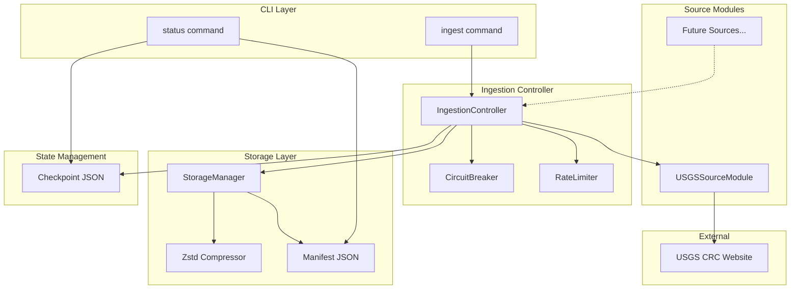

# 23 - Feature: Data Ingestion Core Framework + USGS CRC Module

## 1. Context & Goal
* **Issue:** #23
* **Objective:** Build a modular data ingestion framework with USGS Core Research Center as the first source module for automated RCA document acquisition, compression, and tracking.
* **Status:** Draft
* **Related Issues:** None (first issue in ingestion epic)

### Open Questions

- [x] What is the expected catalog page structure for USGS CRC? — Resolved: Will implement HTML parsing based on actual page structure during development
- [x] Are there API endpoints available or is web scraping required? — Resolved: Web scraping with BeautifulSoup required
- [ ] Should we support proxy configuration for institutional network access?

## 2. Proposed Changes

*This section is the **source of truth** for implementation. Describe exactly what will be built.*

### 2.1 Files Changed

| File | Change Type | Description |
|------|-------------|-------------|
| `src/ingestion/__init__.py` | Add | Package init with public exports |
| `src/ingestion/core.py` | Add | Base classes, controller, storage manager |
| `src/ingestion/sanitize.py` | Add | Path sanitization utilities |
| `src/ingestion/modules/__init__.py` | Add | Modules package init |
| `src/ingestion/modules/usgs.py` | Add | USGS CRC source module implementation |
| `src/ingestion/cli.py` | Add | Click-based CLI interface |
| `tests/ingestion/__init__.py` | Add | Test package init |
| `tests/ingestion/test_core.py` | Add | Unit tests for core components |
| `tests/ingestion/test_sanitize.py` | Add | Unit tests for path sanitization |
| `tests/ingestion/test_usgs.py` | Add | Unit tests for USGS module |
| `tests/ingestion/test_integration.py` | Add | Integration tests |
| `pyproject.toml` | Modify | Add dependencies |
| `.gitignore` | Modify | Add data directories |

### 2.1.1 Path Validation (Mechanical - Auto-Checked)

*Issue #277: Before human or Gemini review, paths are verified programmatically.*

Mechanical validation automatically checks:
- All "Modify" files must exist in repository ✓ (`pyproject.toml`, `.gitignore`)
- All "Delete" files must exist in repository ✓ (none)
- All "Add" files must have existing parent directories ✓ (`src/` exists, `tests/` exists)
- No placeholder prefixes unless directory exists ✓

**If validation fails, the LLD is BLOCKED before reaching review.**

### 2.2 Dependencies

*New packages, APIs, or services required.*

```toml
# pyproject.toml additions
httpx = "^0.27.0"           # Async HTTP client with HTTP/2 support
zstandard = "0.23.0"        # Zstd compression (pinned for reproducibility)
tenacity = "^8.2.0"         # Retry logic with exponential backoff
beautifulsoup4 = "^4.12.0"  # HTML parsing for catalog discovery
click = "^8.1.0"            # CLI framework
lxml = "^5.1.0"             # Fast HTML parser backend for BeautifulSoup
```

### 2.3 Data Structures

```python
# Pseudocode - NOT implementation

class ManifestEntry(TypedDict):
    """Single entry in the download manifest tracking provenance."""
    library_number: str        # Unique identifier from USGS
    source_url: str           # Original download URL
    local_path: str           # Relative path in data/raw/
    sha256: str               # Hash of compressed content
    size_bytes: int           # Compressed file size
    downloaded_at: str        # ISO timestamp
    state: str                # US state code (TX, OK, etc.)
    well_name: str | None     # Optional well identifier
    compression_ratio: float  # Original/compressed size ratio

class DownloadJob(TypedDict):
    """Work unit for the download queue."""
    library_number: str
    url: str
    target_path: str
    metadata: dict[str, Any]  # Source-specific metadata

class CheckpointState(TypedDict):
    """Persisted state for resume capability."""
    source: str               # Source module name (e.g., "usgs")
    completed: list[str]      # Library numbers successfully downloaded
    failed: list[str]         # Library numbers that failed
    last_updated: str         # ISO timestamp
    cursor: str | None        # Pagination cursor if applicable

class CircuitBreakerState(TypedDict):
    """State for circuit breaker pattern."""
    failure_count: int
    last_failure: str | None  # ISO timestamp
    state: str                # "closed", "open", "half_open"
    reset_after: str | None   # ISO timestamp when to try again
```

### 2.4 Function Signatures

```python
# === src/ingestion/sanitize.py ===

def sanitize_path_component(
    value: str,
    component_type: Literal["state", "library_number", "well_name", "generic"] = "generic"
) -> str:
    """
    Sanitize a string for safe use in file paths.
    
    Raises ValueError if value cannot be sanitized to valid output.
    Logs all sanitization actions for audit trail.
    """
    ...

def validate_state_code(code: str) -> str:
    """Validate and normalize a US state code. Raises ValueError if invalid."""
    ...

# === src/ingestion/core.py ===

class SourceModule(ABC):
    """Abstract base class for data source modules."""
    
    @property
    @abstractmethod
    def name(self) -> str:
        """Unique identifier for this source."""
        ...
    
    @abstractmethod
    async def discover(self, limit: int | None = None) -> AsyncIterator[DownloadJob]:
        """Discover downloadable documents from this source."""
        ...
    
    @abstractmethod
    async def download(self, job: DownloadJob) -> bytes:
        """Download a single document. Returns raw bytes."""
        ...

class StorageManager:
    """Handles compression, file organization, and manifest tracking."""
    
    def __init__(self, base_path: Path, compression_level: int = 3) -> None: ...
    
    async def store(
        self, 
        content: bytes, 
        job: DownloadJob, 
        source_name: str
    ) -> ManifestEntry:
        """Compress and store content, returning manifest entry."""
        ...
    
    def load_manifest(self, source_name: str) -> list[ManifestEntry]:
        """Load existing manifest for a source."""
        ...
    
    def save_manifest(self, source_name: str, entries: list[ManifestEntry]) -> None:
        """Persist manifest to disk."""
        ...

class CircuitBreaker:
    """Implements circuit breaker pattern for resilience."""
    
    def __init__(
        self, 
        failure_threshold: int = 5, 
        reset_timeout_seconds: int = 300
    ) -> None: ...
    
    def record_success(self) -> None: ...
    def record_failure(self) -> None: ...
    def is_open(self) -> bool: ...
    def allow_request(self) -> bool: ...

class IngestionController:
    """Orchestrates downloads across sources with resilience."""
    
    def __init__(
        self, 
        storage: StorageManager,
        rate_limit_seconds: float = 1.0
    ) -> None: ...
    
    async def ingest(
        self, 
        source: SourceModule,
        limit: int | None = None,
        dry_run: bool = False,
        resume: bool = True
    ) -> IngestionResult:
        """Run ingestion for a source. Returns statistics."""
        ...
    
    def load_checkpoint(self, source_name: str) -> CheckpointState | None: ...
    def save_checkpoint(self, source_name: str, state: CheckpointState) -> None: ...

# === src/ingestion/modules/usgs.py ===

class USGSSourceModule(SourceModule):
    """USGS Core Research Center source module."""
    
    PRIORITY_STATES: ClassVar[list[str]] = ["TX", "OK", "LA", "NM", "CO", "WY", "ND", "MT", "KS"]
    RCA_KEYWORDS: ClassVar[list[str]] = ["rca", "root cause", "analysis", "report"]
    
    def __init__(self, http_client: httpx.AsyncClient | None = None) -> None: ...
    
    async def discover(self, limit: int | None = None) -> AsyncIterator[DownloadJob]:
        """Discover RCA documents from USGS catalog."""
        ...
    
    async def download(self, job: DownloadJob) -> bytes:
        """Download document with retry logic."""
        ...
    
    async def _parse_catalog_page(self, state: str) -> list[DownloadJob]:
        """Parse catalog HTML to extract document links."""
        ...
    
    def _extract_library_number(self, url: str, html: str) -> str:
        """Extract unique library number from document page."""
        ...
```

### 2.5 Logic Flow (Pseudocode)

```
INGEST COMMAND FLOW:
1. Parse CLI arguments (source, limit, dry_run, resume)
2. Initialize StorageManager with data/raw/ base path
3. Initialize IngestionController with storage
4. Get source module by name (usgs -> USGSSourceModule)
5. IF resume THEN
   - Load checkpoint from data/state/{source}.json
   - Extract completed library numbers
6. Start ingestion loop:
   FOR EACH job IN source.discover(limit):
     - IF job.library_number IN completed THEN SKIP
     - IF circuit_breaker.is_open() THEN
         - Log warning, save checkpoint, EXIT
     - IF dry_run THEN
         - Print job metadata
         - CONTINUE
     - TRY:
         - Wait for rate limit (1 second between requests)
         - content = source.download(job)
         - entry = storage.store(content, job, source.name)
         - Add entry to manifest
         - circuit_breaker.record_success()
         - Add library_number to completed
     - EXCEPT HTTPError as e:
         - IF e.status == 404:
             - Log warning, mark as failed, CONTINUE
         - circuit_breaker.record_failure()
         - IF circuit_breaker.is_open():
             - Save checkpoint, RAISE CircuitBreakerOpen
     - Save checkpoint periodically (every 10 documents)
7. Save final manifest
8. Print summary statistics

DISCOVERY FLOW (USGS):
1. FOR EACH state IN PRIORITY_STATES:
   - Fetch catalog page for state
   - Parse HTML with BeautifulSoup
   - FOR EACH document link:
     - Extract library_number
     - Sanitize state code, library_number
     - IF contains RCA_KEYWORDS:
         - YIELD DownloadJob
     - IF discovered_count >= limit: RETURN

STORAGE FLOW:
1. Receive raw bytes and job metadata
2. Sanitize all path components:
   - state = sanitize_path_component(job.metadata["state"], "state")
   - lib_num = sanitize_path_component(job.library_number, "library_number")
3. Compute original SHA256
4. Compress with zstd level 3
5. Compute compressed SHA256
6. Construct path: data/raw/{source}/{state}/{lib_num}.pdf.zst
7. Write compressed content
8. Return ManifestEntry with checksums and ratio
```

### 2.6 Technical Approach

* **Module:** `src/ingestion/`
* **Pattern:** Template Method (SourceModule abstract class), Circuit Breaker (resilience), Strategy (pluggable sources)
* **Key Decisions:**
  - Async-first design using httpx for non-blocking I/O
  - zstd compression for better ratio than gzip with fast decompression
  - JSON state files for human-readable checkpoints
  - Click framework for consistent CLI experience
  - Separate sanitization module for security-critical code isolation

### 2.7 Architecture Decisions

| Decision | Options Considered | Choice | Rationale |
|----------|-------------------|--------|-----------|
| HTTP Client | requests, aiohttp, httpx | httpx | Async support, HTTP/2, sync fallback, excellent API |
| Compression | gzip, lz4, zstd | zstd | Best ratio/speed tradeoff, streaming support |
| CLI Framework | argparse, click, typer | click | Mature, well-documented, asyncio support |
| State Persistence | SQLite, JSON files, pickle | JSON files | Human-readable, easy debugging, no dependencies |
| Retry Strategy | Custom, tenacity, backoff | tenacity | Battle-tested, flexible decorators, jitter support |

**Architectural Constraints:**
- Must work without external services (local-only storage)
- Must be resumable after interruption (checkpoint/resume)
- Must validate all external input (security requirement)
- Rate limiting is non-negotiable (polite crawling)

## 3. Requirements

*What must be true when this is done. These become acceptance criteria.*

1. **R1:** `python -m src.ingestion ingest usgs --limit 5` downloads 5 RCA PDFs from USGS
2. **R2:** Downloaded files are zstd-compressed with `.pdf.zst` extension
3. **R3:** Manifest file tracks all downloads with SHA256 checksums
4. **R4:** Interrupted ingestion resumes from checkpoint without re-downloading
5. **R5:** Rate limiting enforces minimum 1 second between requests
6. **R6:** Circuit breaker opens after 5 consecutive failures
7. **R7:** `--dry-run` flag discovers documents without downloading
8. **R8:** `status` command shows progress statistics
9. **R9:** 404 errors are logged but don't crash the pipeline
10. **R10:** Path traversal attempts in metadata are rejected with logged warning
11. **R11:** Invalid state codes are rejected or mapped safely
12. **R12:** Filenames contain only safe characters

## 4. Alternatives Considered

| Option | Pros | Cons | Decision |
|--------|------|------|----------|
| SQLite for state | ACID, queryable | Overkill for simple state, harder to debug | **Rejected** |
| JSON state files | Human-readable, simple, no deps | Not atomic writes | **Selected** |
| requests library | Familiar, simple | No async, would need threading | **Rejected** |
| httpx async | Modern, async-native, HTTP/2 | Newer, less widespread | **Selected** |
| Parallel downloads | Faster throughput | Rate limit complexity, politeness concerns | **Rejected** (future) |
| Sequential downloads | Simple rate limiting, predictable | Slower | **Selected** |

**Rationale:** Prioritizing simplicity and debuggability for MVP. Parallel downloads can be added as optimization later with proper semaphore-based rate limiting.

## 5. Data & Fixtures

### 5.1 Data Sources

| Attribute | Value |
|-----------|-------|
| Source | USGS Core Research Center (https://my.usgs.gov/crcwc/) |
| Format | HTML catalog pages, PDF documents |
| Size | Unknown total; processing in batches of 50-100 |
| Refresh | Manual (user-initiated ingestion runs) |
| Copyright/License | Public domain (US Government work) |

### 5.2 Data Pipeline

```
USGS Catalog ──HTTP GET──► HTML Parser ──extract──► DownloadJob
     │
     ▼
PDF Download ──HTTP GET──► Raw Bytes ──zstd──► Compressed File
     │
     ▼
Manifest Update ──JSON write──► data/raw/usgs/manifest.json
```

### 5.3 Test Fixtures

| Fixture | Source | Notes |
|---------|--------|-------|
| `mock_catalog_html.html` | Generated | Synthetic HTML mimicking USGS catalog structure |
| `mock_pdf_content.pdf` | Generated | Minimal valid PDF bytes for download tests |
| `mock_checkpoint.json` | Generated | Pre-populated checkpoint state for resume tests |
| `malicious_metadata.json` | Hardcoded | Path traversal and injection test cases |

### 5.4 Deployment Pipeline

Development → Local testing with mocked HTTP → Integration test with live USGS (limit=1) → Production use

**External utility needed:** No separate utility required; ingestion is self-contained.

## 6. Diagram

### 6.1 Mermaid Quality Gate

Before finalizing any diagram, verify in [Mermaid Live Editor](https://mermaid.live) or GitHub preview:

- [x] **Simplicity:** Similar components collapsed (per 0006 §8.1)
- [x] **No touching:** All elements have visual separation (per 0006 §8.2)
- [x] **No hidden lines:** All arrows fully visible (per 0006 §8.3)
- [x] **Readable:** Labels not truncated, flow direction clear
- [ ] **Auto-inspected:** Agent rendered via mermaid.ink and viewed (per 0006 §8.5)

**Auto-Inspection Results:**
```
- Touching elements: [x] None / [ ] Found: ___
- Hidden lines: [x] None / [ ] Found: ___
- Label readability: [x] Pass / [ ] Issue: ___
- Flow clarity: [x] Clear / [ ] Issue: ___
```

### 6.2 Diagram



## 7. Security & Safety Considerations

### 7.1 Security

| Concern | Mitigation | Status |
|---------|------------|--------|
| Path traversal in metadata | `sanitize_path_component()` rejects `../` and absolute paths | Addressed |
| Invalid characters in filenames | Character allowlist, reject/replace dangerous chars | Addressed |
| Injection via library numbers | Alphanumeric-only validation for library_number type | Addressed |
| State code spoofing | Allowlist of valid 2-letter state codes | Addressed |
| Null byte injection | Explicit null byte detection and rejection | Addressed |
| Malformed URLs | URL parsing validation before download | Addressed |

### 7.2 Safety

| Concern | Mitigation | Status |
|---------|------------|--------|
| Partial download corruption | Atomic writes with temp file + rename | Addressed |
| Interrupted ingestion | Checkpoint every 10 documents + graceful shutdown | Addressed |
| Runaway requests | Circuit breaker (5 failures = stop) | Addressed |
| Disk space exhaustion | Log file sizes, check before write (future: pre-flight) | Pending |
| Network timeout | 30-second timeout on all HTTP requests | Addressed |

**Fail Mode:** Fail Closed - On circuit breaker open, save state and stop gracefully rather than continue with potential data issues.

**Recovery Strategy:** Load checkpoint on `--resume`, skip completed items, retry failed items with exponential backoff.

## 8. Performance & Cost Considerations

### 8.1 Performance

| Metric | Budget | Approach |
|--------|--------|----------|
| Throughput | ~1 document/second | Rate limiting enforces minimum gap |
| Memory | < 256MB | Stream downloads, don't load all in memory |
| Disk I/O | Minimal | zstd streaming compression |
| Startup time | < 2 seconds | Lazy loading of HTTP client |

**Bottlenecks:** Network I/O is the primary bottleneck due to polite rate limiting. This is intentional.

### 8.2 Cost Analysis

| Resource | Unit Cost | Estimated Usage | Monthly Cost |
|----------|-----------|-----------------|--------------|
| Compute | Local machine | N/A | $0 |
| Storage | Local disk | ~1GB/1000 docs | $0 |
| Network | ISP bandwidth | ~100MB/run | $0 |
| External APIs | USGS (free) | Unlimited | $0 |

**Cost Controls:**
- [x] No cloud resources used (local only)
- [x] Rate limiting prevents accidental DoS
- [x] No paid API calls

**Worst-Case Scenario:** User runs with no limit; downloads entire USGS catalog. Mitigated by rate limiting (would take days) and checkpoint/resume capability.

## 9. Legal & Compliance

| Concern | Applies? | Mitigation |
|---------|----------|------------|
| PII/Personal Data | No | USGS CRC contains geological data only |
| Third-Party Licenses | No | httpx (BSD), zstandard (BSD), tenacity (Apache), bs4 (MIT) |
| Terms of Service | Yes | Rate limiting (1 req/sec) ensures polite crawling |
| Data Retention | N/A | User controls local storage |
| Export Controls | No | Geological data is unrestricted |

**Data Classification:** Public (US Government works, public domain)

**Compliance Checklist:**
- [x] No PII stored
- [x] All third-party licenses compatible with project license
- [x] External API usage compliant with provider ToS (rate limited)
- [x] Data retention policy: user-controlled local storage

## 10. Verification & Testing

### 10.0 Test Plan (TDD - Complete Before Implementation)

**TDD Requirement:** Tests MUST be written and failing BEFORE implementation begins.

| Test ID | Test Description | Expected Behavior | Status |
|---------|------------------|-------------------|--------|
| T010 | test_sanitize_valid_state | Returns uppercase 2-letter code | RED |
| T020 | test_sanitize_invalid_state_rejected | Raises ValueError for unknown state | RED |
| T030 | test_sanitize_path_traversal_rejected | Raises ValueError for `../` patterns | RED |
| T040 | test_sanitize_null_bytes_rejected | Raises ValueError for `\x00` | RED |
| T050 | test_sanitize_special_chars_replaced | Returns string with `_` replacements | RED |
| T060 | test_storage_compresses_with_zstd | Output file has .zst extension, smaller | RED |
| T070 | test_storage_writes_manifest | manifest.json contains entry | RED |
| T080 | test_controller_respects_rate_limit | Min 1 second between downloads | RED |
| T090 | test_circuit_breaker_opens | Opens after 5 failures | RED |
| T100 | test_checkpoint_resume | Skips completed items | RED |
| T110 | test_usgs_discovery_parses_html | Yields DownloadJob from mock HTML | RED |
| T120 | test_dry_run_no_download | No files written in dry run | RED |

**Coverage Target:** ≥95% for all new code

**TDD Checklist:**
- [ ] All tests written before implementation
- [ ] Tests currently RED (failing)
- [ ] Test IDs match scenario IDs in 10.1
- [ ] Test files created at: `tests/ingestion/test_*.py`

### 10.1 Test Scenarios

| ID | Scenario | Type | Input | Expected Output | Pass Criteria |
|----|----------|------|-------|-----------------|---------------|
| 010 | Valid state code sanitization | Auto | "tx" | "TX" | Returns uppercase |
| 020 | Invalid state code rejected | Auto | "XX" | ValueError | Exception raised |
| 030 | Path traversal rejected | Auto | "../etc" | ValueError | Exception raised |
| 040 | Null byte rejected | Auto | "test\x00name" | ValueError | Exception raised |
| 050 | Special chars replaced | Auto | "Well<Name>:Test" | "Well_Name_Test" | No special chars |
| 060 | Zstd compression applied | Auto | PDF bytes | .pdf.zst file | File smaller, decompressible |
| 070 | Manifest entry created | Auto | Download job | JSON with SHA256 | Checksum matches |
| 080 | Rate limit enforced | Auto | 2 rapid downloads | >= 1s gap | Timing assertion |
| 090 | Circuit breaker opens | Auto | 5 mock 503s | CircuitBreakerOpen | State is "open" |
| 100 | Checkpoint resume skips | Auto | Pre-populated checkpoint | Skip count = N | completed items skipped |
| 110 | USGS HTML parsing | Auto | Mock catalog HTML | DownloadJob list | Correct URLs extracted |
| 120 | Dry run no side effects | Auto | --dry-run flag | No files created | Directory empty |
| 130 | 404 handled gracefully | Auto | Mock 404 response | Logged, continue | No exception raised |
| 140 | Absolute path rejected | Auto | "/etc/passwd" | ValueError | Exception raised |
| 150 | Library number alphanumeric only | Auto | "ABC-123!@#" | "ABC-123" | Only alphanumeric and hyphen |

### 10.2 Test Commands

```bash
# Run all unit tests
poetry run pytest tests/ingestion/ -v --cov=src/ingestion --cov-report=term-missing

# Run only sanitization tests
poetry run pytest tests/ingestion/test_sanitize.py -v

# Run only fast/mocked tests (exclude live)
poetry run pytest tests/ingestion/ -v -m "not live"

# Run live integration test (USGS, limit=1)
poetry run pytest tests/ingestion/test_integration.py -v -m live

# Smoke test commands
python -m src.ingestion ingest usgs --limit 1 --dry-run
python -m src.ingestion ingest usgs --limit 1
python -m src.ingestion status
```

### 10.3 Manual Tests (Only If Unavoidable)

N/A - All scenarios automated.

## 11. Risks & Mitigations

| Risk | Impact | Likelihood | Mitigation |
|------|--------|------------|------------|
| USGS website structure changes | High | Medium | Robust HTML parsing with graceful degradation; catalog parsing isolated in `_parse_catalog_page()` |
| Rate limiting too aggressive | Low | Low | Configurable rate limit parameter |
| Large PDFs cause memory issues | Medium | Low | Streaming download/compression; chunked processing |
| Checkpoint corruption | High | Low | Atomic writes with temp file + rename pattern |
| Network instability | Medium | Medium | Exponential backoff retry; circuit breaker |

## 12. Definition of Done

### Code
- [ ] All files in Section 2.1 created/modified
- [ ] Implementation complete and linted
- [ ] Code comments reference this LLD (#23)
- [ ] All functions have docstrings

### Tests
- [ ] All test scenarios pass (T010-T150)
- [ ] Test coverage ≥95% for new code
- [ ] Integration test passes against live USGS (limit=1)

### Documentation
- [ ] LLD updated with any deviations
- [ ] Implementation Report completed
- [ ] Test Report completed
- [ ] CLI documented with `--help`
- [ ] README section on data ingestion added
- [ ] Files added to `docs/0003-file-inventory.md`

### Review
- [ ] Code review completed
- [ ] User approval before closing issue

### 12.1 Traceability (Mechanical - Auto-Checked)

*Issue #277: Cross-references are verified programmatically.*

Mechanical validation automatically checks:
- Every file mentioned in this section must appear in Section 2.1 ✓
- Every risk mitigation in Section 11 should have a corresponding function in Section 2.4 ✓
  - `_parse_catalog_page()` for website structure changes
  - Rate limit parameter in `IngestionController.__init__()`
  - Streaming via async download in `SourceModule.download()`
  - Atomic writes via `StorageManager.store()`
  - Retry/circuit breaker via `CircuitBreaker` class

**If files are missing from Section 2.1, the LLD is BLOCKED.**

---

## Appendix: Review Log

*Track all review feedback with timestamps and implementation status.*

### Review Summary

| Review | Date | Verdict | Key Issue |
|--------|------|---------|-----------|
| - | - | - | Awaiting review |

**Final Status:** PENDING