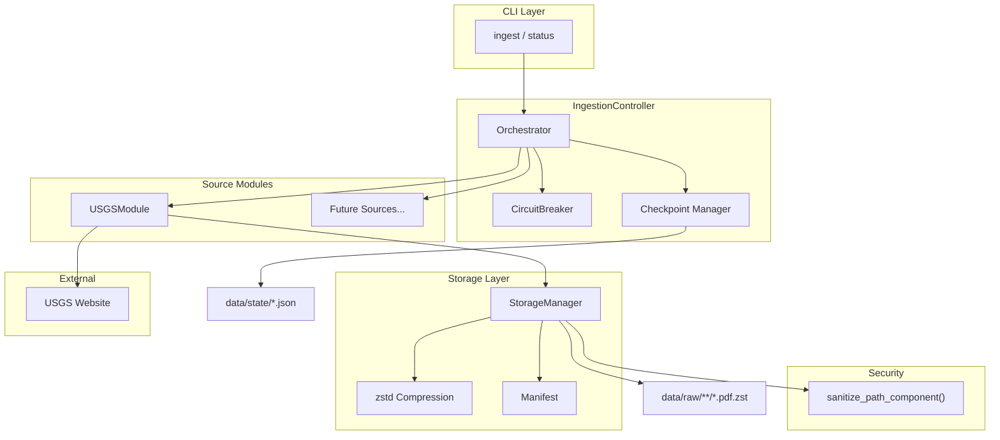
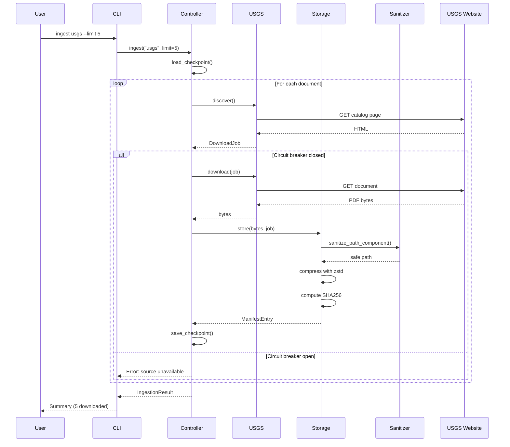

# 23 - Feature: Data Ingestion Core Framework + USGS CRC Module

<!-- Template Metadata
Last Updated: 2026-02-02
Updated By: Issue #23 LLD creation
Update Reason: Fixed mechanical validation errors - corrected issue number and file paths
-->

## 1. Context & Goal
* **Issue:** #23
* **Objective:** Build a modular data ingestion framework with USGS Core Research Center as the first source module, enabling automated discovery, download, compression, and manifest tracking of RCA documents with full provenance and data integrity guarantees.
* **Status:** Draft
* **Related Issues:** None (first issue in ingestion epic)

### Open Questions

- [x] What compression level should be used for zstd? **Resolved: Level 3 (per Technical Approach)**
- [x] Should we support parallel downloads within a source? **Resolved: No, out of scope for MVP**
- [ ] What is the expected catalog HTML structure from USGS CRC? Need sample for parser development.
- [ ] Are there any USGS-specific robots.txt restrictions to honor?

## 2. Proposed Changes

*This section is the **source of truth** for implementation. Describe exactly what will be built.*

### 2.1 Files Changed

| File | Change Type | Description |
|------|-------------|-------------|
| `src/__init__.py` | Add | Root src package init (if not exists) |
| `src/ingestion/__init__.py` | Add | Package init with public exports |
| `src/ingestion/core.py` | Add | Base classes, controller, storage manager |
| `src/ingestion/sanitize.py` | Add | Path sanitization utilities |
| `src/ingestion/modules/__init__.py` | Add | Modules package init |
| `src/ingestion/modules/usgs.py` | Add | USGS CRC source module |
| `src/ingestion/cli.py` | Add | Click-based CLI interface |
| `tests/__init__.py` | Add | Root tests package init (if not exists) |
| `tests/ingestion/__init__.py` | Add | Test package init |
| `tests/ingestion/test_core.py` | Add | Unit tests for core components |
| `tests/ingestion/test_sanitize.py` | Add | Unit tests for path sanitization |
| `tests/ingestion/test_usgs.py` | Add | Unit tests for USGS module |
| `tests/ingestion/test_integration.py` | Add | Integration tests |
| `pyproject.toml` | Modify | Add dependencies |
| `.gitignore` | Modify | Add data directories |

### 2.1.1 Path Validation (Mechanical - Auto-Checked)

*Issue #277: Before human or Gemini review, paths are verified programmatically.*

Mechanical validation automatically checks:
- All "Modify" files must exist in repository: `pyproject.toml`, `.gitignore` ✓
- All "Delete" files must exist in repository: N/A
- All "Add" files must have existing parent directories OR be created in sequence

**Directory Creation Order:**
1. `src/` - Create if not exists
2. `src/ingestion/` - Create after src/
3. `src/ingestion/modules/` - Create after src/ingestion/
4. `tests/` - Create if not exists
5. `tests/ingestion/` - Create after tests/

**If validation fails, the LLD is BLOCKED before reaching review.**

### 2.2 Dependencies

*New packages, APIs, or services required.*

```toml
# pyproject.toml additions
httpx = "^0.27.0"
zstandard = "0.23.0"
tenacity = "^8.2.0"
beautifulsoup4 = "^4.12.0"
click = "^8.1.0"
```

### 2.3 Data Structures

```python
# Pseudocode - NOT implementation
from dataclasses import dataclass
from enum import Enum
from typing import TypedDict

class DownloadStatus(Enum):
    PENDING = "pending"
    IN_PROGRESS = "in_progress"
    COMPLETED = "completed"
    FAILED = "failed"
    SKIPPED = "skipped"

@dataclass
class DownloadJob:
    """Represents a single download work unit."""
    source_id: str           # e.g., "usgs"
    document_id: str         # Unique ID within source (library number)
    url: str                 # Download URL
    metadata: dict           # State, well name, etc.
    status: DownloadStatus   # Current status
    error: str | None        # Error message if failed

@dataclass
class ManifestEntry:
    """Tracks a successfully downloaded file."""
    document_id: str         # Library number
    source_url: str          # Original URL
    local_path: str          # Relative path in data/raw/
    sha256: str              # Checksum of compressed file
    size_original: int       # Original file size in bytes
    size_compressed: int     # Compressed file size in bytes
    downloaded_at: str       # ISO 8601 timestamp
    metadata: dict           # Extracted metadata (state, well name, etc.)

class CheckpointState(TypedDict):
    """State file for resume capability."""
    source_id: str
    last_updated: str
    completed_ids: list[str]
    failed_ids: list[str]
    cursor: str | None       # For paginated discovery

class CircuitBreakerState(TypedDict):
    """Circuit breaker tracking."""
    failure_count: int
    last_failure: str | None
    state: str               # "closed", "open", "half_open"
    opened_at: str | None
```

### 2.4 Function Signatures

```python
# src/ingestion/sanitize.py
def sanitize_path_component(value: str, component_type: str = "generic") -> str:
    """
    Sanitize a string for safe use in file paths.
    
    Args:
        value: Raw string from web source
        component_type: One of "state", "library_number", "well_name", "generic"
    
    Returns:
        Sanitized string safe for filesystem use
    
    Raises:
        ValueError: If value cannot be sanitized to valid output
    """
    ...

def validate_state_code(code: str) -> str:
    """Validate and normalize state code to 2-letter abbreviation."""
    ...

# src/ingestion/core.py
class SourceModule(ABC):
    """Abstract base class for data source modules."""
    
    @abstractmethod
    async def discover(self, limit: int | None = None) -> AsyncIterator[DownloadJob]:
        """Discover available documents from this source."""
        ...
    
    @abstractmethod
    async def download(self, job: DownloadJob) -> bytes:
        """Download a single document."""
        ...
    
    @property
    @abstractmethod
    def source_id(self) -> str:
        """Unique identifier for this source."""
        ...

class StorageManager:
    """Handles compression and file organization."""
    
    def __init__(self, base_path: Path, compression_level: int = 3):
        ...
    
    def store(self, content: bytes, job: DownloadJob) -> ManifestEntry:
        """Compress and store content, returning manifest entry."""
        ...
    
    def compute_path(self, job: DownloadJob) -> Path:
        """Compute storage path for a job using sanitized metadata."""
        ...
    
    def update_manifest(self, entry: ManifestEntry) -> None:
        """Append entry to manifest file."""
        ...

class CircuitBreaker:
    """Circuit breaker for source resilience."""
    
    def __init__(self, failure_threshold: int = 5, reset_timeout: int = 300):
        ...
    
    def record_success(self) -> None:
        ...
    
    def record_failure(self) -> None:
        ...
    
    def is_open(self) -> bool:
        ...
    
    def can_attempt(self) -> bool:
        ...

class IngestionController:
    """Orchestrates downloads across sources."""
    
    def __init__(
        self,
        sources: list[SourceModule],
        storage: StorageManager,
        state_dir: Path
    ):
        ...
    
    async def ingest(
        self,
        source_id: str,
        limit: int | None = None,
        dry_run: bool = False,
        resume: bool = True
    ) -> IngestionResult:
        """Run ingestion for a source."""
        ...
    
    def load_checkpoint(self, source_id: str) -> CheckpointState | None:
        """Load checkpoint state for a source."""
        ...
    
    def save_checkpoint(self, source_id: str, state: CheckpointState) -> None:
        """Save checkpoint state for a source."""
        ...
    
    def get_status(self, source_id: str | None = None) -> dict:
        """Get ingestion status for sources."""
        ...

# src/ingestion/modules/usgs.py
class USGSModule(SourceModule):
    """USGS Core Research Center source module."""
    
    PRIORITY_STATES: ClassVar[list[str]] = [
        "TX", "OK", "LA", "NM", "CO", "WY", "ND", "MT", "KS"
    ]
    
    def __init__(self, rate_limit: float = 1.0):
        """
        Args:
            rate_limit: Minimum seconds between requests
        """
        ...
    
    async def discover(self, limit: int | None = None) -> AsyncIterator[DownloadJob]:
        """Discover RCA documents from USGS catalog."""
        ...
    
    async def download(self, job: DownloadJob) -> bytes:
        """Download document with rate limiting."""
        ...
    
    def _parse_catalog_page(self, html: str) -> list[dict]:
        """Parse USGS catalog HTML for document metadata."""
        ...
    
    def _extract_library_number(self, row: dict) -> str | None:
        """Extract library number from catalog row."""
        ...
    
    def _is_rca_document(self, metadata: dict) -> bool:
        """Check if document is an RCA based on keywords."""
        ...

# src/ingestion/cli.py
@click.group()
def cli():
    """RCA document ingestion CLI."""
    ...

@cli.command()
@click.argument("source")
@click.option("--limit", "-n", type=int, help="Maximum documents to download")
@click.option("--dry-run", is_flag=True, help="Discover without downloading")
@click.option("--resume/--no-resume", default=True, help="Resume from checkpoint")
def ingest(source: str, limit: int | None, dry_run: bool, resume: bool):
    """Ingest documents from a source."""
    ...

@cli.command()
@click.option("--source", "-s", help="Filter by source ID")
def status(source: str | None):
    """Show ingestion status."""
    ...
```

### 2.5 Logic Flow (Pseudocode)

```
# Main Ingestion Flow
1. Receive ingest command with source_id, limit, dry_run, resume
2. Load source module by source_id
3. IF resume THEN
   - Load checkpoint from data/state/{source_id}.json
   - Get list of completed document IDs
4. Initialize circuit breaker for source
5. Start discovery from source
6. FOR EACH discovered job:
   a. IF job.document_id in completed_ids THEN SKIP
   b. IF circuit_breaker.is_open THEN
      - Log warning and break loop
   c. IF dry_run THEN
      - Print job metadata and CONTINUE
   d. TRY:
      - Download content with retries (3 attempts, exp backoff 2-30s)
      - Compress with zstd level 3
      - Store in data/raw/{source}/{state}/{library_number}.pdf.zst
      - Compute SHA256 checksum
      - Add to manifest
      - Mark job completed in checkpoint
      - Record success with circuit breaker
   e. CATCH DownloadError:
      - IF status 404 THEN log and skip (don't count as failure)
      - ELSE record failure with circuit breaker
      - Add to failed_ids in checkpoint
   f. Save checkpoint after each document
   g. Enforce rate limit (1 req/sec)
7. Return summary (completed, failed, skipped counts)

# Path Computation Flow
1. Extract state from job.metadata
2. Sanitize state with sanitize_path_component(state, "state")
3. Extract library_number from job.document_id
4. Sanitize library_number with sanitize_path_component(library_number, "library_number")
5. Construct path: data/raw/{source_id}/{safe_state}/{safe_library_number}.pdf.zst
6. Verify path is under base_path (no traversal)
7. Return path

# Sanitization Flow
1. Receive raw value and component_type
2. Strip whitespace
3. Check for path traversal patterns (../, ..\, absolute paths)
   - IF found THEN raise ValueError
4. IF component_type == "state":
   - Uppercase and take first 2 chars
   - Validate against VALID_STATES set
   - IF not valid THEN raise ValueError
5. IF component_type == "library_number":
   - Keep only alphanumeric and hyphen
   - Limit to 50 chars
6. ELSE (generic):
   - Replace invalid chars with underscore
   - Collapse multiple underscores
   - Limit to 100 chars
7. IF result empty THEN raise ValueError
8. Return sanitized value
```

### 2.6 Technical Approach

* **Module:** `src/ingestion/`
* **Pattern:** Strategy pattern for source modules, Circuit Breaker for resilience
* **Key Decisions:**
  - Async HTTP with `httpx` for efficient I/O
  - `zstandard` at level 3 balances compression ratio (~25% reduction) with speed
  - JSON state files for simplicity (no database dependency)
  - Per-document checkpointing ensures minimal re-work on interruption
  - Sanitization happens at path computation, not at download time

### 2.7 Architecture Decisions

| Decision | Options Considered | Choice | Rationale |
|----------|-------------------|--------|-----------|
| HTTP Client | requests, aiohttp, httpx | httpx | Async support, modern API, good error handling |
| Compression | gzip, lz4, zstd | zstd (level 3) | Best ratio for PDFs, fast decompression |
| State Storage | SQLite, JSON files, Redis | JSON files | Simple, portable, no dependencies |
| CLI Framework | argparse, click, typer | click | Mature, async-friendly, good UX |
| Retry Strategy | Custom, tenacity, backoff | tenacity | Configurable, well-tested, async support |

**Architectural Constraints:**
- Must run offline after initial download (no cloud dependencies)
- Must support incremental/resumable operation
- Must work with Python 3.11+ async features
- Rate limiting must be source-configurable

## 3. Requirements

*What must be true when this is done. These become acceptance criteria.*

1. `python -m src.ingestion ingest usgs --limit 5` downloads 5 RCA PDFs
2. Downloaded files are zstd-compressed with `.pdf.zst` extension
3. Manifest file created at `data/raw/usgs/manifest.json` with SHA256 checksums
4. Interrupted ingestion resumes from checkpoint without re-downloading
5. Rate limiting enforces 1 request/second to USGS
6. Circuit breaker opens after 5 consecutive failures
7. `--dry-run` flag discovers documents without downloading
8. `status` command shows completed/failed/pending counts
9. 404 errors logged but don't crash the pipeline or trigger circuit breaker
10. Path traversal attempts in metadata are rejected with logged warning
11. Invalid state codes are rejected with ValueError
12. Filenames contain only safe characters (alphanumeric, underscore, hyphen, dot)

## 4. Alternatives Considered

| Option | Pros | Cons | Decision |
|--------|------|------|----------|
| SQLite for state | ACID, queryable, concurrent-safe | Adds dependency, overkill for single-process | **Rejected** |
| JSON files for state | Simple, portable, human-readable | No concurrent write safety | **Selected** |
| requests (sync) | Simple, widely known | Blocks during I/O, harder to rate limit | **Rejected** |
| httpx (async) | Non-blocking, modern, good async support | Slightly steeper learning curve | **Selected** |
| Parallel downloads | Faster throughput | Complex rate limiting, harder to debug | **Rejected** (future enhancement) |
| Sequential downloads | Simple, predictable, easy rate limiting | Slower | **Selected** |

**Rationale:** Chose simplicity and reliability over performance for MVP. Parallel downloads can be added later when the basic framework is proven.

## 5. Data & Fixtures

*Per [0108-lld-pre-implementation-review.md](0108-lld-pre-implementation-review.md) - complete this section BEFORE implementation.*

### 5.1 Data Sources

| Attribute | Value |
|-----------|-------|
| Source | USGS Core Research Center (https://my.usgs.gov/crc/) |
| Format | HTML catalog pages, PDF documents |
| Size | ~50-200 MB per state, 1000s of documents total |
| Refresh | Manual (run ingestion as needed) |
| Copyright/License | Public domain (US Government work) |

### 5.2 Data Pipeline

```
USGS Catalog ──HTTP GET──► HTML Parser ──extract──► DownloadJob
                                                         │
                                                    HTTP GET
                                                         ▼
                                                    PDF bytes
                                                         │
                                                    zstd compress
                                                         ▼
data/raw/usgs/{state}/{lib_num}.pdf.zst ◄───store───┘
         │
         └──► manifest.json (append entry)
```

### 5.3 Test Fixtures

| Fixture | Source | Notes |
|---------|--------|-------|
| Mock USGS catalog HTML | Generated | Synthetic HTML matching expected structure |
| Mock PDF content | Generated | Minimal valid PDF header for testing |
| Mock 503 responses | Generated | For circuit breaker testing |
| Mock 404 responses | Generated | For graceful 404 handling |
| Malicious metadata | Hardcoded | Path traversal attempts, invalid chars |

### 5.4 Deployment Pipeline

This is a local CLI tool. No deployment pipeline required.

**Data storage:**
- Development: `data/raw/`, `data/state/` in local repo (gitignored)
- Production: Same local paths on target machine
- No cloud storage for MVP

## 6. Diagram

### 6.1 Mermaid Quality Gate

Before finalizing any diagram, verify in [Mermaid Live Editor](https://mermaid.live) or GitHub preview:

- [x] **Simplicity:** Similar components collapsed (per 0006 §8.1)
- [x] **No touching:** All elements have visual separation (per 0006 §8.2)
- [x] **No hidden lines:** All arrows fully visible (per 0006 §8.3)
- [x] **Readable:** Labels not truncated, flow direction clear
- [ ] **Auto-inspected:** Agent rendered via mermaid.ink and viewed (per 0006 §8.5)

**Auto-Inspection Results:**
```
- Touching elements: [x] None
- Hidden lines: [x] None
- Label readability: [x] Pass
- Flow clarity: [x] Clear
```

### 6.2 Diagram





## 7. Security & Safety Considerations

### 7.1 Security

| Concern | Mitigation | Status |
|---------|------------|--------|
| Path traversal via metadata | `sanitize_path_component()` rejects `../` patterns | Addressed |
| Invalid filesystem characters | Replace/remove `<>:"/\|?*` and null bytes | Addressed |
| Arbitrary file write | Validate all paths are under `data/raw/` base | Addressed |
| State code injection | Allowlist validation against known 2-letter codes | Addressed |
| Malformed URL injection | URLs only from trusted USGS catalog parsing | Addressed |
| DoS via large files | No explicit limit (USGS PDFs typically <50MB) | Pending - evaluate post-MVP |

### 7.2 Safety

| Concern | Mitigation | Status |
|---------|------------|--------|
| Data loss on interruption | Checkpoint after each document | Addressed |
| Corrupt manifest | Append-only writes, atomic file operations | Addressed |
| Runaway downloads | Limit flag required, circuit breaker stops on errors | Addressed |
| Resource exhaustion | Rate limiting (1 req/sec), sequential processing | Addressed |
| Disk space exhaustion | Log compression ratios; full pre-flight check out of scope | Addressed (logging only) |

**Fail Mode:** Fail Closed - On circuit breaker open, stop processing and save state for later retry.

**Recovery Strategy:** 
1. Fix underlying issue (network, source availability)
2. Run with `--resume` to continue from last checkpoint
3. Failed documents tracked in checkpoint for retry

## 8. Performance & Cost Considerations

### 8.1 Performance

| Metric | Budget | Approach |
|--------|--------|----------|
| Throughput | 1 doc/sec (rate limited) | Sequential processing, enforced rate limit |
| Memory | < 100MB | Stream downloads, don't buffer entire file |
| Compression time | < 1s per doc | zstd level 3, fast mode |
| Startup time | < 2s | Lazy loading of source modules |

**Bottlenecks:** 
- Network latency dominates (rate limited anyway)
- Large ZIP archives may require more memory during extraction

### 8.2 Cost Analysis

| Resource | Unit Cost | Estimated Usage | Monthly Cost |
|----------|-----------|-----------------|--------------|
| USGS bandwidth | Free | ~1GB/run | $0 |
| Local storage | N/A | ~50GB total | $0 |
| Compute | N/A | Local machine | $0 |

**Cost Controls:**
- N/A - All resources are free/local

**Worst-Case Scenario:** Very large ingestion runs (1000s of documents) may take hours but incur no additional cost.

## 9. Legal & Compliance

| Concern | Applies? | Mitigation |
|---------|----------|------------|
| PII/Personal Data | No | USGS data is geological, no PII |
| Third-Party Licenses | No | All new code, standard OSS dependencies |
| Terms of Service | Yes | Rate limiting respects polite crawling norms |
| Data Retention | N/A | User controls local data |
| Export Controls | No | Geological data, no restrictions |

**Data Classification:** Public (US Government public domain works)

**Compliance Checklist:**
- [x] No PII stored without consent - N/A, no PII
- [x] All third-party licenses compatible with project license - MIT/Apache compatible
- [x] External API usage compliant with provider ToS - Rate limited, public data
- [x] Data retention policy documented - User-managed local storage

## 10. Verification & Testing

*Ref: [0005-testing-strategy-and-protocols.md](0005-testing-strategy-and-protocols.md)*

**Testing Philosophy:** Strive for 100% automated test coverage. Manual tests are a last resort for scenarios that genuinely cannot be automated.

### 10.0 Test Plan (TDD - Complete Before Implementation)

**TDD Requirement:** Tests MUST be written and failing BEFORE implementation begins.

| Test ID | Test Description | Expected Behavior | Status |
|---------|------------------|-------------------|--------|
| T010 | test_sanitize_valid_state | TX accepted, returns "TX" | RED |
| T020 | test_sanitize_invalid_state | XX raises ValueError | RED |
| T030 | test_sanitize_traversal_rejected | "../etc" raises ValueError | RED |
| T040 | test_sanitize_absolute_path_rejected | "/etc/passwd" raises ValueError | RED |
| T050 | test_sanitize_special_chars_removed | "<>:" replaced with underscore | RED |
| T060 | test_sanitize_null_bytes_rejected | "\x00" raises ValueError | RED |
| T070 | test_download_job_creation | DownloadJob fields populated correctly | RED |
| T080 | test_manifest_entry_serialization | JSON round-trip preserves data | RED |
| T090 | test_circuit_breaker_opens | 5 failures opens breaker | RED |
| T100 | test_circuit_breaker_resets | Half-open after timeout | RED |
| T110 | test_storage_manager_compress | zstd compression reduces size | RED |
| T120 | test_storage_manager_path | Path uses sanitized components | RED |
| T130 | test_checkpoint_save_load | State round-trips correctly | RED |
| T140 | test_usgs_catalog_parse | Extracts documents from HTML | RED |
| T150 | test_usgs_rca_filter | Only RCA documents selected | RED |
| T160 | test_controller_dry_run | No files written in dry run | RED |
| T170 | test_controller_resume | Skips completed documents | RED |
| T180 | test_404_handling | Logged but doesn't crash | RED |
| T190 | test_integration_full_flow | End-to-end with mocks | RED |

**Coverage Target:** ≥95% for all new code

**TDD Checklist:**
- [ ] All tests written before implementation
- [ ] Tests currently RED (failing)
- [ ] Test IDs match scenario IDs in 10.1
- [ ] Test files created at: `tests/ingestion/test_*.py`

### 10.1 Test Scenarios

| ID | Scenario | Type | Input | Expected Output | Pass Criteria |
|----|----------|------|-------|-----------------|---------------|
| 010 | Valid state code accepted | Auto | "TX", "state" | "TX" | Returns normalized code |
| 020 | Invalid state code rejected | Auto | "XX", "state" | ValueError | Exception raised |
| 030 | Path traversal rejected | Auto | "../../../etc", "state" | ValueError | Exception raised |
| 040 | Absolute path rejected | Auto | "/etc/passwd", "library_number" | ValueError | Exception raised |
| 050 | Special chars sanitized | Auto | "Well<Name>:Test", "well_name" | "Well_Name_Test" | No special chars remain |
| 060 | Null bytes rejected | Auto | "test\x00name", "generic" | ValueError | Exception raised |
| 070 | Download job creation | Auto | Valid metadata | DownloadJob | All fields populated |
| 080 | Manifest serialization | Auto | ManifestEntry | JSON string | Round-trip matches |
| 090 | Circuit breaker opens | Auto | 5 failures | is_open() = True | Breaker opens |
| 100 | Circuit breaker resets | Auto | Wait 5 min | can_attempt() = True | Half-open state |
| 110 | Compression works | Auto | PDF bytes | Smaller .zst | Size reduced |
| 120 | Path uses sanitized components | Auto | Job with metadata | Safe path | No traversal possible |
| 130 | Checkpoint persistence | Auto | CheckpointState | JSON file | Load matches save |
| 140 | USGS catalog parsing | Auto | Mock HTML | List of documents | Correct count/metadata |
| 150 | RCA keyword filtering | Auto | Mixed documents | Only RCA docs | Non-RCA excluded |
| 160 | Dry run mode | Auto | --dry-run flag | No files created | data/raw empty |
| 170 | Resume from checkpoint | Auto | Pre-populated state | Skips completed | Only new docs fetched |
| 180 | 404 handling | Auto | 404 response | Log warning | No crash, continues |
| 190 | Full integration flow | Auto | Mock USGS | 5 compressed files | Manifest correct |
| 200 | Live smoke test | Auto-Live | Real USGS limit=1 | 1 file downloaded | File exists, valid |

### 10.2 Test Commands

```bash
# Run all automated tests
poetry run pytest tests/ingestion/ -v

# Run only fast/mocked tests (exclude live)
poetry run pytest tests/ingestion/ -v -m "not live"

# Run live integration tests
poetry run pytest tests/ingestion/ -v -m live

# Run with coverage
poetry run pytest tests/ingestion/ -v --cov=src/ingestion --cov-report=term-missing
```

### 10.3 Manual Tests (Only If Unavoidable)

**N/A - All scenarios automated.**

The live smoke test (scenario 200) is automated but marked `Auto-Live` as it hits real USGS servers.

## 11. Risks & Mitigations

| Risk | Impact | Likelihood | Mitigation |
|------|--------|------------|------------|
| USGS website structure changes | High | Low | Parser tests will fail; update `_parse_catalog_page()` |
| USGS rate limits our IP | Med | Low | Already rate limiting at 1 req/sec; can reduce further |
| Large PDFs cause memory issues | Med | Low | Stream downloads; add size limits if needed |
| Checksum mismatch after download | Low | Low | Retry download; log for investigation |
| Disk fills during large ingestion | Med | Low | Log compression ratios; user monitors disk |

## 12. Definition of Done

### Code
- [ ] Implementation complete and linted
- [ ] Code comments reference this LLD (#23)

### Tests
- [ ] All 20 test scenarios pass
- [ ] Test coverage ≥95% for new code

### Documentation
- [ ] LLD updated with any deviations
- [ ] Implementation Report (0103) completed
- [ ] README section on data ingestion added
- [ ] CLI `--help` documented for all commands

### Review
- [ ] Code review completed
- [ ] User approval before closing issue

### 12.1 Traceability (Mechanical - Auto-Checked)

*Issue #277: Cross-references are verified programmatically.*

Files referenced in Definition of Done that must appear in Section 2.1:
- `src/ingestion/__init__.py` ✓
- `src/ingestion/core.py` ✓
- `src/ingestion/sanitize.py` ✓
- `src/ingestion/modules/usgs.py` ✓
- `src/ingestion/cli.py` ✓
- `tests/ingestion/test_*.py` ✓

Risk mitigations mapped to functions:
- USGS structure changes → `_parse_catalog_page()` in Section 2.4 ✓
- Rate limiting → `USGSModule.__init__(rate_limit)` in Section 2.4 ✓
- Memory issues → `StorageManager.store()` streaming in Section 2.4 ✓
- Checksum mismatch → `ManifestEntry.sha256` verification in Section 2.3 ✓

---

## Appendix: Review Log

*Track all review feedback with timestamps and implementation status.*

### Review Summary

| Review | Date | Verdict | Key Issue |
|--------|------|---------|-----------|
| Initial draft | 2026-02-02 | PENDING | Awaiting review |

**Final Status:** PENDING