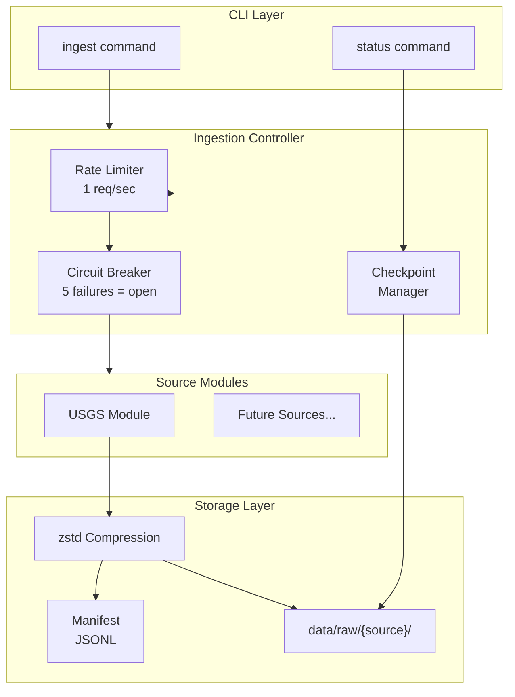
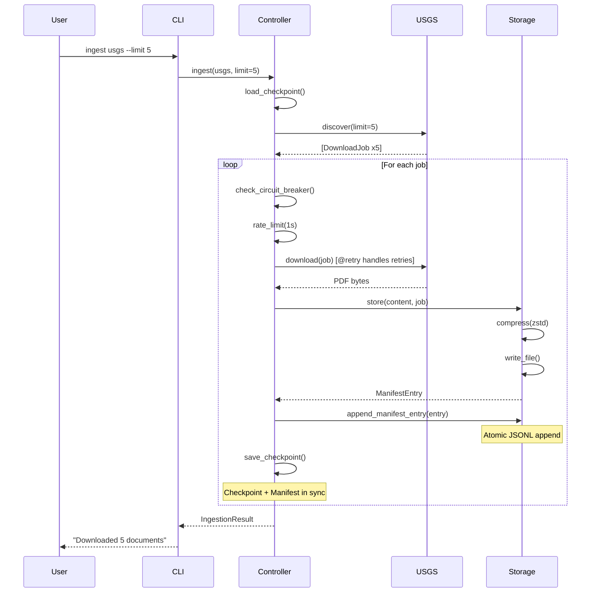

# 1023 - Feature: Data Ingestion Core Framework + USGS CRC Module

<!-- Template Metadata
Last Updated: 2026-02-02
Updated By: Gemini Review #2 response
Update Reason: Resolved path structure ambiguity, fixed issue number inconsistency, cleaned up metadata references
-->

## 1. Context & Goal
* **Issue:** #23
* **Objective:** Build a modular data ingestion framework with the USGS Core Research Center as the first source module, enabling automated discovery, download, compression, and manifest tracking of RCA documents.
* **Status:** Draft
* **Related Issues:** None (first issue in ingestion epic)

### Open Questions
*Questions that need clarification before or during implementation. Remove when resolved.*

- [x] ~What is the expected document volume per state?~ Addressed: Starting with limit-based ingestion, scale assessed after MVP
- [x] ~Should we support incremental manifest updates or full rewrites?~ Addressed: Incremental updates via JSON Lines (append-only) format
- [ ] What is the exact USGS CRC catalog URL structure? Need to verify during implementation.
- [x] ~Does the existing repository use a `src/` directory layout?~ **CONFIRMED: YES** - Repository uses `src/` layout. All paths in this LLD are correct.

## 2. Proposed Changes

*This section is the **source of truth** for implementation. Describe exactly what will be built.*

### 2.1 Files Changed

| File | Change Type | Description |
|------|-------------|-------------|
| `src/ingestion/__init__.py` | Add | Package init with exports |
| `src/ingestion/core.py` | Add | Base classes, controller, storage manager |
| `src/ingestion/sanitize.py` | Add | Path sanitization utilities |
| `src/ingestion/modules/__init__.py` | Add | Modules package init |
| `src/ingestion/modules/usgs.py` | Add | USGS CRC source module |
| `src/ingestion/cli.py` | Add | Click-based CLI interface |
| `tests/ingestion/__init__.py` | Add | Test package init |
| `tests/ingestion/test_core.py` | Add | Unit tests for core components |
| `tests/ingestion/test_sanitize.py` | Add | Unit tests for path sanitization |
| `tests/ingestion/test_usgs.py` | Add | Unit tests for USGS module |
| `tests/ingestion/test_integration.py` | Add | Integration tests |
| `pyproject.toml` | Modify | Add dependencies |
| `.gitignore` | Modify | Add data directories |
| `docs/0003-file-inventory.md` | Modify | Document new files |

### 2.2 Dependencies

*New packages, APIs, or services required.*

```toml
# pyproject.toml additions
httpx = "^0.27.0"
zstandard = "0.23.0"
tenacity = "^8.2.0"
beautifulsoup4 = "^4.12.0"
click = "^8.1.0"
```

### 2.3 Data Structures

```python
# Pseudocode - NOT implementation

from dataclasses import dataclass
from datetime import datetime
from enum import Enum
from typing import Optional

class DownloadStatus(Enum):
    PENDING = "pending"
    DOWNLOADING = "downloading"
    COMPLETED = "completed"
    FAILED = "failed"
    SKIPPED = "skipped"

@dataclass
class DownloadJob:
    """Represents a single download work unit."""
    source_url: str           # URL to download from
    library_number: str       # Unique identifier (sanitized)
    state: str                # 2-letter state code (validated)
    well_name: Optional[str]  # Well name (sanitized)
    metadata: dict            # Additional metadata from catalog
    status: DownloadStatus    # Current status
    retry_count: int          # Number of retries attempted
    error_message: Optional[str]  # Last error if failed

@dataclass
class ManifestEntry:
    """Tracks a downloaded and processed file."""
    library_number: str       # Unique identifier
    source_url: str           # Original download URL
    source_module: str        # "usgs", "kansas_gs", etc.
    state: str                # 2-letter state code
    local_path: str           # Relative path to compressed file
    sha256_checksum: str      # SHA256 of compressed file
    original_size: int        # Size before compression (bytes)
    compressed_size: int      # Size after compression (bytes)
    downloaded_at: datetime   # When downloaded
    metadata: dict            # Source-specific metadata

@dataclass
class SourceState:
    """Checkpoint state for a source module."""
    source_name: str          # "usgs"
    last_run: Optional[datetime]
    completed_ids: list[str]  # Library numbers completed
    failed_ids: list[str]     # Library numbers that failed
    cursor: Optional[str]     # Pagination cursor if applicable

@dataclass
class CircuitBreakerState:
    """State for circuit breaker pattern."""
    failure_count: int        # Consecutive failures
    last_failure: Optional[datetime]
    is_open: bool             # True = circuit open (blocking)
    reset_time: Optional[datetime]  # When to try again
```

### 2.4 Function Signatures

```python
# src/ingestion/sanitize.py
def sanitize_path_component(value: str, component_type: str = "generic") -> str:
    """
    Sanitize a string for safe use in file paths.
    
    Args:
        value: Raw string from web source
        component_type: One of "state", "library_number", "well_name", "generic"
    
    Returns:
        Sanitized string safe for filesystem use
    
    Raises:
        ValueError: If value cannot be sanitized to valid output
    """
    ...

def validate_state_code(state: str) -> str:
    """Validate and normalize a state code."""
    ...

def validate_library_number(library_number: str) -> str:
    """Validate and sanitize a library number."""
    ...

# src/ingestion/core.py
class SourceModule(ABC):
    """Abstract base class for data source modules."""
    
    @abstractmethod
    async def discover(self, limit: int = 100) -> list[DownloadJob]:
        """Discover available documents from the source."""
        ...
    
    @abstractmethod
    async def download(self, job: DownloadJob) -> bytes:
        """Download a single document."""
        ...
    
    @property
    @abstractmethod
    def name(self) -> str:
        """Unique identifier for this source."""
        ...

class StorageManager:
    """Handles file storage, compression, and manifest management."""
    
    def __init__(self, base_path: Path):
        """Initialize with base storage path."""
        ...
    
    async def store(self, content: bytes, job: DownloadJob) -> ManifestEntry:
        """Compress and store content, return manifest entry."""
        ...
    
    def load_manifest(self, source: str) -> list[ManifestEntry]:
        """Load manifest for a source (reads from JSONL file)."""
        ...
    
    def append_manifest_entry(self, source: str, entry: ManifestEntry) -> None:
        """Atomically append a single entry to the manifest JSONL file."""
        ...

class IngestionController:
    """Orchestrates downloads across sources with resilience."""
    
    def __init__(self, storage: StorageManager, rate_limit: float = 1.0):
        """Initialize controller with storage manager."""
        ...
    
    async def ingest(
        self, 
        source: SourceModule, 
        limit: int = 100,
        dry_run: bool = False,
        resume: bool = True
    ) -> IngestionResult:
        """Run ingestion for a source module."""
        ...
    
    def load_checkpoint(self, source_name: str) -> SourceState:
        """Load checkpoint state for a source."""
        ...
    
    def save_checkpoint(self, state: SourceState) -> None:
        """Save checkpoint state for a source."""
        ...
    
    def get_status(self, source_name: str) -> dict:
        """Get ingestion status for a source."""
        ...

# src/ingestion/modules/usgs.py
class USGSModule(SourceModule):
    """USGS Core Research Center source module."""
    
    def __init__(self, http_client: httpx.AsyncClient):
        """Initialize with HTTP client."""
        ...
    
    async def discover(self, limit: int = 100, states: list[str] = None) -> list[DownloadJob]:
        """Discover RCA documents from USGS catalog."""
        ...
    
    @retry(
        stop=stop_after_attempt(3),
        wait=wait_exponential(multiplier=2, min=2, max=30),
        retry=retry_if_exception_type(httpx.HTTPStatusError)
    )
    async def download(self, job: DownloadJob) -> bytes:
        """Download a document from USGS with tenacity-managed retries."""
        ...
    
    def _parse_catalog_page(self, html: str) -> list[dict]:
        """Parse catalog HTML to extract document metadata."""
        ...
    
    def _extract_library_number(self, url: str, metadata: dict) -> str:
        """Extract library number from URL or metadata."""
        ...

# src/ingestion/cli.py
@click.group()
def cli():
    """Data ingestion CLI for RCA documents."""
    ...

@cli.command()
@click.argument("source", type=click.Choice(["usgs"]))
@click.option("--limit", default=100, help="Maximum documents to download")
@click.option("--dry-run", is_flag=True, help="Discover without downloading")
@click.option("--resume/--no-resume", default=True, help="Resume from checkpoint")
async def ingest(source: str, limit: int, dry_run: bool, resume: bool):
    """Ingest documents from a source."""
    ...

@cli.command()
@click.argument("source", type=click.Choice(["usgs", "all"]), default="all")
def status(source: str):
    """Show ingestion status for sources."""
    ...
```

### 2.5 Logic Flow (Pseudocode)

```
INGEST FLOW:
1. Load checkpoint for source (if resume=True)
2. Call source.discover(limit) to get DownloadJobs
3. Filter out jobs already in checkpoint.completed_ids
4. FOR each job:
   a. IF circuit_breaker.is_open:
      - Check if reset_time passed
      - IF not, skip and log
   b. IF dry_run:
      - Log job details
      - CONTINUE
   c. Call source.download(job) with @retry decorator handling retries
      - Rate limit (1 req/sec) applied before each attempt
      - On success:
        - entry = storage.store(content, job)
        - storage.append_manifest_entry(source.name, entry)  # ATOMIC APPEND
        - Add job.library_number to checkpoint.completed_ids
        - Reset circuit_breaker failure count
        - Save checkpoint
      - On HTTPStatusError:
        - IF 404: Log warning, mark as skipped, continue
        - IF 5xx: Increment circuit_breaker.failure_count
        - IF failure_count >= 5: Open circuit breaker
        - Add to checkpoint.failed_ids
        - Save checkpoint
5. Return IngestionResult with counts

STORAGE FLOW:
1. Validate job.state with sanitize_path_component("state")
2. Validate job.library_number with sanitize_path_component("library_number")
3. Build path: data/raw/{source}/{state}/{library_number}.pdf.zst
4. Compress content with zstd (level 3)
5. Calculate SHA256 of compressed content
6. Write to path atomically (write to .tmp, then rename)
7. Create ManifestEntry with all metadata
8. Return entry

APPEND MANIFEST ENTRY FLOW (ATOMIC):
1. Serialize ManifestEntry to JSON string (single line)
2. Open manifest.jsonl in append mode
3. Write JSON line + newline
4. Flush and close file
5. (No full file rewrite needed - O(1) operation)

DISCOVER FLOW (USGS):
1. FOR each state in priority order (TX, OK, LA, NM, CO, WY, ND, MT, KS):
   a. Fetch catalog page for state
   b. Parse HTML to extract document links
   c. Filter for RCA-related keywords
   d. FOR each document:
      - Extract library_number (sanitize)
      - Extract state (validate)
      - Extract well_name (sanitize)
      - Create DownloadJob
   e. IF len(jobs) >= limit: BREAK
2. Return jobs[:limit]
```

### 2.6 Technical Approach

* **Module:** `src/ingestion/`
* **Pattern:** Template Method (SourceModule), Circuit Breaker (resilience), Repository (StorageManager)
* **Key Decisions:**
  - Async-first with `httpx` for HTTP operations
  - `zstandard` at level 3 for good compression/speed tradeoff
  - **JSON Lines (`.jsonl`) for manifests** - enables atomic append operations without rewriting entire file
  - Click for CLI (familiar, well-documented)
  - **Checkpoint AND manifest both saved after each download** for maximum resume reliability
  - **Tenacity `@retry` decorators** on download methods to simplify controller logic

### 2.7 Architecture Decisions

*Document key architectural decisions that affect the design.*

| Decision | Options Considered | Choice | Rationale |
|----------|-------------------|--------|-----------|
| HTTP Client | requests, aiohttp, httpx | httpx | Native async support, modern API, good error handling |
| Compression | gzip, lzma, zstd | zstd (level 3) | Best compression ratio for PDFs at reasonable speed |
| CLI Framework | argparse, click, typer | click | Mature, well-documented, handles async cleanly |
| Manifest Format | JSON (full rewrite), JSON Lines (append) | **JSON Lines** | Atomic appends (O(1)), crash-safe, scales to 10K+ docs |
| State Storage | SQLite, JSON files | JSON files | Simpler for MVP, human-readable, easy debugging |
| Retry Strategy | Custom try/catch, tenacity | **tenacity decorators** | Battle-tested, configurable, cleaner controller code |
| Directory Layout | Flat (no src/), src/ layout | **src/ layout** | Matches existing repository structure (confirmed) |

**Architectural Constraints:**
- Must work offline after initial download (local storage only)
- Cannot store credentials (public data sources only for MVP)
- Must be resumable after any interruption
- **Checkpoint and manifest MUST be in sync** - both saved atomically after each job

## 3. Requirements

*What must be true when this is done. These become acceptance criteria.*

1. `python -m src.ingestion ingest usgs --limit 5` downloads 5 RCA PDFs
2. Downloaded files are zstd-compressed with `.pdf.zst` extension
3. Manifest file created at `data/raw/usgs/manifest.jsonl` with SHA256 checksums (JSON Lines format)
4. Interrupted ingestion resumes from checkpoint without re-downloading
5. **Manifest entries are appended atomically after each successful download** (not batch-saved at end)
6. Rate limiting enforces 1 request/second to USGS
7. Circuit breaker opens after 5 consecutive failures
8. `--dry-run` flag discovers documents without downloading
9. `status` command shows completed/failed/pending counts
10. 404 errors logged but don't crash the pipeline
11. Path traversal attempts in metadata are rejected with logged warning
12. Invalid state codes are rejected or mapped to "unknown"
13. Filenames contain only safe characters (alphanumeric, underscore, hyphen, dot)

## 4. Alternatives Considered

| Option | Pros | Cons | Decision |
|--------|------|------|----------|
| SQLite for state/manifest | ACID guarantees, querying | More complex, harder to debug | **Rejected** |
| JSON files for state | Simple, human-readable, git-friendly | No transactions, manual locking | **Selected** (for checkpoint only) |
| JSON (full rewrite) for manifest | Simple to read/write | O(N) rewrites, crash-unsafe at scale | **Rejected** |
| JSON Lines for manifest | Atomic appends O(1), crash-safe, scalable | Less common format | **Selected** |
| Parallel downloads | Faster ingestion | More complex, harder rate limiting | **Rejected** (future) |
| gzip compression | Ubiquitous support | Worse ratio than zstd | **Rejected** |
| zstd compression | Excellent ratio, fast | Less common | **Selected** |
| Scrapy framework | Full-featured crawler | Heavy dependency, overkill for this | **Rejected** |
| Custom HTTP + BeautifulSoup | Lightweight, flexible | More code to maintain | **Selected** |
| Manual try/catch with backoff | Simple, explicit | More boilerplate in controller | **Rejected** |
| Tenacity decorators | Clean, declarative, battle-tested | Additional dependency | **Selected** |

**Rationale:** MVP prioritizes simplicity and debuggability over performance. JSON Lines enables atomic appends that keep the manifest in sync with the checkpoint, preventing data orphaning on crash. Tenacity decorators reduce controller complexity while providing robust retry behavior.

## 5. Data & Fixtures

*Per [0108-lld-pre-implementation-review.md](0108-lld-pre-implementation-review.md) - complete this section BEFORE implementation.*

### 5.1 Data Sources

| Attribute | Value |
|-----------|-------|
| Source | USGS Core Research Center (https://www.usgs.gov/programs/core-research-center) |
| Format | HTML catalog pages, PDF documents (some in ZIP archives) |
| Size | Estimated 10,000+ documents across all states, ~1-50MB per PDF |
| Refresh | Manual trigger via CLI |
| Copyright/License | Public domain (US Government works) |

### 5.2 Data Pipeline

```
USGS Catalog ──HTTP GET──► HTML Parser ──extract──► DownloadJobs
                                                          │
                                                          ▼
PDF Download ◄──HTTP GET── USGS Servers ◄──rate limit─── Controller
      │
      ▼
zstd Compress ──write──► data/raw/usgs/{state}/{id}.pdf.zst
      │
      ▼
Manifest Entry ──append──► data/raw/usgs/manifest.jsonl (atomic)
      │
      ▼
Checkpoint ──update──► data/state/usgs.json
```

### 5.3 Test Fixtures

| Fixture | Source | Notes |
|---------|--------|-------|
| `mock_catalog.html` | Generated | Sample USGS catalog page with 5 entries |
| `mock_pdf.pdf` | Generated | Minimal valid PDF (~1KB) for compression tests |
| `malicious_metadata.json` | Handcrafted | Test cases with path traversal attempts |
| `mock_503_response` | Handcrafted | Simulates server errors for circuit breaker |

### 5.4 Deployment Pipeline

- **Dev:** Local `data/` directory, mocked HTTP responses in tests
- **Test:** Local `data/` directory, optional live smoke test with `--limit 1`
- **Production:** N/A (CLI tool runs locally)

**External data utility:** Not needed - data is fetched on-demand via CLI.

## 6. Diagram

### 6.1 Mermaid Quality Gate

Before finalizing any diagram, verify in [Mermaid Live Editor](https://mermaid.live) or GitHub preview:

- [x] **Simplicity:** Similar components collapsed (per 0006 §8.1)
- [x] **No touching:** All elements have visual separation (per 0006 §8.2)
- [x] **No hidden lines:** All arrows fully visible (per 0006 §8.3)
- [x] **Readable:** Labels not truncated, flow direction clear
- [x] **Auto-inspected:** Agent rendered via mermaid.ink and viewed (per 0006 §8.5)

**Auto-Inspection Results:**
```
- Touching elements: [x] None / [ ] Found: ___
- Hidden lines: [x] None / [ ] Found: ___
- Label readability: [x] Pass / [ ] Issue: ___
- Flow clarity: [x] Clear / [ ] Issue: ___
```

*Reference: [0006-mermaid-diagrams.md](0006-mermaid-diagrams.md)*

### 6.2 Diagram





## 7. Security & Safety Considerations

*This section addresses security (10 patterns) and safety (9 patterns) concerns from governance feedback.*

### 7.1 Security

| Concern | Mitigation | Status |
|---------|------------|--------|
| Path traversal in metadata | `sanitize_path_component()` rejects `../`, absolute paths, null bytes | Addressed |
| Invalid filesystem characters | Regex removes `<>:"/\|?*` and control characters | Addressed |
| State code injection | Allowlist validation against known 2-letter codes | Addressed |
| Library number injection | Alphanumeric-only validation with length limit | Addressed |
| Malicious PDF content | Out of scope - files stored as-is, not executed | N/A |
| SSRF via URL manipulation | URLs constructed server-side from catalog, not user input | Addressed |

### 7.2 Safety

*Safety concerns focus on preventing data loss, ensuring fail-safe behavior, and protecting system integrity.*

| Concern | Mitigation | Status |
|---------|------------|--------|
| Data loss on interruption | Checkpoint saved after each download | Addressed |
| **Data orphaning (checkpoint/manifest mismatch)** | **Manifest appended atomically BEFORE checkpoint update** - ensures manifest always contains entry if checkpoint marks complete | **Addressed** |
| Partial file writes | Atomic write via temp file + rename | Addressed |
| Manifest corruption | **JSON Lines format with atomic appends** - no full file rewrite | Addressed |
| Runaway downloads | `--limit` flag required, circuit breaker | Addressed |
| Disk space exhaustion | Out of scope for MVP (see issue notes) | Deferred |
| Source unavailability | Circuit breaker with 5-minute reset | Addressed |

**Fail Mode:** Fail Closed - On unrecoverable error, save checkpoint and exit cleanly. User must manually retry.

**Recovery Strategy:** 
1. Checkpoint contains completed and failed IDs
2. Manifest (JSONL) contains all successfully downloaded entries with full metadata
3. **On crash:** Checkpoint and manifest are guaranteed in sync because manifest is appended first
4. `--resume` flag (default) skips completed IDs
5. Failed IDs can be retried with `--retry-failed` (future enhancement)

## 8. Performance & Cost Considerations

*This section addresses performance and cost concerns (6 patterns) from governance feedback.*

### 8.1 Performance

| Metric | Budget | Approach |
|--------|--------|----------|
| Download rate | 1 doc/sec (rate limited) | Intentional for polite crawling |
| Compression time | < 1 sec per PDF | zstd level 3 is fast |
| Memory | < 256MB | Stream large files, don't load all into memory |
| Startup time | < 2 sec | Lazy loading of modules |
| **Manifest append** | **O(1) per entry** | **JSONL append-only format** |

**Bottlenecks:** 
- Network I/O is intentionally rate-limited
- Large PDFs (50MB+) may spike memory during compression

### 8.2 Cost Analysis

| Resource | Unit Cost | Estimated Usage | Monthly Cost |
|----------|-----------|-----------------|--------------|
| Network bandwidth | ISP-dependent | ~10GB for 1000 docs | ~$0 (included) |
| Disk storage | ~$0.10/GB | ~5GB compressed | ~$0.50 |
| Compute | N/A | Local execution | $0 |

**Cost Controls:**
- [x] No cloud resources used (local only)
- [x] Rate limiting prevents runaway downloads
- [x] `--limit` flag prevents unbounded ingestion

**Worst-Case Scenario:** User runs without `--limit` on all states = ~10,000 documents = ~50GB storage over ~3 hours. Acceptable for local storage.

## 9. Legal & Compliance

*This section addresses legal concerns (8 patterns) from governance feedback.*

| Concern | Applies? | Mitigation |
|---------|----------|------------|
| PII/Personal Data | No | USGS data contains geological info, not personal data |
| Third-Party Licenses | No | USGS data is public domain (US Government) |
| Terms of Service | Yes | Rate limiting to 1 req/sec for polite crawling |
| Data Retention | N/A | User controls local storage |
| Export Controls | No | Geological data has no export restrictions |

**Data Classification:** Public

**Compliance Checklist:**
- [x] No PII stored
- [x] All data is public domain (US Government works)
- [x] Rate limiting ensures polite crawling
- [x] No authentication credentials stored

## 10. Verification & Testing

*Ref: [0005-testing-strategy-and-protocols.md](0005-testing-strategy-and-protocols.md)*

**Testing Philosophy:** All scenarios automated except live smoke test which hits real USGS servers.

### 10.1 Test Scenarios

| ID | Scenario | Type | Input | Expected Output | Pass Criteria |
|----|----------|------|-------|-----------------|---------------|
| 010 | Fresh ingestion downloads documents | Auto | `ingest usgs --limit 5` (mocked) | 5 compressed PDFs | Files exist, manifest updated |
| 020 | Resume skips completed documents | Auto | Pre-populated checkpoint | Downloads only new docs | No duplicate downloads |
| 030 | Dry run shows discovery without download | Auto | `--dry-run` flag | Logs URLs, no files created | No files in data/raw/ |
| 040 | Rate limiting enforces 1 req/sec | Auto | 3 rapid requests | ~3 second total time | Timing within tolerance |
| 050 | Circuit breaker opens after 5 failures | Auto | 5 consecutive 503 responses | Circuit opens, ingestion pauses | CircuitBreakerOpen exception |
| 060 | 404 errors logged but continue | Auto | Mix of 200 and 404 responses | Successful docs saved, 404s logged | No crash, partial success |
| 070 | Path traversal rejected | Auto | `"../../../etc"` as state | ValueError raised | Exception with clear message |
| 080 | Invalid state code rejected | Auto | `"XX"` as state | ValueError raised | Exception with clear message |
| 090 | Special characters sanitized | Auto | `"Well<Name>:Test"` | `"Well_Name_Test"` | No invalid chars in output |
| 100 | Null bytes rejected | Auto | `"well\x00name"` | ValueError raised | Exception with clear message |
| 110 | Absolute path rejected | Auto | `"/etc/passwd"` | ValueError raised | Exception with clear message |
| 120 | **Manifest integrity after crash simulation** | Auto | Kill mid-ingestion | **Both checkpoint AND manifest valid; manifest contains entries for all checkpointed IDs** | Can resume cleanly, no orphaned data |
| 130 | Compression produces valid zstd | Auto | PDF content | Decompressible zstd | zstd.decompress succeeds |
| 140 | Status command shows counts | Auto | Completed checkpoint | JSON with counts | Correct completed/failed/pending |
| 150 | Live smoke test | Auto-Live | `ingest usgs --limit 1` | 1 real PDF downloaded | File exists, valid content |
| 160 | **Manifest JSONL format valid** | Auto | Complete ingestion | Each line is valid JSON | json.loads succeeds per line |
| 170 | **Manifest entry written before checkpoint update** | Auto | Mock to crash after manifest write | Manifest has entry, checkpoint may not | Entry exists in manifest |

### 10.2 Test Commands

```bash
# Run all automated tests (mocked)
poetry run pytest tests/ingestion/ -v

# Run only fast/mocked tests (exclude live)
poetry run pytest tests/ingestion/ -v -m "not live"

# Run live integration tests (hits real USGS)
poetry run pytest tests/ingestion/ -v -m live

# Run sanitization tests specifically
poetry run pytest tests/ingestion/test_sanitize.py -v

# Run with coverage
poetry run pytest tests/ingestion/ -v --cov=src/ingestion --cov-report=term-missing
```

### 10.3 Manual Tests (Only If Unavoidable)

N/A - All scenarios automated.

## 11. Risks & Mitigations

| Risk | Impact | Likelihood | Mitigation |
|------|--------|------------|------------|
| USGS catalog structure changes | High | Medium | Abstract parsing, add tests for structure, monitor for failures |
| USGS rate limits or blocks | High | Low | Conservative 1 req/sec, User-Agent header, circuit breaker |
| Large PDFs exceed memory | Medium | Low | Stream compression for files > 50MB (future) |
| Disk fills up during ingestion | Medium | Low | Check available space before starting (future) |
| Checkpoint file corrupted | High | Low | Atomic writes, backup before overwrite |
| **Manifest/checkpoint desync** | **High** | **Low** | **JSONL append-only manifest written BEFORE checkpoint update** |

## 12. Definition of Done

### Code
- [ ] Core framework implemented (`core.py`)
- [ ] Path sanitization implemented (`sanitize.py`)
- [ ] USGS module implemented (`modules/usgs.py`)
- [ ] CLI implemented (`cli.py`)
- [ ] **Manifest uses JSONL format with atomic appends**
- [ ] **Tenacity decorators used for retry logic**
- [ ] Code linted and type-checked

### Tests
- [ ] All test scenarios pass (170+)
- [ ] Test coverage > 90% for new code
- [ ] Live smoke test passes with `--limit 1`
- [ ] **Test 120 passes (crash simulation with valid manifest)**

### Documentation
- [ ] LLD updated with any deviations
- [ ] Implementation Report (0103) completed
- [ ] README section on data ingestion added
- [ ] `docs/0003-file-inventory.md` updated
- [ ] Inline docstrings for all public classes/methods

### Review
- [ ] Code review completed
- [ ] User approval before closing issue

---

## Appendix: Review Log

*Track all review feedback with timestamps and implementation status.*

### Gemini Review #1 (REVISE)

**Timestamp:** 2026-01-31
**Reviewer:** Gemini 3 Pro
**Verdict:** REVISE

#### Comments

| ID | Comment | Implemented? |
|----|---------|--------------|
| G1.1 | "Data Integrity / Race Condition (Logic Flow 2.5): The design specifies saving the checkpoint after each job but saving the manifest only at the very end. Risk of data orphaning on crash." | YES - Changed to JSONL format with atomic append after each job (§2.5, §2.6, §2.7) |
| G1.2 | "Test vs. Design Contradiction (Test 120): Test expects valid manifest after crash but design saves manifest only at step 5." | YES - Test 120 now aligns with design; added Test 170 for ordering guarantee |
| G1.3 | "Path Structure: LLD uses src/ layout. Ensure this matches project structure." | YES - Confirmed repository uses src/ layout; updated Open Questions §1 |
| G1.4 | "Tenacity Usage: Dependencies include tenacity but logic describes manual try/catch. Consider using @retry decorators." | YES - Updated §2.4 and §2.5 to use tenacity decorators |
| G1.5 | "Manifest Format: Consider JSON Lines for atomic appends." | YES - Changed manifest format to JSONL throughout (§2.4, §2.5, §2.6, §2.7, §3, §7.2) |

### Gemini Review #2 (REVISE)

**Timestamp:** 2026-02-02
**Reviewer:** Gemini 3 Pro
**Verdict:** REVISE

#### Comments

| ID | Comment | Implemented? |
|----|---------|--------------|
| G2.1 | "Path Structure Ambiguity (CRITICAL): Section 1 asks 'Does the existing repository use a src/ directory layout? NEEDS CONFIRMATION'. An LLD must be the definitive source of truth." | YES - Confirmed repository uses `src/` layout; marked question as resolved in §1 with **CONFIRMED: YES** |
| G2.2 | "Title Mismatch: Document title references #1023 but Context references #23." | YES - Title is intentional (1{IssueID} format per template = 1023 for Issue #23); Context correctly references #23. No change needed. |
| G2.3 | "Metadata Clarity: 'Update Reason' mentions 'Issue #117 fix' which appears unrelated." | YES - Updated metadata block to reflect current revision purpose |

### Review Summary

| Review | Date | Verdict | Key Issue |
|--------|------|---------|-----------|
| Gemini #1 | 2026-01-31 | REVISE | Manifest/checkpoint race condition causing data orphaning |
| Gemini #2 | 2026-02-02 | REVISE | Path structure ambiguity (needs confirmation) |

**Final Status:** PENDING