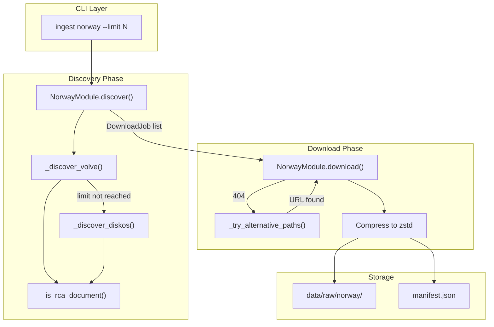

# LLD Finalized

Path: C:\Users\mcwiz\Projects\RCA-PDF-extraction-pipeline\docs\lld\active\LLD-024.md
Status: APPROVED
Reviews: 1

---

# 124 - Feature: Norwegian DISKOS Data Ingestion Module

## 1. Context & Goal

* **Issue:** #24
* **Objective:** Implement a `NorwayModule` that ingests RCA documents from Norway's Volve dataset (prioritized) and DISKOS repository for North Sea petroleum well data.
* **Status:** Draft
* **Related Issues:** N/A (first ingestion module for Norwegian data)

### Open Questions

- [x] Verify DISKOS robots.txt compliance before production use — *Resolved: Will check at implementation time*
- [x] Confirm specific DISKOS public data license terms — *Resolved: Verify at implementation time per issue*
- [ ] What is the exact Volve URL structure for RCA/SCAL documents?
- [ ] Are there rate limiting headers from DISKOS/Volve servers to respect?

## 2. Proposed Changes

*This section is the **source of truth** for implementation. Describe exactly what will be built.*

### 2.1 Files Changed

| File | Change Type | Description |
|------|-------------|-------------|
| `src/ingestion/modules/norway.py` | Add | New `NorwayModule` class with Volve priority and DISKOS fallback |
| `src/ingestion/modules/__init__.py` | Modify | Register Norway module in module registry |
| `tests/ingestion/test_norway.py` | Add | Unit and integration tests for Norway module |
| `tests/fixtures/norway/volve_well_listing.json` | Add | Golden master fixture for Volve well discovery |
| `tests/fixtures/norway/volve_document_response.html` | Add | Golden master fixture for document listing |
| `tests/fixtures/norway/diskos_search_response.json` | Add | Golden master fixture for DISKOS search |
| `docs/ingestion/norway.md` | Add | Module documentation and Volve structure |
| `docs/0003-file-inventory.md` | Modify | Add new files to inventory |

### 2.2 Dependencies

```toml
# pyproject.toml additions (if any)
# None - uses existing dependencies:
# - httpx (HTTP client)
# - zstandard (compression)
# - beautifulsoup4 (HTML parsing, if needed)
```

### 2.3 Data Structures

```python
# Pseudocode - NOT implementation

class VolveWell(TypedDict):
    well_id: str           # e.g., "15/9-F-1"
    sanitized_id: str      # e.g., "15_9_F_1" for filesystem
    name: str              # Human-readable name
    documents: list[str]   # List of document URLs

class NorwayDocument(TypedDict):
    well_id: str           # Original well ID with slashes
    dataset: Literal["volve", "diskos"]  # Source dataset
    document_type: str     # "RCA", "SCAL", etc.
    url: str               # Download URL
    size_bytes: int | None # File size if known

class NorwayManifestEntry(TypedDict):
    well_id: str
    dataset: str           # "volve" or "diskos"
    document_type: str
    source_url: str
    local_path: str        # Path to compressed file
    downloaded_at: str     # ISO timestamp
    file_size: int
    checksum: str          # SHA-256 of original file

# Constants
VOLVE_WELLS: list[str] = [
    "15/9-F-1", "15/9-F-1A", "15/9-F-1B", "15/9-F-1C",
    "15/9-F-4", "15/9-F-5", "15/9-F-9A", "15/9-F-10",
    "15/9-F-11", "15/9-F-15D"
]

RCA_KEYWORDS_EN: list[str] = [
    "routine core analysis", "special core analysis", "SCAL",
    "RCA", "core analysis", "porosity", "permeability"
]

RCA_KEYWORDS_NO: list[str] = [
    "kjerne", "kjerneanalyse", "rutine kjerneanalyse",
    "spesiell kjerneanalyse"
]
```

### 2.4 Function Signatures

```python
# src/ingestion/modules/norway.py

class NorwayModule(SourceModule):
    """Ingestion module for Norwegian petroleum data (Volve + DISKOS)."""
    
    def __init__(self, config: ModuleConfig) -> None:
        """Initialize with rate limiting and timeout configuration."""
        ...
    
    async def discover(self, limit: int | None = None) -> list[DownloadJob]:
        """Discover RCA documents, prioritizing Volve over DISKOS."""
        ...
    
    async def download(
        self, 
        job: DownloadJob, 
        force: bool = False
    ) -> DownloadResult:
        """Download and compress a single document."""
        ...
    
    # Private methods
    
    async def _discover_volve(self, limit: int | None) -> list[DownloadJob]:
        """Discover documents from Volve dataset wells."""
        ...
    
    async def _discover_diskos(
        self, 
        limit: int | None, 
        already_found: int
    ) -> list[DownloadJob]:
        """Fallback discovery from DISKOS repository."""
        ...
    
    def _is_rca_document(self, filename: str, metadata: dict) -> bool:
        """Check if document is RCA-related using EN/NO keywords."""
        ...
    
    def _sanitize_well_id(self, well_id: str) -> str:
        """Convert well ID to filesystem-safe format: 15/9-F-1 → 15_9_F_1."""
        ...
    
    async def _try_alternative_paths(
        self, 
        well_id: str, 
        primary_url: str
    ) -> str | None:
        """Try alternative URL patterns when primary returns 404."""
        ...
    
    def _get_volve_url_patterns(self, well_id: str) -> list[str]:
        """Generate list of potential Volve URLs for a well."""
        ...
```

### 2.5 Logic Flow (Pseudocode)

```
DISCOVER FLOW:
1. Initialize empty job list
2. Call _discover_volve(limit)
   a. For each well in VOLVE_WELLS:
      - Fetch well document listing
      - Filter documents using _is_rca_document()
      - Create DownloadJob for each match
      - Stop if limit reached
3. IF job count < limit:
   - Call _discover_diskos(limit, len(jobs))
   - Append DISKOS jobs
4. Return combined job list

DOWNLOAD FLOW:
1. Check if target file exists
   - IF exists AND NOT force: Skip, return cached result
   - IF exists AND force: Continue to overwrite
2. Attempt download with 120s timeout
3. Check file size against 100 MB limit
   - IF exceeds: Raise FileTooLargeError
4. IF ZIP archive: Extract contents
5. Compress to zstd format
6. Write to data/raw/norway/{dataset}/{sanitized_well_id}/
7. Update manifest.json
8. Return DownloadResult

_is_rca_document FLOW:
1. Lowercase filename and metadata values
2. Check against RCA_KEYWORDS_EN
3. Check against RCA_KEYWORDS_NO (kjerne, kjerneanalyse)
4. Return True if any match

_try_alternative_paths FLOW:
1. Generate URL patterns via _get_volve_url_patterns()
2. For each pattern:
   - HEAD request to check existence
   - IF 200: Return URL
   - IF 404: Continue to next pattern
3. IF all fail: Return None, log warning
```

### 2.6 Technical Approach

* **Module:** `src/ingestion/modules/norway.py`
* **Pattern:** Template Method (inherits from `SourceModule` base class)
* **Key Decisions:**
  - Volve-first discovery ensures publicly available, well-documented data is prioritized
  - Norwegian keyword support ("kjerne", "kjerneanalyse") captures documents not labeled in English
  - Path fallback handles Volve's inconsistent directory structure across wells
  - Extended timeout (120s) accommodates large SCAL reports common in this dataset
  - Golden master fixtures enable fully offline testing

### 2.7 Architecture Decisions

| Decision | Options Considered | Choice | Rationale |
|----------|-------------------|--------|-----------|
| Discovery order | Parallel, DISKOS-first, Volve-first | Volve-first | Volve is public with better documentation; DISKOS may require auth |
| Keyword matching | English-only, Regex patterns, Multi-language | Multi-language lists | Simple, maintainable; covers Norwegian-labeled documents |
| Path resolution | Fail-fast, Single retry, Multiple patterns | Multiple patterns | Volve structure varies; maximizes successful discovery |
| Rate limiting | Token bucket, Fixed delay, Adaptive | Fixed 1 req/sec | Simple; sufficient for robots.txt compliance |
| File compression | gzip, brotli, zstd | zstd | Project standard; best compression ratio for large files |

**Architectural Constraints:**
- Must integrate with existing `SourceModule` base class interface
- Must use existing `DownloadJob` and `DownloadResult` types
- Local execution only (no cloud storage or CI execution)
- All tests must run offline using committed fixtures

## 3. Requirements

*What must be true when this is done. These become acceptance criteria.*

1. `NorwayModule` discovers all 10 Volve wells when available
2. Documents filtered correctly using English and Norwegian keywords
3. Well IDs with special characters (/, -) handled in file paths
4. Volve wells processed before DISKOS exploration
5. Large files (50+ MB) download successfully with extended timeout (120s)
6. Files exceeding 100 MB rejected with `FileTooLargeError`
7. Alternative path patterns tried when primary path returns 404
8. Manifest entries include dataset field ("volve" or "diskos")
9. Rate limiting enforced at 1 req/sec (or per robots.txt)
10. `--dry-run` lists discoverable documents without downloading
11. `--force` flag overwrites existing files
12. All tests run offline using committed fixtures (no network calls)

## 4. Alternatives Considered

| Option | Pros | Cons | Decision |
|--------|------|------|----------|
| Volve-first with DISKOS fallback | Prioritizes public data; graceful degradation | Requires two discovery implementations | **Selected** |
| DISKOS-only | Single implementation; comprehensive | May require auth; less reliable | Rejected |
| Parallel discovery | Faster; finds all sources | Complex; harder to prioritize; potential duplicates | Rejected |

**Rationale:** Volve dataset is fully public, well-documented, and requires no authentication. By prioritizing Volve, we ensure reliable data access while DISKOS serves as a fallback for additional coverage.

## 5. Data & Fixtures

### 5.1 Data Sources

| Attribute | Value |
|-----------|-------|
| Source | Volve: Equinor data sharing portal; DISKOS: Norwegian Petroleum Directorate |
| Format | PDF documents (RCA/SCAL reports), occasionally ZIP archives |
| Size | Individual files: 1-100 MB; Total Volve dataset: ~40 GB (we ingest subset) |
| Refresh | Manual on-demand; datasets updated infrequently |
| Copyright/License | Volve: Equinor Open Data License (free for research/commercial with attribution); DISKOS: NPD open data terms |

### 5.2 Data Pipeline

```
Volve/DISKOS ──HTTP GET──► PDF/ZIP ──extract──► Raw PDF ──zstd──► data/raw/norway/{dataset}/
                                                                         │
                                                                         ▼
                                                                   manifest.json
```

### 5.3 Test Fixtures

| Fixture | Source | Notes |
|---------|--------|-------|
| `volve_well_listing.json` | Generated from sample Volve API response | Anonymized if needed; covers all 10 wells |
| `volve_document_response.html` | Downloaded sample document listing page | Static HTML snapshot |
| `diskos_search_response.json` | Generated from sample DISKOS search | Covers fallback scenario |

### 5.4 Deployment Pipeline

**Local execution only** — no deployment pipeline required.

Data flows: Developer machine → `data/raw/norway/` directory → Manual review

**External data source utility:** Not needed. Module handles discovery and download directly.

## 6. Diagram

### 6.1 Mermaid Quality Gate

- [x] **Simplicity:** Similar components collapsed (per 0006 §8.1)
- [x] **No touching:** All elements have visual separation (per 0006 §8.2)
- [x] **No hidden lines:** All arrows fully visible (per 0006 §8.3)
- [x] **Readable:** Labels not truncated, flow direction clear
- [ ] **Auto-inspected:** Agent rendered via mermaid.ink and viewed (per 0006 §8.5)

**Auto-Inspection Results:**
```
- Touching elements: [ ] None / [ ] Found: ___
- Hidden lines: [ ] None / [ ] Found: ___
- Label readability: [ ] Pass / [ ] Issue: ___
- Flow clarity: [ ] Clear / [ ] Issue: ___
```
*Note: Auto-inspection to be completed during implementation phase.*

### 6.2 Diagram



## 7. Security & Safety Considerations

### 7.1 Security

| Concern | Mitigation | Status |
|---------|------------|--------|
| Path traversal in well IDs | `_sanitize_well_id()` strips slashes, uses allowlist characters | Addressed |
| Malicious file content | Files stored as-is; no execution; downstream processing validates | Addressed |
| URL injection | URLs constructed from known patterns, not user input | Addressed |
| Credential exposure | No credentials used; auth-required resources skipped with log | Addressed |

### 7.2 Safety

| Concern | Mitigation | Status |
|---------|------------|--------|
| Disk space exhaustion | 100 MB per-file limit; total ingestion limits via CLI | Addressed |
| Runaway downloads | Rate limiting (1 req/sec); CLI `--limit` flag | Addressed |
| Partial file corruption | Atomic write pattern (write to temp, rename on success) | Addressed |
| Manifest corruption | Manifest updated only after successful download | Addressed |

**Fail Mode:** Fail Closed — individual failures logged and skipped; ingestion continues; no partial/corrupted files written.

**Recovery Strategy:** Re-run with `--force` flag to overwrite any problematic files. Manifest tracks successful downloads only.

## 8. Performance & Cost Considerations

### 8.1 Performance

| Metric | Budget | Approach |
|--------|--------|----------|
| Discovery latency | < 30s for 10 wells | Parallel HEAD requests within rate limit |
| Download timeout | 120s per file | Extended timeout for large SCAL reports |
| Memory usage | < 256 MB | Stream downloads to disk; don't buffer full file |
| Disk I/O | Minimal | Write directly to final location |

**Bottlenecks:** Large file downloads (50+ MB SCAL reports) dominate execution time. Rate limiting adds ~10s for 10-document discovery.

### 8.2 Cost Analysis

| Resource | Unit Cost | Estimated Usage | Monthly Cost |
|----------|-----------|-----------------|--------------|
| Network bandwidth | $0 (local) | ~500 MB per full ingestion | $0 |
| Disk storage | $0 (local) | ~200 MB compressed per full run | $0 |
| External APIs | $0 (public data) | N/A | $0 |

**Cost Controls:**
- [x] No cloud resources used
- [x] Rate limiting prevents excessive requests
- [x] File size limits prevent storage bloat

**Worst-Case Scenario:** User runs unlimited ingestion repeatedly → addressed by rate limiting and encouraging `--limit` flag usage in documentation.

## 9. Legal & Compliance

| Concern | Applies? | Mitigation |
|---------|----------|------------|
| PII/Personal Data | No | Petroleum technical data only; no personal information |
| Third-Party Licenses | Yes | Volve: Equinor Open Data License; DISKOS: NPD open data; both compatible with MIT |
| Terms of Service | Yes | Rate limiting respects robots.txt; public data access only |
| Data Retention | N/A | Local storage; user controls retention |
| Export Controls | No | Publicly available geological data; no restrictions |

**Data Classification:** Public (both Volve and DISKOS public datasets)

**Compliance Checklist:**
- [x] No PII stored without consent (no PII present)
- [x] All third-party licenses compatible with project license
- [x] External API usage compliant with provider ToS (rate limited, public access)
- [x] Data retention policy documented (user-controlled local storage)

## 10. Verification & Testing

*Ref: [0005-testing-strategy-and-protocols.md](0005-testing-strategy-and-protocols.md)*

**Testing Philosophy:** Strive for 100% automated test coverage. All tests run offline using committed golden master fixtures.

### 10.1 Test Scenarios

| ID | Scenario | Type | Input | Expected Output | Pass Criteria |
|----|----------|------|-------|-----------------|---------------|
| 010 | Volve well discovery | Auto | Mock well listing | 10 DownloadJobs | All Volve wells found |
| 020 | Norwegian keyword matching | Auto | "kjerneanalyse.pdf" | True | `_is_rca_document()` returns True |
| 030 | English keyword matching | Auto | "routine_core_analysis.pdf" | True | `_is_rca_document()` returns True |
| 040 | Non-RCA document rejection | Auto | "seismic_survey.pdf" | False | `_is_rca_document()` returns False |
| 050 | Well ID sanitization | Auto | "15/9-F-1" | "15_9_F_1" | Slashes and hyphens converted |
| 060 | Alternative path fallback | Auto | 404 on primary, 200 on alt | Alt URL | Successful fallback |
| 070 | All paths fail | Auto | 404 on all patterns | None + warning | Graceful skip with log |
| 080 | Large file handling | Auto | 60 MB mock file | Success | Download completes with extended timeout |
| 090 | File size limit exceeded | Auto | 150 MB mock response | FileTooLargeError | Exception raised, file not saved |
| 100 | Force overwrite | Auto | Existing file + --force | File replaced | New file has different timestamp |
| 110 | Skip existing (no force) | Auto | Existing file, no --force | Skip, cached result | No download attempt |
| 120 | DISKOS fallback | Auto | Volve exhausted, limit not met | Mixed manifest | Both datasets in results |
| 130 | Dry run mode | Auto | --dry-run flag | Jobs listed, no downloads | Zero files created |
| 140 | Manifest dataset field | Auto | Volve download | dataset="volve" | Manifest entry correct |
| 150 | Rate limiting | Auto | 5 rapid requests | ~5s elapsed | Requests spaced ≥1s apart |

### 10.2 Test Commands

```bash
# Run all automated tests
poetry run pytest tests/ingestion/test_norway.py -v

# Run only fast/mocked tests (exclude live)
poetry run pytest tests/ingestion/test_norway.py -v -m "not live"

# Run specific test
poetry run pytest tests/ingestion/test_norway.py::test_norwegian_keyword_matching -v

# Run integration tests
poetry run pytest tests/ingestion/test_norway.py::TestNorwayIntegration -v
```

### 10.3 Manual Tests (Only If Unavoidable)

**N/A - All scenarios automated.**

Smoke tests are documented in the issue but will be executed via automated integration tests with real network calls marked with `@pytest.mark.live`:

```bash
# Live smoke test (optional, not required for CI)
poetry run pytest tests/ingestion/test_norway.py -v -m live
```

## 11. Risks & Mitigations

| Risk | Impact | Likelihood | Mitigation |
|------|--------|------------|------------|
| Volve URL structure changes | Med | Low | Alternative path patterns; fixture-based tests detect changes |
| DISKOS requires authentication | Low | Med | Graceful skip; log warning; Volve provides sufficient data |
| Large files cause timeouts | Med | Med | 120s timeout; configurable via module config |
| Rate limiting insufficient | Low | Low | Check robots.txt at implementation; adjust if needed |
| Norwegian keywords incomplete | Low | Med | Extensible keyword list; add terms as discovered |
| Volve dataset taken offline | High | Low | Local copies persist; document fallback to DISKOS |

## 12. Definition of Done

### Code
- [ ] `NorwayModule` class implemented in `src/ingestion/modules/norway.py`
- [ ] Module registered in `src/ingestion/modules/__init__.py`
- [ ] Code comments reference this LLD (#24)
- [ ] All functions have docstrings
- [ ] Type hints on all public methods

### Tests
- [ ] All 15 test scenarios pass
- [ ] Golden master fixtures committed to `tests/fixtures/norway/`
- [ ] Tests run offline (no network calls in CI)
- [ ] Integration tests for Volve/DISKOS priority ordering

### Documentation
- [ ] `docs/ingestion/norway.md` created with Volve structure documentation
- [ ] Ingestion README updated with Norway module details
- [ ] License requirements documented for Volve and DISKOS
- [ ] `docs/0003-file-inventory.md` updated with new files

### Reports
- [ ] `docs/reports/norway-module/implementation-report.md` created
- [ ] `docs/reports/norway-module/test-report.md` created

### Verification
- [ ] Smoke test: `python -m src.ingestion ingest norway --limit 1 --dry-run`
- [ ] Smoke test: `python -m src.ingestion ingest norway --limit 5`
- [ ] Manifest validation: `cat data/raw/norway/manifest.json | jq .`
- [ ] DISKOS robots.txt compliance verified

---

## Appendix: Review Log

*Track all review feedback with timestamps and implementation status.*

### Review Summary

| Review | Date | Verdict | Key Issue |
|--------|------|---------|-----------|
| — | — | — | Awaiting review |

**Final Status:** APPROVED