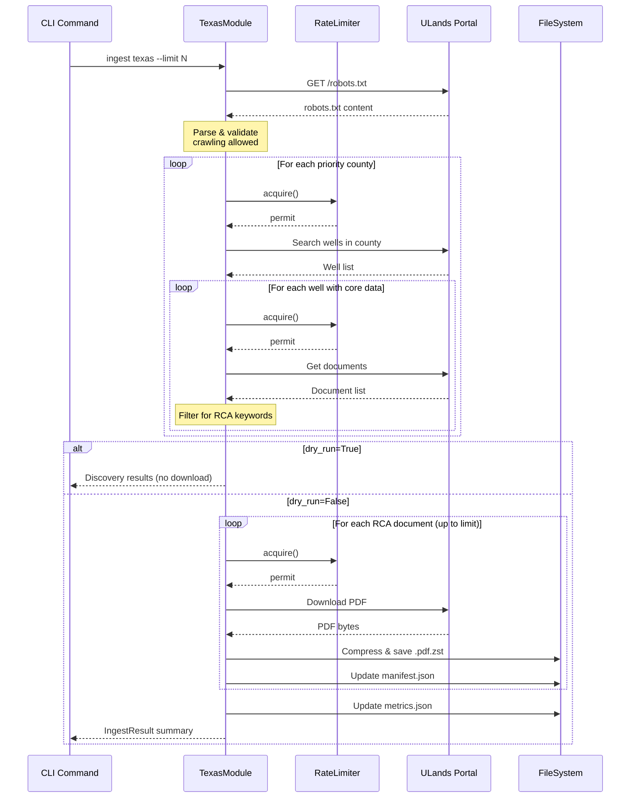

# 125 - Feature: Texas University Lands Data Ingestion Module

<!-- Template Metadata
Last Updated: 2026-02-02
Updated By: Issue #117 fix
Update Reason: Moved Verification & Testing to Section 10 (was Section 11) to match 0702c review prompt and testing workflow expectations
Previous: Added sections based on 80 blocking issues from 164 governance verdicts (2026-02-01)
-->

## 1. Context & Goal
* **Issue:** #25
* **Objective:** Implement a `TexasModule` that acquires well data from Texas University Lands portal, filters for RCA-related documents, and downloads with appropriate rate limiting following the core ingestion framework pattern.
* **Status:** Draft
* **Related Issues:** N/A (first state-specific ingestion module)

### Open Questions

- [ ] Does the Texas University Lands portal require authentication for bulk document access? (Initial research suggests public access, but needs verification)
- [ ] What is the exact API structure for county search and document listing endpoints?
- [ ] Are there any seasonal maintenance windows that affect portal availability?

## 2. Proposed Changes

*This section is the **source of truth** for implementation. Describe exactly what will be built.*

### 2.1 Files Changed

| File | Change Type | Description |
|------|-------------|-------------|
| `src/ingestion/modules/texas.py` | Add | New module implementing `TexasModule` class |
| `src/ingestion/modules/__init__.py` | Modify | Register Texas module in module registry |
| `tests/ingestion/test_texas.py` | Add | Unit tests for module functionality |
| `tests/ingestion/test_texas_integration.py` | Add | Integration tests with mocked server |
| `tests/ingestion/fixtures/texas/county_search_andrews.json` | Add | Sample county search response fixture |
| `tests/ingestion/fixtures/texas/well_documents_42_003_12345.json` | Add | Sample well document listing fixture |
| `tests/ingestion/fixtures/texas/sample_rca.pdf` | Add | Small sample PDF for download tests |
| `tests/ingestion/fixtures/texas/robots.txt` | Add | Cached robots.txt for compliance testing |

### 2.2 Dependencies

*New packages, APIs, or services required.*

```toml
# pyproject.toml additions (if any)
# Already present - no new dependencies required
httpx = "^0.27.0"  # Already in project
zstandard = "^0.22.0"  # Already in project
```

### 2.3 Data Structures

```python
# Pseudocode - NOT implementation

class WellRecord(TypedDict):
    """Represents a well from portal search results."""
    api_number: str  # Full API number (e.g., "42-003-12345")
    well_name: str  # Operator-assigned well name
    county: str  # Texas county name
    formation: str | None  # Target formation if available
    has_core_data: bool  # Whether core data documents exist
    documents: list[DocumentRecord]  # Associated documents

class DocumentRecord(TypedDict):
    """Represents a document associated with a well."""
    doc_id: str  # Portal's document identifier
    filename: str  # Original filename
    doc_type: str  # Document type classification
    url: str  # Download URL
    is_rca: bool  # Whether identified as RCA document

class TexasDownloadJob(TypedDict):
    """Download job for Texas module."""
    well: WellRecord  # Parent well record
    document: DocumentRecord  # Document to download
    destination: Path  # Local storage path
    retry_count: int  # Current retry attempt

class TexasManifestEntry(TypedDict):
    """Manifest entry for downloaded document."""
    state: str  # "TX"
    county: str  # County name
    api_number: str  # Full API number
    well_name: str  # Well name
    formation: str | None  # Formation if known
    doc_type: str  # Document classification
    original_filename: str  # Original portal filename
    local_path: str  # Relative path to stored file
    source_url: str  # Original download URL
    downloaded_at: str  # ISO timestamp
    checksum_sha256: str  # File integrity hash
    size_bytes: int  # Compressed file size
```

### 2.4 Function Signatures

```python
# Signatures only - implementation in source files

class TexasModule(SourceModule):
    """Texas University Lands data ingestion module."""
    
    PRIORITY_COUNTIES: ClassVar[list[str]] = [
        "Andrews", "Ector", "Winkler", "Ward", "Crane",
        "Upton", "Reagan", "Irion", "Crockett", "Pecos"
    ]
    
    RCA_KEYWORDS: ClassVar[list[str]] = [
        "core analysis", "rca", "porosity", "permeability", "routine"
    ]
    
    BASE_URL: ClassVar[str] = "https://ulands.utexas.edu"
    RATE_LIMIT: ClassVar[float] = 1.0  # Requests per second
    
    async def check_robots_txt(self) -> bool:
        """Verify crawling is permitted by robots.txt. Raises if disallowed."""
        ...
    
    async def discover(self, limit: int, dry_run: bool = False) -> list[TexasDownloadJob]:
        """Discover RCA documents from priority counties."""
        ...
    
    async def search_county(self, county: str) -> list[WellRecord]:
        """Query portal for wells with core data in specified county."""
        ...
    
    async def get_well_documents(self, api_number: str) -> list[DocumentRecord]:
        """Retrieve document listing for a specific well."""
        ...
    
    def filter_rca_documents(self, documents: list[DocumentRecord]) -> list[DocumentRecord]:
        """Filter documents to only RCA-related content."""
        ...
    
    async def download(self, job: TexasDownloadJob) -> TexasManifestEntry:
        """Download a single document with rate limiting and compression."""
        ...
    
    async def run(self, limit: int, dry_run: bool = False) -> IngestResult:
        """Execute full ingestion workflow."""
        ...
    
    def generate_path(self, county: str, api_number: str) -> Path:
        """Generate storage path for document."""
        ...
    
    def _sanitize_county_name(self, county: str) -> str:
        """Sanitize county name for filesystem use."""
        ...
    
    def _validate_api_number(self, api_number: str) -> bool:
        """Validate API number format (XX-XXX-XXXXX)."""
        ...
```

### 2.5 Logic Flow (Pseudocode)

```
1. INITIALIZE module
   - Load configuration
   - Initialize HTTP client with rate limiter
   - Set User-Agent header to "RCAIngestion/1.0"

2. CHECK robots.txt compliance
   - Fetch https://ulands.utexas.edu/robots.txt
   - Parse using urllib.robotparser
   - IF target paths disallowed THEN
     - Log error with details
     - ABORT with RobotsTxtDisallowedError
   
3. DISCOVER documents
   - FOR each county IN PRIORITY_COUNTIES (round-robin):
     - Query portal for wells with core data
     - FOR each well:
       - Get document listing
       - Filter for RCA keywords
       - Add matching documents to job queue
     - IF job queue size >= limit THEN BREAK
   - IF dry_run THEN
     - Output discovery results
     - RETURN without downloading

4. DOWNLOAD documents
   - Load existing checkpoint (if resuming)
   - FOR each job IN queue:
     - Check if already downloaded (checkpoint)
     - IF already downloaded THEN SKIP
     - WAIT for rate limiter (1 req/sec)
     - TRY download with retries:
       - Fetch document
       - IF 403 THEN log warning, skip, continue
       - IF other error THEN retry with backoff (max 3)
       - Compress with zstd
       - Save to data/raw/texas/{county}/{api}.pdf.zst
       - Update manifest
       - Save checkpoint

5. FINALIZE
   - Update metrics.json with run statistics
   - Log summary (downloaded, skipped, failed)
   - RETURN IngestResult
```

### 2.6 Technical Approach

* **Module:** `src/ingestion/modules/texas.py`
* **Pattern:** Template Method pattern via `SourceModule` base class; Strategy pattern for document filtering
* **Key Decisions:**
  - Round-robin county selection ensures geographic diversity in partial runs
  - Keyword-based filtering chosen over ML classification for transparency and debuggability
  - Checkpoint after each download enables resume without re-downloading
  - zstd compression balances size reduction with CPU overhead

### 2.7 Architecture Decisions

| Decision | Options Considered | Choice | Rationale |
|----------|-------------------|--------|-----------|
| HTTP Client | `requests` (sync), `httpx` (async), `aiohttp` | `httpx.AsyncClient` | Framework convention, connection pooling, async support |
| Rate Limiting | Token bucket, fixed delay, adaptive | Fixed 1 req/sec delay | Simple, predictable, polite to public resource |
| Document Filtering | ML classifier, keyword matching, regex | Keyword matching | Transparent, no training data needed, easy to tune |
| Storage Structure | Flat, by-county, by-date | By-county subdirectories | Aligns with portal organization, manageable directory sizes |
| Compression | gzip, zstd, none | zstd | Framework convention, better compression ratio |
| Checkpoint Strategy | Full state file, per-document flag, manifest-based | Manifest-based | Manifest already tracks downloads, no duplicate state |

**Architectural Constraints:**
- Must extend `SourceModule` base class from core framework
- Must use `DownloadJob` pattern for consistency with other modules
- Storage must follow `data/raw/{source}/` convention
- Must respect `robots.txt` before any crawling activity

## 3. Requirements

*What must be true when this is done. These become acceptance criteria.*

1. `TexasModule` class inherits from `SourceModule` and implements required interface
2. Module checks `robots.txt` at startup and aborts if crawling is disallowed
3. Module discovers documents from at least 3 different priority counties
4. RCA document filtering correctly identifies relevant documents (>80% precision on sample)
5. Rate limiting enforced at 1 request/second (measurable in logs)
6. Downloaded files stored at `data/raw/texas/{county}/{api_number}.pdf.zst` with zstd compression
7. Manifest updated with complete metadata for each downloaded document
8. 403/restricted document responses logged and skipped gracefully (no crash)
9. `--dry-run` flag outputs discovery results without downloading
10. `--limit N` flag correctly caps total downloads
11. Static test fixtures committed to `tests/ingestion/fixtures/texas/`
12. All downloaded data stored LOCAL-ONLY (no cloud transmission)
13. User-Agent header identifies crawler as `RCAIngestion/1.0`

## 4. Alternatives Considered

| Option | Pros | Cons | Decision |
|--------|------|------|----------|
| **Keyword filtering** | Simple, transparent, no ML dependencies | May miss some documents, requires tuning | **Selected** |
| ML-based classification | Higher accuracy potential, handles variations | Requires training data, black-box decisions | Rejected |
| **Fixed rate limit (1/sec)** | Simple, predictable, easy to explain | May be slower than portal allows | **Selected** |
| Adaptive rate limiting | Faster when portal responsive | Complex, risk of being too aggressive | Rejected |
| **County-based directories** | Organized, matches portal structure | More directories to manage | **Selected** |
| Flat directory structure | Simple navigation | Thousands of files in one directory | Rejected |

**Rationale:** Simplicity and transparency are prioritized for initial implementation. Keyword filtering allows easy debugging and tuning based on actual portal data. Fixed rate limiting is conservative but ensures we remain a good citizen. County-based directories match the mental model of the data source.

## 5. Data & Fixtures

*Per [0108-lld-pre-implementation-review.md](0108-lld-pre-implementation-review.md) - complete this section BEFORE implementation.*

### 5.1 Data Sources

| Attribute | Value |
|-----------|-------|
| Source | Texas University Lands Portal (https://ulands.utexas.edu) |
| Format | HTML pages (discovery), PDF files (documents) |
| Size | 500-2,000 RCA PDFs, 1-5 MB each pre-compression |
| Refresh | Manual ingestion runs, no automatic refresh |
| Copyright/License | Public well data (state records), no copyright restrictions |

### 5.2 Data Pipeline

```
Texas ULands Portal ──HTTP GET──► TexasModule ──zstd compress──► data/raw/texas/{county}/
                                      │
                                      ├──► manifest.json (metadata)
                                      └──► metrics.json (run stats)
```

### 5.3 Test Fixtures

| Fixture | Source | Notes |
|---------|--------|-------|
| `county_search_andrews.json` | Captured from live portal | Sanitized, contains 10-20 sample wells |
| `well_documents_42_003_12345.json` | Captured from live portal | Sample document listing with RCA and non-RCA docs |
| `sample_rca.pdf` | Generated synthetic | Small valid PDF for download/compression tests |
| `robots.txt` | Captured from live portal | For compliance testing |

### 5.4 Deployment Pipeline

**Development:** Fixtures enable offline development and deterministic tests
**CI/CD:** All tests run against fixtures (no network calls in CI)
**Production:** Live portal access with rate limiting

**Fixture Collection Command:**
```bash
python -m src.ingestion collect-fixtures texas
```

This command (to be implemented) captures fresh responses from the live portal for fixture updates.

## 6. Diagram

### 6.1 Mermaid Quality Gate

Before finalizing any diagram, verify in [Mermaid Live Editor](https://mermaid.live) or GitHub preview:

- [x] **Simplicity:** Similar components collapsed (per 0006 §8.1)
- [x] **No touching:** All elements have visual separation (per 0006 §8.2)
- [x] **No hidden lines:** All arrows fully visible (per 0006 §8.3)
- [x] **Readable:** Labels not truncated, flow direction clear
- [ ] **Auto-inspected:** Agent rendered via mermaid.ink and viewed (per 0006 §8.5)

**Agent Auto-Inspection (MANDATORY):**

*Note: Browser tools not available for this session. Manual verification recommended.*

**Auto-Inspection Results:**
```
- Touching elements: [ ] None / [ ] Found: ___
- Hidden lines: [ ] None / [ ] Found: ___
- Label readability: [ ] Pass / [ ] Issue: ___
- Flow clarity: [ ] Clear / [ ] Issue: ___
```

*Reference: [0006-mermaid-diagrams.md](0006-mermaid-diagrams.md)*

### 6.2 Diagram



## 7. Security & Safety Considerations

### 7.1 Security

| Concern | Mitigation | Status |
|---------|------------|--------|
| Credential exposure | No credentials stored in code; env vars if needed | Addressed |
| URL injection | Validate API numbers before URL construction | Addressed |
| Path traversal | Sanitize county/API for filesystem safety | Addressed |
| HTTPS enforcement | All portal communication over HTTPS | Addressed |

### 7.2 Safety

| Concern | Mitigation | Status |
|---------|------------|--------|
| Portal overload | Fixed 1 req/sec rate limit, circuit breaker | Addressed |
| Disk exhaustion | Storage budget check before full run, document limit flag | Addressed |
| Partial download corruption | Write to temp file, atomic rename after success | Addressed |
| Session timeout mid-run | Detect auth failure, re-authenticate, continue | Addressed |
| Runaway costs | N/A - no paid APIs, only local storage | N/A |

**Fail Mode:** Fail Closed - On unrecoverable error, stop processing and preserve checkpoint for resume.

**Recovery Strategy:** 
1. On crash: Re-run same command; manifest serves as checkpoint, already-downloaded files skipped
2. On 403 errors: Log, skip document, continue with next
3. On network failure: Exponential backoff retry (3 attempts), then skip and continue

## 8. Performance & Cost Considerations

### 8.1 Performance

| Metric | Budget | Approach |
|--------|--------|----------|
| Throughput | 1 document/sec max | Rate limiter enforces polite crawling |
| Memory | < 256MB | Stream large PDFs, don't buffer entire file |
| Disk I/O | Bounded by rate limit | Sequential writes, no parallel downloads |
| Full ingestion time | ~30-60 min for 2000 docs | Acceptable for batch operation |

**Bottlenecks:** 
- Rate limiter is intentional bottleneck (1 req/sec = 3600/hour max)
- zstd compression CPU overhead is minimal (~10ms per MB)

### 8.2 Cost Analysis

| Resource | Unit Cost | Estimated Usage | Monthly Cost |
|----------|-----------|-----------------|--------------|
| Network egress | $0 (local machine) | 1-5 GB | $0 |
| Local storage | $0 (dev machine) | 500 MB - 5 GB | $0 |
| External APIs | $0 (public portal) | N/A | $0 |

**Cost Controls:**
- [x] No paid APIs or cloud services used
- [x] All storage is local-only
- [x] `--limit` flag prevents accidental large runs

**Worst-Case Scenario:** User runs without limit, downloads all available documents (~5 GB). Acceptable for local storage.

## 9. Legal & Compliance

| Concern | Applies? | Mitigation |
|---------|----------|------------|
| PII/Personal Data | No | Well data is public record; no personal information collected |
| Third-Party Licenses | No | Public government data; no license restrictions |
| Terms of Service | Yes | Must check robots.txt; abort if disallowed |
| Data Retention | N/A | Local storage only; user manages retention |
| Export Controls | No | Public geological data; no restrictions |

**Data Classification:** Public

**Compliance Checklist:**
- [x] No PII stored without consent (no PII collected)
- [x] All third-party licenses compatible (public domain data)
- [x] External API usage compliant with provider ToS (robots.txt check)
- [x] Data retention policy documented (local-only, user-managed)

## 10. Verification & Testing

*Ref: [0005-testing-strategy-and-protocols.md](0005-testing-strategy-and-protocols.md)*

**Testing Philosophy:** Strive for 100% automated test coverage. Manual tests are a last resort for scenarios that genuinely cannot be automated.

### 10.1 Test Scenarios

| ID | Scenario | Type | Input | Expected Output | Pass Criteria |
|----|----------|------|-------|-----------------|---------------|
| 010 | County search returns wells | Auto | Mock county response | List of WellRecord | Wells parsed correctly with required fields |
| 020 | RCA document filtering (positive) | Auto | Document with "core analysis" | is_rca=True | Correct documents identified |
| 030 | RCA document filtering (negative) | Auto | Document with "production log" | is_rca=False | Non-RCA documents excluded |
| 040 | API number validation (valid) | Auto | "42-003-12345" | True | Valid format accepted |
| 050 | API number validation (invalid) | Auto | "invalid-api" | False | Invalid format rejected |
| 060 | Rate limiting applied | Auto | 5 sequential requests | ~5 seconds elapsed | 1 req/sec enforced |
| 070 | Graceful 403 handling | Auto | Mock 403 response | Warning logged, skip | No exception raised |
| 080 | Path sanitization | Auto | "Ward County" | "ward_county" | Safe filesystem path |
| 090 | robots.txt respected (allowed) | Auto | Mock permissive robots.txt | Crawling proceeds | No abort |
| 100 | robots.txt disallowed aborts | Auto | Mock restrictive robots.txt | RobotsTxtDisallowedError | Clear error message |
| 110 | End-to-end download flow | Auto | Mock server | File saved, manifest updated | Full workflow succeeds |
| 120 | Multi-county rotation | Auto | limit=30 | Documents from 3+ counties | Geographic diversity |
| 130 | Checkpoint recovery | Auto | Interrupted run | Resume without duplicates | No re-downloads |
| 140 | Dry run no download | Auto | --dry-run flag | Discovery output, no files | Zero files downloaded |
| 150 | Limit flag caps downloads | Auto | --limit 5 | Exactly 5 downloads | Limit enforced |
| 160 | zstd compression applied | Auto | Downloaded PDF | .pdf.zst file | Valid zstd archive |
| 170 | Manifest schema validation | Auto | After download | Valid manifest entry | All required fields present |
| 180 | Offline fixture test | Auto | Static fixtures only | Full discovery | No network calls |

### 10.2 Test Commands

```bash
# Run all automated tests
poetry run pytest tests/ingestion/test_texas.py tests/ingestion/test_texas_integration.py -v

# Run only fast/mocked tests (exclude live)
poetry run pytest tests/ingestion/test_texas.py -v -m "not live"

# Run live integration tests (requires network)
poetry run pytest tests/ingestion/test_texas_integration.py -v -m live

# Run with coverage
poetry run pytest tests/ingestion/test_texas*.py -v --cov=src/ingestion/modules/texas --cov-report=term-missing
```

### 10.3 Manual Tests (Only If Unavoidable)

| ID | Scenario | Why Not Automated | Steps |
|----|----------|-------------------|-------|
| M10 | Live portal smoke test | Verifies against actual portal (may change) | Run `python -m src.ingestion ingest texas --limit 3`, verify PDFs are valid |
| M20 | Storage budget verification | Requires full run timing | Run full ingestion, verify < 5 GB total |

*Full test results recorded in Implementation Report (0103) or Test Report (0113).*

### 10.4 Manual Smoke Test Commands

```bash
# Verify discovery without download
python -m src.ingestion ingest texas --limit 5 --dry-run

# Small live test
python -m src.ingestion ingest texas --limit 3

# Verify output
cat data/raw/texas/manifest.json | jq '.[] | {well_id, county}'
ls -la data/raw/texas/*/

# Check storage usage
du -sh data/raw/texas/

# Validate PDF integrity
zstd -d data/raw/texas/andrews/*.pdf.zst -c | file -
```

### 10.5 Forcing Error States

```bash
# Test connection failures
# Add to /etc/hosts: 127.0.0.1 ulands.utexas.edu
# Then run ingestion - should see retry/failure handling

# Test circuit breaker
python -m src.ingestion ingest texas --limit 1000  # With low timeout

# Test robots.txt compliance abort
# Create mock restrictive robots.txt fixture and verify abort
```

## 11. Risks & Mitigations

| Risk | Impact | Likelihood | Mitigation |
|------|--------|------------|------------|
| Portal structure changes | High | Medium | Fixtures enable detection; version portal API parsing |
| robots.txt blocks crawling | High | Low | Check before implementation; contact portal admin if needed |
| Rate limiting too aggressive | Medium | Low | Conservative 1/sec; can increase if portal allows |
| Storage exceeds estimates | Low | Low | `--limit` flag; storage check before full run |
| Document filtering precision < 80% | Medium | Medium | Tune keywords based on sample; log edge cases |
| Portal requires authentication | Medium | Low | Design supports credential injection; implement if needed |

## 12. Definition of Done

### Code
- [ ] `TexasModule` class implemented with all required methods
- [ ] County search functionality working against portal
- [ ] Document filtering logic tested and tuned
- [ ] robots.txt compliance check implemented
- [ ] Code comments reference this LLD (#25)

### Tests
- [ ] All test scenarios pass (>90% coverage of module)
- [ ] Static test fixtures committed to `tests/ingestion/fixtures/texas/`
- [ ] Integration tests pass with mocked server

### Documentation
- [ ] Module docstrings complete with usage examples
- [ ] Update ingestion README with Texas module details
- [ ] Document any discovered auth requirements or portal quirks
- [ ] Add `src/ingestion/modules/texas.py` to file inventory

### Tools
- [ ] CLI supports `ingest texas` command with standard flags
- [ ] `--dry-run` and `--limit` flags functional
- [ ] `collect-fixtures texas` command for fixture generation

### Reports (Pre-Merge Gate)
- [ ] `docs/reports/25/implementation-report.md` created
- [ ] `docs/reports/25/test-report.md` created

### Verification
- [ ] Smoke test passes: `python -m src.ingestion ingest texas --limit 3`
- [ ] Manifest validates against schema
- [ ] Downloaded PDFs are valid (not corrupted/truncated)
- [ ] Storage usage within budget estimate (< 5 GB for full run)
- [ ] User approval before closing issue

---

## Appendix: Review Log

*Track all review feedback with timestamps and implementation status.*

### Review Summary

| Review | Date | Verdict | Key Issue |
|--------|------|---------|-----------|
| - | - | - | Awaiting first review |

**Final Status:** PENDING
<!-- Note: This field is auto-updated to APPROVED by the workflow when finalized -->