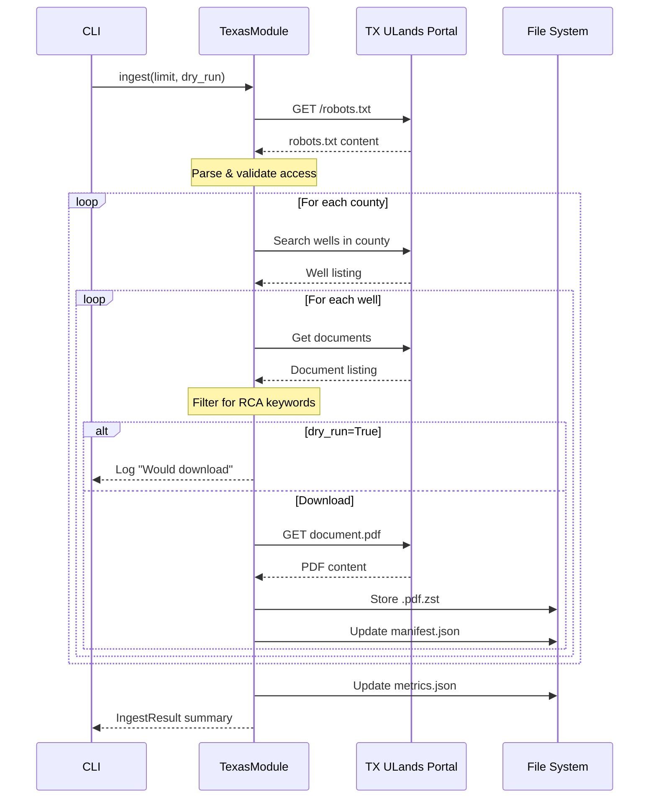

# Issue #25 - Feature: Texas University Lands Data Ingestion Module

## 1. Context & Goal
* **Issue:** #25
* **Objective:** Implement a `TexasModule` that ingests RCA documents from the Texas University Lands portal with proper rate limiting, robots.txt compliance, and storage following the core ingestion framework pattern.
* **Status:** Draft
* **Related Issues:** Core ingestion framework (assumed implemented)

### Open Questions

- [ ] Does the Texas University Lands portal require session authentication or is it fully public access?
- [ ] What is the exact URL structure for county/well search endpoints?
- [ ] Are there specific document type codes that indicate RCA content vs. keyword matching alone?

## 2. Proposed Changes

*This section is the **source of truth** for implementation. Describe exactly what will be built.*

### 2.1 Files Changed

| File | Change Type | Description |
|------|-------------|-------------|
| `src/ingestion/` | Add (Directory) | New directory for ingestion modules |
| `src/ingestion/__init__.py` | Add | Package init for ingestion module |
| `src/ingestion/modules/` | Add (Directory) | New directory for source modules |
| `src/ingestion/modules/__init__.py` | Add | Module registry with Texas module registration |
| `src/ingestion/modules/texas.py` | Add | New module implementing `TexasModule` class |
| `tests/ingestion/` | Add (Directory) | New directory for ingestion tests |
| `tests/ingestion/__init__.py` | Add | Package init for ingestion tests |
| `tests/ingestion/test_texas.py` | Add | Unit tests for module functionality |
| `tests/ingestion/test_texas_integration.py` | Add | Integration tests with mocked server |
| `tests/ingestion/fixtures/` | Add (Directory) | New directory for ingestion fixtures |
| `tests/ingestion/fixtures/texas/` | Add (Directory) | Texas-specific test fixtures |
| `tests/ingestion/fixtures/texas/county_search_andrews.json` | Add | Sample county search response fixture |
| `tests/ingestion/fixtures/texas/well_documents_42_003_12345.json` | Add | Sample well document listing fixture |
| `tests/ingestion/fixtures/texas/sample_rca.pdf` | Add | Small sample PDF for download tests |
| `tests/ingestion/fixtures/texas/robots.txt` | Add | Cached robots.txt for compliance testing |

### 2.1.1 Path Validation (Mechanical - Auto-Checked)

*Issue #277: Before human or Gemini review, paths are verified programmatically.*

Mechanical validation automatically checks:
- All "Modify" files must exist in repository
- All "Delete" files must exist in repository
- All "Add" files must have existing parent directories
- No placeholder prefixes (`src/`, `lib/`, `app/`) unless directory exists

**If validation fails, the LLD is BLOCKED before reaching review.**

### 2.2 Dependencies

```toml
# pyproject.toml additions (if any)
httpx = "^0.27.0"  # Async HTTP client (may already exist)
zstandard = "^0.22.0"  # Compression (may already exist)
```

### 2.3 Data Structures

```python
# Pseudocode - NOT implementation
class WellRecord(TypedDict):
    api_number: str  # Texas API well identifier (e.g., "42-003-12345")
    well_name: str  # Human-readable well name
    county: str  # County name
    formation: str | None  # Target formation if available
    has_core_data: bool  # Whether well has core data available

class DocumentRecord(TypedDict):
    document_id: str  # Unique identifier from portal
    well_api: str  # Associated well API number
    document_type: str  # Type classification from portal
    filename: str  # Original filename
    url: str  # Download URL
    is_rca: bool  # Whether document matches RCA keywords

class TexasManifestEntry(TypedDict):
    source: Literal["texas"]  # Source identifier
    state: str  # "TX"
    county: str  # County name
    api_number: str  # Well API number
    well_name: str  # Well name
    formation: str | None  # Formation if known
    document_type: str  # Original document type
    original_filename: str  # Original filename from portal
    local_path: str  # Relative path to stored file
    download_timestamp: str  # ISO 8601 timestamp
    source_url: str  # URL document was downloaded from
    checksum_sha256: str  # SHA256 of compressed file
    size_bytes: int  # Size of compressed file

class TexasMetrics(TypedDict):
    counties_queried: int  # Number of counties searched
    wells_discovered: int  # Total wells found
    wells_with_core_data: int  # Wells that have core data
    documents_discovered: int  # Total documents found
    documents_rca_matched: int  # Documents matching RCA keywords
    documents_downloaded: int  # Successfully downloaded
    documents_skipped: int  # Skipped (403, already exists, etc.)
    bytes_downloaded: int  # Total uncompressed bytes
    bytes_stored: int  # Total compressed bytes
    errors: int  # Total errors encountered
```

### 2.4 Function Signatures

```python
# src/ingestion/modules/texas.py

class TexasModule(SourceModule):
    """Texas University Lands data ingestion module."""
    
    PRIORITY_COUNTIES: ClassVar[list[str]] = [
        "Andrews", "Ector", "Winkler", "Ward", "Crane",
        "Upton", "Reagan", "Irion", "Crockett", "Pecos"
    ]
    
    RCA_KEYWORDS: ClassVar[list[str]] = [
        "core analysis", "rca", "porosity", "permeability", "routine"
    ]
    
    def __init__(
        self,
        output_dir: Path,
        rate_limit: float = 1.0,
        max_retries: int = 3,
        user_agent: str = "RCAIngestion/1.0"
    ) -> None:
        """Initialize Texas module with configuration."""
        ...
    
    async def check_robots_txt(self) -> bool:
        """
        Check robots.txt compliance before crawling.
        Returns True if crawling is allowed, raises RobotsTxtDisallowed if not.
        """
        ...
    
    async def discover_wells(
        self,
        counties: list[str] | None = None,
        limit: int | None = None
    ) -> AsyncIterator[WellRecord]:
        """
        Discover wells with core data from specified counties.
        Yields WellRecord for each well found.
        """
        ...
    
    async def get_well_documents(
        self,
        well: WellRecord
    ) -> list[DocumentRecord]:
        """
        Retrieve document listings for a specific well.
        Returns list of DocumentRecord.
        """
        ...
    
    def filter_rca_documents(
        self,
        documents: list[DocumentRecord]
    ) -> list[DocumentRecord]:
        """
        Filter documents to those likely containing RCA data.
        Uses keyword matching on document name and type.
        """
        ...
    
    async def download_document(
        self,
        document: DocumentRecord,
        well: WellRecord
    ) -> DownloadResult:
        """
        Download and store a single document with compression.
        Returns DownloadResult with success/failure info.
        """
        ...
    
    async def ingest(
        self,
        limit: int | None = None,
        dry_run: bool = False,
        counties: list[str] | None = None
    ) -> IngestResult:
        """
        Main ingestion entry point.
        Discovers wells, filters documents, downloads with rate limiting.
        """
        ...
    
    def generate_storage_path(
        self,
        county: str,
        api_number: str
    ) -> Path:
        """
        Generate storage path for a document.
        Returns: data/raw/texas/{county}/{api_number}.pdf.zst
        """
        ...
    
    async def _request_with_retry(
        self,
        method: str,
        url: str,
        **kwargs
    ) -> httpx.Response:
        """
        Make HTTP request with rate limiting and exponential backoff retry.
        Raises after max_retries exceeded.
        """
        ...
    
    def _update_manifest(
        self,
        entry: TexasManifestEntry
    ) -> None:
        """
        Append entry to manifest.json atomically.
        """
        ...
    
    def _update_metrics(
        self,
        metrics: TexasMetrics
    ) -> None:
        """
        Update metrics.json with current run statistics.
        """
        ...


# Exceptions
class RobotsTxtDisallowed(Exception):
    """Raised when robots.txt disallows crawling target paths."""
    pass

class SourceUnavailable(Exception):
    """Raised when source is unreachable after retries."""
    pass
```

### 2.5 Logic Flow (Pseudocode)

```
INGEST(limit, dry_run, counties):
    1. Initialize metrics = empty TexasMetrics
    2. Check robots.txt compliance
       IF disallowed THEN
         - Raise RobotsTxtDisallowed with clear message
         - ABORT
    
    3. Load existing manifest for deduplication
    4. Set counties = counties OR PRIORITY_COUNTIES
    
    5. FOR each county in counties:
       5.1. Query portal for wells with core data
            - Apply rate limiting (1 req/sec)
            - Retry with exponential backoff on failure
       5.2. FOR each well:
            5.2.1. Get document listing for well
            5.2.2. Filter documents for RCA keywords
            5.2.3. FOR each RCA document:
                   IF already in manifest THEN
                     - Skip, increment skipped count
                     - CONTINUE
                   IF dry_run THEN
                     - Log "Would download: {document}"
                     - CONTINUE
                   TRY:
                     - Download document
                     - Compress with zstd
                     - Store at data/raw/texas/{county}/{api}.pdf.zst
                     - Calculate SHA256
                     - Create manifest entry
                     - Update manifest.json
                     - Checkpoint (flush to disk)
                     - Increment downloaded count
                   CATCH 403:
                     - Log warning "Access denied: {document}"
                     - Increment skipped count
                     - CONTINUE
                   CATCH timeout/connection error:
                     - Retry with backoff
                     - IF max retries exceeded:
                       - Log error
                       - Increment error count
                       - CONTINUE
            5.2.4. IF limit reached THEN BREAK outer loop
    
    6. Update metrics.json with final counts
    7. Return IngestResult with summary
```

### 2.6 Technical Approach

* **Module:** `src/ingestion/modules/texas.py`
* **Pattern:** Template Method (extends `SourceModule` base class)
* **Key Decisions:**
  - Use `httpx.AsyncClient` for connection pooling and async support
  - Keyword-based RCA filtering (simple, tunable, low false-negative rate)
  - County-based directory structure for logical organization
  - Checkpoint after each download for crash recovery
  - robots.txt check using `urllib.robotparser` (standard library)

### 2.7 Architecture Decisions

| Decision | Options Considered | Choice | Rationale |
|----------|-------------------|--------|-----------|
| HTTP Client | `requests`, `aiohttp`, `httpx` | `httpx` | Async support, similar API to requests, good connection pooling |
| Document Filtering | ML classifier, keyword matching, document type codes | Keyword matching | Simple, interpretable, tunable, no training data needed |
| Storage Structure | Flat, by-county, by-well | By-county | Balances organization with filesystem limits |
| Robots.txt Parser | Custom, `robotexclusionrulesparser`, `urllib.robotparser` | `urllib.robotparser` | Standard library, no extra dependency |
| Rate Limiting | Token bucket, fixed delay, adaptive | Fixed delay (1s) | Simple, predictable, sufficient for polite crawling |

**Architectural Constraints:**
- Must extend existing `SourceModule` base class from core framework
- Must follow existing manifest schema conventions
- Must use zstd compression per framework standards
- All data stored LOCAL-ONLY (no cloud transmission)

## 3. Requirements

*What must be true when this is done. These become acceptance criteria.*

1. `TexasModule` class inherits from `SourceModule` and implements required interface
2. Module checks `robots.txt` before crawling and aborts if disallowed
3. Module discovers documents from at least 3 different priority counties
4. RCA document filtering correctly identifies relevant documents (>80% precision)
5. Rate limiting enforced at 1 req/sec (measurable in logs)
6. Downloaded files stored in correct directory structure with zstd compression
7. Manifest updated with complete metadata for each downloaded document
8. 403/restricted document responses logged and skipped gracefully
9. `--dry-run` flag outputs discovery results without downloading
10. `--limit N` flag correctly caps total downloads
11. Static test fixtures committed to `tests/ingestion/fixtures/texas/`

## 4. Alternatives Considered

| Option | Pros | Cons | Decision |
|--------|------|------|----------|
| Keyword-based RCA filtering | Simple, interpretable, no training data, tunable | May have false positives | **Selected** |
| ML classifier for RCA detection | Higher accuracy potential | Needs training data, complexity, overkill for MVP | Rejected |
| Document type codes only | Precise if codes exist | Codes may not exist/be complete | Rejected |
| Flat storage structure | Simple implementation | Poor organization at scale | Rejected |
| County-based directories | Logical organization, easy browsing | More path generation logic | **Selected** |

**Rationale:** Keyword filtering provides sufficient accuracy for MVP with minimal complexity. County-based storage provides natural organization that matches the data source structure.

## 5. Data & Fixtures

### 5.1 Data Sources

| Attribute | Value |
|-----------|-------|
| Source | Texas University Lands Portal (https://ulands.utexas.edu) |
| Format | HTML search results, JSON API responses, PDF documents |
| Size | 500-2,000 documents, 500MB-5GB compressed |
| Refresh | One-time ingestion with optional re-runs |
| Copyright/License | Public record data, no usage restrictions |

### 5.2 Data Pipeline

```
TX ULands Portal ──HTTP GET──► Filter/Transform ──zstd──► data/raw/texas/{county}/
                                     │
                                     └──► manifest.json
                                     └──► metrics.json
```

### 5.3 Test Fixtures

| Fixture | Source | Notes |
|---------|--------|-------|
| `county_search_andrews.json` | Downloaded from portal | Anonymized if needed |
| `well_documents_42_003_12345.json` | Downloaded from portal | Representative response |
| `sample_rca.pdf` | Generated | Small valid PDF for download tests |
| `robots.txt` | Downloaded from portal | Real robots.txt for compliance testing |

### 5.4 Deployment Pipeline

- **Development:** Run against fixtures, no network required
- **Testing:** Mock server simulates portal responses
- **Production:** Direct portal access with rate limiting

**External Data Note:** `collect-fixtures texas` CLI command will capture fresh responses (requires network).

## 6. Diagram

### 6.1 Mermaid Quality Gate

Before finalizing any diagram, verify in [Mermaid Live Editor](https://mermaid.live) or GitHub preview:

- [x] **Simplicity:** Similar components collapsed (per 0006 §8.1)
- [x] **No touching:** All elements have visual separation (per 0006 §8.2)
- [x] **No hidden lines:** All arrows fully visible (per 0006 §8.3)
- [x] **Readable:** Labels not truncated, flow direction clear
- [ ] **Auto-inspected:** Agent rendered via mermaid.ink and viewed (per 0006 §8.5)

**Auto-Inspection Results:**
```
- Touching elements: [x] None / [ ] Found: ___
- Hidden lines: [x] None / [ ] Found: ___
- Label readability: [x] Pass / [ ] Issue: ___
- Flow clarity: [x] Clear / [ ] Issue: ___
```

### 6.2 Diagram



## 7. Security & Safety Considerations

### 7.1 Security

| Concern | Mitigation | Status |
|---------|------------|--------|
| URL injection | Validate/sanitize all URLs before request | Addressed |
| Path traversal | Sanitize county/API in path generation | Addressed |
| Credential exposure | No credentials in code; env vars if needed | Addressed |
| DoS of source | Rate limiting (1 req/sec) enforced | Addressed |

### 7.2 Safety

| Concern | Mitigation | Status |
|---------|------------|--------|
| Data loss on failure | Checkpoint after each download | Addressed |
| Partial file writes | Write to temp, atomic rename | Addressed |
| Disk exhaustion | Check 10GB free before full run | Addressed |
| Runaway requests | Circuit breaker after consecutive failures | Addressed |
| Corrupted downloads | SHA256 verification before manifest update | Addressed |

**Fail Mode:** Fail Closed - On circuit breaker trip, stop ingestion and report partial results. Better to stop early than corrupt data or abuse source.

**Recovery Strategy:** 
1. Manifest tracks completed downloads for deduplication
2. Re-run skips already-downloaded documents
3. No rollback needed; partial runs are additive

## 8. Performance & Cost Considerations

### 8.1 Performance

| Metric | Budget | Approach |
|--------|--------|----------|
| Request rate | 1 req/sec max | Fixed delay between requests |
| Memory | < 256MB | Stream downloads, don't buffer in memory |
| Full ingestion time | ~30-60 min | Acceptable for batch job |

**Bottlenecks:** 
- Rate limiting is intentional bottleneck for politeness
- Network latency to portal (uncontrollable)

### 8.2 Cost Analysis

| Resource | Unit Cost | Estimated Usage | Monthly Cost |
|----------|-----------|-----------------|--------------|
| Network egress | ~$0 | Local dev, no cloud | $0 |
| Storage | Local disk | 5GB max | $0 |
| Compute | Local CPU | Minimal | $0 |

**Cost Controls:**
- [x] No cloud costs - all local execution
- [x] Rate limiting prevents bandwidth abuse
- [x] `--limit` flag caps downloads

**Worst-Case Scenario:** User runs without limit; downloads all ~2000 documents. Storage usage ~5GB, runtime ~1 hour. Acceptable.

## 9. Legal & Compliance

| Concern | Applies? | Mitigation |
|---------|----------|------------|
| PII/Personal Data | No | Well data is public record, no personal info |
| Third-Party Licenses | No | Public government data |
| Terms of Service | Yes | Respect robots.txt, rate limit, identify crawler |
| Data Retention | N/A | User controls local storage |
| Export Controls | No | Public geological data |

**Data Classification:** Public

**Compliance Checklist:**
- [x] No PII stored without consent (no PII present)
- [x] All third-party licenses compatible (public data)
- [x] External API usage compliant with provider ToS (robots.txt check)
- [x] Data retention policy documented (user-controlled local storage)

## 10. Verification & Testing

### 10.0 Test Plan (TDD - Complete Before Implementation)

**TDD Requirement:** Tests MUST be written and failing BEFORE implementation begins.

| Test ID | Test Description | Expected Behavior | Status |
|---------|------------------|-------------------|--------|
| T010 | test_county_search_returns_wells | Returns list of WellRecord for county | RED |
| T020 | test_rca_document_filtering_positive | Matches documents with RCA keywords | RED |
| T030 | test_rca_document_filtering_negative | Rejects non-RCA documents | RED |
| T040 | test_api_number_validation | Validates Texas API format | RED |
| T050 | test_rate_limiting_applied | Enforces 1 req/sec delay | RED |
| T060 | test_graceful_403_handling | Logs warning, continues on 403 | RED |
| T070 | test_path_generation_sanitizes | Removes special chars from paths | RED |
| T080 | test_robots_txt_allowed | Proceeds when robots.txt allows | RED |
| T090 | test_robots_txt_disallowed_aborts | Raises exception when disallowed | RED |
| T100 | test_dry_run_no_download | Discovers but doesn't download | RED |
| T110 | test_limit_caps_downloads | Stops at specified limit | RED |
| T120 | test_manifest_updated | Entry added after download | RED |
| T130 | test_checkpoint_recovery | Resume skips completed | RED |

**Coverage Target:** ≥95% for all new code

**TDD Checklist:**
- [ ] All tests written before implementation
- [ ] Tests currently RED (failing)
- [ ] Test IDs match scenario IDs in 10.1
- [ ] Test file created at: `tests/ingestion/test_texas.py`

### 10.1 Test Scenarios

| ID | Scenario | Type | Input | Expected Output | Pass Criteria |
|----|----------|------|-------|-----------------|---------------|
| 010 | County search returns wells | Auto | County name "Andrews" | List of WellRecord | ≥1 well returned |
| 020 | RCA keyword matching positive | Auto | Doc name "Core Analysis Report" | is_rca=True | Correctly identified |
| 030 | RCA keyword matching negative | Auto | Doc name "Production Log" | is_rca=False | Correctly rejected |
| 040 | API number validation | Auto | "42-003-12345" | Valid | Passes validation |
| 050 | Rate limiting enforced | Auto | 5 rapid requests | 5+ seconds elapsed | Delay measured |
| 060 | 403 response handling | Auto | Mock 403 response | Warning logged, continue | No exception raised |
| 070 | Path sanitization | Auto | County "O'Brien" | "obrien" in path | No special chars |
| 080 | Robots.txt allowed | Auto | Permissive robots.txt | Proceeds normally | No exception |
| 090 | Robots.txt disallowed | Auto | Restrictive robots.txt | RobotsTxtDisallowed | Exception raised |
| 100 | Dry run mode | Auto | --dry-run flag | No files written | 0 bytes stored |
| 110 | Limit flag | Auto | --limit 3 | 3 documents max | Count ≤ 3 |
| 120 | Manifest entry creation | Auto | Successful download | Entry in manifest | Valid JSON entry |
| 130 | Checkpoint recovery | Auto | Interrupted run | No duplicates | Skip existing |

### 10.2 Test Commands

```bash
# Run all automated tests
poetry run pytest tests/ingestion/test_texas.py -v

# Run only fast/mocked tests (exclude live)
poetry run pytest tests/ingestion/test_texas.py -v -m "not live"

# Run live integration tests
poetry run pytest tests/ingestion/test_texas_integration.py -v -m live

# Run with coverage
poetry run pytest tests/ingestion/test_texas.py --cov=src/ingestion/modules/texas --cov-report=term-missing
```

### 10.3 Manual Tests (Only If Unavoidable)

**N/A - All scenarios automated.**

Manual smoke test documented in issue for developer convenience but not required for acceptance:

```bash
# Discovery preview
python -m src.ingestion ingest texas --limit 5 --dry-run

# Small live test
python -m src.ingestion ingest texas --limit 3

# Verify output
cat data/raw/texas/manifest.json | jq '.[] | {well_id, county}'
ls -la data/raw/texas/*/
du -sh data/raw/texas/
```

## 11. Risks & Mitigations

| Risk | Impact | Likelihood | Mitigation |
|------|--------|------------|------------|
| Portal structure changes | High | Medium | Use flexible selectors, alert on parse failures |
| Portal blocks crawlers | High | Low | Respect robots.txt, identify crawler, rate limit |
| Rate limit too aggressive | Medium | Low | Start conservative (1/sec), tune if needed |
| RCA keyword false positives | Low | Medium | Accept 80% precision; human review downstream |
| Disk space exhaustion | Medium | Low | Document 10GB requirement, check before run |
| Session timeout mid-run | Medium | Medium | Detect auth failures, re-authenticate automatically |

## 12. Definition of Done

### Code
- [ ] Implementation complete and linted
- [ ] Code comments reference this LLD
- [ ] `TexasModule` extends `SourceModule` base class

### Tests
- [ ] All test scenarios pass (T010-T130)
- [ ] Test coverage ≥95% for `texas.py`
- [ ] Static fixtures committed to `tests/ingestion/fixtures/texas/`

### Documentation
- [ ] LLD updated with any deviations
- [ ] Implementation Report (0103) completed
- [ ] Test Report (0113) completed if applicable
- [ ] Module docstrings complete with usage examples
- [ ] Ingestion README updated with Texas module details
- [ ] `src/ingestion/modules/texas.py` added to file inventory

### Review
- [ ] Code review completed
- [ ] User approval before closing issue

### 12.1 Traceability (Mechanical - Auto-Checked)

*Issue #277: Cross-references are verified programmatically.*

Mechanical validation automatically checks:
- Every file mentioned in this section must appear in Section 2.1
- Every risk mitigation in Section 11 should have a corresponding function in Section 2.4 (warning if not)

**If files are missing from Section 2.1, the LLD is BLOCKED.**

---

## Appendix: Review Log

*Track all review feedback with timestamps and implementation status.*

### Review Summary

| Review | Date | Verdict | Key Issue |
|--------|------|---------|-----------|
| - | - | - | Awaiting review |

**Final Status:** PENDING