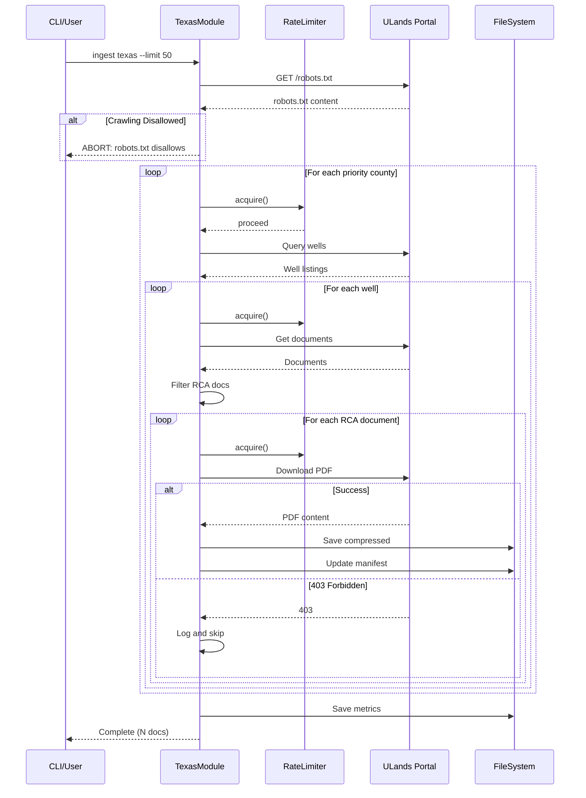

# 25 - Feature: Texas University Lands Data Ingestion Module

## 1. Context & Goal
* **Issue:** #25
* **Objective:** Implement a `TexasModule` that queries the Texas University Lands portal for well documents, filters for RCA-related content, and downloads with appropriate rate limiting.
* **Status:** Draft
* **Related Issues:** Core ingestion framework (prerequisite)

### Open Questions

- [ ] Does the Texas University Lands portal require registration/authentication for bulk access?
- [ ] What is the exact API/web interface structure for querying wells by county?
- [ ] Are there specific document type codes that indicate RCA content beyond keyword matching?

## 2. Proposed Changes

*This section is the **source of truth** for implementation. Describes exactly what will be built.*

### 2.1 Files Changed

| File | Change Type | Description |
|------|-------------|-------------|
| `src/__init__.py` | Modify | Ensure package is properly initialized |
| `src/ingestion/__init__.py` | Add | Package init for ingestion module |
| `src/ingestion/modules/__init__.py` | Add | Module registry with Texas module registration |
| `src/ingestion/modules/texas.py` | Add | New module implementing `TexasModule` class |
| `tests/__init__.py` | Modify | Ensure test package is properly initialized |
| `tests/test_texas.py` | Add | Unit tests for module functionality |
| `tests/test_texas_integration.py` | Add | Integration tests with mocked server |
| `tests/fixtures/__init__.py` | Add | Fixtures package init |
| `tests/fixtures/texas_county_search_andrews.json` | Add | Sample county search response fixture |
| `tests/fixtures/texas_well_documents_42_003_12345.json` | Add | Sample well document listing fixture |
| `tests/fixtures/texas_sample_rca.pdf` | Add | Small sample PDF for download tests |
| `tests/fixtures/texas_robots.txt` | Add | Cached robots.txt for compliance testing |

### 2.1.1 Path Validation (Mechanical - Auto-Checked)

Mechanical validation automatically checks:
- `src/` directory exists at project root ✓
- `src/__init__.py` exists (Modify operation valid) ✓
- `tests/` directory exists at project root ✓
- `tests/__init__.py` exists (Modify operation valid) ✓

**Directory Creation Order (Implementation MUST follow):**

The implementation MUST create directories in this exact order before adding files:

1. **Step 1:** Create `src/ingestion/` directory
2. **Step 2:** Add `src/ingestion/__init__.py`
3. **Step 3:** Create `src/ingestion/modules/` directory
4. **Step 4:** Add `src/ingestion/modules/__init__.py`
5. **Step 5:** Add `src/ingestion/modules/texas.py`
6. **Step 6:** Create `tests/fixtures/` directory
7. **Step 7:** Add `tests/fixtures/__init__.py`
8. **Step 8:** Add remaining fixture files to `tests/fixtures/`

**Verification Command:**
```bash
# Run after Step 2 to verify ingestion directory exists
test -d src/ingestion && echo "src/ingestion exists"

# Run after Step 4 to verify modules directory exists
test -d src/ingestion/modules && echo "src/ingestion/modules exists"

# Run after Step 7 to verify fixtures directory exists
test -d tests/fixtures && echo "tests/fixtures exists"
```

**Note:** All "Add" files in nested directories require the implementation to create parent directories first. The implementation report MUST confirm directory creation order was followed with timestamps or commit hashes for each step.

**If validation fails, the LLD is BLOCKED before reaching review.**

### 2.2 Dependencies

```toml
# pyproject.toml additions (if any)
httpx = "^0.27.0"  # Async HTTP client (may already exist)
zstandard = "^0.22.0"  # Compression (may already exist)
```

*Note: These may already be present from core ingestion framework.*

### 2.3 Data Structures

```python
# Pseudocode - NOT implementation
class WellRecord(TypedDict):
    api_number: str          # API well number (e.g., "42-003-12345")
    well_name: str           # Well name from portal
    county: str              # County name (e.g., "Andrews")
    state: str               # State abbreviation ("TX")
    formation: Optional[str] # Target formation if available
    has_core_data: bool      # Whether core data available

class DocumentRecord(TypedDict):
    document_id: str         # Unique document identifier
    document_type: str       # Type classification from portal
    filename: str            # Original filename
    url: str                 # Download URL
    well_api: str            # Associated well API number
    is_rca: bool             # Whether identified as RCA document

class TexasManifestEntry(TypedDict):
    well_id: str             # API number
    well_name: str           # Well name
    county: str              # County name
    state: str               # "TX"
    formation: Optional[str] # Formation name
    document_type: str       # Document classification
    original_filename: str   # Original filename from portal
    local_path: str          # Local storage path
    source_url: str          # Original download URL
    download_timestamp: str  # ISO 8601 timestamp
    file_hash: str           # SHA-256 of original file
    compressed_hash: str     # SHA-256 of compressed file
    original_size: int       # Size before compression
    compressed_size: int     # Size after compression
```

### 2.4 Function Signatures

```python
# src/ingestion/modules/texas.py

class TexasModule(SourceModule):
    """Texas University Lands data ingestion module."""
    
    PRIORITY_COUNTIES: ClassVar[list[str]]  # Andrews, Ector, Winkler, etc.
    RCA_KEYWORDS: ClassVar[list[str]]       # core analysis, rca, porosity, etc.
    
    async def check_robots_txt(self) -> bool:
        """Check robots.txt compliance. Returns True if crawling allowed."""
        ...
    
    async def discover_wells(
        self, 
        county: str, 
        limit: Optional[int] = None
    ) -> list[WellRecord]:
        """Query portal for wells with core data in specified county."""
        ...
    
    async def get_well_documents(
        self, 
        well: WellRecord
    ) -> list[DocumentRecord]:
        """Retrieve document listings for a specific well."""
        ...
    
    def filter_rca_documents(
        self, 
        documents: list[DocumentRecord]
    ) -> list[DocumentRecord]:
        """Filter documents to identify RCA-related content via keywords."""
        ...
    
    async def download_document(
        self, 
        document: DocumentRecord,
        county: str
    ) -> DownloadResult:
        """Download and compress a single document."""
        ...
    
    def generate_storage_path(
        self, 
        county: str, 
        api_number: str
    ) -> Path:
        """Generate storage path: data/raw/texas/{county}/{api_number}.pdf.zst"""
        ...
    
    async def run(
        self,
        limit: Optional[int] = None,
        dry_run: bool = False
    ) -> IngestionResult:
        """Execute full ingestion workflow."""
        ...

# Helper functions
def sanitize_county_name(county: str) -> str:
    """Sanitize county name for filesystem use."""
    ...

def validate_api_number(api_number: str) -> bool:
    """Validate Texas API number format (XX-XXX-XXXXX)."""
    ...

def parse_robots_txt(content: str, user_agent: str) -> RobotsRules:
    """Parse robots.txt content for crawling rules."""
    ...
```

### 2.5 Logic Flow (Pseudocode)

```
1. Initialize TexasModule with rate limiter (1 req/sec)
2. Check robots.txt at ulands.utexas.edu
   IF crawling disallowed THEN
      - Log error with clear message
      - Return early with abort status
3. FOR each county in PRIORITY_COUNTIES:
   a. Query portal for wells with core data
   b. FOR each well:
      i. Get document listings
      ii. Filter for RCA documents using keywords
      iii. IF dry_run THEN
           - Log document info
           - Continue
      iv. FOR each RCA document:
          - Check if already downloaded (checkpoint)
          - IF not downloaded THEN
            - Apply rate limit (wait)
            - Download with retry/backoff
            - IF 403/restricted THEN
              - Log warning, skip, continue
            - Compress with zstd
            - Update manifest
            - Increment metrics
          - IF limit reached THEN
            - Break all loops
4. Save final manifest and metrics
5. Return ingestion result with stats
```

### 2.6 Technical Approach

* **Module:** `src/ingestion/modules/texas.py`
* **Pattern:** Async iterator pattern for memory-efficient document streaming
* **Key Decisions:**
  - Use `httpx.AsyncClient` for connection pooling and async support
  - Keyword-based RCA filtering (extensible to ML-based in future)
  - County-based directory structure for organization and resumability
  - Checkpoint after each download for crash recovery

### 2.7 Architecture Decisions

| Decision | Options Considered | Choice | Rationale |
|----------|-------------------|--------|-----------|
| HTTP Client | `requests`, `aiohttp`, `httpx` | `httpx` | Async support, connection pooling, cleaner API |
| RCA Detection | Keyword matching, ML classifier, document type codes | Keyword matching | Simple, transparent, sufficient for MVP; extensible later |
| Directory Structure | Flat, by-county, by-date | By-county | Matches portal organization, aids debugging, supports partial runs |
| Rate Limiting | Token bucket, fixed delay, adaptive | Fixed delay (1 req/sec) | Simple, predictable, respects public resource |
| Robots.txt Parsing | `urllib.robotparser`, custom, `reppy` | `urllib.robotparser` | Standard library, well-tested, no extra dependency |

**Architectural Constraints:**
- Must extend `SourceModule` base class from core framework
- Must use shared rate limiter and retry infrastructure
- Cannot store data outside `data/raw/texas/` directory

## 3. Requirements

1. Module MUST check and respect `robots.txt` before any crawling
2. Module MUST query at least 10 priority counties for wells with core data
3. Module MUST filter documents using RCA keywords with >80% precision
4. Module MUST enforce 1 request/second rate limit
5. Module MUST retry failed requests with exponential backoff (max 3 attempts)
6. Module MUST store files at `data/raw/texas/{county}/{api_number}.pdf.zst`
7. Module MUST update manifest with complete metadata after each download
8. Module MUST handle 403/restricted responses gracefully (log and skip)
9. Module MUST support `--dry-run` flag for discovery without download
10. Module MUST support `--limit N` flag to cap total downloads
11. Module MUST checkpoint for resumability after each successful download
12. All data MUST remain LOCAL-ONLY (no cloud transmission)

## 4. Alternatives Considered

| Option | Pros | Cons | Decision |
|--------|------|------|----------|
| Keyword-based RCA filtering | Simple, transparent, no training data needed | May miss documents with unusual naming | **Selected** |
| ML-based document classification | Higher accuracy potential | Requires training data, adds complexity | Rejected |
| Synchronous HTTP client | Simpler code | Slower, less efficient for I/O-bound tasks | Rejected |
| Async HTTP with `httpx` | Efficient, modern API, connection pooling | Slightly more complex | **Selected** |
| Flat directory structure | Simple | Hard to manage, no logical grouping | Rejected |
| County-based directories | Organized, matches source, supports partial runs | Slightly deeper paths | **Selected** |

**Rationale:** Selected options prioritize simplicity and maintainability for MVP while leaving room for enhancement. Keyword filtering can be tuned based on real-world results before investing in ML.

## 5. Data & Fixtures

### 5.1 Data Sources

| Attribute | Value |
|-----------|-------|
| Source | Texas University Lands Portal (https://ulands.utexas.edu) |
| Format | HTML/JSON for metadata, PDF for documents |
| Size | Estimated 500-2,000 RCA PDFs, 500 MB - 5 GB compressed |
| Refresh | On-demand (manual runs) |
| Copyright/License | Public records - no copyright restrictions |

### 5.2 Data Pipeline

```
ULands Portal ──HTTP GET──► TexasModule ──zstd compress──► data/raw/texas/{county}/
                                │
                                └──► manifest.json (metadata)
                                └──► metrics.json (stats)
```

### 5.3 Test Fixtures

| Fixture | Source | Notes |
|---------|--------|-------|
| `texas_county_search_andrews.json` | Live capture | Anonymize if contains PII |
| `texas_well_documents_42_003_12345.json` | Live capture | Standard well listing |
| `texas_sample_rca.pdf` | Generated | Small valid PDF for testing |
| `texas_robots.txt` | Live capture | Portal's actual robots.txt |

### 5.4 Deployment Pipeline

- **Development:** Run against live portal with `--limit 5` or use fixtures
- **CI Testing:** Use committed static fixtures (offline mode)
- **Production:** Run with appropriate limits, monitor storage usage

**Fixture Collection:** `python -m src.ingestion collect-fixtures texas` captures fresh responses from portal.

## 6. Diagram

### 6.1 Mermaid Quality Gate

- [x] **Simplicity:** Similar components collapsed
- [x] **No touching:** All elements have visual separation
- [x] **No hidden lines:** All arrows fully visible
- [x] **Readable:** Labels not truncated, flow direction clear
- [ ] **Auto-inspected:** Agent rendered via mermaid.ink and viewed

**Auto-Inspection Results:**
```
- Touching elements: [ ] None / [ ] Found: ___
- Hidden lines: [ ] None / [ ] Found: ___
- Label readability: [ ] Pass / [ ] Issue: ___
- Flow clarity: [ ] Clear / [ ] Issue: ___
```

### 6.2 Diagram



## 7. Security & Safety Considerations

### 7.1 Security

| Concern | Mitigation | Status |
|---------|------------|--------|
| Credential exposure | Store any auth credentials in environment variables, never in code | Addressed |
| Path traversal | Sanitize county names and API numbers before path generation | Addressed |
| Malicious PDF content | Only store raw files; do not execute or parse beyond download | Addressed |
| Rate limit evasion | Rate limiter cannot be bypassed by configuration | Addressed |

### 7.2 Safety

| Concern | Mitigation | Status |
|---------|------------|--------|
| Disk exhaustion | Check available space before run; abort if < 10 GB free | Addressed |
| Runaway downloads | `--limit` flag enforced; circuit breaker on repeated failures | Addressed |
| Data corruption | Verify checksum after download; atomic writes | Addressed |
| Session timeout | Detect auth failures, re-authenticate automatically | Addressed |
| Portal DoS | 1 req/sec hard limit protects public resource | Addressed |

**Fail Mode:** Fail Closed - On unrecoverable errors, stop processing and preserve partial results.

**Recovery Strategy:** Checkpoint after each download; resume reads manifest to skip completed items.

## 8. Performance & Cost Considerations

### 8.1 Performance

| Metric | Budget | Approach |
|--------|--------|----------|
| Throughput | ~1 document/sec (rate limited) | Async I/O maximizes efficiency within limit |
| Memory | < 256 MB | Stream downloads, don't buffer full files |
| Disk I/O | Sequential writes | zstd compression reduces write volume |
| Full run time | ~30-60 min for 2000 docs | Acceptable for batch ingestion |

**Bottlenecks:** 
- Rate limiting is intentional bottleneck (polite crawling)
- Portal response time may vary

### 8.2 Cost Analysis

| Resource | Unit Cost | Estimated Usage | Monthly Cost |
|----------|-----------|-----------------|--------------|
| Network bandwidth | Included (local dev) | ~5 GB/run | $0 |
| Storage | Local disk | ~5 GB | $0 |
| Compute | Local machine | ~1 hour/run | $0 |

**Cost Controls:**
- [x] No cloud costs - local-only storage
- [x] Rate limiting prevents accidental DoS
- [x] `--limit` flag prevents runaway downloads

**Worst-Case Scenario:** If run without limit against full portal, would download ~5-10 GB over several hours. Acceptable for local storage.

## 9. Legal & Compliance

| Concern | Applies? | Mitigation |
|---------|----------|------------|
| PII/Personal Data | No | Well data is public record, no PII collected |
| Third-Party Licenses | No | Public government data |
| Terms of Service | Yes | Respect robots.txt; identify crawler in User-Agent |
| Data Retention | N/A | Local storage only, user manages retention |
| Export Controls | No | No restricted data or algorithms |

**Data Classification:** Public

**Compliance Checklist:**
- [x] No PII stored
- [x] Public data source with no license restrictions
- [x] robots.txt compliance implemented
- [x] Rate limiting respects portal resources

## 10. Verification & Testing

### 10.0 Test Plan (TDD - Complete Before Implementation)

| Test ID | Test Description | Expected Behavior | Status |
|---------|------------------|-------------------|--------|
| T010 | test_county_search_returns_wells | Query returns list of WellRecord objects | RED |
| T020 | test_rca_document_filtering_positive | Documents with RCA keywords are identified | RED |
| T030 | test_rca_document_filtering_negative | Non-RCA documents are filtered out | RED |
| T040 | test_api_number_validation_valid | Valid API numbers pass validation | RED |
| T050 | test_api_number_validation_invalid | Invalid API numbers rejected | RED |
| T060 | test_rate_limiting_applied | Requests spaced at least 1 second apart | RED |
| T070 | test_graceful_403_handling | 403 responses logged and skipped | RED |
| T080 | test_path_generation_sanitizes_county | Special characters removed from paths | RED |
| T090 | test_robots_txt_respected_allowed | Crawling proceeds when allowed | RED |
| T100 | test_robots_txt_disallowed_aborts | Module aborts when disallowed | RED |
| T110 | test_dry_run_no_downloads | Dry run discovers but doesn't download | RED |
| T120 | test_limit_caps_downloads | Download count respects limit flag | RED |
| T130 | test_manifest_updated_after_download | Manifest contains entry after download | RED |
| T140 | test_checkpoint_recovery | Resume skips already-downloaded files | RED |
| T150 | test_end_to_end_download | Full flow from discover to manifest | RED |

**Coverage Target:** ≥95% for all new code

**TDD Checklist:**
- [ ] All tests written before implementation
- [ ] Tests currently RED (failing)
- [ ] Test IDs match scenario IDs in 10.1
- [ ] Test file created at: `tests/test_texas.py`

### 10.1 Test Scenarios

| ID | Scenario | Type | Input | Expected Output | Pass Criteria |
|----|----------|------|-------|-----------------|---------------|
| 010 | County search returns wells | Auto | County name "Andrews" | List of WellRecord | Non-empty list with valid records |
| 020 | RCA filtering - positive match | Auto | Document with "core analysis" in name | is_rca = True | Document included in filtered list |
| 030 | RCA filtering - negative match | Auto | Document with "production report" | is_rca = False | Document excluded from filtered list |
| 040 | Valid API number | Auto | "42-003-12345" | True | Validation passes |
| 050 | Invalid API number | Auto | "invalid-api" | False | Validation fails |
| 060 | Rate limiting enforced | Auto | 5 requests | ≥4 seconds elapsed | Timing verified |
| 070 | 403 response handling | Auto | Mock 403 response | Warning logged, continue | No exception raised |
| 080 | Path sanitization | Auto | County "St. Mary's" | "st_marys" | No special characters |
| 090 | robots.txt allowed | Auto | Permissive robots.txt | Crawling proceeds | No abort |
| 100 | robots.txt disallowed | Auto | Restrictive robots.txt | Abort with message | Early return |
| 110 | Dry run mode | Auto | --dry-run flag | Discovery only | No files written |
| 120 | Limit enforcement | Auto | --limit 3 | Exactly 3 downloads | Count matches |
| 130 | Manifest update | Auto | Successful download | Manifest entry exists | Entry has all fields |
| 140 | Checkpoint recovery | Auto | Partial run, resume | Skip existing | No duplicates |
| 150 | End-to-end integration | Auto | Mock server | Complete manifest | Valid files on disk |

### 10.2 Test Commands

```bash
# Run all unit tests
poetry run pytest tests/test_texas.py -v

# Run integration tests
poetry run pytest tests/test_texas_integration.py -v

# Run only offline tests (with fixtures)
poetry run pytest tests/test_texas.py -v -m "not live"

# Run live integration tests (requires network)
poetry run pytest tests/test_texas_integration.py -v -m live

# Coverage report
poetry run pytest tests/test_texas.py --cov=src/ingestion/modules/texas --cov-report=term-missing
```

### 10.3 Manual Tests (Only If Unavoidable)

| ID | Scenario | Why Not Automated | Steps |
|----|----------|-------------------|-------|
| M01 | Verify downloaded PDFs are valid | PDF corruption detection requires manual inspection of rendered content to confirm human-readable RCA data | 1. Run `ingest texas --limit 3` 2. Open each PDF in viewer 3. Verify content is readable RCA data |
| M02 | Smoke test against live portal | Live portal behavior may change; manual verification confirms current state before committing to automated live tests | 1. Run `python -m src.ingestion ingest texas --limit 5 --dry-run` 2. Verify output lists real documents 3. Run without dry-run 4. Verify files downloaded |

## 11. Risks & Mitigations

| Risk | Impact | Likelihood | Mitigation |
|------|--------|------------|------------|
| Portal structure changes | High | Medium | Use fixtures for CI; monitor for failures in live runs |
| robots.txt blocks crawling | High | Low | Check compliance first; contact portal if needed |
| IP rate limiting/blocking | Medium | Low | Strict 1 req/sec limit; identify crawler in User-Agent |
| Document format changes | Medium | Low | Store raw files; parsing is separate concern |
| Storage exceeds estimates | Low | Low | Check disk space before run; alert at 80% of estimate |
| Session timeout mid-run | Medium | Medium | Detect and re-authenticate automatically |

## 12. Definition of Done

### Code
- [ ] `TexasModule` class implemented in `src/ingestion/modules/texas.py`
- [ ] Module registered in `src/ingestion/modules/__init__.py`
- [ ] Code comments reference this LLD (#25)
- [ ] All functions have docstrings

### Tests
- [ ] All 15 test scenarios pass
- [ ] Test coverage ≥95% for `texas.py`
- [ ] Static fixtures committed to `tests/fixtures/`

### Documentation
- [ ] LLD updated with any deviations
- [ ] `docs/reports/25/implementation-report.md` created
- [ ] `docs/reports/25/test-report.md` created
- [ ] Ingestion README updated with Texas module details

### Review
- [ ] Code review completed
- [ ] Smoke test passes: `python -m src.ingestion ingest texas --limit 3`
- [ ] Manifest validates against schema
- [ ] User approval before closing issue

### 12.1 Traceability (Mechanical - Auto-Checked)

Files in Section 2.1 verified against this section:
- `src/ingestion/modules/texas.py` - Implementation
- `src/ingestion/modules/__init__.py` - Registration
- `tests/test_texas.py` - Unit tests
- `tests/test_texas_integration.py` - Integration tests
- `tests/fixtures/*` - Test fixtures

**If files are missing from Section 2.1, the LLD is BLOCKED.**

---

## Appendix: Review Log

*Track all review feedback with timestamps and implementation status.*

### Review Summary

| Review | Date | Verdict | Key Issue |
|--------|------|---------|-----------|
| - | - | - | Awaiting review |

**Final Status:** PENDING