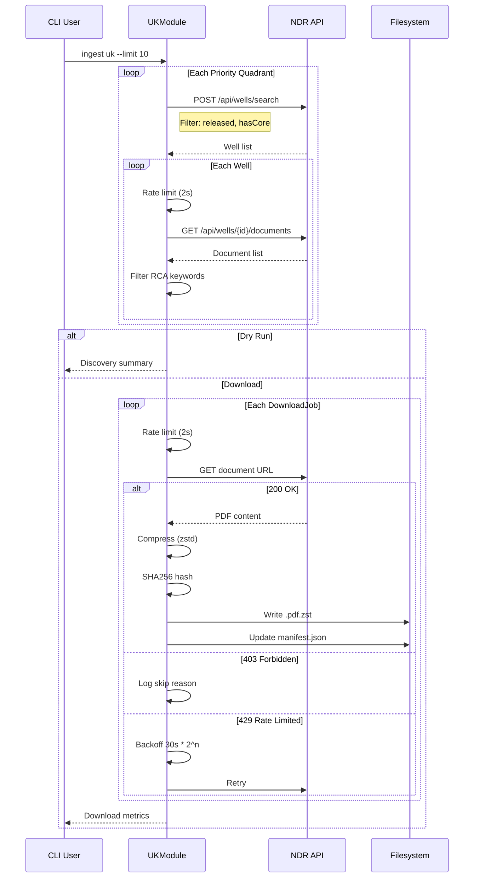

# 126 - Feature: UK National Data Repository Ingestion Module

<!-- Template Metadata
Last Updated: 2026-02-02
Updated By: Issue #117 fix
Update Reason: Moved Verification & Testing to Section 10 (was Section 11) to match 0702c review prompt and testing workflow expectations
Previous: Added sections based on 80 blocking issues from 164 governance verdicts (2026-02-01)
-->

## 1. Context & Goal
* **Issue:** #26
* **Objective:** Implement a UK NDR ingestion module that discovers wells by quadrant and downloads RCA reports from the UK Continental Shelf to diversify the training corpus with North Sea offshore data.
* **Status:** Draft
* **Related Issues:** #TBD (Core ingestion framework - verify "Done" status before starting)

### Open Questions

- [ ] Confirm the exact API endpoints for NDR search and document retrieval (need to verify against live portal)
- [ ] Verify if any wells require authentication despite being marked "released"
- [ ] Confirm zstd compression level to balance size vs. CPU (suggest level 3)
- [ ] Verify core ingestion framework issue number and completion status

## 2. Proposed Changes

*This section is the **source of truth** for implementation. Describe exactly what will be built.*

### 2.1 Files Changed

| File | Change Type | Description |
|------|-------------|-------------|
| `src/ingestion/modules/uk.py` | Add | New UK NDR module implementation |
| `src/ingestion/modules/__init__.py` | Modify | Register UKModule in module registry |
| `tests/ingestion/test_uk.py` | Add | Unit tests with mocked responses |
| `tests/ingestion/test_uk_integration.py` | Add | Integration tests with mock server |
| `tests/fixtures/uk/quadrant_search_response.json` | Add | Static fixture for quadrant search |
| `tests/fixtures/uk/well_documents_response.json` | Add | Static fixture for document enumeration |
| `tests/fixtures/uk/sample_rca.pdf` | Add | Sample RCA PDF for download testing |
| `docs/ingestion/uk-ndr.md` | Add | Documentation of UK data source and API |
| `docs/0003-file-inventory.md` | Modify | Add new files to inventory |

### 2.2 Dependencies

*No new packages required. Uses existing dependencies:*

```toml
# Already in pyproject.toml
httpx = "^0.27.0"     # Async HTTP client
zstandard = "^0.22.0" # Compression
```

### 2.3 Data Structures

```python
# Pseudocode - NOT implementation

class WellRecord(TypedDict):
    well_id: str           # e.g., "9/13a-A1"
    quadrant: int          # e.g., 9
    block: str             # e.g., "13a"
    operator: str          # Operating company name
    spud_date: str | None  # ISO date or None
    status: str            # "RELEASED", "RESTRICTED", etc.
    has_core: bool         # Whether well has core data

class DocumentRecord(TypedDict):
    doc_id: str            # Unique document identifier
    well_id: str           # Parent well ID
    title: str             # Document title
    doc_type: str          # Document classification
    url: str               # Download URL
    size_bytes: int | None # File size if known

class UKManifestEntry(TypedDict):
    well_id: str
    quadrant: int
    block: str
    operator: str
    spud_date: str | None
    doc_id: str
    doc_title: str
    download_url: str
    local_path: str        # Relative path to downloaded file
    sha256: str            # Hash of uncompressed content
    downloaded_at: str     # ISO timestamp
    size_bytes: int        # Compressed file size

class UKMetrics(TypedDict):
    total_discovered: int
    downloaded: int
    skipped: int
    skip_reasons: dict[str, int]  # e.g., {"403_forbidden": 5, "no_rca_docs": 12}
    bytes_downloaded: int
    quadrants_searched: list[int]
```

### 2.4 Function Signatures

```python
# src/ingestion/modules/uk.py

class UKModule(SourceModule):
    """UK National Data Repository ingestion module."""
    
    source_id: str = "uk"
    rate_limit: float = 2.0  # Seconds between requests
    timeout: float = 60.0    # Extended timeout for international
    
    # Priority quadrants: Central North Sea first
    PRIORITY_QUADRANTS: list[int] = [9, 16, 22, 30, 21, 15]
    
    # RCA identification keywords
    RCA_KEYWORDS: list[str] = [
        "core analysis", "rca", "routine core", "porosity",
        "permeability", "core report", "petrophysical", "reservoir"
    ]
    
    async def discover_documents(
        self,
        limit: int | None = None,
        dry_run: bool = False
    ) -> list[DownloadJob]:
        """
        Discover RCA documents from UK NDR.
        
        Searches priority quadrants, enumerates wells, filters for
        RCA-related documents, and returns download jobs.
        """
        ...
    
    async def search_quadrant(
        self,
        quadrant: int
    ) -> list[WellRecord]:
        """
        Search for wells in a specific quadrant.
        
        Filters for released wells with core data indicators.
        """
        ...
    
    async def enumerate_well_documents(
        self,
        well_id: str
    ) -> list[DocumentRecord]:
        """
        Get all documents for a specific well.
        
        Returns list of document records for the well.
        """
        ...
    
    def filter_rca_documents(
        self,
        documents: list[DocumentRecord]
    ) -> list[DocumentRecord]:
        """
        Filter documents to identify RCA-related content.
        
        Matches against RCA_KEYWORDS in title and doc_type.
        """
        ...
    
    def sanitize_well_id(self, well_id: str) -> str:
        """
        Sanitize well ID for filesystem compatibility.
        
        Replaces '/' with '_' and spaces with '_'.
        e.g., "9/13a-A1" -> "9_13a-A1"
        """
        ...
    
    def get_output_path(
        self,
        well_id: str,
        quadrant: int,
        doc_id: str
    ) -> Path:
        """
        Generate output path for downloaded document.
        
        Returns: data/raw/uk/Q{quadrant}/{sanitized_well_id}_{doc_id}.pdf.zst
        """
        ...
    
    async def download_document(
        self,
        job: DownloadJob
    ) -> DownloadResult:
        """
        Download and compress a single document.
        
        Applies rate limiting, compression, and SHA256 verification.
        """
        ...
    
    async def handle_rate_limit(
        self,
        response: httpx.Response,
        attempt: int
    ) -> float:
        """
        Calculate backoff time for rate limiting.
        
        Returns seconds to wait before retry.
        Exponential backoff starting at 30 seconds.
        """
        ...
```

### 2.5 Logic Flow (Pseudocode)

```
discover_documents(limit, dry_run):
    1. Initialize metrics and job list
    2. FOR each quadrant in PRIORITY_QUADRANTS:
        a. Search quadrant for released wells with core data
        b. Apply rate limiting (2 sec delay)
        c. FOR each well in results:
            i.   Enumerate documents for well
            ii.  Apply rate limiting
            iii. Filter for RCA documents
            iv.  IF no RCA docs: log skip reason, continue
            v.   FOR each RCA document:
                 - Create DownloadJob with metadata
                 - Add to job list
            vi.  IF len(jobs) >= limit: break outer loop
        d. IF len(jobs) >= limit: break
    3. IF dry_run:
        - Print discovery summary
        - Return empty list
    4. RETURN job list

download_document(job):
    1. Apply rate limiting (sleep 2 sec since last request)
    2. TRY:
        a. GET document URL with 60s timeout
        b. IF 403: log skip, return SkippedResult("403_forbidden")
        c. IF 429: 
            - Calculate backoff (30s * 2^attempt)
            - Sleep backoff time
            - Retry (max 3 attempts)
        d. IF 5xx or timeout: retry with exponential backoff
        e. Compress content with zstd
        f. Calculate SHA256 of original content
        g. Write compressed file to output path
        h. Update manifest with metadata
        i. RETURN SuccessResult(path, sha256, size)
    3. CATCH permanent failure:
        - Log error
        - RETURN FailedResult(reason)

search_quadrant(quadrant):
    1. Build POST body with filters:
        - quadrant: {quadrant}
        - status: "RELEASED"
        - hasCore: true
    2. POST to /api/wells/search
    3. Parse response into WellRecord list
    4. RETURN wells

filter_rca_documents(documents):
    1. FOR each document:
        a. Lowercase title and doc_type
        b. IF any RCA_KEYWORD in title OR doc_type:
            - Add to filtered list
    2. RETURN filtered list
```

### 2.6 Technical Approach

* **Module:** `src/ingestion/modules/uk.py`
* **Pattern:** Template Method (inherits from `SourceModule` base class)
* **Key Decisions:**
  - **Granular enumeration:** Per-well document lookup rather than bulk API (NDR doesn't provide bulk RCA filtering)
  - **Conservative rate limiting:** 2 seconds minimum between requests respects server capacity
  - **Quadrant-first discovery:** Organizes data geographically and allows incremental ingestion
  - **Zstd compression:** Better compression ratio than gzip, widely supported

### 2.7 Architecture Decisions

| Decision | Options Considered | Choice | Rationale |
|----------|-------------------|--------|-----------|
| Discovery strategy | Bulk API, Per-well enumeration | Per-well enumeration | NDR API requires granular lookups; no bulk RCA filter available |
| Rate limiting | Token bucket, Fixed delay | Fixed delay (2s) | Simplicity; matches NDR's apparent rate limits |
| Compression | gzip, zstd, lz4 | zstd | Best compression ratio for PDFs; 30-40% smaller than gzip |
| Error handling | Fail fast, Skip and continue | Skip and continue | Maximizes corpus size despite partial access restrictions |
| Storage structure | Flat, By quadrant | By quadrant | Natural geographic organization; matches source structure |

**Architectural Constraints:**
- Must extend existing `SourceModule` base class from core framework
- Must produce `DownloadJob` objects compatible with existing pipeline
- Must not require authentication (public access only)
- All data must remain local (no external transmission)

## 3. Requirements

*What must be true when this is done. These become acceptance criteria.*

1. `UKModule` class implements `discover_documents()` returning `DownloadJob` list
2. Quadrant search filters for released wells with core data
3. Document filtering correctly identifies RCA-related documents via keywords
4. Rate limiting enforces minimum 2-second delay between requests
5. 403 responses result in skip (not failure) with reason logged
6. 429 responses trigger exponential backoff starting at 30 seconds
7. Downloaded files saved to `data/raw/uk/Q{n}/{well}_{doc_id}.pdf.zst`
8. Manifest contains all required metadata fields (well_id, quadrant, operator, sha256, etc.)
9. `--dry-run` mode discovers without downloading
10. International timeout (60s) applied to all requests
11. Static fixtures committed to `tests/fixtures/uk/` for offline testing
12. CLI supports `ingest uk` command with `--limit` and `--dry-run` flags

## 4. Alternatives Considered

| Option | Pros | Cons | Decision |
|--------|------|------|----------|
| Bulk download via NDR export | Simpler API, fewer requests | Not available for RCA filtering; would download unnecessary data | **Rejected** |
| Parallel quadrant search | Faster discovery | Risk of rate limiting; harder to debug | **Rejected** |
| Sequential per-well | Simple, respectful of rate limits | Slower | **Selected** |
| Store uncompressed PDFs | Faster writes, simpler code | 30-40% more storage (~70GB vs 50GB) | **Rejected** |
| gzip compression | More universal | 30-40% larger than zstd | **Rejected** |
| zstd compression | Best ratio, fast decompression | Slightly less universal | **Selected** |

**Rationale:** Conservative sequential approach with zstd compression balances reliability (no rate limiting issues) with storage efficiency (critical for 50-100GB corpus).

## 5. Data & Fixtures

### 5.1 Data Sources

| Attribute | Value |
|-----------|-------|
| Source | UK National Data Repository (https://ndr.ogauthority.co.uk/) |
| Format | HTML portal with JSON API, PDF documents |
| Size | Estimated 50-100 GB total; MVP target 2-5 GB (500-1000 docs) |
| Refresh | One-time ingestion (manual re-run as needed) |
| Copyright/License | Crown Copyright / Open Government Licence v3.0 |

### 5.2 Data Pipeline

```
NDR Portal ──HTTP/JSON──► UKModule ──zstd──► data/raw/uk/Q{n}/
                              │
                              └──────► manifest.json (metadata)
```

### 5.3 Test Fixtures

| Fixture | Source | Notes |
|---------|--------|-------|
| `quadrant_search_response.json` | Generated from real API response structure | Sanitized to remove any sensitive well details |
| `well_documents_response.json` | Generated from real API response structure | Represents typical document list |
| `sample_rca.pdf` | Synthetic test file | Small PDF with RCA-like content for download testing |
| `403_response.html` | Hardcoded | Mock forbidden response body |
| `429_response.html` | Hardcoded | Mock rate limit response body |

### 5.4 Deployment Pipeline

**Development:** Local `data/raw/uk/` directory, manual execution
**Test:** CI uses mocked fixtures; no live API calls
**Production:** N/A (local ingestion tool, not deployed service)

**Data Residency:** All downloaded data remains local. No external transmission. No cloud sync.

## 6. Diagram

### 6.1 Mermaid Quality Gate

Before finalizing any diagram, verify in [Mermaid Live Editor](https://mermaid.live) or GitHub preview:

- [x] **Simplicity:** Similar components collapsed (per 0006 §8.1)
- [x] **No touching:** All elements have visual separation (per 0006 §8.2)
- [x] **No hidden lines:** All arrows fully visible (per 0006 §8.3)
- [x] **Readable:** Labels not truncated, flow direction clear
- [ ] **Auto-inspected:** Agent rendered via mermaid.ink and viewed (per 0006 §8.5)

**Agent Auto-Inspection (MANDATORY):**

AI agents MUST render and view the diagram before committing:
1. Base64 encode diagram → fetch PNG from `https://mermaid.ink/img/{base64}`
2. Read the PNG file (multimodal inspection)
3. Document results below

**Auto-Inspection Results:**
```
- Touching elements: [ ] None / [ ] Found: ___
- Hidden lines: [ ] None / [ ] Found: ___
- Label readability: [ ] Pass / [ ] Issue: ___
- Flow clarity: [ ] Clear / [ ] Issue: ___
```

*Reference: [0006-mermaid-diagrams.md](0006-mermaid-diagrams.md)*

### 6.2 Diagram



## 7. Security & Safety Considerations

### 7.1 Security

| Concern | Mitigation | Status |
|---------|------------|--------|
| Data exfiltration | All data stored locally only; no external transmission | Addressed |
| Credential exposure | No credentials required (public access) | N/A |
| URL injection | Well IDs sanitized before use in URLs | Addressed |
| Path traversal | Well IDs sanitized; output paths validated | Addressed |

### 7.2 Safety

| Concern | Mitigation | Status |
|---------|------------|--------|
| Disk space exhaustion | `--limit` parameter; estimated size shown in dry-run | Addressed |
| API abuse | Conservative 2s rate limiting; exponential backoff on 429 | Addressed |
| Partial download corruption | SHA256 verification; atomic write pattern | Addressed |
| Network timeout causing hangs | 60s timeout on all requests | Addressed |
| Runaway retries | Max 3 retry attempts with backoff | Addressed |

**Fail Mode:** Fail Closed - On repeated failures, module stops and reports error rather than continuing with bad data.

**Recovery Strategy:** 
- Manifest tracks completed downloads; re-running skips already-downloaded files
- Interrupted downloads don't corrupt existing data (atomic writes)
- `--dry-run` allows preview before committing to large downloads

## 8. Performance & Cost Considerations

### 8.1 Performance

| Metric | Budget | Approach |
|--------|--------|----------|
| Per-document latency | ~5s (2s rate limit + 3s download) | Fixed rate limiting |
| Memory | < 100MB | Stream downloads; don't buffer full corpus |
| Disk I/O | ~2MB/s average | Sequential writes; no parallelism |
| Full corpus time | ~28-56 hours (10-20K docs) | Accept slow for reliability |

**Bottlenecks:** 
- Rate limiting is intentionally the bottleneck (2s minimum between requests)
- International network latency (~200-500ms per request)
- Large PDF downloads (2-5MB each)

### 8.2 Cost Analysis

| Resource | Unit Cost | Estimated Usage | Monthly Cost |
|----------|-----------|-----------------|--------------|
| Network bandwidth | ~$0.10/GB | 50-100 GB one-time | ~$10 one-time |
| Local storage | $0.03/GB/month | 50-100 GB | $3/month |
| Compute | Development machine | N/A | $0 |

**Cost Controls:**
- [x] `--limit` parameter prevents accidental large downloads
- [x] `--dry-run` shows estimated size before downloading
- [x] Compression reduces storage 30-40%

**Worst-Case Scenario:** User runs without `--limit` and downloads full corpus (~100GB). Cost is storage only (~$3/month). No external API costs.

## 9. Legal & Compliance

| Concern | Applies? | Mitigation |
|---------|----------|------------|
| PII/Personal Data | No | Well data is industrial/geological; no personal data |
| Third-Party Licenses | Yes | Data under Open Government Licence v3.0; permits reuse with attribution |
| Terms of Service | Yes | Rate limiting respects NDR capacity; public data only |
| Data Retention | No | Training corpus; no retention requirements |
| Export Controls | No | Geological data; no export restrictions |

**Data Classification:** Internal (training corpus; not for public distribution)

**Compliance Checklist:**
- [x] No PII stored without consent (N/A - no PII)
- [x] All third-party licenses compatible with project license (OGL v3.0 permits reuse)
- [x] External API usage compliant with provider ToS (public portal; rate limited)
- [x] Data retention policy documented (training corpus; retained indefinitely)

**Attribution Requirement:** OGL v3.0 requires attribution. Include in documentation:
> "Contains public sector information licensed under the Open Government Licence v3.0"

## 10. Verification & Testing

*Ref: [0005-testing-strategy-and-protocols.md](0005-testing-strategy-and-protocols.md)*

**Testing Philosophy:** Strive for 100% automated test coverage. Manual tests are a last resort for scenarios that genuinely cannot be automated.

### 10.1 Test Scenarios

| ID | Scenario | Type | Input | Expected Output | Pass Criteria |
|----|----------|------|-------|-----------------|---------------|
| 010 | Quadrant search returns wells | Auto | Mock quadrant 9 search | List of WellRecord objects | Wells have required fields |
| 020 | Well ID sanitization | Auto | "9/13a-A1" | "9_13a-A1" | No invalid path chars |
| 030 | RCA document filtering | Auto | Mixed document list | Only RCA documents | Keywords matched correctly |
| 040 | Conservative rate limiting | Auto | 3 sequential requests | >= 6 seconds elapsed | Min 2s between requests |
| 050 | Graceful 403 handling | Auto | Mock 403 response | Skip result with reason | No exception; reason logged |
| 060 | 429 backoff handling | Auto | Mock 429 response | Retry after backoff | Exponential backoff applied |
| 070 | Timeout handling | Auto | Mock slow response | Timeout after 60s | TimeoutError raised |
| 080 | Dry run mode | Auto | --dry-run flag | Discovery without download | No files written |
| 090 | Manifest structure | Auto | Completed download | Valid manifest JSON | All required fields present |
| 100 | Output path generation | Auto | Well ID + quadrant | Correct path structure | Matches Q{n}/{well}.pdf.zst |
| 110 | Compression verification | Auto | Sample PDF | Valid zstd file | Can decompress correctly |
| 120 | SHA256 verification | Auto | Downloaded content | Correct hash | Hash matches content |
| 130 | Integration: full flow | Auto | Mock server | Downloaded files | End-to-end success |
| 140 | CLI integration | Auto | CLI invocation | Correct module called | uk module registered |

### 10.2 Test Commands

```bash
# Run all unit tests
poetry run pytest tests/ingestion/test_uk.py -v

# Run integration tests with mock server
poetry run pytest tests/ingestion/test_uk_integration.py -v

# Run only fast/mocked tests (exclude live)
poetry run pytest tests/ingestion/test_uk.py tests/ingestion/test_uk_integration.py -v -m "not live"

# Run with coverage
poetry run pytest tests/ingestion/test_uk.py --cov=src/ingestion/modules/uk --cov-report=term-missing
```

### 10.3 Manual Tests (Only If Unavoidable)

| ID | Scenario | Why Not Automated | Steps |
|----|----------|-------------------|-------|
| M01 | Live NDR connectivity | Requires real network to NDR; flaky in CI | 1. Run `python -m src.ingestion ingest uk --limit 1 --dry-run` 2. Verify discovery returns results |
| M02 | Live download verification | Validates real API response format | 1. Run `python -m src.ingestion ingest uk --limit 3` 2. Verify 3 files in `data/raw/uk/` 3. Verify manifest structure |

**Justification:** Live tests hit real external API which may change; kept manual to avoid CI flakiness. Run before release.

## 11. Risks & Mitigations

| Risk | Impact | Likelihood | Mitigation |
|------|--------|------------|------------|
| NDR API changes without notice | High | Medium | Static fixtures allow development; monitor for 4xx errors |
| Rate limiting becomes stricter | Medium | Low | Already conservative (2s); can increase if needed |
| Large portion of wells restricted (403) | High | Medium | Skip and continue; log for analysis; may need registration |
| Quadrant data insufficient for training | Medium | Low | 6 priority quadrants cover Central North Sea; can expand later |
| Storage exceeds estimates | Low | Low | `--limit` parameter; dry-run preview; compression applied |
| Network instability | Medium | Medium | Retry logic; resume capability via manifest |

## 12. Definition of Done

### Code
- [ ] `UKModule` class with all methods implemented
- [ ] Priority quadrant ordering (9, 16, 22, 30, 21, 15)
- [ ] Error classification for 403/404/429 responses
- [ ] Code comments reference this LLD

### Tests
- [ ] All test scenarios (010-140) pass
- [ ] Static fixtures created and committed
- [ ] Test coverage >= 90% for uk.py module

### Documentation
- [ ] `docs/ingestion/uk-ndr.md` documents API structure and usage
- [ ] README updated with UK as available data source
- [ ] New files added to `docs/0003-file-inventory.md`
- [ ] LLD updated with any deviations

### Reports
- [ ] `docs/reports/26/implementation-report.md` created
- [ ] `docs/reports/26/test-report.md` created

### Verification
- [ ] Smoke test: `python -m src.ingestion ingest uk --limit 1 --dry-run` succeeds
- [ ] Smoke test: `python -m src.ingestion ingest uk --limit 3` downloads 3 files
- [ ] Manifest validation: `cat data/raw/uk/manifest.json | jq .` shows valid structure

### Review
- [ ] Code review completed
- [ ] User approval before closing issue

---

## Appendix: Review Log

*Track all review feedback with timestamps and implementation status.*

### Review Summary

| Review | Date | Verdict | Key Issue |
|--------|------|---------|-----------|
| - | - | - | Pending initial review |

**Final Status:** PENDING
<!-- Note: This field is auto-updated to APPROVED by the workflow when finalized -->