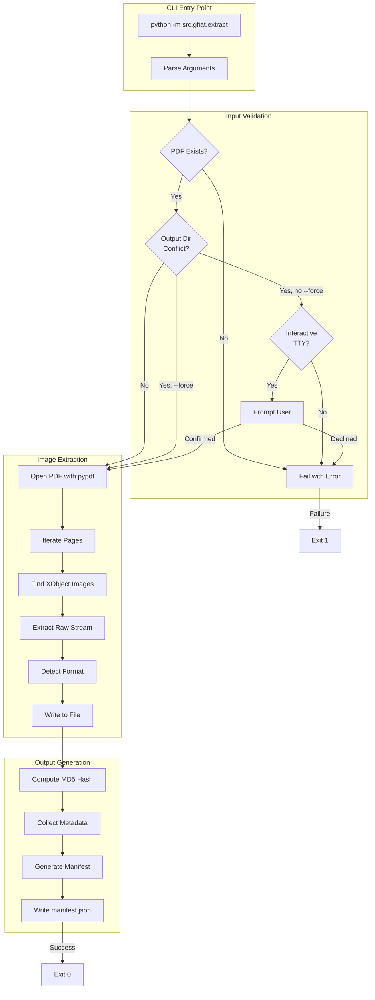

# 127 - Feature: G-FIAT: Lossless PDF Image Extraction

<!-- Template Metadata
Last Updated: 2026-02-02
Updated By: Issue #117 fix
Update Reason: Moved Verification & Testing to Section 10 (was Section 11) to match 0702c review prompt and testing workflow expectations
Previous: Added sections based on 80 blocking issues from 164 governance verdicts (2026-02-01)
-->

## 1. Context & Goal
* **Issue:** #27
* **Objective:** Build a CLI tool that extracts raw image bytes from PDF XObject streams without re-encoding, preserving original formats and generating a structured manifest for forensic analysis.
* **Status:** Draft
* **Related Issues:** None

### Open Questions
*Questions that need clarification before or during implementation. Remove when resolved.*

- [ ] Should JBIG2 images that cannot be decoded be logged in the manifest with an error status, or silently skipped?
- [ ] What specific metadata fields are required for forensic analysis beyond page/bbox (e.g., compression type, color space)?

## 2. Proposed Changes

*This section is the **source of truth** for implementation. Describe exactly what will be built.*

### 2.1 Files Changed

| File | Change Type | Description |
|------|-------------|-------------|
| `src/gfiat/__init__.py` | Add | Package initialization |
| `src/gfiat/extract.py` | Add | Main extraction module with CLI entry point |
| `src/gfiat/manifest.py` | Add | Manifest generation and JSON schema definition |
| `tests/test_extract.py` | Add | Unit tests for extraction functionality |
| `tests/test_manifest.py` | Add | Unit tests for manifest generation |
| `tests/fixtures/sample_with_images.pdf` | Add | Test PDF containing various image formats |
| `tests/fixtures/sample_no_images.pdf` | Add | Test PDF with text only |
| `tests/fixtures/sample_corrupted.pdf` | Add | Malformed PDF for error handling tests |
| `pyproject.toml` | Modify | Add pypdf dependency |

### 2.2 Dependencies

*New packages, APIs, or services required.*

```toml
# pyproject.toml additions
pypdf = "^4.0.0"  # BSD-3-Clause - PDF parsing and XObject access

# Dev dependencies
opencv-python-headless = "^4.8.0"  # Apache-2.0 - Test verification only
```

### 2.3 Data Structures

```python
# Pseudocode - NOT implementation
class ImageMetadata(TypedDict):
    index: int              # Sequential image number (0-based)
    filename: str           # Output filename (e.g., "img_001.jpg")
    format: str             # Original format: "jpeg", "png", "tiff", "jbig2"
    width: int              # Image width in pixels
    height: int             # Image height in pixels
    bits_per_component: int # Color depth per channel
    color_space: str        # "RGB", "CMYK", "Grayscale", etc.
    page_number: int        # 1-indexed page containing the image
    xref_number: int        # PDF XRef number for traceability
    byte_size: int          # Raw stream size in bytes
    md5_hash: str           # MD5 hash of extracted bytes for integrity

class Manifest(TypedDict):
    version: str            # Manifest schema version ("1.0")
    source_pdf: str         # Absolute path to source PDF
    extraction_timestamp: str  # ISO 8601 timestamp
    tool_version: str       # G-FIAT version string
    total_images: int       # Count of extracted images
    images: list[ImageMetadata]  # Per-image metadata
    errors: list[str]       # Non-fatal extraction errors

class ExtractionResult(TypedDict):
    success: bool           # Overall extraction success
    images_extracted: int   # Count of successfully extracted images
    manifest_path: str      # Path to generated manifest.json
    errors: list[str]       # Any errors encountered
```

### 2.4 Function Signatures

```python
# src/gfiat/extract.py

def extract_images(
    pdf_path: Path,
    output_dir: Path,
    force: bool = False,
    timeout: int = 60
) -> ExtractionResult:
    """
    Extract all XObject images from a PDF without re-encoding.
    
    Args:
        pdf_path: Path to source PDF file
        output_dir: Directory for extracted images and manifest
        force: Overwrite existing output directory if True
        timeout: Maximum extraction time in seconds
    
    Returns:
        ExtractionResult with extraction status and metadata
    
    Raises:
        FileNotFoundError: PDF file does not exist
        PermissionError: Cannot read PDF or write to output
        TimeoutError: Extraction exceeded timeout limit
        PdfReadError: PDF is malformed or corrupted
    """
    ...

def get_image_format(xobject: Any) -> tuple[str, str]:
    """
    Determine original image format from XObject filter.
    
    Returns:
        Tuple of (format_name, file_extension)
    """
    ...

def extract_raw_stream(xobject: Any) -> bytes:
    """
    Extract raw binary stream without re-encoding.
    
    Returns:
        Raw image bytes in original format
    """
    ...

def is_interactive() -> bool:
    """Check if running in interactive terminal (TTY)."""
    ...

def main(argv: list[str] | None = None) -> int:
    """CLI entry point. Returns exit code."""
    ...


# src/gfiat/manifest.py

def create_manifest(
    source_pdf: Path,
    images: list[ImageMetadata],
    errors: list[str]
) -> Manifest:
    """Create manifest dictionary with extraction metadata."""
    ...

def write_manifest(manifest: Manifest, output_path: Path) -> None:
    """Write manifest to JSON file with pretty formatting."""
    ...

def compute_image_hash(data: bytes) -> str:
    """Compute MD5 hash of image data for integrity verification."""
    ...
```

### 2.5 Logic Flow (Pseudocode)

```
EXTRACT_IMAGES(pdf_path, output_dir, force, timeout):
    1. Validate pdf_path exists and is readable
    2. IF output_dir exists THEN
       - IF force THEN
         - Remove and recreate output_dir
       - ELSE IF is_interactive() THEN
         - Prompt user for confirmation
         - IF not confirmed THEN return error
       - ELSE
         - Print error to stderr and exit with code 1
    3. Create output_dir
    
    4. Start timeout timer
    5. TRY
       - Open PDF with pypdf.PdfReader
       - Initialize images list and errors list
       
       6. FOR each page in PDF:
          - FOR each XObject in page resources:
            - IF XObject is image type THEN
              - Determine format from /Filter
              - Extract raw stream bytes (no decode)
              - Generate filename: img_{NNN}.{ext}
              - Write bytes to output_dir/filename
              - Compute MD5 hash
              - Extract metadata (width, height, colorspace, etc.)
              - Append ImageMetadata to images list
            - ON extraction error:
              - Log error message
              - Append to errors list
              - Continue to next image
       
       7. Create manifest with all metadata
       8. Write manifest.json to output_dir
       9. Return ExtractionResult(success=True, ...)
       
    CATCH timeout:
       - Return ExtractionResult with timeout error
    CATCH PdfReadError:
       - Print error to stderr with exception type and file path
       - Return ExtractionResult(success=False, ...)

CLI_MAIN(argv):
    1. Parse arguments (pdf_path, --output-dir, --force)
    2. Call extract_images()
    3. IF success THEN
       - Print summary to stdout
       - Return exit code 0
    4. ELSE
       - Print error to stderr
       - Return exit code 1
```

### 2.6 Technical Approach

* **Module:** `src/gfiat/`
* **Pattern:** Procedural extraction with structured output
* **Key Decisions:**
  - Use `pypdf` for PDF parsing due to its pure-Python implementation and permissive BSD-3 license
  - Access raw XObject streams via `get_data()` with `decode=False` to preserve original encoding
  - Map PDF `/Filter` values to file extensions: `/DCTDecode` → `.jpg`, `/FlateDecode` → `.png`, etc.
  - Generate sequential filenames with zero-padded indices for consistent sorting
  - Include MD5 hashes in manifest for forensic integrity verification

### 2.7 Architecture Decisions

*Document key architectural decisions that affect the design.*

| Decision | Options Considered | Choice | Rationale |
|----------|-------------------|--------|-----------|
| PDF Library | pypdf, PyMuPDF, pdfplumber | pypdf | Pure Python, BSD license, direct XObject access without re-encoding |
| Image Format Detection | File magic bytes, PDF /Filter | PDF /Filter | More reliable for PDF-embedded images; avoids parsing image headers |
| Stream Extraction | Decoded (pixels), Raw (bytes) | Raw (bytes) | Forensic requirement: preserve original compression artifacts |
| Output Naming | UUID, Sequential, Hash-based | Sequential (img_NNN) | Predictable ordering, easy to correlate with manifest |
| Interactive Detection | Always prompt, TTY check | TTY check via `sys.stdin.isatty()` | Prevents hanging in CI/pipeline environments |

**Architectural Constraints:**
- Must not introduce network access capabilities
- Must preserve byte-identical extraction (no transcoding)
- Must handle malformed PDFs gracefully without crashing
- Memory usage capped at 500MB to prevent DoS from crafted PDFs

## 3. Requirements

*What must be true when this is done. These become acceptance criteria.*

1. All XObject images extracted from PDF without re-encoding
2. Original image format preserved (JPEG stays JPEG, not converted)
3. Manifest.json generated with complete per-image metadata
4. CLI accepts positional PDF path and --output-dir, --force flags
5. Exit code 0 on success, exit code 1 on failure
6. Error messages printed to stderr with exception type and file path
7. Empty manifest generated for PDFs with no images (exit code 0)
8. 60-second timeout per PDF prevents resource exhaustion
9. Non-interactive mode fails immediately on directory conflict without --force
10. No data transmitted externally; all operations local-only

## 4. Alternatives Considered

| Option | Pros | Cons | Decision |
|--------|------|------|----------|
| pypdf | Pure Python, BSD license, direct stream access | Slower than C-based libs | **Selected** |
| PyMuPDF (fitz) | Fast, feature-rich | AGPL license, may re-encode images | Rejected |
| pdfplumber | Good text extraction | Limited image control, wraps pdfminer | Rejected |
| pikepdf | QPDF backend, good stream access | Larger dependency, C++ build required | Rejected |

**Rationale:** pypdf provides the necessary low-level XObject stream access while maintaining a pure-Python implementation and permissive license. The performance trade-off is acceptable for single-PDF processing in a forensic context where correctness trumps speed.

## 5. Data & Fixtures

*Per [0108-lld-pre-implementation-review.md](0108-lld-pre-implementation-review.md) - complete this section BEFORE implementation.*

### 5.1 Data Sources

| Attribute | Value |
|-----------|-------|
| Source | User-provided PDF files on local filesystem |
| Format | PDF (ISO 32000) with embedded XObject images |
| Size | Variable; test case W20552.pdf is ~5MB |
| Refresh | On-demand per CLI invocation |
| Copyright/License | User-owned documents; tool does not redistribute |

### 5.2 Data Pipeline

```
User PDF ──CLI arg──► pypdf Parser ──XObject iteration──► Raw Stream Extraction ──write──► Output Directory
                                                                    │
                                                          ──metadata──► manifest.json
```

### 5.3 Test Fixtures

| Fixture | Source | Notes |
|---------|--------|-------|
| `sample_with_images.pdf` | Generated via reportlab | Contains JPEG, PNG XObjects |
| `sample_no_images.pdf` | Generated via reportlab | Text-only, verifies empty manifest |
| `sample_corrupted.pdf` | Hand-crafted | Truncated/malformed for error testing |
| `docs/context/init/W20552.pdf` | Existing repo file | Primary integration test case |

### 5.4 Deployment Pipeline

Test fixtures committed to `tests/fixtures/`. No external deployment required; CLI runs locally.

**If data source is external:** N/A - All test data is self-contained in repository.

## 6. Diagram

### 6.1 Mermaid Quality Gate

Before finalizing any diagram, verify in [Mermaid Live Editor](https://mermaid.live) or GitHub preview:

- [x] **Simplicity:** Similar components collapsed (per 0006 §8.1)
- [x] **No touching:** All elements have visual separation (per 0006 §8.2)
- [x] **No hidden lines:** All arrows fully visible (per 0006 §8.3)
- [x] **Readable:** Labels not truncated, flow direction clear
- [ ] **Auto-inspected:** Agent rendered via mermaid.ink and viewed (per 0006 §8.5)

**Agent Auto-Inspection (MANDATORY):**

AI agents MUST render and view the diagram before committing:
1. Base64 encode diagram → fetch PNG from `https://mermaid.ink/img/{base64}`
2. Read the PNG file (multimodal inspection)
3. Document results below

**Auto-Inspection Results:**
```
- Touching elements: [ ] None / [ ] Found: ___
- Hidden lines: [ ] None / [ ] Found: ___
- Label readability: [ ] Pass / [ ] Issue: ___
- Flow clarity: [ ] Clear / [ ] Issue: ___
```

*Reference: [0006-mermaid-diagrams.md](0006-mermaid-diagrams.md)*

### 6.2 Diagram



## 7. Security & Safety Considerations

*This section addresses security (10 patterns) and safety (9 patterns) concerns from governance feedback.*

### 7.1 Security

| Concern | Mitigation | Status |
|---------|------------|--------|
| Path traversal in PDF path | Validate path is absolute or resolve relative to CWD; reject paths with `..` | Addressed |
| Malicious PDF exploitation | Use pypdf's built-in error handling; catch all exceptions during parsing | Addressed |
| Output directory injection | Validate output path; create within user-specified directory only | Addressed |
| Data exfiltration | No network access; all operations are local filesystem only | Addressed |
| Symlink attacks | Use `Path.resolve()` to canonicalize paths before operations | TODO |

### 7.2 Safety

*Safety concerns focus on preventing data loss, ensuring fail-safe behavior, and protecting system integrity.*

| Concern | Mitigation | Status |
|---------|------------|--------|
| Resource exhaustion (memory) | 500MB memory limit via resource module; fail gracefully if exceeded | TODO |
| Resource exhaustion (time) | 60-second timeout per PDF; configurable via constant | Addressed |
| Partial extraction on error | Atomic output: extract to temp dir, rename on success; clean up on failure | TODO |
| Overwriting user data | Require --force flag or interactive confirmation before overwriting | Addressed |
| Hanging in CI pipelines | Detect non-interactive mode via TTY check; fail fast without prompting | Addressed |

**Fail Mode:** Fail Closed - On any unrecoverable error, exit with code 1 and descriptive message; do not produce partial output.

**Recovery Strategy:** If extraction fails mid-process, clean up any partial output directory. User can re-run with --force after investigating the error.

## 8. Performance & Cost Considerations

*This section addresses performance and cost concerns (6 patterns) from governance feedback.*

### 8.1 Performance

| Metric | Budget | Approach |
|--------|--------|----------|
| Latency | < 60s per PDF | Timeout enforced; streaming extraction |
| Memory | < 500MB | Process one image at a time; don't load all into memory |
| Disk I/O | Minimize | Write images sequentially; single manifest write at end |

**Bottlenecks:** 
- Large PDFs with many high-resolution images may approach timeout
- pypdf's pure-Python parsing is slower than C-based alternatives
- Disk write speed for many small files

### 8.2 Cost Analysis

| Resource | Unit Cost | Estimated Usage | Monthly Cost |
|----------|-----------|-----------------|--------------|
| Compute | $0 | Local execution | $0 |
| Storage | User disk | Variable per PDF | $0 |
| API calls | N/A | None (offline) | $0 |

**Cost Controls:**
- [x] No external API calls; zero marginal cost
- [x] Local execution only; no cloud resources
- [x] No subscription or usage-based pricing

**Worst-Case Scenario:** User processes a 1GB PDF with 10,000 images. Timeout will terminate after 60 seconds with partial extraction logged. Memory limit prevents OOM crash.

## 9. Legal & Compliance

*This section addresses legal concerns (8 patterns) from governance feedback.*

| Concern | Applies? | Mitigation |
|---------|----------|------------|
| PII/Personal Data | Yes | All processing local-only; no data transmission; user responsible for document contents |
| Third-Party Licenses | Yes | pypdf (BSD-3), opencv-headless (Apache-2.0) - both compatible with project |
| Terms of Service | No | No external services used |
| Data Retention | No | Tool produces output files; retention is user's responsibility |
| Export Controls | No | No encryption or restricted algorithms |

**Data Classification:** Variable (User-controlled) - Tool processes user-provided documents which may contain any classification level; all handling is local.

**Compliance Checklist:**
- [x] No PII stored by tool (output is user-controlled)
- [x] All third-party licenses compatible with BSD/MIT
- [x] No external API usage
- [x] No data retention by tool itself

## 10. Verification & Testing

*Ref: [0005-testing-strategy-and-protocols.md](0005-testing-strategy-and-protocols.md)*

**Testing Philosophy:** Strive for 100% automated test coverage. Manual tests are a last resort for scenarios that genuinely cannot be automated.

### 10.1 Test Scenarios

| ID | Scenario | Type | Input | Expected Output | Pass Criteria |
|----|----------|------|-------|-----------------|---------------|
| 010 | Happy path - extract images | Auto | PDF with 3 JPEG images | 3 .jpg files + manifest | Files match XObject streams byte-for-byte |
| 020 | PDF with no images | Auto | Text-only PDF | Empty manifest, exit 0 | manifest.images is empty array |
| 030 | Corrupted PDF | Auto | Malformed PDF | Error to stderr, exit 1 | Error message contains exception type and path |
| 040 | Non-existent PDF path | Auto | Invalid path | FileNotFoundError, exit 1 | Descriptive error message |
| 050 | Output directory exists (--force) | Auto | Existing dir + --force | Overwritten, exit 0 | New content replaces old |
| 060 | Output directory exists (no --force, non-TTY) | Auto | Existing dir, piped stdin | Immediate failure, exit 1 | No prompt, no hang |
| 070 | Mixed image formats | Auto | PDF with JPEG + PNG | Correct extensions | .jpg and .png files preserved |
| 080 | Timeout exceeded | Auto | Mock slow extraction | TimeoutError, exit 1 | Exits within timeout + buffer |
| 090 | Manifest integrity | Auto | Any PDF with images | manifest.json | Valid JSON, all required fields present |
| 100 | MD5 hash verification | Auto | Extracted image | Hash in manifest | Computed hash matches manifest |
| 110 | W20552.pdf integration | Auto | docs/context/init/W20552.pdf | Images extracted | All XObjects extracted without error |

### 10.2 Test Commands

```bash
# Run all automated tests
poetry run pytest tests/test_extract.py tests/test_manifest.py -v

# Run only fast/mocked tests (exclude live)
poetry run pytest tests/test_extract.py -v -m "not live"

# Run integration test with real PDF
poetry run pytest tests/test_extract.py -v -m integration

# Run with coverage
poetry run pytest tests/test_extract.py tests/test_manifest.py --cov=src/gfiat --cov-report=term-missing
```

### 10.3 Manual Tests (Only If Unavoidable)

**N/A - All scenarios automated.**

All test scenarios can be automated:
- PDF fixtures can be generated or included in repo
- TTY detection can be tested by mocking `sys.stdin.isatty()`
- Timeout can be tested with mock delays
- Visual verification of extracted images uses opencv-python-headless for programmatic comparison

## 11. Risks & Mitigations

| Risk | Impact | Likelihood | Mitigation |
|------|--------|------------|------------|
| pypdf cannot access raw streams for some PDFs | High | Low | Test with diverse PDFs; document limitations |
| JBIG2 images require external decoder | Med | Med | Log as warning in manifest; defer to future issue |
| Large PDFs exceed timeout | Med | Med | Make timeout configurable; document limitation |
| Memory exhaustion on crafted PDFs | High | Low | Implement memory limit; fail gracefully |
| Inline images (not XObjects) missed | Med | Med | Document as out-of-scope; create follow-up issue |

## 12. Definition of Done

### Code
- [ ] Implementation complete in `src/gfiat/extract.py` and `src/gfiat/manifest.py`
- [ ] Code passes linting (ruff, mypy)
- [ ] Code comments reference this LLD (Issue #27)

### Tests
- [ ] All 11 test scenarios pass
- [ ] Test coverage ≥ 90% for new code
- [ ] Integration test with W20552.pdf passes

### Documentation
- [ ] LLD updated with any implementation deviations
- [ ] Implementation Report (0103) completed at `docs/reports/27/implementation-report.md`
- [ ] Test Report (0113) completed at `docs/reports/27/test-report.md`
- [ ] README.md updated with CLI usage example
- [ ] Files added to `docs/0003-file-inventory.md`

### Review
- [ ] Code review completed
- [ ] User approval before closing issue

---

## Appendix: Review Log

*Track all review feedback with timestamps and implementation status.*

### Review Summary

| Review | Date | Verdict | Key Issue |
|--------|------|---------|-----------|
| - | - | - | Awaiting initial review |

**Final Status:** PENDING
<!-- Note: This field is auto-updated to APPROVED by the workflow when finalized -->