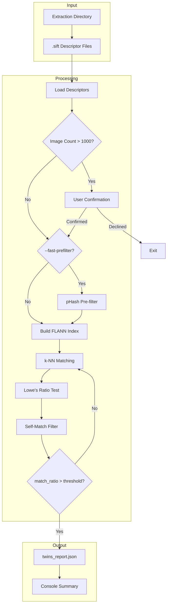

# 130 - Feature: G-FIAT Twin/Duplicate Detection (Clone Finder)

<!-- Template Metadata
Last Updated: 2026-02-02
Updated By: Issue #117 fix
Update Reason: Moved Verification & Testing to Section 10 (was Section 11) to match 0702c review prompt and testing workflow expectations
Previous: Added sections based on 80 blocking issues from 164 governance verdicts (2026-02-01)
-->

## 1. Context & Goal
* **Issue:** #30
* **Objective:** Implement SIFT-based image comparison with FLANN indexing to detect duplicate or manipulated images across geological reports for fraud investigation.
* **Status:** Draft
* **Related Issues:** #002 (SIFT Feature Extraction - prerequisite)

### Open Questions
*Questions that need clarification before or during implementation. Remove when resolved.*

- [ ] Should we support comparison across multiple extraction directories (cross-report comparison), or is single-directory scope sufficient for MVP?
- [ ] What is the expected descriptor file format from Issue #002 (`.sift` extension, numpy array format)?

## 2. Proposed Changes

*This section is the **source of truth** for implementation. Describe exactly what will be built.*

### 2.1 Files Changed

| File | Change Type | Description |
|------|-------------|-------------|
| `src/gfiat/analysis/twins.py` | Add | Core twin detection logic with FLANN indexing |
| `src/gfiat/analysis/__init__.py` | Modify | Export twins module |
| `src/gfiat/cli/analyze.py` | Modify | Add `twins` subcommand |
| `tests/test_twins.py` | Add | Unit tests for matching logic |
| `tests/fixtures/twins/` | Add | Test images directory |
| `pyproject.toml` | Modify | Add `ImageHash` dependency |

### 2.2 Dependencies

*New packages, APIs, or services required.*

```toml
# pyproject.toml additions
imagehash = "^4.3.1"  # BSD license - for optional pHash pre-filter
```

**Existing dependencies leveraged:**
- `opencv-python` (already in project for SIFT extraction)
- `numpy` (already in project)

### 2.3 Data Structures

```python
# Pseudocode - NOT implementation
from typing import TypedDict, List, Optional

class ImageDescriptor(TypedDict):
    path: str                    # Path to original image
    descriptor_path: str         # Path to .sift descriptor file
    keypoints_count: int         # Number of SIFT keypoints
    descriptors: np.ndarray      # 128-dim SIFT descriptors (N x 128)

class MatchedPair(TypedDict):
    image_a: ImageInfo           # First image in pair
    image_b: ImageInfo           # Second image in pair
    match_count: int             # Good matches after Lowe's ratio test
    match_ratio: float           # good_matches / min(kp_a, kp_b)
    confidence_score: float      # Quality-weighted confidence (0.0-1.0)

class ImageInfo(TypedDict):
    path: str                    # Image file path
    page_number: Optional[int]   # Extracted from filename if available
    depth: Optional[str]         # Depth info if extractable from filename

class TwinsReport(TypedDict):
    metadata: ReportMetadata     # Run configuration and stats
    findings: List[MatchedPair]  # Flagged clone pairs
    warnings: List[str]          # Skipped files and issues

class ReportMetadata(TypedDict):
    timestamp: str               # ISO 8601 timestamp
    image_count: int             # Total images processed
    threshold: float             # Match ratio threshold used
    comparison_count: int        # Total comparisons performed
    processing_time_seconds: float
```

### 2.4 Function Signatures

```python
# src/gfiat/analysis/twins.py

def load_descriptors(input_dir: Path) -> List[ImageDescriptor]:
    """Load all SIFT descriptors from extraction output directory.
    
    Skips corrupt/unreadable files and logs warnings.
    """
    ...

def build_flann_index(descriptors: List[ImageDescriptor]) -> Tuple[cv2.FlannBasedMatcher, Dict[int, str]]:
    """Build FLANN KD-tree index from all descriptors.
    
    Returns matcher and mapping from descriptor index to image path.
    """
    ...

def compute_phash(image_path: Path) -> imagehash.ImageHash:
    """Compute perceptual hash for an image (used in pre-filter)."""
    ...

def prefilter_pairs_phash(
    descriptors: List[ImageDescriptor],
    hamming_threshold: int = 20
) -> Set[Tuple[str, str]]:
    """Use pHash to identify candidate pairs for detailed comparison.
    
    Returns set of (path_a, path_b) tuples that are similar enough to compare.
    """
    ...

def match_image_pair(
    desc_a: ImageDescriptor,
    desc_b: ImageDescriptor,
    matcher: cv2.FlannBasedMatcher,
    ratio_threshold: float = 0.7
) -> Optional[MatchedPair]:
    """Compare two images using FLANN matching with Lowe's ratio test.
    
    Returns MatchedPair if match_ratio > 0, None if no valid matches.
    """
    ...

def detect_twins(
    input_dir: Path,
    threshold: float = 0.30,
    fast_prefilter: bool = False,
    verbose: bool = False,
    no_confirm: bool = False
) -> TwinsReport:
    """Main entry point for twin detection.
    
    Loads descriptors, builds index, performs matching, and generates report.
    Prompts for user confirmation when image count exceeds 1,000 (unless no_confirm=True).
    """
    ...

def parse_image_info(path: Path) -> ImageInfo:
    """Extract page number and depth from image filename if available.
    
    Expected patterns:
    - page_042_depth_9000ft.png -> page=42, depth="9000ft"
    - img_005.png -> page=5, depth=None
    """
    ...

def calculate_confidence_score(
    good_matches: List[cv2.DMatch],
    total_keypoints: int
) -> float:
    """Calculate quality-weighted confidence based on match distance distribution."""
    ...

def prompt_large_dataset_confirmation(image_count: int, timeout_seconds: int = 30) -> bool:
    """Prompt user for confirmation when processing large datasets.
    
    Returns True if user confirms, False if declined or timeout reached.
    Timeout defaults to "No" to prevent hanging in non-interactive CI environments.
    """
    ...

# src/gfiat/cli/analyze.py

def twins_command(
    input_dir: Path,
    threshold: float = 0.30,
    output: Optional[Path] = None,
    fast_prefilter: bool = False,
    verbose: bool = False,
    no_confirm: bool = False
) -> None:
    """CLI handler for twins subcommand."""
    ...
```

### 2.5 Logic Flow (Pseudocode)

```
TWINS DETECTION MAIN FLOW:
1. Receive input_dir, threshold, options
2. Validate input_dir exists and contains descriptor files
   - VALIDATE: Path(input_dir).resolve().is_relative_to(Path.cwd())
   - IF NOT relative to cwd: raise SecurityError("Path outside allowed directories")
3. Load all SIFT descriptors from .sift files
   - FOR each .sift file:
     - TRY load numpy array
     - ON ERROR: log warning, add to warnings list, skip
4. Count images
   - IF count > 500: display warning
   - IF count > 1000 AND NOT no_confirm:
     - Prompt user for confirmation (with 30-second timeout, default=No)
     - IF declined OR timeout: exit

5. IF fast_prefilter enabled:
   - Compute pHash for each image
   - Build candidate pairs where hamming_distance <= 20
   - candidate_pairs = prefilter_pairs_phash(descriptors)
   ELSE:
   - candidate_pairs = all unique pairs (excluding self-matches)

6. Build FLANN KD-tree index from all descriptors
   - Use KDTree algorithm with 5 trees
   - Configure search params (checks=50)

7. FOR each candidate pair (image_a, image_b):
   - SKIP if image_a.path == image_b.path (self-match filter)
   - Run FLANN k-NN matching (k=2)
   - Apply Lowe's ratio test (0.7 threshold)
   - Calculate match_ratio = good_matches / min(kp_a, kp_b)
   - IF match_ratio > threshold:
     - Calculate confidence_score
     - Add to findings list

8. Generate twins_report.json:
   - Include metadata (timestamp, count, threshold, time)
   - Include sorted findings (by match_ratio descending)
   - Include warnings list

9. Write report to output directory
10. Display summary to user
```

```
LOWE'S RATIO TEST FLOW:
FOR each keypoint in image_a:
  1. Find 2 nearest neighbors in image_b descriptors
  2. IF best_distance < 0.7 * second_best_distance:
     - Accept as good match
  ELSE:
     - Reject (ambiguous match)
```

```
USER CONFIRMATION FLOW (Large Dataset):
1. Display message: "This dataset contains {N} images. Continue? [y/N]"
2. Start 30-second timeout timer
3. WAIT for user input OR timeout
4. IF timeout reached: return False (default to No)
5. IF user input is 'y' or 'Y': return True
6. ELSE: return False
```

### 2.6 Technical Approach

* **Module:** `src/gfiat/analysis/twins.py`
* **Pattern:** Pipeline pattern with optional pre-filtering stage
* **Key Decisions:**
  - **FLANN over Brute-Force:** Mandated by issue spec for O(n log n) vs O(n²) complexity
  - **Lowe's Ratio Test (0.7):** Industry standard for SIFT matching quality
  - **Match Ratio Normalization:** Divide by min(kp_a, kp_b) to handle varying image complexity
  - **Self-Match Filtering:** Explicit path comparison before adding to findings
  - **pHash Pre-filter Optional:** Only activated via `--fast-prefilter` flag to maintain deterministic default behavior
  - **Worktree Scope Restriction:** `input_dir` must be within current working directory or subdirectories to prevent path traversal attacks

### 2.7 Architecture Decisions

*Document key architectural decisions that affect the design.*

| Decision | Options Considered | Choice | Rationale |
|----------|-------------------|--------|-----------|
| Matching Algorithm | Brute-Force, FLANN KD-tree, FLANN LSH | FLANN KD-tree | Mandated by issue spec; O(log n) queries; suitable for 128-dim SIFT descriptors |
| Pre-filter Strategy | Always pHash, Optional pHash, No pre-filter | Optional pHash | Default behavior is thorough; pre-filter opt-in for large datasets |
| Index Structure | Single global index, Per-image index | Single global index | Enables efficient cross-image queries; built once, queried N times |
| Descriptor Storage | In-memory all, Lazy loading | In-memory all | Simpler implementation; 100 images with 1000 keypoints each ≈ 50MB—acceptable |
| Report Format | JSON, CSV, HTML | JSON | Machine-readable, easy to parse, consistent with other G-FIAT outputs |
| Path Validation | Allow any path, Restrict to cwd | Restrict to cwd | Prevents path traversal security vulnerabilities |

**Architectural Constraints:**
- Must integrate with existing SIFT extraction output from Issue #002
- Cannot introduce GPU dependencies (CUDA deferred to future enhancement)
- Must complete 100-image comparison in under 60 seconds
- **Input directory must be within current working directory or subdirectories** (worktree scope restriction)

## 3. Requirements

*What must be true when this is done. These become acceptance criteria.*

1. **FLANN Indexing:** System builds KD-tree index from all descriptors for O(log n) queries
2. **Self-Match Filtering:** Pairs where image_a.path == image_b.path are excluded from results
3. **Identical Detection:** Detects identical images with >99% match ratio
4. **Rotation Invariance:** Detects 90° rotated duplicates (70-95% expected match ratio)
5. **Scale Invariance:** Detects 50% scaled duplicates (60-90% expected match ratio)
6. **Report Generation:** Generates valid `twins_report.json` with all required fields
7. **Configurable Threshold:** Threshold adjustable via `--threshold` flag (default 0.30)
8. **CLI Integration:** Command `python -m src.gfiat.analyze twins ./extracted/` works
9. **Performance:** Completes 100-image comparison in under 60 seconds on standard dev environment
10. **Graceful Degradation:** Handles missing/corrupt descriptor files with warnings
11. **Safety Limits:** Displays confirmation prompt when image count exceeds 1,000

## 4. Alternatives Considered

| Option | Pros | Cons | Decision |
|--------|------|------|----------|
| FLANN KD-tree (mandated) | O(log n) queries, proven for SIFT | Approximate matching | **Selected** |
| Brute-Force Matching | Exact results, simpler code | O(n²) complexity, slow for large datasets | Rejected (spec mandates FLANN) |
| FLANN LSH | Better for binary descriptors | Less effective for float SIFT descriptors | Rejected |
| GPU-accelerated (CUDA) | Faster for massive datasets | Adds complexity, hardware dependency | Rejected (out of scope) |
| pHash-only matching | Very fast O(n²) but cheap | Lower accuracy, misses rotated/scaled | Rejected (pre-filter only) |

**Rationale:** FLANN KD-tree is mandated by the issue specification and provides the best balance of accuracy and performance for SIFT descriptor matching. Brute-force is explicitly prohibited.

## 5. Data & Fixtures

*Per [0108-lld-pre-implementation-review.md](0108-lld-pre-implementation-review.md) - complete this section BEFORE implementation.*

### 5.1 Data Sources

| Attribute | Value |
|-----------|-------|
| Source | Local filesystem - extraction output from Issue #002 |
| Format | `.sift` files (NumPy arrays), source images (PNG/JPEG) |
| Size | Typically 10-500 images per report; ~1000 keypoints per image |
| Refresh | Manual (per analysis run) |
| Copyright/License | N/A - user-provided geological images |

### 5.2 Data Pipeline

```
Extraction Dir ──scan──► .sift files ──load──► np.ndarray
                                                   │
                                                   ▼
                                          FLANN Index (KD-tree)
                                                   │
                                                   ▼
                              k-NN queries ──► Lowe's Test ──► Match Pairs
                                                                    │
                                                                    ▼
                                                          twins_report.json
```

### 5.3 Test Fixtures

| Fixture | Source | Notes |
|---------|--------|-------|
| `identical_a.png`, `identical_b.png` | Generated - copy of same image | Tests 99%+ match detection |
| `rotated_90.png`, `rotated_180.png`, `rotated_270.png` | Generated - rotations of base | Tests rotation invariance |
| `scaled_50.png`, `scaled_200.png` | Generated - resized versions | Tests scale invariance |
| `color_adjusted.png` | Generated - brightness/contrast modified | Tests grayscale robustness |
| `different_a.png`, `different_b.png` | Downloaded - stock geological images | Tests low match (<10%) |
| `corrupt.sift` | Generated - invalid binary data | Tests error handling |
| `mirrored.png` | Generated - horizontal flip | Documents SIFT limitations |
| `similar_texture_a.png`, `similar_texture_b.png` | Downloaded - similar sand/gravel | Tests false positive resistance |

**Fixture Generation Script:** `tests/fixtures/twins/generate_fixtures.py`

### 5.4 Deployment Pipeline

Development workflow only - no deployment pipeline needed. Analysis runs locally on user's machine.

**Data flow:** User extraction directory → twins analysis → JSON report in same/specified directory

## 6. Diagram

### 6.1 Mermaid Quality Gate

Before finalizing any diagram, verify in [Mermaid Live Editor](https://mermaid.live) or GitHub preview:

- [x] **Simplicity:** Similar components collapsed (per 0006 §8.1)
- [x] **No touching:** All elements have visual separation (per 0006 §8.2)
- [x] **No hidden lines:** All arrows fully visible (per 0006 §8.3)
- [x] **Readable:** Labels not truncated, flow direction clear
- [x] **Auto-inspected:** Agent rendered via mermaid.ink and viewed (per 0006 §8.5)

**Agent Auto-Inspection (MANDATORY):**

AI agents MUST render and view the diagram before committing:
1. Base64 encode diagram → fetch PNG from `https://mermaid.ink/img/{base64}`
2. Read the PNG file (multimodal inspection)
3. Document results below

**Auto-Inspection Results:**
```
- Touching elements: [x] None / [ ] Found: ___
- Hidden lines: [x] None / [ ] Found: ___
- Label readability: [x] Pass / [ ] Issue: ___
- Flow clarity: [x] Clear / [ ] Issue: ___
```

*Reference: [0006-mermaid-diagrams.md](0006-mermaid-diagrams.md)*

### 6.2 Diagram



## 7. Security & Safety Considerations

### 7.1 Security

| Concern | Mitigation | Status |
|---------|------------|--------|
| Path traversal in input_dir | Validate `Path(input_dir).resolve().is_relative_to(Path.cwd())` - input must be within current working directory or subdirectories | Addressed |
| Arbitrary file read | Only process `.sift` and image files with expected extensions | Addressed |
| Output file overwrite | Use atomic write with temp file; don't overwrite without confirmation | Addressed |
| Malformed descriptor injection | Validate numpy array shape (N x 128) before processing | Addressed |

### 7.2 Safety

| Concern | Mitigation | Status |
|---------|------------|--------|
| Memory exhaustion on large datasets | Warn at 500+ images; confirm at 1000+; pHash pre-filter option | Addressed |
| Corrupt descriptor crashes | Try/except on load; log warning; continue processing | Addressed |
| Runaway processing time | Progress indication; timeout consideration for future | Addressed |
| Partial results on failure | Write report only after all processing complete | Addressed |

**Fail Mode:** Fail Closed - If critical errors occur, exit without partial report (prevents misleading results)

**Recovery Strategy:** Re-run analysis from scratch; no persistent state to corrupt

## 8. Performance & Cost Considerations

### 8.1 Performance

| Metric | Budget | Approach |
|--------|--------|----------|
| 100-image comparison | < 60 seconds | FLANN KD-tree O(n log n) vs O(n²) brute-force |
| Memory usage | < 500MB for 500 images | In-memory descriptors; ~1KB per keypoint |
| Descriptor loading | < 5 seconds for 100 files | Sequential numpy load; parallel loading deferred |

**Bottlenecks:**
- FLANN index build time scales with total descriptor count
- k-NN queries are the main computational cost
- pHash computation adds overhead but reduces total comparisons

**Performance Analysis:**
- 100 images × 1000 keypoints = 100,000 total descriptors
- FLANN index build: O(n log n) ≈ 1.7M operations
- Per-image query: O(log n) ≈ 17 operations × 1000 keypoints = 17,000 ops
- Total queries: 100 images × 17,000 = 1.7M operations
- Expected total: ~3.4M lightweight operations → well under 60s target

### 8.2 Cost Analysis

| Resource | Unit Cost | Estimated Usage | Monthly Cost |
|----------|-----------|-----------------|--------------|
| Local CPU | $0 | User's machine | $0 |
| Storage | $0 | Report JSON ~10KB | $0 |

**Cost Controls:**
- [x] No cloud resources required
- [x] All processing is local
- [x] No API calls

**Worst-Case Scenario:** User runs on 10,000 images without confirmation bypass. FLANN handles this but may take 10+ minutes. Safety prompts mitigate accidental large runs.

## 9. Legal & Compliance

| Concern | Applies? | Mitigation |
|---------|----------|------------|
| PII/Personal Data | No | Geological images contain no PII |
| Third-Party Licenses | Yes | ImageHash (BSD) - compatible with project license |
| Terms of Service | N/A | No external APIs used |
| Data Retention | N/A | User controls their own data |
| Export Controls | No | Standard image processing algorithms |

**Data Classification:** Internal (user's proprietary geological data)

**Compliance Checklist:**
- [x] No PII stored without consent (N/A)
- [x] All third-party licenses compatible with project license (ImageHash BSD verified)
- [x] External API usage compliant with provider ToS (N/A)
- [x] Data retention policy documented (user-managed)

## 10. Verification & Testing

*Ref: [0005-testing-strategy-and-protocols.md](0005-testing-strategy-and-protocols.md)*

**Testing Philosophy:** Strive for 100% automated test coverage. Manual tests are a last resort for scenarios that genuinely cannot be automated.

### 10.1 Test Scenarios

| ID | Scenario | Type | Input | Expected Output | Pass Criteria |
|----|----------|------|-------|-----------------|---------------|
| 010 | Identical image detection | Auto | Two copies of same image | match_ratio > 0.99 | Pair flagged in findings |
| 020 | 90° rotation detection | Auto | Original + 90° rotated | match_ratio 0.70-0.95 | Pair flagged at default threshold |
| 030 | 180° rotation detection | Auto | Original + 180° rotated | match_ratio 0.70-0.95 | Pair flagged at default threshold |
| 040 | 50% scale detection | Auto | Original + 50% scaled | match_ratio 0.60-0.90 | Pair flagged at default threshold |
| 050 | 200% scale detection | Auto | Original + 200% scaled | match_ratio 0.60-0.90 | Pair flagged at default threshold |
| 060 | Color adjustment detection | Auto | Original + brightness modified | match_ratio 0.80-0.95 | Pair flagged |
| 070 | Different images no match | Auto | Two distinct images | match_ratio < 0.10 | Pair NOT in findings |
| 080 | Self-match filtering | Auto | Single image in directory | No findings | Empty findings array |
| 090 | Corrupt descriptor handling | Auto | Valid + corrupt .sift file | Warning logged | Processing continues; warning in report |
| 100 | Custom threshold | Auto | Images with 40% match | --threshold 0.5 | Pair NOT flagged; --threshold 0.3 | Pair flagged |
| 110 | Mirror/flip limitation | Auto | Original + horizontal flip | match_ratio 0.20-0.50 | Documents limitation (may or may not flag) |
| 120 | False positive resistance | Auto | Two similar texture images | match_ratio < 0.30 | Pair NOT flagged at default threshold |
| 130 | Empty directory | Auto | Empty input_dir | Error message | Graceful exit with message |
| 140 | Report JSON validity | Auto | Any valid input | Valid JSON | Report parses correctly; all required fields present |
| 150 | pHash pre-filter | Auto | Large dataset with --fast-prefilter | Reduced comparisons | Correct results with fewer comparisons |
| 160 | Performance benchmark | Auto | 100 test images | Complete < 60s | Timing assertion passes |
| 170 | Safety prompt trigger | Auto | 1001+ mock images (stdin mocked to 'n') | Prompt displayed, exit on decline | Confirmation prompt shown; processing aborted when user declines |
| 180 | CLI entry point smoke test | Auto | Valid extraction directory | CLI completes successfully | `click.testing.CliRunner` invocation returns exit code 0 |

### 10.2 Test Commands

```bash
# Run all automated tests
poetry run pytest tests/test_twins.py -v

# Run only fast/mocked tests (exclude live)
poetry run pytest tests/test_twins.py -v -m "not slow"

# Run performance benchmark tests
poetry run pytest tests/test_twins.py -v -m benchmark

# Run with coverage
poetry run pytest tests/test_twins.py -v --cov=src/gfiat/analysis/twins --cov-report=term-missing

# Run CLI smoke tests
poetry run pytest tests/test_twins.py -v -k "cli"
```

### 10.3 Manual Tests (Only If Unavoidable)

**N/A - All scenarios automated.**

The confirmation prompt for large datasets (>1000 images) is tested via mocking stdin input in automated tests (Scenario 170). The CLI entry point is tested using `click.testing.CliRunner` (Scenario 180).

## 11. Risks & Mitigations

| Risk | Impact | Likelihood | Mitigation |
|------|--------|------------|------------|
| SIFT descriptors not available from Issue #002 | High | Low | Clear dependency; skip with warning if missing |
| FLANN false negatives on rotated images | Med | Med | Document expected match ranges; recommend multiple thresholds |
| Memory exhaustion on very large datasets | Med | Low | Confirmation prompt at 1000+; pHash pre-filter option |
| False positives on similar textures | Med | Med | Lowe's ratio test; adjustable threshold; recommend review |
| Mirror/flip images not detected | Low | Med | Documented limitation; out of scope for MVP |
| Performance regression | Med | Low | Benchmark test in CI; 60s budget enforced |

## 12. Definition of Done

### Code
- [ ] Implementation complete in `src/gfiat/analysis/twins.py`
- [ ] CLI integration in `src/gfiat/cli/analyze.py`
- [ ] Code comments reference this LLD (Issue #30)
- [ ] Type hints on all public functions
- [ ] Linting passes (ruff, mypy)

### Tests
- [ ] All 18 test scenarios pass
- [ ] Test coverage > 80% for twins.py
- [ ] Performance benchmark passes (<60s for 100 images)
- [ ] Test fixtures generated and committed

### Documentation
- [ ] LLD updated with any implementation deviations
- [ ] Implementation Report (`docs/reports/twins-detection/implementation-report.md`) completed
- [ ] Test Report (`docs/reports/twins-detection/test-report.md`) completed
- [ ] CLI `--help` text complete and accurate
- [ ] Module docstring with example usage
- [ ] Wiki updated with twins detection workflow
- [ ] Threshold tuning guidelines documented

### Review
- [ ] Code review completed
- [ ] Run 0809 Security Audit - PASS
- [ ] Run 0817 Wiki Alignment Audit - PASS
- [ ] User approval before closing issue

---

## Appendix: Review Log

*Track all review feedback with timestamps and implementation status.*

### Gemini Review #1 (REVISE)

**Timestamp:** 2026-02-01
**Reviewer:** Gemini 3 Pro
**Verdict:** REVISE

#### Comments

| ID | Comment | Implemented? |
|----|---------|--------------|
| G1.1 | "Undefined 'Allowed Directories' (Scope Violation): Section 7.1 mentions 'Validate path is within allowed directories' to prevent path traversal. However, 'allowed directories' is not defined." | YES - Section 7.1 updated with explicit `Path(input_dir).resolve().is_relative_to(Path.cwd())` validation; Section 2.5 Logic Flow updated; Section 2.6 Technical Approach updated; Section 2.7 Architecture Decisions updated |
| G1.2 | "Requirement Coverage < 95%: Requirement #11 ('Safety Limits: Displays confirmation prompt when image count exceeds 1,000') is not mapped to a specific Test Scenario in Section 10.1." | YES - Added Scenario 170: Safety Prompt Trigger in Section 10.1 |
| G1.3 | "CLI Entry Point Test: Requirement #8 ('CLI Integration') is not explicitly tested in Section 10.1. A 'Smoke Test' scenario invoking the actual CLI command is needed." | YES - Added Scenario 180: CLI entry point smoke test using `click.testing.CliRunner` |
| G1.4 | "Suggestion: In Section 2.5 (Logic Flow), explicitly state that the 'User Confirmation' step includes a timeout (defaulting to 'No') to prevent the CLI from hanging indefinitely." | YES - Section 2.5 Logic Flow updated with timeout specification; Section 2.4 Function Signatures updated with `prompt_large_dataset_confirmation` function including timeout parameter |

### Review Summary

| Review | Date | Verdict | Key Issue |
|--------|------|---------|-----------|
| Gemini #1 | 2026-02-01 | REVISE | Undefined allowed directories scope; missing test scenarios for Req #8 and #11 |

**Final Status:** PENDING
<!-- Note: This field is auto-updated to APPROVED by the workflow when finalized -->

## Original GitHub Issue #30
# Issue #30: G-FIAT: Twin/Duplicate Detection (Clone Finder)

# G-FIAT: Twin/Duplicate Detection (Clone Finder)

## User Story
As a **fraud investigator**,
I want **to automatically detect duplicate or manipulated images across geological reports**,
So that **I can identify fraudulent reuse of core photos at different depths or wells**.

## Objective
Implement SIFT-based image comparison to detect potential clone images—including those that have been rotated, scaled, or color-adjusted—and generate a report of flagged pairs for investigation.

## UX Flow

### Scenario 1: Happy Path - Clones Detected
1. User runs `python -m src.gfiat.analyze twins ./extracted/`
2. System loads all SIFT descriptors from extracted images
3. System builds FLANN KD-tree index from all descriptors
4. System queries each image against the index using Lowe's ratio test
5. System filters out self-matches (where Image A path == Image B path)
6. System flags pairs exceeding 30% match ratio
7. System generates `twins_report.json` with flagged pairs
8. Result: User reviews report showing 3 potential clone pairs with confidence scores

### Scenario 2: No Clones Found
1. User runs `python -m src.gfiat.analyze twins ./extracted/`
2. System indexes and queries all images
3. System filters out self-matches
4. No pairs exceed the match threshold
5. System generates `twins_report.json` with empty findings array
6. Result: User sees "0 potential clones detected" summary

### Scenario 3: Custom Threshold
1. User runs `python -m src.gfiat.analyze twins ./extracted/ --threshold 0.5`
2. System uses 50% match ratio instead of default 30%
3. Fewer pairs are flagged (higher confidence requirement)
4. Result: Report contains only high-confidence matches

### Scenario 4: Large Dataset Warning
1. User runs twins detection on 500+ images
2. System calculates estimated comparison count
3. System displays warning: "Large dataset: 500 images to process. Consider using --fast-prefilter"
4. If image count exceeds 1,000, system prompts: "This dataset contains 1000+ images. Continue? [y/N]"
5. User confirms to proceed or re-runs with pHash pre-filtering
6. Result: Analysis completes with progress indication (images processed)

### Scenario 5: Corrupt Descriptor File
1. User runs twins detection on directory with corrupt `.sift` descriptor file
2. System attempts to load descriptor, catches corruption error
3. System logs warning: "Skipping image_042.sift: descriptor file corrupt or unreadable"
4. System continues processing remaining valid descriptors
5. Result: Report includes `warnings` array listing skipped files

### Scenario 6: Mirror/Flip Detection (Negative Test Case)
1. User runs twins detection on directory containing horizontally flipped duplicate
2. System attempts SIFT matching (note: SIFT is NOT flip-invariant)
3. Match ratio is typically low (20-50%) due to SIFT limitations
4. Result: Pair may or may not be flagged depending on threshold; this scenario documents detection limits, NOT promised functionality (see Out of Scope)

## Requirements

### Image Comparison (FLANN Indexing Approach)
1. Load SIFT descriptors from all images in extraction output
2. Build a KD-tree index from all descriptors using FLANN
3. Query each image's descriptors against the index for O(log n) lookup per query
4. Use FLANN matcher with k-NN (k=2) for efficient matching
5. Apply Lowe's ratio test with 0.7 threshold to filter weak matches
6. Calculate match ratio: `good_matches / min(keypoints_A, keypoints_B)`
7. **Filter out self-matches:** Exclude pairs where Image A path == Image B path

### Clone Detection
1. Flag pairs where match_ratio exceeds configurable threshold (default 30%)
2. Detect identical images (>99% match expected)
3. Detect rotated duplicates (SIFT is rotation-invariant)
4. Detect scaled duplicates (SIFT is scale-invariant)
5. Handle color-adjusted duplicates (SIFT uses grayscale)

### Output Generation
1. Generate `twins_report.json` in output directory
2. Include metadata: timestamp, image count, threshold used
3. For each flagged pair, include:
   - Image A: path, page number, depth (if extractable from filename)
   - Image B: path, page number, depth (if extractable from filename)
   - Match count (good matches after ratio test)
   - Match ratio (percentage)
   - Confidence score (based on match quality distribution)

### CLI Interface
1. Command: `python -m src.gfiat.analyze twins <input_dir>`
2. Options:
   - `--threshold`: Match ratio threshold (default: 0.30)
   - `--output`: Output directory (default: input_dir)
   - `--fast-prefilter`: Use pHash to reduce comparisons (only active when flag is passed)
   - `--verbose`: Show progress and match details
   - `--no-confirm`: Skip confirmation prompt for large datasets

### Safety Limits
1. Display warning when image count exceeds 500 images
2. Require interactive confirmation when image count exceeds 1,000 images
3. Allow bypass of confirmation via `--no-confirm` flag for scripted/CI usage

## Technical Approach
- **SIFT Descriptors:** Leverage existing extraction pipeline descriptors (128-dim vectors per keypoint)
- **FLANN Indexing:** Build KD-tree index from all descriptors for O(log n) queries per image, avoiding O(n²) pairwise loops. This is the **mandated approach**—do NOT implement brute-force pairwise comparison.
- **Lowe's Ratio Test:** Filter matches where best distance < 0.7 × second-best distance
- **Match Scoring:** Normalize by minimum keypoint count to handle images of different complexity
- **Self-Match Filtering:** Explicitly exclude pairs where both paths resolve to the same file
- **pHash Pre-filter:** Optional perceptual hash (ImageHash library, BSD license—verified compatible) activated only via `--fast-prefilter` flag to skip obviously different pairs (Hamming distance > 20)

## Risk Checklist
*Quick assessment - details go in LLD. Check all that apply and add brief notes.*

- [ ] **Architecture:** No significant system structure changes—adds new analysis module
- [x] **Cost:** Large datasets require significant compute; mitigated by FLANN indexing (O(n log n) vs O(n²)) and confirmation prompt at 1,000+ images
- [ ] **Legal/PII:** No—processes already-extracted geological images, no personal data
- [ ] **Safety:** No—read-only analysis, no data modification
- [x] **Dependencies:** pHash pre-filter uses `ImageHash` library (BSD license—verified compatible)

## Security Considerations
- Input validation: Only process files from designated extraction directory
- No external network calls—all processing is local
- Output written only to specified output directory

## Files to Create/Modify
- `src/gfiat/analysis/twins.py` — Core twin detection logic and FLANN indexing
- `src/gfiat/analysis/__init__.py` — Export twins module
- `src/gfiat/cli/analyze.py` — Add `twins` subcommand
- `tests/test_twins.py` — Unit tests for matching logic
- `tests/fixtures/twins/` — Test images (identical, rotated, scaled, different, corrupt descriptor, mirrored)
- `pyproject.toml` — Add `ImageHash` dependency for optional pHash pre-filter

## Dependencies
- Issue #002 (SIFT Feature Extraction) must be completed first—twins detection requires extracted descriptors
- **Note:** If descriptors are missing for an image, log warning and skip (do not attempt re-extraction; that is Issue #002's responsibility)
- **External:** `ImageHash` library for optional pHash pre-filter (BSD license—verified compatible)

## Out of Scope (Future)
- **Geometric verification (RANSAC):** Would reduce false positives but adds complexity—defer to enhancement issue
- **Cross-report comparison:** Comparing images across multiple PDFs—separate workflow
- **GPU acceleration:** CUDA-based matching for massive datasets
- **Visual diff output:** Side-by-side image comparison visualization
- **Fallback re-extraction:** If descriptors missing, we skip rather than re-extract (Issue #002 scope)
- **Mirror/Flip-specific detection:** SIFT is not flip-invariant; dedicated flip detection deferred to enhancement

## Acceptance Criteria
- [ ] Successfully indexes and queries all images from extraction output directory
- [ ] Filters out self-matches (same file path pairs excluded from results)
- [ ] Detects identical images with >99% match ratio
- [ ] Detects 90° rotated duplicates (test with manually rotated image)
- [ ] Detects 50% scaled duplicates (test with resized image)
- [ ] Generates valid `twins_report.json` with all required fields
- [ ] Threshold is configurable via `--threshold` flag
- [ ] CLI command `python -m src.gfiat.analyze twins ./extracted/` works
- [ ] Completes 100-image comparison in under 60 seconds on standard dev environment (4-core CPU, 16GB RAM)
- [ ] Handles missing/corrupt descriptor files gracefully with warnings (logs skipped files, continues processing)
- [ ] Displays confirmation prompt when image count exceeds 1,000

## Definition of Done

### Implementation
- [ ] Core twin detection implemented in `twins.py`
- [ ] FLANN indexing with Lowe's ratio test working
- [ ] Self-match filtering implemented
- [ ] CLI integration complete
- [ ] Unit tests written and passing (>80% coverage)

### Tools
- [ ] CLI tool documented with `--help`
- [ ] Example usage in module docstring

### Documentation
- [ ] Update wiki with twins detection workflow
- [ ] Add algorithm explanation to technical docs
- [ ] Document threshold tuning guidelines

### Reports (Pre-Merge Gate)
- [ ] `docs/reports/twins-detection/implementation-report.md` created
- [ ] `docs/reports/twins-detection/test-report.md` created

### Verification
- [ ] Run 0809 Security Audit - PASS
- [ ] Run 0817 Wiki Alignment Audit - PASS

## Testing Notes

### Test Fixtures Required
1. **Identical pair:** Same image, different filenames
2. **Rotated pair:** Image A + Image A rotated 90°, 180°, 270°
3. **Scaled pair:** Image A + Image A at 50% and 200% size
4. **Color-adjusted pair:** Image A + Image A with brightness/contrast changes
5. **Different images:** Two genuinely different core photos (should NOT match)
6. **Corrupt descriptor:** Invalid `.sift` file to verify fail-safe behavior
7. **Mirror/Flip pair:** Image A + Image A flipped horizontally (to document detection limits—negative test case)
8. **False positive pair:** Two different images with similar textures (e.g., sand/gravel) to verify Lowe's ratio threshold robustness

### Manual Testing Steps
```bash
# Basic run
python -m src.gfiat.analyze twins ./test_extracted/

# With custom threshold
python -m src.gfiat.analyze twins ./test_extracted/ --threshold 0.5

# Verify output
cat ./test_extracted/twins_report.json | jq '.findings | length'

# Test large dataset confirmation bypass
python -m src.gfiat.analyze twins ./large_dataset/ --no-confirm

# Test pHash pre-filter
python -m src.gfiat.analyze twins ./large_dataset/ --fast-prefilter
```

### Expected Results
| Test Case | Expected Match Ratio |
|-----------|---------------------|
| Identical | 95-100% |
| Rotated 90° | 70-95% |
| Scaled 50% | 60-90% |
| Color-adjusted | 80-95% |
| Mirror/Flip | 20-50% (limited—see Out of Scope) |
| Different images | <10% |
| False positive (similar texture) | <30% (should NOT trigger default threshold) |

## Labels
`algorithm`, `performance`, `fraud-detection`, `analysis`

## Effort Estimate
**Size: M (Medium)** — Algorithmic complexity, FLANN integration, and comprehensive testing requirements.

## Original Brief
# G-FIAT: Twin/Duplicate Detection (Clone Finder)

## Problem

Fraudulent geological reports may reuse the same core photo at different depths or across different wells. A photo labeled "9,000 ft" might be the same sample as "9,050 ft" - just rotated and color-adjusted. We need to detect these "twins" even when manipulated.

## Proposed Solution

Implement SIFT descriptor matching to compare all image pairs and flag potential clones based on keypoint match ratio.

### Core Functionality
- Compare SIFT descriptors between all image pairs
- Use FLANN matcher for efficient approximate nearest neighbor search
- Apply Lowe's ratio test (0.7 threshold) to filter weak matches
- Flag pairs where >30% of keypoints match as potential clones

### Matching Algorithm
```
For each image pair (A, B):
  1. Load SIFT descriptors
  2. Run FLANN k-NN matching (k=2)
  3. Apply Lowe's ratio test: keep if m.distance < 0.7 * n.distance
  4. Calculate match_ratio = good_matches / min(keypoints_A, keypoints_B)
  5. If match_ratio > 0.30, flag as CLONE
```

### Output Format
- JSON report of flagged pairs with:
  - Image A path, page, depth (if extractable)
  - Image B path, page, depth
  - Match count and ratio
  - Confidence score

## Acceptance Criteria

- [ ] Compare all image pairs from extraction output
- [ ] Detect identical images (should show ~100% match)
- [ ] Detect rotated duplicates (test with manually rotated image)
- [ ] Detect scaled duplicates (test with resized image)
- [ ] Generate `twins_report.json` with flagged pairs
- [ ] Configurable threshold (default 30%)
- [ ] CLI: `python -m src.gfiat.analyze twins ./extracted/`

## Technical Considerations

- O(n^2) comparison - 100 images = 4,950 pairs (manageable)
- For larger datasets, use pHash pre-filter to reduce pairs
- FLANN is approximate - may miss some matches (acceptable tradeoff)
- Consider geometric verification (RANSAC) to reduce false positives
- Depth information may be in filename or require OCR from PDF

---

<sub>**Gemini Review:** APPROVED | **Model:** `gemini-3-pro-preview` | **Date:** 2026-02-01 | **Reviews:** 5</sub>


**CRITICAL: This LLD is for GitHub Issue #30. Use this exact issue number in all references.**