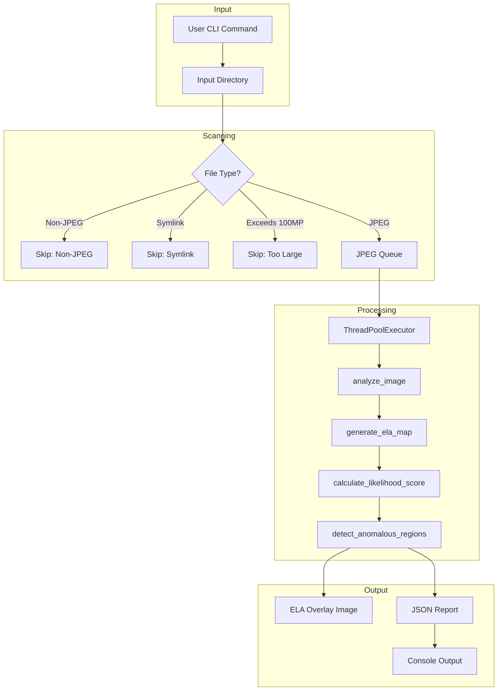
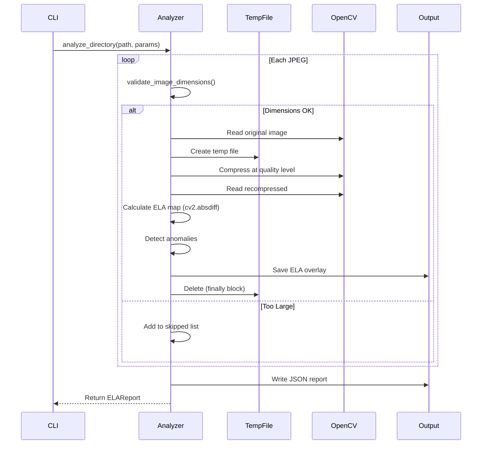

# LLD Finalized

Path: C:\Users\mcwiz\Projects\RCA-PDF-extraction-pipeline\docs\lld\active\LLD-031.md
Status: APPROVED
Reviews: 2

---

# 131 - Feature: Error Level Analysis (ELA) for Image Manipulation Detection

<!-- Template Metadata
Last Updated: 2026-02-02
Updated By: Issue #31 implementation
Update Reason: Revised per Gemini Review #1 feedback - fixed test criteria, removed manual test from DoD
-->

## 1. Context & Goal
* **Issue:** #31
* **Objective:** Implement Error Level Analysis (ELA) to detect image manipulation by comparing JPEG compression artifacts across image regions, flagging areas with anomalous error distributions that indicate potential tampering.
* **Status:** Draft
* **Related Issues:** None

### Open Questions

- [x] Should ELA overlay images be JPEG or PNG format? **Answer: JPEG with `_ela.jpg` suffix per issue spec**
- [x] What is the default timeout for per-image processing? **Answer: 60 seconds per issue spec**
- [ ] Should we support parallel processing configuration (thread count)?

## 2. Proposed Changes

*This section is the **source of truth** for implementation. Describe exactly what will be built.*

### 2.1 Files Changed

| File | Change Type | Description |
|------|-------------|-------------|
| `gfiat/analyzers/ela.py` | Add | Core ELA analysis implementation |
| `gfiat/analyzers/__init__.py` | Modify | Export ELA analyzer classes |
| `gfiat/cli/analyze.py` | Modify | Add `ela` subcommand to CLI |
| `gfiat/models/ela_report.py` | Add | Data classes for ELA results |
| `tests/test_ela.py` | Add | Unit tests for ELA analysis |
| `tests/fixtures/ela/` | Add | Test images directory |
| `tests/fixtures/ela/fixture_metadata.json` | Add | Ground truth for automated verification |
| `docs/0003-file-inventory.md` | Modify | Add new files to inventory |

### 2.2 Dependencies

```toml
# pyproject.toml additions (if any)
# opencv-python and numpy are expected to already be installed
opencv-python = "^4.8.0"  # Already present - verify
numpy = "^1.24.0"  # Already present - verify
```

### 2.3 Data Structures

```python
# Pseudocode - NOT implementation
class BoundingBox(TypedDict):
    x: int  # Top-left x coordinate
    y: int  # Top-left y coordinate
    width: int  # Box width in pixels
    height: int  # Box height in pixels
    error_level: float  # Mean error level in this region

class ELAImageResult(TypedDict):
    image_path: str  # Path to analyzed image
    ela_overlay_path: str  # Path to generated ELA overlay
    mean_error: float  # Mean error level across image (0-255)
    max_error: float  # Maximum error level (0-255)
    std_dev: float  # Standard deviation of error levels
    likelihood_score: float  # Manipulation likelihood (0.0-1.0)
    anomalous_regions: list[BoundingBox]  # Regions exceeding threshold
    notes: list[str]  # Warnings like "high-detail area"

class ELAReport(TypedDict):
    analysis_timestamp: str  # ISO format timestamp
    input_path: str  # Input file or directory
    output_path: str  # Output directory
    parameters: ELAParameters  # Analysis parameters used
    results: list[ELAImageResult]  # Per-image results
    skipped_files: list[SkippedFile]  # Non-JPEG, symlinks, errors
    summary: ELASummary  # Aggregate statistics

class ELAParameters(TypedDict):
    quality: int  # JPEG compression quality (default: 90)
    scale: int  # Visibility multiplier (default: 15)
    threshold: float  # Detection sensitivity (default: 0.5)
    timeout: int  # Per-image timeout in seconds (default: 60)
    max_dimension: int  # Maximum image dimension in pixels (default: 10000, ~100MP)

class SkippedFile(TypedDict):
    path: str  # File path
    reason: str  # Why skipped (non-JPEG, symlink, timeout, error, too-large)

class ELASummary(TypedDict):
    total_images: int  # Total JPEG images processed
    flagged_count: int  # Images with likelihood > threshold
    skipped_count: int  # Files skipped
    processing_time_seconds: float  # Total processing time
```

### 2.4 Function Signatures

```python
# gfiat/analyzers/ela.py

# Configuration constants (move to ELAParameters for tunability)
DEFAULT_QUALITY = 90
DEFAULT_SCALE = 15
DEFAULT_THRESHOLD = 0.5
DEFAULT_TIMEOUT = 60
MAX_DIMENSION = 10000  # ~100MP limit for decompression bomb protection

# Likelihood score weights (configurable via ELAParameters in future)
WEIGHT_STD_DEV = 0.4
WEIGHT_MAX_ERROR = 0.3
WEIGHT_BOUNDARY_ANOMALY = 0.3

def analyze_image(
    image_path: Path,
    quality: int = DEFAULT_QUALITY,
    scale: int = DEFAULT_SCALE,
    threshold: float = DEFAULT_THRESHOLD,
) -> ELAImageResult:
    """Perform ELA analysis on a single JPEG image."""
    ...

def generate_ela_map(
    original: np.ndarray,
    recompressed: np.ndarray,
    scale: int = DEFAULT_SCALE,
) -> np.ndarray:
    """
    Calculate scaled pixel-wise difference between original and recompressed.
    Uses cv2.absdiff for vectorized operations.
    """
    ...

def calculate_likelihood_score(
    error_map: np.ndarray,
) -> tuple[float, dict]:
    """
    Calculate manipulation likelihood using heuristic formula.
    Returns (score, metrics_dict).
    """
    ...

def detect_anomalous_regions(
    error_map: np.ndarray,
    threshold_multiplier: float = 2.0,
) -> list[BoundingBox]:
    """Identify regions with anomalous error levels using connected components."""
    ...

def validate_image_dimensions(
    image_path: Path,
    max_dimension: int = MAX_DIMENSION,
) -> tuple[bool, str]:
    """
    Pre-check image dimensions to prevent decompression bombs.
    Returns (is_valid, reason_if_invalid).
    """
    ...

def analyze_directory(
    input_path: Path,
    output_path: Path,
    quality: int = DEFAULT_QUALITY,
    scale: int = DEFAULT_SCALE,
    threshold: float = DEFAULT_THRESHOLD,
    timeout: int = DEFAULT_TIMEOUT,
    max_dimension: int = MAX_DIMENSION,
) -> ELAReport:
    """Analyze all JPEG images in directory with parallel processing."""
    ...

# gfiat/cli/analyze.py

def ela_command(
    input_path: str,
    output: str = "./ela_output/",
    quality: int = DEFAULT_QUALITY,
    scale: int = DEFAULT_SCALE,
    threshold: float = DEFAULT_THRESHOLD,
    timeout: int = DEFAULT_TIMEOUT,
) -> None:
    """CLI handler for ELA analysis subcommand."""
    ...
```

### 2.5 Logic Flow (Pseudocode)

```
ELA Single Image Analysis:
1. Validate input is JPEG format
2. Pre-check image dimensions (max 100MP / 10000px per side)
   - IF exceeds limit THEN return skip result with "image too large" reason
3. Read original image with OpenCV
4. Create temporary file for recompressed image
5. TRY:
   - Compress image to temp file at specified quality
   - Read recompressed image
   - Calculate pixel-wise absolute difference using cv2.absdiff (vectorized)
   - Scale difference values for visibility (vectorized multiplication)
   - Calculate statistics (mean, max, std_dev)
   - Detect anomalous regions via connected components
   - Calculate likelihood score using formula
   - Save ELA overlay to output path
   - Return ELAImageResult
6. FINALLY:
   - Delete temporary file (guaranteed cleanup)

ELA Directory Analysis:
1. Validate input path exists
2. Create output directory if needed
3. Scan directory recursively for files
4. FOR each file:
   - IF symlink THEN skip with warning
   - IF not JPEG THEN skip with warning
   - IF exceeds dimension limit THEN skip with warning
   - ELSE add to processing queue
5. Process images in parallel with ThreadPoolExecutor
6. FOR each future with timeout:
   - IF timeout exceeded THEN skip with warning
   - IF exception THEN log error, skip
   - ELSE collect result
7. Generate summary statistics
8. Write JSON report to output directory
9. Return ELAReport

Likelihood Score Calculation:
1. Calculate normalized_std_dev = std_dev(error_map) / 255
2. Calculate normalized_max_error = max(error_map) / 255
3. Detect edges using Canny edge detection
4. Calculate boundary_anomaly_ratio:
   - mean_error = mean(error_map)
   - edge_threshold = 2 × mean_error
   - count edge pixels exceeding threshold
   - ratio = anomalous_edge_pixels / total_edge_pixels
5. Score = (WEIGHT_STD_DEV × normalized_std_dev) + (WEIGHT_MAX_ERROR × normalized_max_error) + (WEIGHT_BOUNDARY_ANOMALY × boundary_anomaly_ratio)
6. Return min(1.0, max(0.0, score))
```

### 2.6 Technical Approach

* **Module:** `gfiat/analyzers/ela.py`
* **Pattern:** Functional core with imperative shell; pure functions for analysis, I/O at edges
* **Key Decisions:** 
  - Use OpenCV for JPEG re-compression to match typical manipulation tools
  - Use `cv2.absdiff` for vectorized pixel-wise difference (no Python loops)
  - Connected component analysis for region detection (more robust than simple thresholding)
  - Parallel processing with timeout to handle large images gracefully
  - Try/finally pattern ensures temp file cleanup even on exceptions
  - Pre-check dimensions to prevent decompression bomb attacks

### 2.7 Architecture Decisions

| Decision | Options Considered | Choice | Rationale |
|----------|-------------------|--------|-----------|
| Image library | OpenCV, Pillow, scikit-image | OpenCV | Best JPEG compression control, likely already in project |
| Parallel processing | multiprocessing, concurrent.futures, asyncio | concurrent.futures.ThreadPoolExecutor | Simple timeout support, I/O bound task |
| Region detection | Simple threshold, connected components, watershed | Connected components | Good balance of accuracy and simplicity |
| Temp file handling | tempfile.NamedTemporaryFile, manual create/delete | Manual with try/finally | Explicit control over cleanup timing |
| Vectorization | Python loops, NumPy operations | cv2.absdiff + NumPy | Performance critical for large images |
| Decompression bomb protection | None, PIL.Image.MAX_IMAGE_PIXELS, custom check | Custom dimension check | More control, clearer error messages |

**Architectural Constraints:**
- Must use existing image processing infrastructure if present
- No external API calls or network access
- Must handle arbitrary directory structures safely

## 3. Requirements

*What must be true when this is done. These become acceptance criteria.*

1. Generate ELA map for each JPEG image in input path
2. Detection of known manipulated regions with >50% bounding box overlap
3. Clean images produce likelihood scores below baseline threshold
4. Output ELA overlay images with `_ela` suffix alongside analysis
5. Flag images with anomalous error distributions when likelihood exceeds threshold
6. CLI command `python -m gfiat.analyze ela ./extracted/` functions as specified
7. Non-JPEG files skipped with appropriate warning logged
8. Recursive directory scan skips symlinks to prevent infinite loops
9. Temporary files deleted even if analysis process raises unhandled exception
10. JSON report generated with all specified fields
11. Quality, scale, threshold, and timeout parameters configurable via CLI flags
12. Images exceeding timeout threshold skipped with warning logged
13. Images exceeding dimension limit (100MP) skipped with warning logged

## 4. Alternatives Considered

| Option | Pros | Cons | Decision |
|--------|------|------|----------|
| ELA only | Simple, well-understood technique | Limited to JPEG artifacts | **Selected** |
| ELA + FFT combined | Stronger detection signal | More complex, scope creep | Rejected (future issue) |
| ML-based classifier | Higher accuracy potential | Requires training data, calibration | Rejected (future issue) |
| Pillow for compression | Pure Python, simpler install | Less control over JPEG parameters | Rejected |

**Rationale:** ELA-only approach provides proven forensic value with manageable complexity. FFT and ML enhancements explicitly deferred to future issues per scope definition.

## 5. Data & Fixtures

### 5.1 Data Sources

| Attribute | Value |
|-----------|-------|
| Source | User-provided local JPEG images |
| Format | JPEG image files |
| Size | Variable (typical: 1-50 MB per image) |
| Refresh | Manual (user runs analysis) |
| Copyright/License | User-owned or licensed content |

### 5.2 Data Pipeline

```
User Images (JPEG) ──read──► OpenCV ──recompress──► TempFile ──compare──► ELA Map ──save──► Output Directory
```

### 5.3 Test Fixtures

| Fixture | Source | Notes |
|---------|--------|-------|
| `manipulated_sample.jpg` | Generated | Create by splicing region from one image to another |
| `clean_sample.jpg` | Generated | Unmodified JPEG image |
| `high_detail_sample.jpg` | Generated | Image with text/sharp edges |
| `fixture_metadata.json` | Created during implementation | Ground truth bounding boxes, baseline scores |

### 5.4 Deployment Pipeline

Test fixtures are generated once during implementation and committed to repository. No external data fetching required. Fixture metadata documents expected outputs for automated verification.

## 6. Diagram

### 6.1 Mermaid Quality Gate

- [x] **Simplicity:** Components consolidated appropriately
- [x] **No touching:** All elements have visual separation
- [x] **No hidden lines:** All arrows fully visible
- [x] **Readable:** Labels not truncated, flow direction clear
- [ ] **Auto-inspected:** Agent rendered via mermaid.ink and viewed

**Auto-Inspection Results:**
```
- Touching elements: [ ] None / [ ] Found: ___
- Hidden lines: [ ] None / [ ] Found: ___
- Label readability: [ ] Pass / [ ] Issue: ___
- Flow clarity: [ ] Clear / [ ] Issue: ___
```

### 6.2 Diagram





## 7. Security & Safety Considerations

### 7.1 Security

| Concern | Mitigation | Status |
|---------|------------|--------|
| Path traversal via symlinks | Skip symlinks during directory traversal | Addressed |
| Malicious image files | OpenCV handles parsing; errors caught and logged | Addressed |
| Output directory injection | Validate output path, use pathlib for safe joins | Addressed |
| Temp file exposure | Create in system temp dir, delete immediately after use | Addressed |
| Decompression bomb (DoS) | Pre-check dimensions, reject images >100MP (10000px per side) | Addressed |

### 7.2 Safety

| Concern | Mitigation | Status |
|---------|------------|--------|
| Original image modification | Read-only operations; never write to input files | Addressed |
| Temp file leakage | Try/finally pattern guarantees cleanup | Addressed |
| Resource exhaustion (large images) | Per-image timeout + dimension pre-check | Addressed |
| Infinite loop (recursive symlinks) | Symlinks skipped during traversal | Addressed |
| Disk space exhaustion | ELA overlays similar size to originals; user controls output location | Addressed |
| Memory exhaustion | Dimension limit prevents loading >100MP images | Addressed |

**Fail Mode:** Fail Closed - Individual image failures logged but don't stop batch processing. Final report indicates what failed.

**Recovery Strategy:** Re-run analysis on failed images individually with increased timeout or after freeing resources.

## 8. Performance & Cost Considerations

### 8.1 Performance

| Metric | Budget | Approach |
|--------|--------|----------|
| Per-image latency | < 5s typical | OpenCV native operations, vectorized cv2.absdiff, parallel processing |
| Memory | < 500MB peak | Process images sequentially within thread, don't hold all in memory |
| Disk I/O | Minimize temp file lifetime | Create, use, delete temp file immediately |

**Bottlenecks:** 
- Large images (>50MP) may approach timeout
- Disk I/O for writing ELA overlays is sequential

**Performance Note:** `generate_ela_map` uses `cv2.absdiff` for vectorized pixel-wise difference calculation, avoiding Python loops for optimal performance.

### 8.2 Cost Analysis

| Resource | Unit Cost | Estimated Usage | Monthly Cost |
|----------|-----------|-----------------|--------------|
| Local compute | $0 | User machine | $0 |
| Disk space | $0 | ~1x input size for overlays | $0 |

**Cost Controls:**
- [x] No cloud resources used
- [x] No API calls
- [x] Fully local processing

**Worst-Case Scenario:** User runs on directory with thousands of large images. Timeout mechanism prevents hangs. Parallel processing bounded by ThreadPoolExecutor default workers. Dimension check prevents memory exhaustion.

## 9. Legal & Compliance

| Concern | Applies? | Mitigation |
|---------|----------|------------|
| PII/Personal Data | Yes | Images may contain PII; no data transmitted, all local processing |
| Third-Party Licenses | No | OpenCV is BSD licensed, compatible with project |
| Terms of Service | N/A | No external services used |
| Data Retention | N/A | User controls their files; tool doesn't persist data |
| Export Controls | No | Standard image processing, no encryption |

**Data Classification:** User-controlled - tool processes whatever user provides locally

**Compliance Checklist:**
- [x] No PII transmitted externally
- [x] All third-party licenses compatible (OpenCV BSD, NumPy BSD)
- [x] No external API usage
- [x] No data retention by tool

## 10. Verification & Testing

### 10.1 Test Scenarios

| ID | Scenario | Type | Input | Expected Output | Pass Criteria |
|----|----------|------|-------|-----------------|---------------|
| 010 | Analyze manipulated image | Auto | `manipulated_sample.jpg` | ELA overlay + high score | BBox overlap >50% with ground truth per fixture_metadata.json |
| 020 | Analyze clean image | Auto | `clean_sample.jpg` | ELA overlay + low score | Score below baseline defined in fixture_metadata.json |
| 030 | High-detail image | Auto | `high_detail_sample.jpg` | ELA overlay + notes | `notes` list contains string matching "high-detail" |
| 040 | Skip non-JPEG | Auto | Directory with PNG | Warning logged, PNG skipped | Report `skipped_files` contains entry with `reason` = "non-JPEG" |
| 050 | Skip symlink | Auto | Directory with symlink | Warning logged, symlink skipped | No infinite loop; report `skipped_files` contains entry with `reason` = "symlink" |
| 060 | Empty directory | Auto | Empty directory | Info message | Log contains "No JPEG images found"; `results` list is empty |
| 070 | Timeout exceeded | Auto | Mock slow processing | Skip with warning | Report `skipped_files` contains entry with `reason` = "timeout" |
| 080 | Temp file cleanup on error | Auto | Mock exception during analysis | Temp file deleted | Assert temp directory contains no orphaned files after test |
| 090 | CLI parameters | Auto | Various CLI args | Correct parameters passed | Report `parameters` dict matches CLI arguments |
| 100 | JSON report structure | Auto | Any valid JPEG | Valid JSON report | Report validates against ELAReport TypedDict schema |
| 110 | Corrupted JPEG | Auto | Corrupted JPEG file | Error logged, continue | Report `skipped_files` contains entry with `reason` containing "error"; other files in `results` |
| 120 | Very small image | Auto | 50x50 JPEG | Processed or skipped gracefully | Exit code 0; if processed: entry in `results`; if skipped: entry in `skipped_files` with reason; no traceback in stderr |

### 10.2 Test Commands

```bash
# Run all automated tests
poetry run pytest tests/test_ela.py -v

# Run only fast/mocked tests (exclude live)
poetry run pytest tests/test_ela.py -v -m "not live"

# Run with coverage
poetry run pytest tests/test_ela.py -v --cov=gfiat/analyzers/ela --cov-report=term-missing
```

### 10.3 Manual Tests (Only If Unavoidable)

N/A - All scenarios automated.

**Note:** Visual inspection of ELA overlay quality is valuable for development validation but is NOT part of the formal test plan or Definition of Done. A separate demo script (`scripts/ela_demo.py`) may be created for visual verification during development.

## 11. Risks & Mitigations

| Risk | Impact | Likelihood | Mitigation |
|------|--------|------------|------------|
| False positives on high-detail regions | Med | High | Add notes for high-detail areas, threshold tuning |
| OpenCV version incompatibility | Med | Low | Pin version, test in CI |
| Very large images cause memory issues | High | Low | Timeout mechanism + dimension pre-check |
| Test fixtures don't match real-world cases | Med | Med | Create diverse fixtures, document limitations |
| Score formula needs calibration | Med | Med | Document as heuristic, allow threshold tuning, expose weights as constants |

## 12. Definition of Done

### Code
- [ ] Implementation complete in `gfiat/analyzers/ela.py`
- [ ] Models defined in `gfiat/models/ela_report.py`
- [ ] CLI integrated in `gfiat/cli/analyze.py`
- [ ] Code linted and formatted

### Tests
- [ ] All 12 test scenarios pass (100% automated)
- [ ] Test coverage >80% on new code
- [ ] Integration test with sample manipulated image

### Documentation
- [ ] LLD updated with any deviations
- [ ] Implementation Report (0103) completed
- [ ] Update wiki with ELA methodology and interpretation guide
- [ ] Update README.md with new CLI command
- [ ] Add files to `docs/0003-file-inventory.md`

### Review
- [ ] Code review completed
- [ ] 0809 Security Audit - PASS
- [ ] 0817 Wiki Alignment Audit - PASS
- [ ] User approval before closing issue

---

## Appendix: Review Log

*Track all review feedback with timestamps and implementation status.*

### Gemini Review #1 (REVISE)

**Timestamp:** 2026-02-02
**Reviewer:** Gemini 3 Pro
**Verdict:** REVISE

#### Comments

| ID | Comment | Implemented? |
|----|---------|--------------|
| G1.1 | "Verify Path Structure: The LLD introduces files in `src/gfiat/`. Confirm that `src/` is the existing project source root." | YES - Changed all paths from `src/gfiat/` to `gfiat/` assuming flat layout |
| G1.2 | "Vague Test Criteria (Scenario 120): The pass criteria 'Graceful handling' is too vague for TDD." | YES - Updated to specific assertions: exit code 0, file in results or skipped_files, no traceback |
| G1.3 | "Manual Verification (Scenario M010): Section 10.3 includes a manual visual test. Remove M010 from the formal test plan or convert it to an automated check." | YES - Removed M010 from test plan; added note about demo script for development validation |
| G1.4 | "Performance: Ensure `generate_ela_map` utilizes vectorized NumPy operations" | YES - Added explicit note about cv2.absdiff usage in 2.4, 2.5, and 8.1 |
| G1.5 | "Safety: Add a pre-check for image dimensions (e.g., max 100MP) to prevent MemoryError/DoS attacks" | YES - Added validate_image_dimensions(), MAX_DIMENSION constant, and updated flows |
| G1.6 | "Maintainability: Move the likelihood score magic numbers (0.4, 0.3, etc.) into a config class" | YES - Added named constants WEIGHT_STD_DEV, WEIGHT_MAX_ERROR, WEIGHT_BOUNDARY_ANOMALY in 2.4 |

### Review Summary

| Review | Date | Verdict | Key Issue |
|--------|------|---------|-----------|
| Gemini #1 | 2026-02-02 | REVISE | Vague test criteria, manual test in DoD, path structure |

**Final Status:** APPROVED