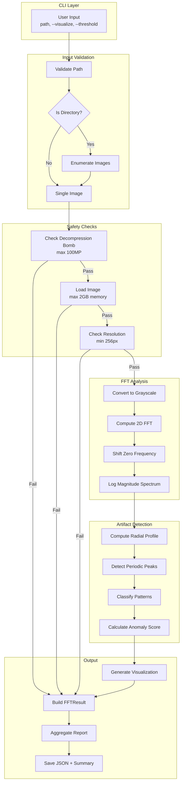

# 132 - Feature: FFT Resampling Detection for Digital Manipulation Analysis

<!-- Template Metadata
Last Updated: 2026-02-02
Updated By: Initial creation for Issue #32
Update Reason: New LLD for FFT resampling detection feature
-->

## 1. Context & Goal
* **Issue:** #32
* **Objective:** Implement 2D Fast Fourier Transform analysis to detect interpolation artifacts indicating image resampling (rotation, scaling, or transformation) for forensic analysis.
* **Status:** Draft
* **Related Issues:** None

### Open Questions
*All questions from the issue have been resolved inline.*

## 2. Proposed Changes

*This section is the **source of truth** for implementation. Describes exactly what will be built.*

### 2.1 Files Changed

| File | Change Type | Description |
|------|-------------|-------------|
| `src/gfiat/analyzers/fft_resampling.py` | Add | Core FFT analysis implementation with peak detection |
| `src/gfiat/analyzers/__init__.py` | Modify | Export new FFTResamplingAnalyzer class |
| `src/gfiat/cli/analyze.py` | Modify | Add `fft` subcommand to CLI |
| `src/gfiat/utils/image_loader.py` | Add | Shared image loading utilities with safety checks |
| `tests/test_fft_resampling.py` | Add | Unit tests for FFT analysis |
| `tests/fixtures/fft/generate_corpus.py` | Add | Script to generate synthetic test corpus |
| `tests/fixtures/fft/` | Add | Directory for test images |
| `docs/reports/32/implementation-report.md` | Add | Implementation report |
| `docs/reports/32/test-report.md` | Add | Test report |

### 2.2 Dependencies

```toml
# pyproject.toml additions
numpy = "^1.24.0"          # FFT computation (likely existing)
opencv-python = "^4.8.0"   # Image loading and processing
scipy = "^1.11.0"          # Peak detection algorithms
matplotlib = "^3.7.0"      # FFT visualization output
pillow = "^10.0.0"         # Image format support and decompression bomb protection
```

### 2.3 Data Structures

```python
# Pseudocode - NOT implementation
from typing import TypedDict, Literal
from enum import Enum

class AnalysisStatus(Enum):
    SUCCESS = "success"
    SKIPPED = "skipped"
    REJECTED = "rejected"
    ERROR = "error"

class ReasonCode(Enum):
    LOW_RESOLUTION = "low_resolution"
    DECOMPRESSION_BOMB = "decompression_bomb"
    MEMORY_EXCEEDED = "memory_exceeded"
    INVALID_FORMAT = "invalid_format"
    CORRUPTED_FILE = "corrupted_file"

class FFTResult(TypedDict):
    file_path: str                    # Path to analyzed image
    status: AnalysisStatus            # Analysis status
    reason_code: ReasonCode | None    # Reason for non-success status
    anomaly_score: float | None       # 0-1 normalized score (None if not analyzed)
    is_resampled: bool | None         # True if score exceeds threshold
    confidence: str | None            # "low", "medium", "high"
    detected_patterns: list[str]      # ["rotation", "scaling", etc.]
    jpeg_quality_estimate: int | None # Estimated JPEG quality if applicable
    resolution: tuple[int, int]       # Image dimensions (width, height)
    processing_time_ms: float         # Time taken to analyze
    visualization_path: str | None    # Path to saved FFT visualization

class FFTAnalysisReport(TypedDict):
    timestamp: str                    # ISO 8601 timestamp
    total_images: int                 # Total images processed
    analyzed_count: int               # Successfully analyzed
    skipped_count: int                # Skipped (too small, etc.)
    rejected_count: int               # Rejected (decompression bomb, etc.)
    flagged_count: int                # Images flagged as resampled
    threshold_used: float             # Anomaly threshold
    results: list[FFTResult]          # Individual results

class PeakInfo(TypedDict):
    frequency: float                  # Radial frequency of peak
    magnitude: float                  # Peak magnitude
    prominence: float                 # Peak prominence
    pattern_type: str                 # "rotation", "scaling", "unknown"
```

### 2.4 Function Signatures

```python
# src/gfiat/analyzers/fft_resampling.py

class FFTResamplingAnalyzer:
    """Analyzes images for resampling artifacts using 2D FFT."""
    
    def __init__(
        self,
        threshold: float = 0.5,
        min_resolution: int = 256,
        max_pixels: int = 100_000_000,
        max_memory_bytes: int = 2_147_483_648,
        timeout_seconds: float = 30.0
    ) -> None:
        """Initialize analyzer with configurable limits."""
        ...
    
    def analyze(self, image_path: Path) -> FFTResult:
        """Analyze single image for resampling artifacts."""
        ...
    
    def analyze_directory(
        self,
        directory: Path,
        recursive: bool = False
    ) -> FFTAnalysisReport:
        """Analyze all images in directory."""
        ...
    
    def generate_visualization(
        self,
        image_path: Path,
        output_path: Path
    ) -> Path:
        """Generate and save FFT magnitude spectrum visualization."""
        ...


# Internal helper functions
def _compute_fft_magnitude(image: np.ndarray) -> np.ndarray:
    """Compute log-magnitude spectrum of 2D FFT."""
    ...

def _compute_radial_profile(magnitude: np.ndarray) -> np.ndarray:
    """Compute radial average of magnitude spectrum."""
    ...

def _detect_periodic_peaks(
    radial_profile: np.ndarray,
    prominence_threshold: float = 0.1
) -> list[PeakInfo]:
    """Detect periodic peaks indicating resampling."""
    ...

def _classify_pattern(peaks: list[PeakInfo]) -> list[str]:
    """Classify detected patterns as rotation, scaling, etc."""
    ...

def _calculate_anomaly_score(
    peaks: list[PeakInfo],
    baseline_profile: np.ndarray
) -> float:
    """Calculate normalized anomaly score from detected peaks."""
    ...

def _estimate_jpeg_quality(magnitude: np.ndarray) -> int | None:
    """Estimate JPEG compression quality from block artifacts."""
    ...


# src/gfiat/utils/image_loader.py

def load_image_safe(
    path: Path,
    max_pixels: int = 100_000_000,
    max_memory_bytes: int = 2_147_483_648
) -> tuple[np.ndarray | None, str | None]:
    """
    Load image with decompression bomb protection.
    Returns (image_array, error_message).
    """
    ...

def validate_image_path(path: Path) -> tuple[bool, str | None]:
    """Validate path exists and is an image file."""
    ...


# src/gfiat/cli/analyze.py (additions)

def fft_command(
    path: Path,
    visualize: bool = False,
    threshold: float = 0.5,
    output: Path | None = None,
    recursive: bool = False
) -> None:
    """CLI handler for FFT resampling analysis."""
    ...
```

### 2.5 Logic Flow (Pseudocode)

```
FFT Analysis Flow (Single Image):
================================
1. VALIDATE input path
   - IF not exists → ERROR "File not found"
   - IF not image format → ERROR "Invalid format"

2. CHECK decompression bomb protection
   - Read image header for dimensions
   - IF width × height > 100MP → REJECT with DECOMPRESSION_BOMB

3. LOAD image
   - Load with memory limit tracking
   - IF memory exceeds 2GB → REJECT with MEMORY_EXCEEDED
   - Convert to grayscale

4. CHECK resolution
   - IF min(width, height) < 256 → SKIP with LOW_RESOLUTION
   - Log warning "Resolution < 256px: insufficient for reliable FFT analysis"

5. COMPUTE FFT
   - Apply 2D FFT: f_transform = np.fft.fft2(gray_image)
   - Shift zero frequency to center: f_shift = np.fft.fftshift(f_transform)
   - Calculate log-magnitude: magnitude = np.log(np.abs(f_shift) + 1)

6. COMPUTE radial profile
   - For each radius r from center:
     - Average all magnitude values at distance r
   - Result: 1D array of magnitude vs. frequency

7. DETECT periodic peaks
   - Use find_peaks with prominence threshold
   - Filter peaks in high-frequency region (outer 50% of spectrum)
   - Record frequency, magnitude, prominence for each peak

8. CLASSIFY patterns
   - Star pattern (multiple evenly-spaced peaks) → rotation artifact
   - Regular interval peaks → scaling artifact
   - Both → rotation + scaling

9. ESTIMATE JPEG quality (if applicable)
   - Look for 8×8 block frequency signatures
   - Adjust anomaly threshold based on compression level

10. CALCULATE anomaly score
    - Compare detected peaks to expected smooth falloff baseline
    - Score = normalized deviation (0 = clean, 1 = highly manipulated)

11. GENERATE visualization (if requested)
    - Create figure with original image and FFT magnitude spectrum
    - Mark detected peaks on spectrum
    - Save to output path

12. RETURN FFTResult with all metrics


Directory Analysis Flow:
========================
1. ENUMERATE image files in directory
2. FOR EACH image:
   - Call single image analysis
   - Respect timeout (30s per image)
   - Collect result
3. AGGREGATE results into FFTAnalysisReport
4. SAVE JSON report to output directory
5. PRINT summary to console
```

### 2.6 Technical Approach

* **Module:** `src/gfiat/analyzers/fft_resampling.py`
* **Pattern:** Analyzer class pattern consistent with other G-FIAT analyzers
* **Key Decisions:**
  - Use NumPy for FFT (standard, efficient, already a dependency)
  - SciPy for peak detection (robust `find_peaks` with prominence)
  - Pillow for decompression bomb protection (built-in `MAX_IMAGE_PIXELS`)
  - OpenCV for efficient image loading and grayscale conversion
  - Radial profile analysis for detecting periodic artifacts
  - Adjustable threshold to balance sensitivity vs. false positives

### 2.7 Architecture Decisions

| Decision | Options Considered | Choice | Rationale |
|----------|-------------------|--------|-----------|
| FFT library | NumPy fft2, SciPy fft2, pyFFTW | NumPy fft2 | Sufficient performance, simpler dependency, consistent API |
| Peak detection | Manual threshold, SciPy find_peaks, custom algorithm | SciPy find_peaks | Well-tested, prominence parameter handles noise well |
| Image loading | OpenCV only, Pillow only, Combined | Combined | OpenCV for speed, Pillow for decompression bomb protection |
| Scoring method | Binary threshold, Continuous score, ML classifier | Continuous 0-1 score | Allows user to set threshold, more informative than binary |
| Baseline comparison | Hardcoded baseline, Per-image adaptive, Calibrated corpus | Hardcoded baseline | Simpler implementation; calibration can be added later |

**Architectural Constraints:**
- Must process 12MP image in < 5 seconds on standard hardware
- Memory capped at 2GB per image to prevent system destabilization
- No external network calls; all processing local
- Must integrate with existing G-FIAT CLI structure

## 3. Requirements

*What must be true when this is done. These become acceptance criteria.*

1. FFT magnitude spectrum generated for each input image
2. Periodic high-frequency spikes detected and quantified
3. Known-manipulated test images correctly flagged (rotation, scaling)
4. Known-clean camera images pass without false positives (FPR < 10% on JPEG Q60-85)
5. FFT visualization saved when `--visualize` flag used
6. Anomaly score output in range 0-1 with clear threshold guidance
7. CLI command `python -m src.gfiat.analyze fft ./extracted/` works as specified
8. Images < 256px return status `SKIPPED` with logged warning
9. 12MP image processed in < 5 seconds on 4-core, 16GB RAM system
10. Memory usage capped at 2GB per image; exceeding triggers graceful failure
11. Decompression bomb images (>100MP) rejected with `REJECTED` status

## 4. Alternatives Considered

| Option | Pros | Cons | Decision |
|--------|------|------|----------|
| NumPy FFT | Standard library, fast, well-documented | No advanced features | **Selected** |
| pyFFTW FFT | Faster for repeated transforms | Extra dependency, setup complexity | Rejected |
| Wavelet analysis | Better localization, multi-scale | Different artifact signatures, separate technique | Rejected (future issue) |
| ML classifier | Higher accuracy potential | Requires training data, black box | Rejected (future enhancement) |
| Manual threshold only | Simple | Misses nuanced patterns | Rejected |
| Radial profile + peak detection | Captures periodic artifacts well | Sensitive to noise | **Selected** |

**Rationale:** NumPy FFT with radial profile analysis provides a good balance of simplicity, performance, and detection accuracy. More advanced techniques (wavelets, ML) can be layered on top in future issues.

## 5. Data & Fixtures

*Per [0108-lld-pre-implementation-review.md](0108-lld-pre-implementation-review.md) - complete this section BEFORE implementation.*

### 5.1 Data Sources

| Attribute | Value |
|-----------|-------|
| Source | Synthetically generated test corpus |
| Format | PNG (clean), JPEG (compressed samples) |
| Size | ~50 images, ~100MB total |
| Refresh | Generated once, committed to repo |
| Copyright/License | Self-generated, project license |

### 5.2 Data Pipeline

```
generate_corpus.py ──creates──► tests/fixtures/fft/ ──consumed by──► pytest tests
```

### 5.3 Test Fixtures

| Fixture | Source | Notes |
|---------|--------|-------|
| `clean_gradient_*.png` | Generated | Smooth gradients simulating sensor noise |
| `clean_noise_*.png` | Generated | Random noise patterns |
| `rotated_5deg_*.png` | Generated | Clean images rotated 5° |
| `rotated_15deg_*.png` | Generated | Clean images rotated 15° |
| `rotated_45deg_*.png` | Generated | Clean images rotated 45° |
| `rotated_90deg_*.png` | Generated | Clean images rotated 90° (should not detect) |
| `scaled_0.5x_*.png` | Generated | Clean images scaled down 50% |
| `scaled_1.5x_*.png` | Generated | Clean images scaled up 150% |
| `scaled_2x_*.png` | Generated | Clean images scaled up 200% |
| `jpeg_q60_*.jpg` | Generated | Manipulated images at JPEG Q60 |
| `jpeg_q70_*.jpg` | Generated | Manipulated images at JPEG Q70 |
| `jpeg_q85_*.jpg` | Generated | Manipulated images at JPEG Q85 |
| `periodic_grid_*.png` | Generated | Natural periodic patterns (edge case) |
| `tiny_64x64.png` | Generated | Below minimum resolution |
| `corrupted.jpg` | Generated | Intentionally malformed |
| `decompression_bomb.png` | Generated | Large dimensions in header, small file |

### 5.4 Deployment Pipeline

Test fixtures are committed to the repository under `tests/fixtures/fft/`. The generation script allows regeneration if needed:

```bash
# Regenerate test corpus
python tests/fixtures/fft/generate_corpus.py --force
```

**External data source:** None required - all test data is synthetic.

## 6. Diagram

### 6.1 Mermaid Quality Gate

Before finalizing any diagram, verify in [Mermaid Live Editor](https://mermaid.live) or GitHub preview:

- [x] **Simplicity:** Similar components collapsed (per 0006 §8.1)
- [x] **No touching:** All elements have visual separation (per 0006 §8.2)
- [x] **No hidden lines:** All arrows fully visible (per 0006 §8.3)
- [x] **Readable:** Labels not truncated, flow direction clear
- [ ] **Auto-inspected:** Agent rendered via mermaid.ink and viewed (per 0006 §8.5)

**Agent Auto-Inspection (MANDATORY):**

**Auto-Inspection Results:**
```
- Touching elements: [ ] None / [ ] Found: ___
- Hidden lines: [ ] None / [ ] Found: ___
- Label readability: [ ] Pass / [ ] Issue: ___
- Flow clarity: [ ] Clear / [ ] Issue: ___
```

*To be completed during implementation phase.*

### 6.2 Diagram



## 7. Security & Safety Considerations

### 7.1 Security

| Concern | Mitigation | Status |
|---------|------------|--------|
| Path traversal in CLI | Validate and canonicalize all input paths; reject paths containing `..` | TODO |
| Decompression bomb | Pillow MAX_IMAGE_PIXELS check; reject images >100MP before full decode | TODO |
| Malicious image files | Use Pillow/OpenCV's built-in format validation; catch exceptions | TODO |
| Memory exhaustion | Track memory usage; abort if exceeding 2GB per image | TODO |

### 7.2 Safety

| Concern | Mitigation | Status |
|---------|------------|--------|
| Runaway processing | 30-second timeout per image; graceful termination | TODO |
| Resource exhaustion | Memory cap, timeout, no parallel processing by default | TODO |
| Partial failure handling | Continue processing remaining images; report failures in results | TODO |
| Data integrity | Read-only analysis; no modification of input images | TODO |

**Fail Mode:** Fail Safe - On any safety limit exceeded, the image is skipped/rejected with clear status code; processing continues for other images.

**Recovery Strategy:** Individual image failures don't affect batch processing. All results (including failures) are recorded in the report for later review.

## 8. Performance & Cost Considerations

### 8.1 Performance

| Metric | Budget | Approach |
|--------|--------|----------|
| Latency (12MP image) | < 5 seconds | NumPy FFT is O(n log n); grayscale reduces data 3x |
| Memory (12MP image) | < 2 GB | Single image in memory; FFT result same size; radial profile is tiny |
| Memory (per-pixel) | ~50 bytes | Original (1 byte) + FFT complex (16 bytes) + magnitude (8 bytes) + workspace |

**Bottlenecks:**
- FFT computation is the primary bottleneck (~80% of time)
- Large images (>20MP) may approach timeout
- JPEG decompression adds overhead for compressed images

### 8.2 Cost Analysis

| Resource | Unit Cost | Estimated Usage | Monthly Cost |
|----------|-----------|-----------------|--------------|
| Local compute | $0 | N/A | $0 |
| Storage (fixtures) | $0 | ~100MB | $0 |
| External APIs | N/A | None | $0 |

**Cost Controls:**
- [x] No external API calls
- [x] All processing local
- [x] No cloud resources required

**Worst-Case Scenario:** Processing a directory of 1000 large images would take ~1.4 hours (1000 × 5s). Memory is bounded per-image, so batch size doesn't affect peak memory.

## 9. Legal & Compliance

| Concern | Applies? | Mitigation |
|---------|----------|------------|
| PII/Personal Data | Yes | Images may contain PII; all processing local, no data exfiltration |
| Third-Party Licenses | No | All dependencies are MIT/BSD compatible |
| Terms of Service | N/A | No external services used |
| Data Retention | N/A | No data stored beyond user's local filesystem |
| Export Controls | No | Standard algorithms, no controlled technology |

**Data Classification:** User-controlled (depends on input images)

**Compliance Checklist:**
- [x] No PII stored without consent (processing only, user controls storage)
- [x] All third-party licenses compatible with project license
- [x] No external API usage
- [x] No data retention beyond local output files

## 10. Verification & Testing

*Ref: [0005-testing-strategy-and-protocols.md](0005-testing-strategy-and-protocols.md)*

**Testing Philosophy:** All scenarios will be automated using pytest with synthetic test fixtures.

### 10.1 Test Scenarios

| ID | Scenario | Type | Input | Expected Output | Pass Criteria |
|----|----------|------|-------|-----------------|---------------|
| 010 | Detect rotation artifact | Auto | `rotated_15deg.png` | `is_resampled=True`, `"rotation"` in patterns | Score > threshold |
| 020 | Detect scaling artifact | Auto | `scaled_1.5x.png` | `is_resampled=True`, `"scaling"` in patterns | Score > threshold |
| 030 | Clean image passes | Auto | `clean_gradient.png` | `is_resampled=False` | Score < threshold |
| 040 | 90° rotation (no artifact) | Auto | `rotated_90deg.png` | `is_resampled=False` | 90° is axis-aligned, no interpolation |
| 050 | Small image skipped | Auto | `tiny_64x64.png` | `status=SKIPPED`, `reason=LOW_RESOLUTION` | Warning logged |
| 060 | JPEG Q60 FPR check | Auto | `clean_jpeg_q60.jpg` | `is_resampled=False` | FPR < 10% across corpus |
| 070 | JPEG Q85 with manipulation | Auto | `rotated_jpeg_q85.jpg` | `is_resampled=True` | Detected despite compression |
| 080 | Decompression bomb rejected | Auto | `decompression_bomb.png` | `status=REJECTED`, `reason=DECOMPRESSION_BOMB` | No memory spike |
| 090 | Corrupted file handling | Auto | `corrupted.jpg` | `status=ERROR` | Graceful error, no crash |
| 100 | Non-image file rejection | Auto | `readme.txt` | `status=ERROR`, `reason=INVALID_FORMAT` | Clear error message |
| 110 | Directory batch processing | Auto | `fixtures/fft/` | `FFTAnalysisReport` with all results | JSON output valid |
| 120 | Visualization generation | Auto | Any valid image, `--visualize` | PNG file created | File exists, valid image |
| 130 | Natural periodic pattern | Auto | `periodic_grid.png` | Score within expected range | Not falsely flagged as manipulation |
| 140 | Performance (12MP) | Auto | 12MP synthetic image | Processing time | < 5 seconds |
| 150 | CLI help output | Auto | `--help` | Usage text | Contains all options |

### 10.2 Test Commands

```bash
# Run all automated tests
poetry run pytest tests/test_fft_resampling.py -v

# Run only fast/mocked tests (exclude performance)
poetry run pytest tests/test_fft_resampling.py -v -m "not slow"

# Run performance tests
poetry run pytest tests/test_fft_resampling.py -v -m slow

# Generate test corpus (if needed)
poetry run python tests/fixtures/fft/generate_corpus.py
```

### 10.3 Manual Tests (Only If Unavoidable)

N/A - All scenarios automated.

## 11. Risks & Mitigations

| Risk | Impact | Likelihood | Mitigation |
|------|--------|------------|------------|
| False positives on heavily compressed JPEG | Med | Med | Adjust threshold based on estimated JPEG quality; document limitations |
| Peak detection sensitivity varies with image content | Med | Med | Tunable prominence threshold; guidance in documentation |
| Natural periodic patterns (fabrics, bricks) trigger false positives | Med | Low | Edge case testing; document known limitations |
| Performance degradation on very large images | Low | Low | Timeout enforcement; warning for images >20MP |
| SciPy find_peaks behavior changes | Low | Low | Pin dependency version; test with specific peak patterns |

## 12. Definition of Done

### Code
- [ ] Implementation complete and linted
- [ ] Code comments reference this LLD (Issue #32)
- [ ] All files created per §2.1

### Tests
- [ ] All test scenarios pass (§10.1)
- [ ] Test coverage > 80% for new code
- [ ] Synthetic test corpus generated and committed

### Documentation
- [ ] LLD updated with any deviations
- [ ] Implementation Report (docs/reports/32/implementation-report.md) completed
- [ ] Test Report (docs/reports/32/test-report.md) completed
- [ ] Algorithm explanation added to wiki
- [ ] Interpretation guide for FFT visualizations
- [ ] README.md updated with new capability
- [ ] `docs/0003-file-inventory.md` updated with new files

### Verification
- [ ] Run 0809 Security Audit - PASS
- [ ] Run 0817 Wiki Alignment Audit - PASS

### Review
- [ ] Code review completed
- [ ] User approval before closing issue

---

## Appendix: Review Log

*Track all review feedback with timestamps and implementation status.*

### Review Summary

| Review | Date | Verdict | Key Issue |
|--------|------|---------|-----------|
| Initial Draft | 2026-02-02 | PENDING | Awaiting Gemini review |

**Final Status:** PENDING
<!-- Note: This field is auto-updated to APPROVED by the workflow when finalized -->