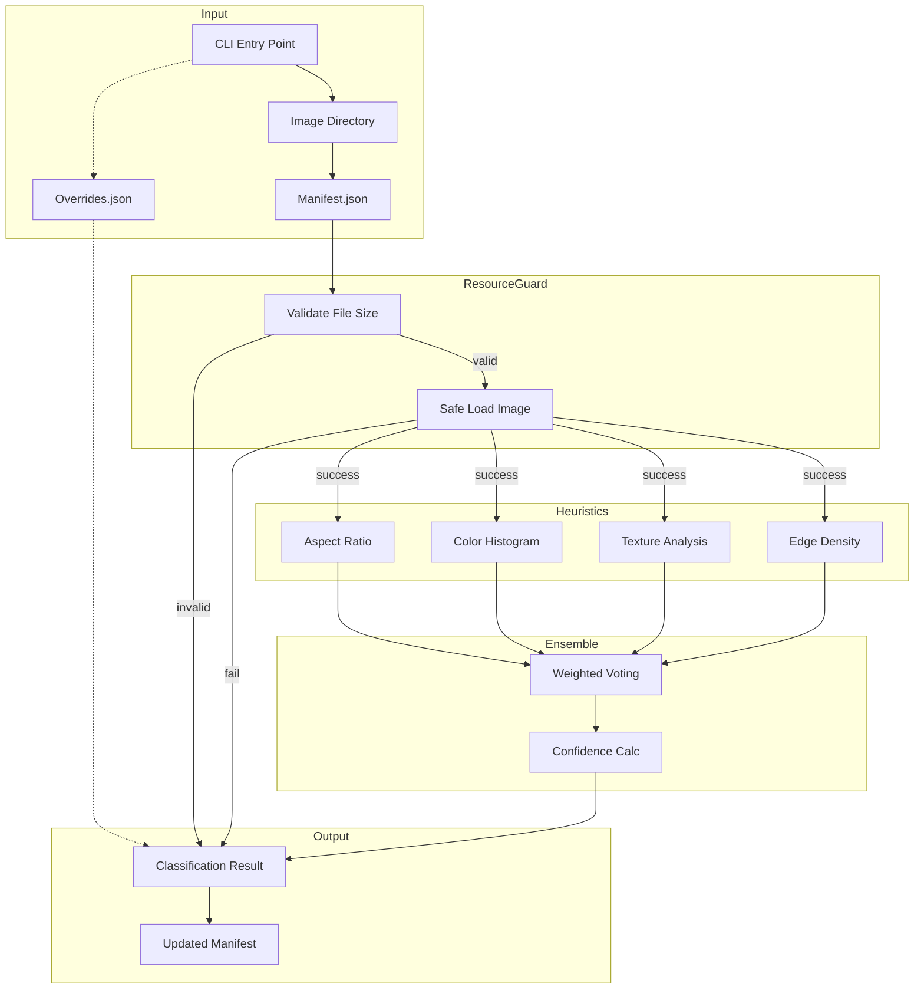

# LLD Finalized

Path: C:\Users\mcwiz\Projects\RCA-PDF-extraction-pipeline\docs\lld\active\LLD-033.md
Status: APPROVED
Reviews: 1

---

# 33 - Feature: G-FIAT Rock Photo Classifier

<!-- Template Metadata
Last Updated: 2026-02-02
Updated By: Issue #33 LLD Creation
Update Reason: Initial LLD for rock photo classification feature
-->

## 1. Context & Goal
* **Issue:** #33
* **Objective:** Build an image classifier that distinguishes rock sample photographs from other imagery types (logos, charts, diagrams) using visual heuristics, enabling efficient downstream processing for geological forensic analysis.
* **Status:** Draft
* **Related Issues:** #42 (Image extraction module - provides manifest format)

### Open Questions

- [x] ~~What is the exact manifest schema from Issue #42?~~ *Resolved: Schema locked in issue description*
- [ ] Should thin section confidence thresholds differ from core plug thresholds?
- [ ] What is the minimum acceptable accuracy before falling back to ML approach?

## 2. Proposed Changes

*This section is the **source of truth** for implementation. Describes exactly what will be built.*

### 2.1 Files Changed

| File | Change Type | Description |
|------|-------------|-------------|
| `src/gfiat/classify.py` | Add | Main classifier module with CLI entry point |
| `src/gfiat/classifiers/__init__.py` | Add | Package init exposing classifier classes |
| `src/gfiat/classifiers/aspect_ratio.py` | Add | Aspect ratio heuristic classifier |
| `src/gfiat/classifiers/color_histogram.py` | Add | Color analysis heuristic (earth-tone detection) |
| `src/gfiat/classifiers/texture.py` | Add | Texture analysis using Laplacian variance/LBP |
| `src/gfiat/classifiers/edge_density.py` | Add | Edge detection heuristic (Canny-based) |
| `src/gfiat/classifiers/ensemble.py` | Add | Voting ensemble combining all heuristics |
| `src/gfiat/classifiers/resource_guard.py` | Add | Decompression bomb and resource limit protection |
| `tests/test_classify.py` | Add | Unit tests for classifier module |
| `tests/test_classifiers/` | Add | Individual tests for each heuristic |
| `tests/fixtures/classify/` | Add | Test images directory |
| `tests/fixtures/classify/ground_truth/` | Add | Labeled ground truth dataset (50+ images) |
| `tests/fixtures/classify/ground_truth/manifest.json` | Add | Ground truth classification labels |

### 2.2 Dependencies

*New packages, APIs, or services required.*

```toml
# pyproject.toml additions
pillow = "^10.0.0"
numpy = "^1.24.0"
scikit-image = "^0.21.0"
```

### 2.3 Data Structures

```python
# Pseudocode - NOT implementation
from typing import TypedDict, Literal

ClassificationType = Literal["rock_photo", "thin_section", "chart", "logo", "diagram", "unknown"]
ClassificationSource = Literal["heuristic", "manual"]

class HeuristicResult(TypedDict):
    """Result from a single heuristic classifier."""
    name: str                    # Heuristic identifier (e.g., "aspect_ratio")
    classification: ClassificationType
    confidence: float            # 0.0 to 1.0
    features: dict               # Raw feature values for debugging

class ClassificationResult(TypedDict):
    """Final classification for an image."""
    classification: ClassificationType
    classification_confidence: float
    classification_source: ClassificationSource
    heuristic_details: list[HeuristicResult]  # Optional, for debugging

class ImageEntry(TypedDict):
    """Image entry in manifest (extended from Issue #42)."""
    path: str                    # Relative path to extracted image
    page: int                    # 1-indexed page number
    type: str                    # embedded|inline|background
    width: int                   # Pixels
    height: int                  # Pixels
    format: str                  # jpeg|png|tiff
    # Added by classifier:
    classification: ClassificationType
    classification_confidence: float
    classification_source: ClassificationSource  # Optional

class Manifest(TypedDict):
    """Full manifest structure."""
    version: str
    source_document: str
    extraction_date: str         # ISO8601
    images: list[ImageEntry]

class OverrideEntry(TypedDict):
    """Manual override configuration entry."""
    path: str
    classification: ClassificationType
```

### 2.4 Function Signatures

```python
# src/gfiat/classify.py
def main(
    directory: Path,
    overrides: Path | None = None,
    threshold: float = 0.5,
    dry_run: bool = False,
    verbose: bool = False
) -> int:
    """CLI entry point. Returns exit code."""
    ...

def classify_directory(
    directory: Path,
    overrides: dict[str, ClassificationType] | None = None,
    threshold: float = 0.5
) -> Manifest:
    """Classify all images in directory, update manifest."""
    ...

def load_manifest(directory: Path) -> Manifest:
    """Load existing manifest from extraction output."""
    ...

def save_manifest(manifest: Manifest, directory: Path) -> None:
    """Atomically save manifest (temp file + rename)."""
    ...

# src/gfiat/classifiers/resource_guard.py
def configure_resource_limits(max_pixels: int = 89_478_485) -> None:
    """Configure PIL.Image.MAX_IMAGE_PIXELS."""
    ...

def validate_image_file(path: Path, max_size_mb: int = 50) -> tuple[bool, str]:
    """Pre-validate image file before loading. Returns (valid, reason)."""
    ...

def safe_load_image(path: Path) -> Image.Image | None:
    """Load image with resource protection. Returns None if unsafe."""
    ...

# src/gfiat/classifiers/aspect_ratio.py
def analyze_aspect_ratio(image: Image.Image) -> HeuristicResult:
    """Analyze image aspect ratio for classification hints."""
    ...

# src/gfiat/classifiers/color_histogram.py
def analyze_color_histogram(image: Image.Image) -> HeuristicResult:
    """Analyze color distribution for earth-tone ratio."""
    ...

# src/gfiat/classifiers/texture.py
def analyze_texture(image: Image.Image) -> HeuristicResult:
    """Analyze texture using Laplacian variance and LBP."""
    ...

# src/gfiat/classifiers/edge_density.py
def analyze_edge_density(image: Image.Image) -> HeuristicResult:
    """Analyze edge density and regularity using Canny."""
    ...

# src/gfiat/classifiers/ensemble.py
def classify_image(
    image: Image.Image,
    threshold: float = 0.5
) -> ClassificationResult:
    """Run all heuristics and produce final classification."""
    ...

def weighted_vote(
    results: list[HeuristicResult],
    weights: dict[str, float] | None = None
) -> tuple[ClassificationType, float]:
    """Combine heuristic results via weighted voting."""
    ...
```

### 2.5 Logic Flow (Pseudocode)

```
MAIN CLASSIFIER FLOW:
1. Configure resource limits (MAX_IMAGE_PIXELS, etc.)
2. Load manifest from directory
3. IF manifest not found THEN exit with error
4. Load override config IF provided
5. FOR EACH image in manifest:
   a. IF path in overrides THEN
      - Apply manual classification
      - Set source = "manual"
      - CONTINUE
   b. Validate image file (size, exists)
   c. IF validation fails THEN
      - Log warning
      - Set classification = "unknown", confidence = 0.0
      - CONTINUE
   d. Safe load image
   e. IF load fails (decompression bomb, corrupt) THEN
      - Log warning
      - Set classification = "unknown", confidence = 0.0
      - CONTINUE
   f. Run ensemble classifier
   g. Update image entry with classification
6. IF dry_run THEN print results, exit
7. Save manifest atomically
8. Return success

ENSEMBLE CLASSIFIER:
1. Run aspect_ratio analyzer → result_ar
2. Run color_histogram analyzer → result_ch
3. Run texture analyzer → result_tx
4. Run edge_density analyzer → result_ed
5. Collect all results
6. Apply weighted voting:
   - Group votes by classification
   - Weight by individual confidence and heuristic weight
   - Select classification with highest weighted score
7. Calculate final confidence = weighted agreement level
8. IF confidence < threshold THEN classification = "unknown"
9. Return ClassificationResult

ASPECT RATIO HEURISTIC:
1. Get width, height from image
2. Calculate ratio = max(w,h) / min(w,h)
3. IF ratio > 3.0 THEN likely logo/banner
4. IF ratio close to 1.0 THEN likely rock_photo or chart
5. Return classification hint with confidence

COLOR HISTOGRAM HEURISTIC:
1. Convert image to HSV color space
2. Compute histogram bins
3. Define earth-tone ranges (brown, gray, tan in HSV)
4. Calculate earth_tone_ratio = earth_pixels / total_pixels
5. IF earth_tone_ratio > 0.6 THEN likely rock_photo
6. IF high saturation + limited palette THEN likely logo/chart
7. Return classification hint with confidence

TEXTURE HEURISTIC:
1. Convert to grayscale
2. Calculate Laplacian variance (blur/sharpness)
3. Extract Local Binary Pattern features
4. IF high variance + organic LBP THEN likely rock_photo
5. IF low variance + smooth regions THEN likely logo
6. IF sharp edges + uniform regions THEN likely chart/diagram
7. Return classification hint with confidence

EDGE DENSITY HEURISTIC:
1. Convert to grayscale
2. Apply Canny edge detection
3. Calculate edge_density = edge_pixels / total_pixels
4. Analyze edge regularity (straight lines vs organic)
5. IF high density + irregular THEN likely rock_photo
6. IF moderate density + regular/geometric THEN likely diagram/chart
7. IF low density + isolated edges THEN likely logo
8. Return classification hint with confidence
```

### 2.6 Technical Approach

* **Module:** `src/gfiat/classifiers/`
* **Pattern:** Strategy pattern for individual heuristics, Ensemble voting for final decision
* **Key Decisions:**
  - Heuristics-first approach allows quick iteration without training data
  - Weighted voting enables tuning individual heuristic influence
  - Resource guard as separate module for testability
  - Atomic manifest writes prevent corruption on interruption

### 2.7 Architecture Decisions

| Decision | Options Considered | Choice | Rationale |
|----------|-------------------|--------|-----------|
| Classifier architecture | Single monolithic classifier, Pipeline of heuristics, Ensemble voting | Ensemble voting | Allows independent tuning, graceful degradation if one heuristic fails |
| Image loading | Direct PIL load, Lazy loading, Pre-validation + load | Pre-validation + guarded load | Prevents resource exhaustion before attempting load |
| Manifest update | In-place modification, Full rewrite, Atomic temp+rename | Atomic temp+rename | Prevents corruption on crash/interrupt |
| Thin section detection | Separate heuristic, Combined with rock_photo, Post-classification refinement | Combined in color/texture heuristics | Thin sections have distinct color profiles (polarized light) |

**Architectural Constraints:**
- Must integrate with Issue #42 manifest schema (locked)
- Cannot introduce ML dependencies for MVP (CPU heuristics only)
- Must process images in-memory without temporary file creation

## 3. Requirements

*What must be true when this is done. These become acceptance criteria.*

1. CLI `python -m src.gfiat.classify ./extracted/` processes all images in directory
2. Each image receives classification: `rock_photo`, `thin_section`, `chart`, `logo`, `diagram`, or `unknown`
3. Each classification includes confidence score between 0.0 and 1.0
4. Rock/core photos identified with >80% accuracy on ground truth test dataset
5. Images labeled as logos/charts in ground truth filtered with >90% accuracy
6. Manifest updated with `classification` and `classification_confidence` fields
7. Manual override via `--overrides config.json` applies specified classifications
8. Thin section photomicrographs distinguished from core plug photos
9. Graceful handling of corrupted/unreadable images (skip with warning)
10. Images exceeding resource limits (>50MB or decompression bomb) skipped with warning
11. Ground truth dataset of 50+ labeled images created and committed

## 4. Alternatives Considered

| Option | Pros | Cons | Decision |
|--------|------|------|----------|
| Heuristic-based classification | No training data needed, interpretable, fast iteration, works on CPU | May need tuning, accuracy ceiling | **Selected** |
| Pre-trained CNN (ResNet/VGG) | Higher accuracy potential, proven approach | Requires GPU or slow inference, black box, overkill for MVP | Rejected |
| Fine-tuned model on geological images | Best potential accuracy | Requires labeled training data, significant effort | Rejected (future option) |
| Cloud vision API (Google/AWS) | High accuracy, no maintenance | Cost per image, network dependency, may not know rock types | Rejected |

**Rationale:** Heuristics provide a fast, interpretable baseline. If accuracy is insufficient (<80% on rocks), we can add ML in a future iteration with the ground truth dataset as training data.

## 5. Data & Fixtures

### 5.1 Data Sources

| Attribute | Value |
|-----------|-------|
| Source | Extracted images from geological PDF reports (Issue #42 output) |
| Format | JPEG, PNG, TIFF image files |
| Size | Typically 10KB - 10MB per image, ~50-500 images per report |
| Refresh | Batch processing per extraction run |
| Copyright/License | Client-provided geological reports (internal use) |

### 5.2 Data Pipeline

```
PDF Reports ──Issue #42 Extract──► Extracted Images + Manifest ──This Issue Classify──► Manifest with Classifications
```

### 5.3 Test Fixtures

| Fixture | Source | Notes |
|---------|--------|-------|
| `ground_truth/rock_photo_*.jpg` | Curated from real reports | 15+ samples, various lighting/scales |
| `ground_truth/thin_section_*.jpg` | Curated from real reports | 10+ samples, polarized light microscopy |
| `ground_truth/chart_*.png` | Curated from real reports | 10+ samples, bar/line/pie charts |
| `ground_truth/logo_*.png` | Curated from real reports | 5+ samples, company logos |
| `ground_truth/diagram_*.png` | Curated from real reports | 5+ samples, geological diagrams |
| `ground_truth/ambiguous_*.jpg` | Curated edge cases | 5+ samples for low-confidence testing |
| `ground_truth/manifest.json` | Generated | Ground truth labels for accuracy calculation |
| `test_oversized.jpg` | Generated/mocked | For decompression bomb protection test |

### 5.4 Deployment Pipeline

Ground truth dataset committed to `tests/fixtures/classify/ground_truth/`.
CI pipeline runs classifier against ground truth and validates accuracy thresholds.
No separate data deployment needed - fixtures travel with code.

## 6. Diagram

### 6.1 Mermaid Quality Gate

Before finalizing any diagram, verify in [Mermaid Live Editor](https://mermaid.live) or GitHub preview:

- [x] **Simplicity:** Similar components collapsed (per 0006 §8.1)
- [x] **No touching:** All elements have visual separation (per 0006 §8.2)
- [x] **No hidden lines:** All arrows fully visible (per 0006 §8.3)
- [x] **Readable:** Labels not truncated, flow direction clear
- [ ] **Auto-inspected:** Agent rendered via mermaid.ink and viewed (per 0006 §8.5)

**Auto-Inspection Results:**
```
- Touching elements: [ ] None / [ ] Found: ___
- Hidden lines: [ ] None / [ ] Found: ___
- Label readability: [ ] Pass / [ ] Issue: ___
- Flow clarity: [ ] Clear / [ ] Issue: ___
```

*Reference: [0006-mermaid-diagrams.md](0006-mermaid-diagrams.md)*

### 6.2 Diagram



## 7. Security & Safety Considerations

### 7.1 Security

| Concern | Mitigation | Status |
|---------|------------|--------|
| Decompression bomb | Set `PIL.Image.MAX_IMAGE_PIXELS` to 89,478,485 before any load | Addressed |
| Directory traversal | Validate all paths are within specified directory | Addressed |
| Malicious override config | Strict JSON schema validation, reject unknown fields | Addressed |
| Memory exhaustion | Pre-validate file size (<50MB), dimension limits (10k x 10k) | Addressed |

### 7.2 Safety

| Concern | Mitigation | Status |
|---------|------------|--------|
| Manifest corruption | Atomic write (temp file + rename) | Addressed |
| Data loss | Never delete images, only add classification fields | Addressed |
| Partial processing | Track progress, resume-safe design | Addressed |
| Classification errors | Unknown class for low confidence, manual override available | Addressed |

**Fail Mode:** Fail Safe - Images that cannot be classified are marked `unknown` with 0.0 confidence, never deleted or corrupted.

**Recovery Strategy:** Re-run classifier on directory; idempotent operation overwrites previous classifications.

## 8. Performance & Cost Considerations

### 8.1 Performance

| Metric | Budget | Approach |
|--------|--------|----------|
| Per-image latency | < 500ms | Optimized numpy operations, lazy feature extraction |
| Memory per image | < 200MB | Process one image at a time, release after classification |
| Batch throughput | > 100 images/min | Sequential but fast heuristics |

**Bottlenecks:**
- Large images (>5000px) may slow texture analysis - mitigated by downsampling for analysis
- Color histogram on 16-bit TIFF may be slow - convert to 8-bit for analysis

### 8.2 Cost Analysis

| Resource | Unit Cost | Estimated Usage | Monthly Cost |
|----------|-----------|-----------------|--------------|
| CPU compute | Local | Batch jobs | $0 |
| Storage | Existing | No new storage | $0 |
| API calls | None | N/A | $0 |

**Cost Controls:**
- [x] No external API dependencies
- [x] All processing local/CPU-based
- [x] No cloud resources required

**Worst-Case Scenario:** Processing 10,000 images takes ~100 minutes on standard hardware. No cost implications.

## 9. Legal & Compliance

| Concern | Applies? | Mitigation |
|---------|----------|------------|
| PII/Personal Data | No | Geological images only, no personal data |
| Third-Party Licenses | Yes | PIL (HPND), numpy (BSD), scikit-image (BSD) - all compatible |
| Terms of Service | N/A | No external APIs |
| Data Retention | N/A | Images remain with client data |
| Export Controls | No | Standard image processing, no restricted algorithms |

**Data Classification:** Internal (client geological data)

**Compliance Checklist:**
- [x] No PII stored without consent (N/A - no PII)
- [x] All third-party licenses compatible with project license
- [x] External API usage compliant with provider ToS (N/A - no APIs)
- [x] Data retention policy documented (follows client data policies)

## 10. Verification & Testing

*Ref: [0005-testing-strategy-and-protocols.md](0005-testing-strategy-and-protocols.md)*

**Testing Philosophy:** All test scenarios are automated. Ground truth dataset enables accuracy verification in CI.

### 10.1 Test Scenarios

| ID | Scenario | Type | Input | Expected Output | Pass Criteria |
|----|----------|------|-------|-----------------|---------------|
| 010 | Happy path - classify directory | Auto | Directory with manifest + images | Updated manifest with classifications | All images classified, manifest valid |
| 020 | Rock photo detection | Auto | Ground truth rock photos | classification="rock_photo" | >80% accuracy on ground truth |
| 030 | Thin section detection | Auto | Ground truth thin sections | classification="thin_section" | >75% accuracy on ground truth |
| 040 | Chart filtering | Auto | Ground truth charts | classification="chart" | >90% accuracy on ground truth |
| 050 | Logo filtering | Auto | Ground truth logos | classification="logo" | >90% accuracy on ground truth |
| 060 | Diagram classification | Auto | Ground truth diagrams | classification="diagram" | >85% accuracy on ground truth |
| 070 | Low confidence handling | Auto | Ambiguous images | classification="unknown", low confidence | Confidence < 0.5 for ambiguous |
| 080 | Manual override | Auto | Overrides.json specifying classifications | Manual classifications applied | source="manual", correct class |
| 090 | Decompression bomb protection | Auto | Oversized/malicious image | Skip with warning, no crash | Process continues, warning logged |
| 100 | File size limit | Auto | >50MB file | Skip with warning | Warning logged, other images processed |
| 110 | Corrupted image | Auto | Truncated/invalid image file | Skip with warning | Graceful handling, no exception |
| 120 | Empty directory | Auto | Directory with no images/manifest | Clear error message | Exit code non-zero, helpful message |
| 130 | Dry run mode | Auto | --dry-run flag | Print results, no manifest change | Manifest unchanged, output shown |
| 140 | Verbose mode | Auto | --verbose flag | Detailed heuristic scores | Additional debug output |
| 150 | Manifest integrity | Auto | Pre/post classification comparison | Only classification fields added | All other fields unchanged |
| 160 | Aspect ratio heuristic | Auto | Various aspect ratio images | Correct classification hints | Wide images flagged as logo-likely |
| 170 | Color histogram heuristic | Auto | Earth-tone vs bright images | Correct earth-tone ratio | Rock photos have high earth-tone |
| 180 | Texture heuristic | Auto | Grainy vs smooth images | Correct texture scores | Rock photos have high variance |
| 190 | Edge density heuristic | Auto | Organic vs geometric edges | Correct edge analysis | Charts have regular edges |
| 200 | Ensemble voting | Auto | Mixed heuristic results | Correct weighted vote | Final classification matches majority |

### 10.2 Test Commands

```bash
# Run all automated tests
poetry run pytest tests/test_classify.py tests/test_classifiers/ -v

# Run only fast/mocked tests (exclude ground truth accuracy tests)
poetry run pytest tests/test_classify.py -v -m "not ground_truth"

# Run ground truth accuracy verification
poetry run pytest tests/test_classify.py -v -m ground_truth

# Run with coverage
poetry run pytest tests/test_classify.py tests/test_classifiers/ --cov=src/gfiat/classifiers --cov-report=term-missing
```

### 10.3 Manual Tests (Only If Unavoidable)

N/A - All scenarios automated. Ground truth dataset enables full accuracy verification in CI.

## 11. Risks & Mitigations

| Risk | Impact | Likelihood | Mitigation |
|------|--------|------------|------------|
| Heuristics fail to achieve 80% rock accuracy | High | Medium | Fallback to ML approach with ground truth as training data |
| Ground truth dataset too small for statistical significance | Medium | Low | Start with 50+, expand if needed |
| Thin sections misclassified as rock_photo | Medium | Medium | Dedicated color analysis for polarized light signatures |
| Edge cases (annotated photos, scale bars) confuse classifiers | Low | Medium | Add specific handling, expand ground truth |
| Large reports overwhelm memory | Medium | Low | Stream processing, one image at a time |

## 12. Definition of Done

### Code
- [ ] Implementation complete and linted
- [ ] Code comments reference this LLD
- [ ] All heuristic classifiers implemented
- [ ] Ensemble voting logic complete
- [ ] Resource guard module protecting against decompression bombs

### Tests
- [ ] All test scenarios pass
- [ ] Test coverage >90% on classifier logic
- [ ] Ground truth accuracy meets thresholds (>80% rock, >90% logos/charts)

### Documentation
- [ ] LLD updated with any deviations
- [ ] Implementation Report (0103) completed
- [ ] Test Report (0113) completed with accuracy metrics
- [ ] Wiki updated with classifier usage and heuristic explanations
- [ ] Override config JSON schema documented
- [ ] Ground truth dataset format documented

### Review
- [ ] Code review completed
- [ ] User approval before closing issue

---

## Appendix: Review Log

*Track all review feedback with timestamps and implementation status.*

### Review Summary

| Review | Date | Verdict | Key Issue |
|--------|------|---------|-----------|
| - | - | - | Awaiting initial review |

**Final Status:** APPROVED
<!-- Note: This field is auto-updated to APPROVED by the workflow when finalized -->