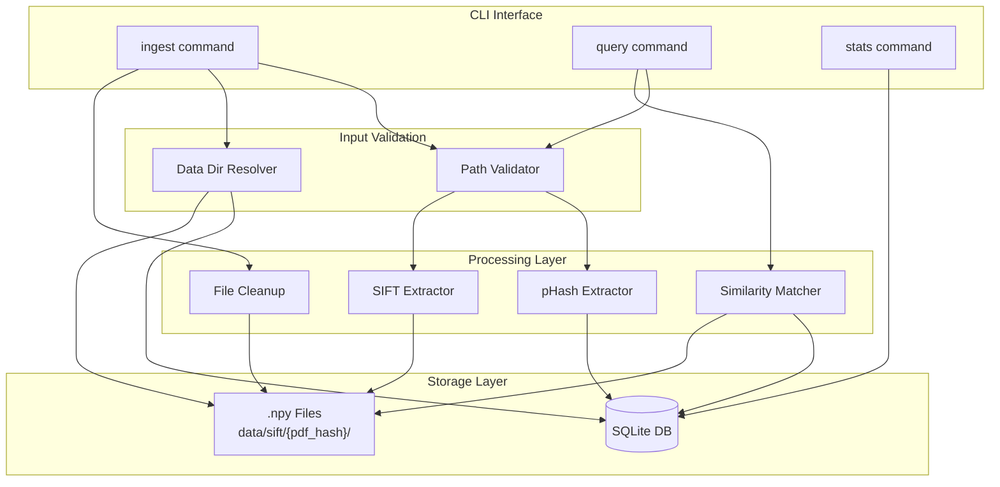

# 134 - Feature: Historical Reference Database for Cross-Report Image Comparison

<!-- Template Metadata
Last Updated: 2026-02-02
Updated By: LLD Creation for Issue #34
Update Reason: Revision addressing Gemini Review #2 feedback - file cleanup and data_dir resolution
Previous: Revision addressing Gemini Review #1 feedback
-->

## 1. Context & Goal
* **Issue:** #34
* **Objective:** Build a persistent database of image fingerprints from historical reports to enable cross-report duplicate detection that catches fraud spanning multiple documents.
* **Status:** Draft
* **Related Issues:** #23 (Data Ingestion - must be completed first)

## 2. Proposed Changes

*This section is the **source of truth** for implementation. Describe exactly what will be built.*

### 2.1 Files Changed

| File | Change Type | Description |
|------|-------------|-------------|
| `gfiat/db/__init__.py` | Add | Database module initialization and exports |
| `gfiat/db/schema.py` | Add | SQLite schema definition and migrations |
| `gfiat/db/ingest.py` | Add | Ingestion logic for historical reports |
| `gfiat/db/query.py` | Add | Query functions for similarity search |
| `gfiat/db/validation.py` | Add | Input path sanitization and validation |
| `gfiat/db/__main__.py` | Add | CLI entry point for database operations |
| `tests/test_db_ingest.py` | Add | Ingestion tests |
| `tests/test_db_query.py` | Add | Query tests |
| `tests/test_db_validation.py` | Add | Path validation tests |
| `tests/test_db_schema.py` | Add | Schema and index verification tests |

### 2.2 Dependencies

*New packages, APIs, or services required.*

```toml
# pyproject.toml additions
opencv-python = "^4.8.0"  # SIFT implementation (patent expired 2020)
numpy = "^1.24.0"         # Array storage for SIFT descriptors
imagehash = "^4.3.0"      # pHash computation
```

### 2.3 Data Structures

```python
# Pseudocode - NOT implementation
from typing import TypedDict, Optional, List

class ImageRecord(TypedDict):
    id: int
    source_pdf: str          # Original PDF filename
    page_num: Optional[int]  # Page number within PDF
    image_index: Optional[int]  # Image index on page
    phash: str               # Perceptual hash (64-bit hex)
    sift_file: Optional[str] # Relative path to .npy descriptor file
    extracted_date: str      # ISO 8601 timestamp
    well_name: Optional[str] # Well identifier if available
    depth: Optional[str]     # Depth information if available

class QueryResult(TypedDict):
    image: ImageRecord
    match_type: str          # "exact_phash", "similar_phash", "sift_match"
    distance: Optional[int]  # Hamming distance for pHash matches
    match_ratio: Optional[float]  # SIFT match ratio

class IngestStats(TypedDict):
    total_files: int
    ingested: int
    skipped: int
    errors: int
    error_log_path: Optional[str]

class DatabaseStats(TypedDict):
    total_images: int
    unique_pdfs: int
    database_size_bytes: int
    sift_storage_bytes: int
```

**SIFT File Organization:**
SIFT descriptor files are organized by PDF-derived hash directory to prevent the root SIFT directory from becoming unmanageable:
```
data/sift/{pdf_hash}/{image_id}.npy
```
Where `pdf_hash` is an 8-character truncated SHA256 hash of the source PDF filename.

**Data Directory Resolution:**
The `data/` directory is resolved relative to the **project root**, detected by locating `pyproject.toml` in ancestor directories. If `pyproject.toml` is not found, the current working directory is used. This can be overridden via the `GFIAT_DATA_DIR` environment variable.

```python
# Resolution order:
# 1. GFIAT_DATA_DIR environment variable (if set)
# 2. Relative to project root (directory containing pyproject.toml)
# 3. Fallback: Current working directory
```

### 2.4 Function Signatures

```python
# gfiat/db/validation.py
def validate_path(path: str) -> str:
    """Validate and sanitize file path. Rejects absolute paths and parent references.
    
    Raises:
        ValueError: If path is absolute or contains '../'
    """
    ...

def is_safe_path(path: str) -> bool:
    """Check if path is safe (relative, no parent traversal)."""
    ...

def resolve_data_dir() -> str:
    """Resolve the data directory path.
    
    Resolution order:
    1. GFIAT_DATA_DIR environment variable (if set)
    2. Relative to project root (directory containing pyproject.toml)
    3. Fallback: Current working directory
    
    Returns:
        Absolute path to data directory
    """
    ...

def find_project_root() -> Optional[str]:
    """Find project root by locating pyproject.toml in ancestor directories.
    
    Returns:
        Absolute path to project root, or None if not found
    """
    ...

# gfiat/db/schema.py
def init_database(db_path: str) -> sqlite3.Connection:
    """Initialize database with schema. Creates tables if not exist."""
    ...

def get_connection(db_path: str) -> sqlite3.Connection:
    """Get database connection with row factory configured."""
    ...

def verify_indexes(conn: sqlite3.Connection) -> bool:
    """Verify that required indexes exist. Returns True if all indexes present."""
    ...

# gfiat/db/ingest.py
def ingest_directory(
    directory: str,
    db_path: str,
    mode: str = "skip-existing"  # "skip-existing", "update-existing", "force"
) -> IngestStats:
    """Ingest all images from directory into database."""
    ...

def extract_phash(image_path: str) -> str:
    """Extract perceptual hash from image file."""
    ...

def extract_sift_descriptors(image_path: str) -> np.ndarray:
    """Extract SIFT descriptors from image file."""
    ...

def store_sift_file(descriptors: np.ndarray, base_dir: str, pdf_hash: str, image_id: int) -> str:
    """Store SIFT descriptors as .npy file in PDF-hash subdirectory. Returns relative path."""
    ...

def compute_pdf_hash(pdf_filename: str) -> str:
    """Compute 8-character hash from PDF filename for directory organization."""
    ...

def delete_sift_files(file_paths: List[str], base_dir: str) -> int:
    """Delete physical SIFT .npy files from disk.
    
    Args:
        file_paths: List of relative paths to .npy files
        base_dir: Base directory for SIFT storage
        
    Returns:
        Number of files successfully deleted
    """
    ...

def cleanup_empty_pdf_directories(base_dir: str, pdf_hash: str) -> bool:
    """Remove PDF hash directory if empty after file deletion.
    
    Returns:
        True if directory was removed, False otherwise
    """
    ...

# gfiat/db/query.py
def query_by_phash(
    phash: str,
    db_path: str,
    threshold: int = 5
) -> List[QueryResult]:
    """Find images with matching or similar pHash."""
    ...

def query_by_image(
    image_path: str,
    db_path: str,
    phash_threshold: int = 5,
    sift_ratio: float = 0.75
) -> List[QueryResult]:
    """Find similar images by analyzing image file."""
    ...

def hamming_distance(hash1: str, hash2: str) -> int:
    """Calculate Hamming distance between two pHash values."""
    ...

def sift_match(
    descriptors1: np.ndarray,
    descriptors2: np.ndarray,
    ratio: float = 0.75
) -> float:
    """Calculate SIFT match ratio using FLANN matcher."""
    ...

def get_database_stats(db_path: str) -> DatabaseStats:
    """Return statistics about the database."""
    ...
```

### 2.5 Logic Flow (Pseudocode)

**Ingestion Flow:**
```
1. Receive directory path and mode flag
2. Validate path (reject absolute, reject ../)
3. Resolve data directory using resolve_data_dir()
4. Get/create database connection
5. Scan directory recursively for image files
6. Group images by source PDF
7. FOR each source PDF:
   a. Check if source PDF already exists in database
   b. IF exists AND mode == "skip-existing":
      - Log skip, continue to next PDF
   c. IF exists AND mode == "force":
      - Query and retrieve list of sift_file paths for this PDF
      - Delete physical .npy files from disk using delete_sift_files()
      - Cleanup empty PDF hash directories using cleanup_empty_pdf_directories()
      - Delete ALL existing DB entries for this PDF (ONCE, before processing images)
   d. FOR each image in this PDF:
      i. TRY:
         - Extract pHash from image
         - Extract SIFT descriptors from image
         - Compute PDF hash for directory organization
         - Store SIFT as .npy file in data/sift/{pdf_hash}/ directory
         - Insert/update record in database
      ii. EXCEPT (file corruption, read error):
         - Log error to ingest_errors.log
         - Continue processing remaining images
8. Return IngestStats with counts
```

**Query by pHash Flow:**
```
1. Receive pHash and threshold
2. Query database for all pHash values
3. FOR each stored pHash:
   a. Calculate Hamming distance
   b. IF distance == 0:
      - Add to results as "exact_phash"
   c. ELIF distance <= threshold:
      - Add to results as "similar_phash"
4. Sort results by distance (ascending)
5. Return results with source metadata
```

**Query by Image Flow:**
```
1. Receive image path, thresholds
2. Validate path
3. Extract pHash from query image
4. Extract SIFT descriptors from query image
5. Query database for similar pHash (using query_by_phash)
6. FOR each candidate from pHash query:
   a. Load SIFT descriptors from .npy file
   b. Calculate SIFT match ratio
   c. IF ratio >= sift_ratio threshold:
      - Add SIFT match info to result
7. Return combined results
```

### 2.6 Technical Approach

* **Module:** `gfiat/db/`
* **Pattern:** Repository pattern for database access; Strategy pattern for duplicate handling modes
* **Key Decisions:**
  - SQLite for simplicity and portability (no external database server)
  - SIFT descriptors stored as .npy files to keep SQLite database lightweight
  - SIFT files organized by PDF-hash subdirectories to prevent flat directory bloat
  - Relative paths throughout for database portability
  - Non-interactive CLI flags for duplicate handling to enable automation
  - Data directory resolved relative to project root (pyproject.toml location) with environment variable override

### 2.7 Architecture Decisions

| Decision | Options Considered | Choice | Rationale |
|----------|-------------------|--------|-----------|
| Database engine | SQLite, PostgreSQL, FAISS | SQLite | Simpler deployment, sufficient for MVP scale, future FAISS migration path preserved |
| SIFT storage | Embedded in SQLite, Separate files | Separate .npy files | Keeps database small, faster queries on metadata, standard numpy format |
| SIFT directory structure | Flat directory, PDF-hash subdirectories | PDF-hash subdirectories | Prevents root directory from becoming unmanageable with thousands of files |
| Path storage | Absolute, Relative | Relative | Database portability, security (no path traversal risk) |
| Duplicate handling | Interactive prompts, CLI flags | CLI flags | Enables automation, scripting, non-interactive batch processing |
| SIFT library | OpenCV, scikit-image, custom | OpenCV | Mature implementation, patent expired 2020, well-documented |
| Data directory resolution | CWD-relative, Project root-relative, Env var | Project root with env var override | Consistent behavior regardless of execution directory; configurable for CI/deployment |

**Architectural Constraints:**
- Must integrate with existing Data Ingestion framework (#23)
- Database file must remain on local filesystem only (no cloud sync)
- All paths stored as relative to ensure portability
- Physical SIFT files must be cleaned up when database entries are deleted (--force mode)

**Expected Database Size:**
- Initial deployment target: ~10,000 images
- pHash database: ~1MB per 1,000 images
- SIFT storage: ~500MB per 1,000 images
- Total for 10K images: ~10MB database + ~5GB SIFT files

## 3. Requirements

*What must be true when this is done. These become acceptance criteria.*

1. SQLite database created with schema for image metadata and pHash indexing
2. pHash values stored with B-tree index for fast lookup queries
3. SIFT descriptors stored as `.npy` files with relative paths in database
4. Query returns images with exact pHash match
5. Query returns images within configurable Hamming distance threshold (default: 5)
6. Query returns images with SIFT match ratio above configurable threshold (default: 0.75)
7. `ingest` command adds all images from directory to database
8. `ingest` command supports `--skip-existing`, `--update-existing`, and `--force` flags
9. System rejects absolute paths and parent directory references in CLI arguments
10. Corrupted files during ingestion are skipped and logged, not crash-causing
11. Database file stored locally only with no external transmission
12. Physical SIFT files are deleted when using `--force` to prevent orphaned files

## 4. Alternatives Considered

| Option | Pros | Cons | Decision |
|--------|------|------|----------|
| SQLite + file-based SIFT | Simple, portable, no external deps | Limited to ~10K images efficiently | **Selected** |
| FAISS vector database | Scales to millions, fast ANN search | Additional complexity, overkill for MVP | Rejected (future migration path) |
| PostgreSQL | Better concurrency, richer queries | Requires database server, deployment complexity | Rejected |
| Embedding SIFT in SQLite BLOBs | Single file database | Large database file, slow metadata queries | Rejected |

**Rationale:** SQLite with file-based SIFT storage provides the best balance of simplicity, portability, and sufficient performance for the expected initial scale. Schema design allows future FAISS migration if needed.

## 5. Data & Fixtures

### 5.1 Data Sources

| Attribute | Value |
|-----------|-------|
| Source | Extracted images from PDF reports (via #23 Data Ingestion) |
| Format | PNG/JPEG images in directory structure |
| Size | ~50-200 images per report, ~1MB average per image |
| Refresh | Manual via `ingest` command |
| Copyright/License | Internal well log images - proprietary |

### 5.2 Data Pipeline

```
PDF Reports ──#23 extraction──► Image Files ──ingest cmd──► SQLite + .npy files
                                    │
                                    └──query cmd──► Match Results (JSON)
```

### 5.3 Test Fixtures

| Fixture | Source | Notes |
|---------|--------|-------|
| Sample images with known pHash | Generated synthetic images | 3 identical, 3 near-duplicate, 3 unique |
| Corrupted image file | Generated (truncated PNG) | For error handling test |
| Mock directory structure | Generated | Simulates extracted report structure |
| Pre-computed SIFT descriptors | Generated from sample images | For query testing |
| Multi-page PDF images | Generated | For testing multi-image PDF ingestion |

### 5.4 Deployment Pipeline

Development: Local SQLite file in `data/gfiat.db`, SIFT files in `data/sift/{pdf_hash}/`
Testing: In-memory SQLite or temp directory
Production: User-specified path via CLI or config

**Data source is internal:** No separate utility needed beyond the CLI commands.

## 6. Diagram

### 6.1 Mermaid Quality Gate

Before finalizing any diagram, verify in [Mermaid Live Editor](https://mermaid.live) or GitHub preview:

- [x] **Simplicity:** Similar components collapsed (per 0006 §8.1)
- [x] **No touching:** All elements have visual separation (per 0006 §8.2)
- [x] **No hidden lines:** All arrows fully visible (per 0006 §8.3)
- [x] **Readable:** Labels not truncated, flow direction clear
- [ ] **Auto-inspected:** Agent rendered via mermaid.ink and viewed (per 0006 §8.5)

**Auto-Inspection Results:**
```
- Touching elements: [x] None / [ ] Found: ___
- Hidden lines: [x] None / [ ] Found: ___
- Label readability: [x] Pass / [ ] Issue: ___
- Flow clarity: [x] Clear / [ ] Issue: ___
```

### 6.2 Diagram



## 7. Security & Safety Considerations

### 7.1 Security

| Concern | Mitigation | Status |
|---------|------------|--------|
| Path traversal attacks | Reject absolute paths and `../` in all path inputs | Addressed |
| Database injection | Use parameterized queries exclusively | Addressed |
| Unauthorized data access | Database contains fingerprints only, not original images | Addressed |
| Data exfiltration | Local-only storage enforced; no network transmission | Addressed |

### 7.2 Safety

| Concern | Mitigation | Status |
|---------|------------|--------|
| Data loss on ingestion failure | Transaction rollback on batch errors; skip-and-log for individual file errors | Addressed |
| Database corruption | SQLite WAL mode for crash safety; recommend regular backups | Addressed |
| Disk space exhaustion | Stats command reports storage size; SIFT files ~50MB/100 images | Addressed |
| Partial ingestion state | Atomic transactions per PDF; consistent state guaranteed | Addressed |
| Multi-image PDF data loss | Delete-before-insert happens ONCE per PDF, outside image loop | Addressed |
| Orphaned SIFT files | Physical files deleted before DB entries on --force; prevents disk exhaustion | Addressed |

**Fail Mode:** Fail Open - On individual file read errors, log and continue processing remaining files. Maximizes data ingestion while recording failures.

**Recovery Strategy:** Re-run ingest with `--force` flag to rebuild entries for specific PDFs. Error log identifies failed files for investigation.

## 8. Performance & Cost Considerations

### 8.1 Performance

| Metric | Budget | Approach |
|--------|--------|----------|
| pHash query latency | < 100ms for 10K images | B-tree index on pHash column |
| SIFT matching latency | < 1s per candidate | FLANN matcher with optimized parameters |
| Ingestion throughput | > 10 images/second | Batch inserts, deferred SIFT extraction |
| Memory usage | < 512MB | Stream processing, don't load all descriptors |

**Bottlenecks:** 
- SIFT extraction is CPU-intensive (~100ms per image)
- SIFT matching requires loading .npy files from disk
- Large-scale queries (10K+ images) may need pagination

### 8.2 Cost Analysis

| Resource | Unit Cost | Estimated Usage | Monthly Cost |
|----------|-----------|-----------------|--------------|
| Local storage (pHash) | $0 | ~1MB per 100 images | $0 |
| Local storage (SIFT) | $0 | ~50MB per 100 images | $0 |
| Compute (ingestion) | $0 | Local CPU | $0 |

**Cost Controls:**
- [x] No cloud resources required
- [x] All processing is local
- [x] Storage is bounded by local disk

**Worst-Case Scenario:** With 100K images: ~1GB pHash database, ~50GB SIFT files. Manageable on modern workstations. If scale exceeds this, migrate to FAISS.

## 9. Legal & Compliance

| Concern | Applies? | Mitigation |
|---------|----------|------------|
| PII/Personal Data | No | Image fingerprints only; well names are not PII |
| Third-Party Licenses | Yes | OpenCV (Apache 2.0), imagehash (BSD), numpy (BSD) - all compatible |
| Terms of Service | N/A | No external APIs used |
| Data Retention | Yes | User controls via `--force` flag to re-ingest |
| Export Controls | N/A | No restricted algorithms |

**Data Classification:** Internal - Contains well names and report references

**Compliance Checklist:**
- [x] No PII stored
- [x] All third-party licenses compatible with project license
- [x] No external API usage
- [x] Data retention controlled by user

## 10. Verification & Testing

### 10.1 Test Scenarios

| ID | Scenario | Type | Input | Expected Output | Pass Criteria |
|----|----------|------|-------|-----------------|---------------|
| 010 | Ingest single image | Auto | Directory with 1 image | 1 record in database, 1 .npy file | Stats show 1 image |
| 020 | Ingest batch of images | Auto | Directory with 10 images | 10 records, 10 .npy files | Stats show 10 images |
| 025 | Ingest PDF with multiple pages | Auto | PDF with 5 images, --force twice | All 5 images persist after second ingest | Count == 5 after both ingests |
| 026 | Verify file cleanup on force | Auto | Ingest PDF, re-ingest with --force | Old .npy files deleted, new ones created | Old file paths no longer exist on disk |
| 030 | Query exact pHash match | Auto | pHash of existing image | 1 result with distance=0 | match_type="exact_phash" |
| 040 | Query similar pHash | Auto | pHash with HD=3 from existing | Result with distance=3 | distance <= threshold |
| 050 | Query no match | Auto | pHash not in database | Empty result list | len(results) == 0 |
| 060 | Query by image file | Auto | Image similar to existing | Results with SIFT matches | match_ratio >= threshold |
| 070 | Reject absolute path | Auto | `/etc/passwd` | ValueError raised | Exception message contains "absolute" |
| 080 | Reject parent traversal | Auto | `../../../etc/passwd` | ValueError raised | Exception message contains ".." |
| 090 | Skip corrupted file | Auto | Directory with 1 good, 1 corrupted | 1 record ingested, 1 error logged | Error log contains corrupted filename |
| 100 | Skip existing PDF (default) | Auto | Ingest same PDF twice | No duplicate entries | Count unchanged on second ingest |
| 110 | Force re-ingest | Auto | Ingest same PDF with --force | Entries replaced | extracted_date updated |
| 120 | Update existing | Auto | Ingest same PDF with --update-existing | Entries updated in place | Record count unchanged, data updated |
| 130 | Configurable threshold | Auto | Query with --threshold 10 | Wider matches returned | Results include HD=8 match |
| 140 | Configurable ratio | Auto | Query with --ratio 0.5 | More SIFT matches returned | Results include ratio=0.6 match |
| 150 | Database stats | Auto | Database with known content | Correct counts returned | Matches expected values |
| 160 | Relative path storage | Auto | Ingest images | All sift_file values are relative | No absolute paths in database |
| 170 | Schema index verification | Auto | Initialize database | All required indexes exist | verify_indexes() returns True |
| 180 | SIFT directory structure | Auto | Ingest images from 2 PDFs | Files organized in pdf_hash subdirectories | Each PDF has separate subdirectory |
| 190 | Data dir from env var | Auto | Set GFIAT_DATA_DIR, ingest | Files stored in env var path | Database created in specified location |
| 200 | Data dir from project root | Auto | Run from subdirectory | Files stored relative to pyproject.toml | Database in project_root/data/ |

### 10.2 Test Commands

```bash
# Run all automated tests
poetry run pytest tests/test_db_*.py -v

# Run only fast/mocked tests (exclude live)
poetry run pytest tests/test_db_*.py -v -m "not live"

# Run specific test file
poetry run pytest tests/test_db_validation.py -v

# Run schema tests
poetry run pytest tests/test_db_schema.py -v

# Run with coverage
poetry run pytest tests/test_db_*.py -v --cov=gfiat/db
```

### 10.3 Manual Tests (Only If Unavoidable)

N/A - All scenarios automated.

## 11. Risks & Mitigations

| Risk | Impact | Likelihood | Mitigation |
|------|--------|------------|------------|
| Database corruption loses reference data | High | Low | Document backup strategy; SQLite WAL mode |
| Scale exceeds SQLite performance | Med | Low | Schema designed for FAISS migration path |
| SIFT descriptors consume excessive disk | Med | Med | Document storage estimates; monitor via stats command |
| Path validation bypass | High | Low | Comprehensive test coverage; defense in depth |
| Dependency version conflicts | Low | Med | Pin versions in pyproject.toml |
| Multi-image PDF ingestion data loss | High | Low | Delete-before-insert logic moved outside image loop; regression test added |
| Orphaned SIFT files exhaust disk | Med | Med | Physical file deletion before DB cleanup on --force; test coverage added |
| Inconsistent data directory resolution | Med | Med | Explicit resolution logic with env var override; documented behavior |

## 12. Definition of Done

### Code
- [ ] Implementation complete and linted
- [ ] Code comments reference this LLD

### Tests
- [ ] All test scenarios pass
- [ ] Test coverage meets threshold (>80%)

### Documentation
- [ ] LLD updated with any deviations
- [ ] Implementation Report (0103) completed
- [ ] Test Report (0113) completed if applicable
- [ ] Module docstring documents CLI usage

### Review
- [ ] Code review completed
- [ ] User approval before closing issue

---

## Appendix: Review Log

*Track all review feedback with timestamps and implementation status.*

### Gemini Review #1 (REVISE)

**Timestamp:** 2026-02-02
**Reviewer:** Gemini 3 Pro
**Verdict:** REVISE

#### Comments

| ID | Comment | Implemented? |
|----|---------|--------------|
| G1.1 | "Unsafe Destructive Logic (CRITICAL): Delete existing entries logic inside image loop causes data loss" | YES - Refactored Section 2.5 to group images by PDF and delete ONCE before image loop |
| G1.2 | "Unresolved Open Questions: SIFT directory organization and DB size must be resolved" | YES - Removed Open Questions section; added SIFT directory structure to Section 2.3 and DB size estimates to Section 2.7 |
| G1.3 | "Path Structure Verification: Verify src/ vs flat layout" | YES - Updated all paths from `src/gfiat/` to `gfiat/` in Section 2.1 and throughout |
| G1.4 | "Missing Schema Tests: No test_db_schema.py listed" | YES - Added `tests/test_db_schema.py` to Section 2.1 and test scenario 170 in Section 10.1 |
| G1.5 | "Explicit SIFT Structure suggestion" | YES - Added pdf_hash subdirectory structure to Section 2.3 and Section 2.7 |
| G1.6 | "Test Coverage suggestion: Add multi-page PDF test" | YES - Added test scenario 025 "Ingest PDF with multiple pages" in Section 10.1 |

### Gemini Review #2 (REVISE)

**Timestamp:** 2026-02-02
**Reviewer:** Gemini 3 Pro
**Verdict:** REVISE

#### Comments

| ID | Comment | Implemented? |
|----|---------|--------------|
| G2.1 | "Ambiguous Storage Root: data/ path resolution undefined" | YES - Added resolve_data_dir() function in Section 2.4, documented resolution logic in Section 2.3, added test scenarios 190 and 200 |
| G2.2 | "Orphaned File Leak: Physical .npy files not deleted on --force" | YES - Added delete_sift_files() and cleanup_empty_pdf_directories() functions in Section 2.4, updated ingestion flow step 7c in Section 2.5, added Requirement 12 in Section 3 |
| G2.3 | "Missing Test for File Cleanup" | YES - Added test scenario 026 "Verify file cleanup on force" in Section 10.1 |

### Review Summary

| Review | Date | Verdict | Key Issue |
|--------|------|---------|-----------|
| Gemini #1 | 2026-02-02 | REVISE | Critical: Delete logic inside image loop causes data loss |
| Gemini #2 | 2026-02-02 | REVISE | High: Orphaned SIFT files on --force; Ambiguous data directory |

**Final Status:** PENDING