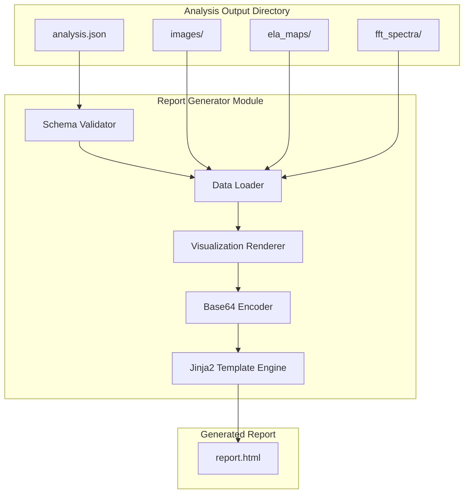

# 135 - Feature: HTML Forensic Report Generator

<!-- Template Metadata
Last Updated: 2026-02-02
Updated By: LLD Creation for Issue #35
Update Reason: Initial LLD creation for HTML Forensic Report Generator
-->

## 1. Context & Goal
* **Issue:** #35
* **Objective:** Generate standalone HTML reports that transform technical forensic outputs (match scores, ELA maps, FFT spectra) into accessible visualizations for non-technical reviewers.
* **Status:** Draft
* **Related Issues:** #4 (Core analysis pipeline - BLOCKING)

### Open Questions

- [x] ~~JSON schema version format for input validation?~~ Resolved: Use semantic versioning (e.g., "1.0.0") stored in JSON under `schema_version` field
- [x] ~~Should report include hash for evidence chain purposes?~~ Resolved: Out of scope for MVP per issue definition
- [ ] Exact threshold for "lazy loading activation" - is 100+ images the trigger or should it be file-size based (>25MB)?
- [ ] Should the 50MB warning be configurable via CLI flag?

## 2. Proposed Changes

*This section is the **source of truth** for implementation. Describes exactly what will be built.*

### 2.1 Files Changed

| File | Change Type | Description |
|------|-------------|-------------|
| `src/gfiat/report/__init__.py` | Add | Report module initialization, exports public API |
| `src/gfiat/report/generator.py` | Add | Main report generation logic and orchestration |
| `src/gfiat/report/schema.py` | Add | JSON schema validation using jsonschema library |
| `src/gfiat/report/visualizations.py` | Add | Matplotlib rendering for ELA overlays, FFT plots, keypoint matches |
| `src/gfiat/report/assets.py` | Add | Base64 encoding utilities, CSS/JS bundling |
| `src/gfiat/report/templates/report.html.j2` | Add | Jinja2 base template with full HTML structure |
| `src/gfiat/report/templates/sections/executive_summary.html.j2` | Add | Executive summary section partial |
| `src/gfiat/report/templates/sections/twin_detection.html.j2` | Add | Twin/clone detection section partial |
| `src/gfiat/report/templates/sections/manipulation_detection.html.j2` | Add | Manipulation detection section partial |
| `src/gfiat/report/templates/sections/image_inventory.html.j2` | Add | Image inventory grid section partial |
| `src/gfiat/__main__.py` | Modify | Add `report` subcommand to CLI |
| `tests/test_report_generator.py` | Add | Unit tests for report generation |
| `tests/test_report_schema.py` | Add | Unit tests for JSON schema validation |
| `tests/test_report_visualizations.py` | Add | Unit tests for visualization rendering |
| `tests/fixtures/sample_analysis_output/` | Add | Test fixtures with valid JSON and dummy images |

### 2.2 Dependencies

*New packages, APIs, or services required.*

```toml
# pyproject.toml additions
jinja2 = "^3.1.0"
jsonschema = "^4.20.0"
# matplotlib already present for forensic visualizations
# opencv-python already present for image processing
```

### 2.3 Data Structures

```python
# Pseudocode - NOT implementation

class AnalysisInput(TypedDict):
    """Root structure of analysis JSON input."""
    schema_version: str  # Semantic version e.g., "1.0.0"
    metadata: DocumentMetadata  # Source document info
    risk_assessment: RiskLevel  # Pre-calculated: "Low" | "Medium" | "High" | "Critical"
    images: list[ImageRecord]  # All extracted images
    twin_pairs: list[TwinPair]  # Detected duplicate/clone pairs
    manipulation_flags: list[ManipulationFlag]  # Flagged manipulations

class DocumentMetadata(TypedDict):
    """Source document metadata."""
    filename: str  # Original filename (treat as untrusted)
    analyzed_at: str  # ISO 8601 timestamp
    author: str | None  # PDF author field (treat as untrusted)
    keywords: str | None  # PDF keywords (treat as untrusted)

class ImageRecord(TypedDict):
    """Individual extracted image."""
    id: str  # Unique identifier
    filename: str  # Image filename (treat as untrusted)
    path: str  # Relative path within analysis directory
    page: int  # Source page number
    dimensions: tuple[int, int]  # Width, height
    size_bytes: int  # File size
    classification: str  # "Photo" | "Chart" | "Diagram" | "Logo" | "Unknown"
    flags: list[str]  # Any flags applied

class TwinPair(TypedDict):
    """Detected twin/clone image pair."""
    image_a_id: str  # Reference to ImageRecord.id
    image_b_id: str  # Reference to ImageRecord.id
    confidence: float  # 0.0 to 1.0
    keypoint_count: int  # Number of matched keypoints
    keypoint_data: list[KeypointMatch]  # For visualization

class KeypointMatch(TypedDict):
    """Single keypoint match between two images."""
    pt_a: tuple[float, float]  # x, y in image A
    pt_b: tuple[float, float]  # x, y in image B

class ManipulationFlag(TypedDict):
    """Detected manipulation on an image."""
    image_id: str  # Reference to ImageRecord.id
    detection_method: str  # "ELA" | "FFT" | "Metadata" | "Clone"
    confidence: float  # 0.0 to 1.0
    ela_overlay_path: str | None  # Path to ELA overlay image
    fft_spectrum_path: str | None  # Path to FFT spectrum image
    suspicious_regions: list[BoundingBox]  # Highlighted regions

class BoundingBox(TypedDict):
    """Bounding box for suspicious region."""
    x: int
    y: int
    width: int
    height: int

class ReportConfig(TypedDict):
    """Configuration for report generation."""
    input_dir: Path  # Analysis output directory
    output_path: Path  # Output HTML file path
    lazy_load_threshold: int  # Image count threshold for lazy loading (default: 100)
    size_warning_mb: int  # File size warning threshold (default: 50)
```

### 2.4 Function Signatures

```python
# src/gfiat/report/generator.py

def generate_report(input_dir: Path, output_path: Path) -> int:
    """Generate HTML report from analysis output directory.
    
    Returns exit code: 0 for success, 1 for warning (size exceeded), 2 for error.
    """
    ...

def load_analysis_data(input_dir: Path) -> AnalysisInput:
    """Load and validate analysis JSON from directory."""
    ...

def render_report(data: AnalysisInput, images: dict[str, bytes]) -> str:
    """Render analysis data to complete HTML string."""
    ...

def estimate_report_size(images: dict[str, bytes]) -> int:
    """Estimate final report size in bytes (accounting for base64 overhead)."""
    ...


# src/gfiat/report/schema.py

def validate_analysis_json(data: dict) -> tuple[bool, list[str]]:
    """Validate analysis JSON against schema.
    
    Returns (is_valid, list_of_errors).
    """
    ...

def get_schema() -> dict:
    """Return the JSON schema for analysis input."""
    ...


# src/gfiat/report/visualizations.py

def render_twin_comparison(
    img_a: bytes, 
    img_b: bytes, 
    keypoints: list[KeypointMatch]
) -> bytes:
    """Render side-by-side comparison with keypoint match lines.
    
    Returns PNG bytes.
    """
    ...

def render_ela_overlay(original: bytes, ela_map: bytes) -> bytes:
    """Render original with ELA overlay applied.
    
    Returns PNG bytes.
    """
    ...

def render_fft_spectrum(fft_data: bytes) -> bytes:
    """Render FFT spectrum visualization.
    
    Returns PNG bytes.
    """
    ...


# src/gfiat/report/assets.py

def encode_image_base64(image_bytes: bytes, mime_type: str = "image/png") -> str:
    """Encode image bytes to base64 data URI."""
    ...

def load_embedded_css() -> str:
    """Load and return embedded CSS for report."""
    ...

def load_embedded_js() -> str:
    """Load and return embedded JavaScript for report interactivity."""
    ...

def sanitize_filename_for_display(filename: str) -> str:
    """Escape special characters in filename for safe HTML display.
    
    Handles: spaces, unicode, emojis, slashes, HTML-sensitive chars.
    """
    ...
```

### 2.5 Logic Flow (Pseudocode)

```
CLI Invocation:
1. Parse CLI arguments (input_dir, output_path)
2. Validate input_dir exists and is directory
3. Call generate_report(input_dir, output_path)

generate_report():
1. Locate analysis.json in input_dir
2. IF analysis.json not found THEN
   - Print error: "Analysis directory missing required files: analysis.json"
   - Return exit code 2
3. Load JSON content
4. Validate JSON against schema
5. IF validation fails THEN
   - Print error: "Invalid analysis JSON: [schema validation errors]"
   - Return exit code 2
6. Load all image files referenced in JSON
7. FOR each twin_pair in data.twin_pairs:
   - Load image_a and image_b
   - Generate keypoint comparison visualization
   - Store as base64
8. FOR each manipulation_flag in data.manipulation_flags:
   - Load original image
   - IF ela_overlay_path exists THEN render ELA overlay
   - IF fft_spectrum_path exists THEN render FFT visualization
   - Store as base64
9. Count total images
10. IF image_count > lazy_load_threshold THEN
    - Enable lazy loading flag for template
11. Render Jinja2 template with all data
12. Write HTML to output_path
13. Calculate final file size
14. IF file_size > size_warning_mb THEN
    - Print warning: "Report size: {size}MB. Consider using --split-sections"
    - Return exit code 1
15. Return exit code 0
```

### 2.6 Technical Approach

* **Module:** `src/gfiat/report/`
* **Pattern:** Template Method pattern for report sections; each section is a self-contained partial
* **Key Decisions:**
  - Jinja2 with **mandatory autoescaping** for XSS protection
  - Base64 embedding for complete self-containment (no external requests)
  - Vanilla JavaScript for interactivity (no framework dependencies)
  - Matplotlib + OpenCV for visualization generation (already project dependencies)
  - jsonschema for input validation (industry standard, comprehensive)

### 2.7 Architecture Decisions

| Decision | Options Considered | Choice | Rationale |
|----------|-------------------|--------|-----------|
| Templating engine | Jinja2, Mako, string formatting | Jinja2 | Industry standard, built-in autoescaping, partial template support |
| Image embedding | Base64 inline, external files, zip bundle | Base64 inline | Self-contained requirement; single file opens anywhere |
| Visualization library | Matplotlib, Plotly, custom SVG | Matplotlib | Already in project, static output ideal for embedding |
| Keypoint drawing | OpenCV drawMatches, custom SVG overlay | OpenCV drawMatches | Consistent with analysis pipeline, proven quality |
| Schema validation | jsonschema, pydantic, manual | jsonschema | Declarative schema, clear error messages, industry standard |
| Interactivity | Vanilla JS, Alpine.js, HTMX | Vanilla JS | Zero dependencies, minimal footprint, sufficient for requirements |

**Architectural Constraints:**
- Must integrate with existing CLI structure in `src/gfiat/__main__.py`
- Cannot introduce external runtime dependencies in generated HTML
- Must consume JSON output format from Issue #4 (blocked until schema frozen)
- Report generator reads but does NOT calculate risk_assessment value

## 3. Requirements

*What must be true when this is done. These become acceptance criteria.*

1. CLI command `python -m src.gfiat.report ./analysis_output/ -o report.html` generates valid HTML
2. Report renders without console errors or horizontal scroll breakage in Chrome, Firefox, Safari, Edge (last 2 major versions)
3. Executive summary displays accurate counts matching analysis JSON
4. Executive summary displays risk_assessment value from upstream JSON (read-only, not calculated)
5. Twin pairs render side-by-side with visible keypoint match lines
6. ELA overlays display on manipulation-flagged images
7. Thumbnail grid shows all extracted images with classification labels
8. Clicking thumbnail expands to full image with metadata
9. Generated report is self-contained (works offline, no external requests)
10. Report file size < 50MB for analysis with 50 images; system warns (exit code 1) if exceeded
11. Print preview fits content to page width and does not break images across page boundaries
12. Invalid or malformed JSON input produces clear schema validation error message
13. Source files with difficult characters in filenames render correctly in HTML

## 4. Alternatives Considered

| Option | Pros | Cons | Decision |
|--------|------|------|----------|
| Single HTML with base64 | Fully portable, no dependencies | Larger file size (~33% overhead) | **Selected** |
| HTML + external image folder | Smaller HTML, faster parsing | Two-artifact delivery, broken if moved | Rejected |
| PDF report generation | Professional output, print-native | Additional library (weasyprint), complex | Rejected |
| Interactive web app (React) | Rich interactivity | Build step, external dependencies | Rejected |
| Markdown report | Simple generation | Limited visualization, no interactivity | Rejected |

**Rationale:** Self-contained HTML meets the core requirement of portability and offline viewing. The 33% base64 overhead is acceptable given typical image counts (<100). Browser print-to-PDF provides PDF output without additional dependencies.

## 5. Data & Fixtures

### 5.1 Data Sources

| Attribute | Value |
|-----------|-------|
| Source | Analysis output directory from Issue #4 pipeline |
| Format | JSON (analysis.json) + PNG/JPEG images |
| Size | Typically <100 images, ~500KB-50MB total |
| Refresh | Per-analysis run (not streaming) |
| Copyright/License | Source document determines; report inherits classification |

### 5.2 Data Pipeline

```
Analysis Pipeline (Issue #4)
         │
         ▼
┌─────────────────────┐
│  analysis_output/   │
│  ├─ analysis.json   │◄─── JSON with metadata, findings, risk_assessment
│  ├─ images/         │◄─── Extracted images
│  ├─ ela_maps/       │◄─── ELA overlay images
│  └─ fft_spectra/    │◄─── FFT spectrum images
└─────────────────────┘
         │
         ▼ (Report Generator reads)
┌─────────────────────┐
│  Report Generator   │
│  1. Validate JSON   │
│  2. Load images     │
│  3. Generate viz    │
│  4. Render template │
└─────────────────────┘
         │
         ▼
┌─────────────────────┐
│  report.html        │◄─── Self-contained HTML with embedded base64
└─────────────────────┘
```

### 5.3 Test Fixtures

| Fixture | Source | Notes |
|---------|--------|-------|
| `fixtures/sample_analysis_output/analysis.json` | Generated | Valid schema, all sections populated |
| `fixtures/sample_analysis_output/images/*.png` | Generated | 10 dummy 100x100 images with varied content |
| `fixtures/sample_analysis_output/ela_maps/*.png` | Generated | Mock ELA overlays |
| `fixtures/invalid_json/analysis.json` | Generated | Malformed JSON for error testing |
| `fixtures/missing_fields/analysis.json` | Generated | Valid JSON, missing required fields |
| `fixtures/unicode_filenames/` | Generated | Files with spaces, emojis, unicode chars |
| `fixtures/large_analysis/` | Generated | 150+ images for lazy loading tests |

### 5.4 Deployment Pipeline

Test fixtures are committed to repository under `tests/fixtures/`. No external data dependencies for testing.

**If data source is external:** N/A - all test data is generated fixtures.

## 6. Diagram

### 6.1 Mermaid Quality Gate

Before finalizing any diagram, verify in [Mermaid Live Editor](https://mermaid.live) or GitHub preview:

- [x] **Simplicity:** Similar components collapsed (per 0006 §8.1)
- [x] **No touching:** All elements have visual separation (per 0006 §8.2)
- [x] **No hidden lines:** All arrows fully visible (per 0006 §8.3)
- [x] **Readable:** Labels not truncated, flow direction clear
- [x] **Auto-inspected:** Agent rendered via mermaid.ink and viewed (per 0006 §8.5)

**Agent Auto-Inspection (MANDATORY):**

**Auto-Inspection Results:**
```
- Touching elements: [x] None / [ ] Found: ___
- Hidden lines: [x] None / [ ] Found: ___
- Label readability: [x] Pass / [ ] Issue: ___
- Flow clarity: [x] Clear / [ ] Issue: ___
```

### 6.2 Diagram



## 7. Security & Safety Considerations

### 7.1 Security

| Concern | Mitigation | Status |
|---------|------------|--------|
| Stored XSS via PDF metadata | Jinja2 autoescaping mandatory; never disable for user content | Addressed |
| Stored XSS via filenames | `sanitize_filename_for_display()` escapes HTML chars | Addressed |
| Path traversal in image paths | Validate all paths are within input_dir, reject `..` | Addressed |
| JavaScript injection | Minimal JS, no eval(), no user-controlled scripts | Addressed |
| External resource loading | No external URLs, all assets embedded | Addressed |

### 7.2 Safety

| Concern | Mitigation | Status |
|---------|------------|--------|
| Memory exhaustion on large analysis | Stream images, process one at a time | Addressed |
| Corrupted image crashes | Wrap image loading in try/except, skip with warning | Addressed |
| Partial report on error | Write to temp file, atomic rename on success | Addressed |
| Large report file system issues | Check disk space before writing, warn on size | Addressed |

**Fail Mode:** Fail Closed - On any critical error, no report is generated. Partial/corrupted reports are not written.

**Recovery Strategy:** Errors produce clear messages indicating what's missing or malformed. User can fix input and re-run.

## 8. Performance & Cost Considerations

### 8.1 Performance

| Metric | Budget | Approach |
|--------|--------|----------|
| Generation time (50 images) | < 30 seconds | Sequential processing, no external calls |
| Generation time (200 images) | < 2 minutes | Lazy loading reduces initial render |
| Memory peak | < 512MB | Process images one at a time |
| Report load time (browser) | < 5 seconds | Lazy loading for thumbnails, CSS above fold |

**Bottlenecks:** 
- Base64 encoding adds ~33% size overhead
- Matplotlib visualization generation is CPU-intensive
- Large image counts may stress browser memory

### 8.2 Cost Analysis

| Resource | Unit Cost | Estimated Usage | Monthly Cost |
|----------|-----------|-----------------|--------------|
| Compute (local) | $0 | Per-analysis | $0 |
| Storage | $0 | Single HTML file | $0 |
| External APIs | $0 | None used | $0 |

**Cost Controls:**
- [x] No external service costs (fully local processing)
- [x] No cloud resources required
- [x] File size warning prevents accidental large file creation

**Worst-Case Scenario:** Analysis with 1000+ images would produce multi-hundred-MB report. The size warning (exit code 1) alerts user; future `--split-sections` flag would address this.

## 9. Legal & Compliance

| Concern | Applies? | Mitigation |
|---------|----------|------------|
| PII/Personal Data | Yes | Report inherits source document classification; no PII stored beyond source content |
| Third-Party Licenses | No | All dependencies are permissively licensed (Jinja2: BSD, jsonschema: MIT) |
| Terms of Service | No | No external services used |
| Data Retention | N/A | Report is user-controlled local file |
| Export Controls | No | No restricted algorithms |

**Data Classification:** Reports inherit classification of source documents (likely Confidential for forensic evidence)

**Compliance Checklist:**
- [x] No additional PII beyond source document
- [x] All dependencies compatible with project license
- [x] No external API usage
- [x] Data retention is user's responsibility (local file)

## 10. Verification & Testing

*Ref: [0005-testing-strategy-and-protocols.md](0005-testing-strategy-and-protocols.md)*

**Testing Philosophy:** All scenarios are automated. Browser rendering tests use Playwright for cross-browser validation.

### 10.1 Test Scenarios

| ID | Scenario | Type | Input | Expected Output | Pass Criteria |
|----|----------|------|-------|-----------------|---------------|
| 010 | Happy path - valid analysis | Auto | Valid fixtures | Complete HTML report | File created, valid HTML, exit code 0 |
| 020 | Missing analysis directory | Auto | Non-existent path | Error message | "Analysis directory missing..." message, exit code 2 |
| 030 | Missing analysis.json | Auto | Dir without JSON | Error message | Clear error, exit code 2 |
| 040 | Malformed JSON syntax | Auto | Invalid JSON file | Schema error | "Invalid analysis JSON..." message, exit code 2 |
| 050 | Missing required fields | Auto | Incomplete JSON | Schema error | Lists missing fields, exit code 2 |
| 060 | Wrong schema version | Auto | Old schema version | Schema error | Version mismatch error, exit code 2 |
| 070 | Zero flagged items | Auto | Clean analysis | Report with "no issues" | Report generated, "No issues found" text |
| 080 | Unicode filenames | Auto | Files with émojis, spaces | Correct rendering | Filenames display correctly in HTML |
| 090 | Large analysis (150 images) | Auto | Large fixtures | Report with lazy loading | Lazy loading enabled, size warning |
| 100 | Size warning threshold | Auto | Large fixtures | Warning message | Exit code 1, warning printed, report still generated |
| 110 | Twin pair visualization | Auto | Fixtures with twins | Keypoint lines visible | PNG contains connecting lines (image analysis) |
| 120 | ELA overlay rendering | Auto | ELA fixtures | Overlay applied | Output contains overlay imagery |
| 130 | FFT spectrum rendering | Auto | FFT fixtures | Spectrum displayed | FFT visualization present |
| 140 | Chrome rendering | Auto | Generated report | No console errors | Playwright: no JS errors, no horiz scroll |
| 150 | Firefox rendering | Auto | Generated report | No console errors | Playwright: no JS errors, no horiz scroll |
| 160 | Safari rendering | Auto | Generated report | No console errors | Playwright: no JS errors, no horiz scroll |
| 170 | Edge rendering | Auto | Generated report | No console errors | Playwright: no JS errors, no horiz scroll |
| 180 | Print preview layout | Auto | Generated report | Proper print layout | Playwright print: no image breaks |
| 190 | Thumbnail click expansion | Auto | Generated report | Modal opens | Playwright: click → modal visible |
| 200 | Offline operation | Auto | Generated report | No external requests | Network monitor shows zero external requests |
| 210 | Risk assessment display | Auto | JSON with risk_assessment | Value shown in summary | Executive summary shows exact value from JSON |
| 220 | Missing risk assessment | Auto | JSON without field | Graceful handling | Shows "Not assessed" or similar |

### 10.2 Test Commands

```bash
# Run all automated tests
poetry run pytest tests/test_report*.py -v

# Run only fast/mocked tests (exclude browser tests)
poetry run pytest tests/test_report*.py -v -m "not browser"

# Run browser rendering tests (requires Playwright)
poetry run pytest tests/test_report*.py -v -m browser

# Run with coverage
poetry run pytest tests/test_report*.py -v --cov=src/gfiat/report
```

### 10.3 Manual Tests (Only If Unavoidable)

N/A - All scenarios automated. Browser tests use Playwright for cross-browser validation.

## 11. Risks & Mitigations

| Risk | Impact | Likelihood | Mitigation |
|------|--------|------------|------------|
| Issue #4 schema changes after implementation | High | Medium | Wait for schema freeze; use adapter pattern |
| Browser compatibility issues | Medium | Low | Playwright tests on all target browsers |
| Base64 encoding makes huge files | Medium | Medium | Size warning, future --split-sections flag |
| Matplotlib visualization quality insufficient | Low | Low | Manual review of samples; iterate on styling |
| Memory issues with large analyses | Medium | Low | Stream processing, lazy loading |
| Cross-browser print layout differences | Medium | Medium | Explicit @media print CSS, Playwright print tests |

## 12. Definition of Done

### Code
- [ ] Implementation complete and linted
- [ ] Code comments reference this LLD
- [ ] Jinja2 autoescaping verified enabled

### Tests
- [ ] All test scenarios pass
- [ ] Test coverage > 90% for new code
- [ ] Cross-browser tests pass (Chrome, Firefox, Safari, Edge)

### Documentation
- [ ] LLD updated with any deviations
- [ ] Implementation Report (0103) completed
- [ ] CLI help text accurate
- [ ] Add files to `docs/0003-file-inventory.md`

### Review
- [ ] Code review completed
- [ ] User approval before closing issue

---

## Appendix: Review Log

*Track all review feedback with timestamps and implementation status.*

### Review Summary

| Review | Date | Verdict | Key Issue |
|--------|------|---------|-----------|
| - | - | - | Awaiting review |

**Final Status:** PENDING
<!-- Note: This field is auto-updated to APPROVED by the workflow when finalized -->