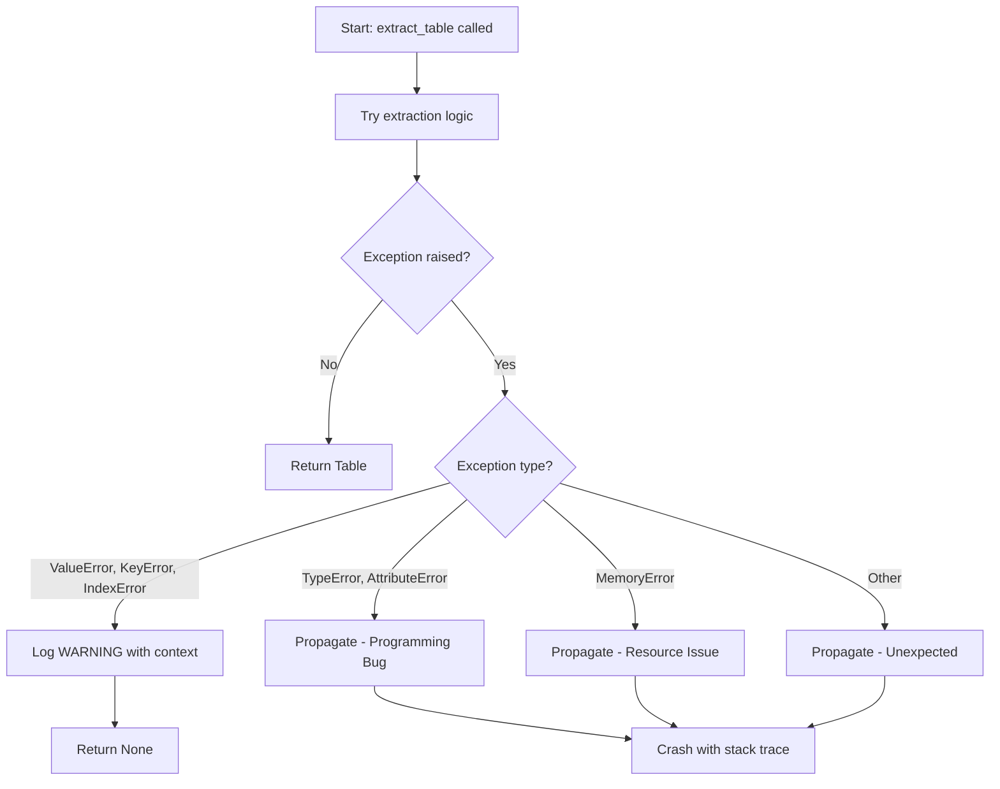

# LLD Finalized

Path: C:\Users\mcwiz\Projects\RCA-PDF-extraction-pipeline\docs\lld\active\LLD-037.md
Status: APPROVED
Reviews: 1

---

# 137 - Feature: Silent Exception Handler Fix in Table Extractor

<!-- Template Metadata
Last Updated: 2026-02-02
Updated By: Issue #117 fix
Update Reason: Moved Verification & Testing to Section 10 (was Section 11) to match 0702c review prompt and testing workflow expectations
Previous: Added sections based on 80 blocking issues from 164 governance verdicts (2026-02-01)
-->

## 1. Context & Goal
* **Issue:** #37
* **Objective:** Replace the silent `except Exception: pass` handler with specific exception handling and proper logging to surface extraction failures
* **Status:** Draft
* **Related Issues:** None identified

### Open Questions
*Questions that need clarification before or during implementation. Remove when resolved.*

- [ ] What logging level is appropriate for table extraction failures (WARNING vs DEBUG)?
- [ ] Should failed extractions be reported in any aggregated metrics or summary?
- [ ] Are there specific exception types already observed in production that should be prioritized?

## 2. Proposed Changes

*This section is the **source of truth** for implementation. Describe exactly what will be built.*

### 2.1 Files Changed

| File | Change Type | Description |
|------|-------------|-------------|
| `src/table_extractor.py` | Modify | Replace broad exception handler with specific types and logging |
| `tests/test_table_extractor.py` | Add/Modify | Add tests for exception handling behavior |

### 2.2 Dependencies

*New packages, APIs, or services required.*

```toml
# pyproject.toml additions (if any)
# None - logging is part of Python standard library
```

### 2.3 Data Structures

```python
# Pseudocode - NOT implementation
class TableExtractionResult(TypedDict):
    tables: list[Table]  # Successfully extracted tables
    errors: list[str]    # Human-readable error messages for failed extractions
    skipped_count: int   # Number of tables that could not be extracted
```

### 2.4 Function Signatures

```python
# Signatures only - implementation in source files
import logging

logger = logging.getLogger(__name__)

def extract_table(page_data: PageData, table_index: int) -> Table | None:
    """
    Extract a single table from page data.
    
    Returns Table on success, None on expected failures (logged as warnings).
    Raises unexpected exceptions for bugs/resource issues.
    """
    ...
```

### 2.5 Logic Flow (Pseudocode)

```
1. Receive page_data and table_index
2. TRY table extraction logic
3. CATCH specific expected exceptions:
   - ValueError: Malformed table structure
   - KeyError: Missing expected PDF structure keys
   - IndexError: Table bounds exceed page dimensions
   THEN
   - Log warning with context (page, table_index, exception message)
   - Return None (graceful skip)
4. LET other exceptions propagate:
   - TypeError, AttributeError → Programming bugs (should crash)
   - MemoryError → Resource issues (should crash)
   - Other → Unexpected failures (should crash)
5. Return extracted Table on success
```

### 2.6 Technical Approach

* **Module:** `src/table_extractor.py`
* **Pattern:** Fail-fast for bugs, graceful degradation for expected data issues
* **Key Decisions:** 
  - Use Python's `logging` module for consistent log formatting
  - Return `None` for skipped tables rather than raising (allows batch processing to continue)
  - Include contextual information in log messages (page number, table index)

### 2.7 Architecture Decisions

*Document key architectural decisions that affect the design. This section addresses the most common category of governance feedback (23 patterns).*

| Decision | Options Considered | Choice | Rationale |
|----------|-------------------|--------|-----------|
| Exception handling strategy | Catch all vs. Catch specific | Catch specific | Allows bugs to surface while handling expected data issues gracefully |
| Logging level for skipped tables | DEBUG vs. WARNING | WARNING | Skipped tables represent data loss; operators should be aware |
| Return type for failures | Raise vs. Return None | Return None | Allows batch processing to continue; caller can count skipped tables |

**Architectural Constraints:**
- Must not break existing callers that expect extraction to never raise
- Must maintain backward compatibility with existing API
- Logging must integrate with existing project logging configuration

## 3. Requirements

*What must be true when this is done. These become acceptance criteria.*

1. Specific exceptions (`ValueError`, `KeyError`, `IndexError`) are caught and logged at WARNING level
2. Log messages include: page number, table index, exception type, and exception message
3. Programming bugs (`TypeError`, `AttributeError`) propagate and crash with stack trace
4. Resource issues (`MemoryError`) propagate and crash
5. Callers can determine how many tables were skipped vs. successfully extracted
6. Existing test suite continues to pass

## 4. Alternatives Considered

| Option | Pros | Cons | Decision |
|--------|------|------|----------|
| Catch specific exceptions + logging | Surfaces bugs, provides visibility, maintains stability for data issues | Requires identifying all expected exception types | **Selected** |
| Catch all + logging | Simple, matches existing behavior with added visibility | Still hides bugs | Rejected |
| Remove try/except entirely | All failures surface immediately | Single bad table crashes entire extraction | Rejected |
| Return Result type with error info | Type-safe error handling | Major API change, over-engineering for this case | Rejected |

**Rationale:** The selected option balances bug visibility (let unexpected errors crash) with graceful degradation for known PDF structure issues. Logging provides the visibility needed for debugging without breaking batch processing workflows.

## 5. Data & Fixtures

*Per [0108-lld-pre-implementation-review.md](0108-lld-pre-implementation-review.md) - complete this section BEFORE implementation.*

### 5.1 Data Sources

| Attribute | Value |
|-----------|-------|
| Source | PDF files processed by table extractor |
| Format | PDF binary with embedded table structures |
| Size | Varies; tests use small fixtures < 1MB |
| Refresh | N/A - static test fixtures |
| Copyright/License | Test fixtures are generated/synthetic |

### 5.2 Data Pipeline

```
PDF File ──pdfplumber──► Page Data ──extract_table()──► Table Objects
                                          │
                                          └──► Log entries (on failure)
```

### 5.3 Test Fixtures

| Fixture | Source | Notes |
|---------|--------|-------|
| `malformed_table.pdf` | Generated | PDF with intentionally broken table structure |
| `missing_keys.pdf` | Generated | PDF missing expected structure keys |
| `valid_tables.pdf` | Generated | PDF with correctly formatted tables |

### 5.4 Deployment Pipeline

N/A - This is a code behavior change, not a data pipeline.

**If data source is external:** N/A

## 6. Diagram
*{Write "N/A" if not applicable - do not delete sections}*

### 6.1 Mermaid Quality Gate

Before finalizing any diagram, verify in [Mermaid Live Editor](https://mermaid.live) or GitHub preview:

- [x] **Simplicity:** Similar components collapsed (per 0006 §8.1)
- [x] **No touching:** All elements have visual separation (per 0006 §8.2)
- [x] **No hidden lines:** All arrows fully visible (per 0006 §8.3)
- [x] **Readable:** Labels not truncated, flow direction clear
- [ ] **Auto-inspected:** Agent rendered via mermaid.ink and viewed (per 0006 §8.5)

**Agent Auto-Inspection (MANDATORY):**

**Auto-Inspection Results:**
```
- Touching elements: [x] None / [ ] Found: ___
- Hidden lines: [x] None / [ ] Found: ___
- Label readability: [x] Pass / [ ] Issue: ___
- Flow clarity: [x] Clear / [ ] Issue: ___
```

*Reference: [0006-mermaid-diagrams.md](0006-mermaid-diagrams.md)*

### 6.2 Diagram



## 7. Security & Safety Considerations

*This section addresses security (10 patterns) and safety (9 patterns) concerns from governance feedback.*

### 7.1 Security

| Concern | Mitigation | Status |
|---------|------------|--------|
| Log injection | Exception messages logged via `%s` formatting, not f-strings with user data | Addressed |
| Information disclosure in logs | Only exception type and message logged; no sensitive data | Addressed |

### 7.2 Safety

*Safety concerns focus on preventing data loss, ensuring fail-safe behavior, and protecting system integrity.*

| Concern | Mitigation | Status |
|---------|------------|--------|
| Hidden bugs causing data loss | Let programming errors propagate; only catch expected data issues | Addressed |
| Silent data skipping | Log every skipped table at WARNING level | Addressed |
| Resource exhaustion | Let MemoryError propagate to crash fast | Addressed |

**Fail Mode:** Fail Closed for bugs, Fail Open for expected data issues - Bugs crash the process immediately; malformed data is skipped with logging.

**Recovery Strategy:** Skipped tables are logged; operators can reprocess specific pages or investigate PDF structure issues.

## 8. Performance & Cost Considerations

*This section addresses performance and cost concerns (6 patterns) from governance feedback.*

### 8.1 Performance

| Metric | Budget | Approach |
|--------|--------|----------|
| Latency | Negligible overhead | Exception handling and logging are fast operations |
| Memory | No increase | No new data structures retained |
| CPU | Negligible | String formatting for logs only on failure path |

**Bottlenecks:** None introduced. Logging is I/O but only occurs on failures.

### 8.2 Cost Analysis

| Resource | Unit Cost | Estimated Usage | Monthly Cost |
|----------|-----------|-----------------|--------------|
| Logging storage | Minimal | Only on failures | Negligible |

**Cost Controls:**
- [x] No additional cloud resources required
- [x] Logging volume bounded by failure rate

**Worst-Case Scenario:** If every table extraction fails, log volume increases. This is a signal of a real problem, not a cost concern.

## 9. Legal & Compliance

*This section addresses legal concerns (8 patterns) from governance feedback.*

| Concern | Applies? | Mitigation |
|---------|----------|------------|
| PII/Personal Data | No | Exception messages do not contain PII |
| Third-Party Licenses | No | Using Python standard library only |
| Terms of Service | N/A | No external services |
| Data Retention | N/A | Logs follow existing log retention policy |
| Export Controls | N/A | No restricted algorithms |

**Data Classification:** Internal (log messages are operational data)

**Compliance Checklist:**
- [x] No PII stored without consent
- [x] All third-party licenses compatible with project license
- [x] External API usage compliant with provider ToS
- [x] Data retention policy documented (follows existing log policy)

## 10. Verification & Testing

*Ref: [0005-testing-strategy-and-protocols.md](0005-testing-strategy-and-protocols.md)*

**Testing Philosophy:** Strive for 100% automated test coverage. Manual tests are a last resort for scenarios that genuinely cannot be automated (e.g., visual inspection, hardware interaction). Every scenario marked "Manual" requires justification.

### 10.1 Test Scenarios

| ID | Scenario | Type | Input | Expected Output | Pass Criteria |
|----|----------|------|-------|-----------------|---------------|
| 010 | Valid table extraction | Auto | Well-formed PDF page | Table object returned | Table data matches expected |
| 020 | ValueError on malformed table | Auto | PDF with broken table structure | None returned, WARNING logged | Log contains page/table context |
| 030 | KeyError on missing structure | Auto | PDF missing expected keys | None returned, WARNING logged | Log contains exception message |
| 040 | IndexError on bounds issue | Auto | Table exceeds page bounds | None returned, WARNING logged | Log contains exception message |
| 050 | TypeError propagates | Auto | Mock that raises TypeError | Exception raised to caller | TypeError with stack trace |
| 060 | AttributeError propagates | Auto | Mock that raises AttributeError | Exception raised to caller | AttributeError with stack trace |
| 070 | MemoryError propagates | Auto | Mock that raises MemoryError | Exception raised to caller | MemoryError with stack trace |
| 080 | Multiple tables with partial failure | Auto | PDF with 3 tables, 1 malformed | 2 Tables + 1 None, 1 WARNING | Correct count and log entry |

*Note: Use 3-digit IDs with gaps of 10 (010, 020, 030...) to allow insertions.*

**Type values:**
- `Auto` - Fully automated, runs in CI (pytest, playwright, etc.)
- `Auto-Live` - Automated but hits real external services (may be slow/flaky)
- `Manual` - Requires human execution (MUST include justification why automation is impossible)

### 10.2 Test Commands

```bash
# Run all automated tests
poetry run pytest tests/test_table_extractor.py -v

# Run only fast/mocked tests (exclude live)
poetry run pytest tests/test_table_extractor.py -v -m "not live"

# Run with log capture verification
poetry run pytest tests/test_table_extractor.py -v --log-cli-level=WARNING
```

### 10.3 Manual Tests (Only If Unavoidable)

N/A - All scenarios automated.

*Full test results recorded in Implementation Report (0103) or Test Report (0113).*

## 11. Risks & Mitigations

| Risk | Impact | Likelihood | Mitigation |
|------|--------|------------|------------|
| Unexpected exception types not covered | Med | Low | Start with common types; expand based on production observation |
| Log volume spike | Low | Low | Only logs on failures; indicates real problems |
| Breaking existing callers expecting no raises | High | Low | Document behavior change; most callers should handle exceptions anyway |
| Missing context in log messages | Med | Med | Include page number, table index, and full exception message |

## 12. Definition of Done

### Code
- [ ] Implementation complete and linted
- [ ] Code comments reference this LLD (Issue #37)

### Tests
- [ ] All test scenarios pass
- [ ] Test coverage meets threshold (aim for 100% of modified code)

### Documentation
- [ ] LLD updated with any deviations
- [ ] Implementation Report (0103) completed
- [ ] Test Report (0113) completed if applicable

### Review
- [ ] Code review completed
- [ ] User approval before closing issue

---

## Appendix: Review Log

*Track all review feedback with timestamps and implementation status.*

### Review Summary

| Review | Date | Verdict | Key Issue |
|--------|------|---------|-----------|
| - | - | - | Initial draft, pending review |

**Final Status:** APPROVED
<!-- Note: This field is auto-updated to APPROVED by the workflow when finalized -->