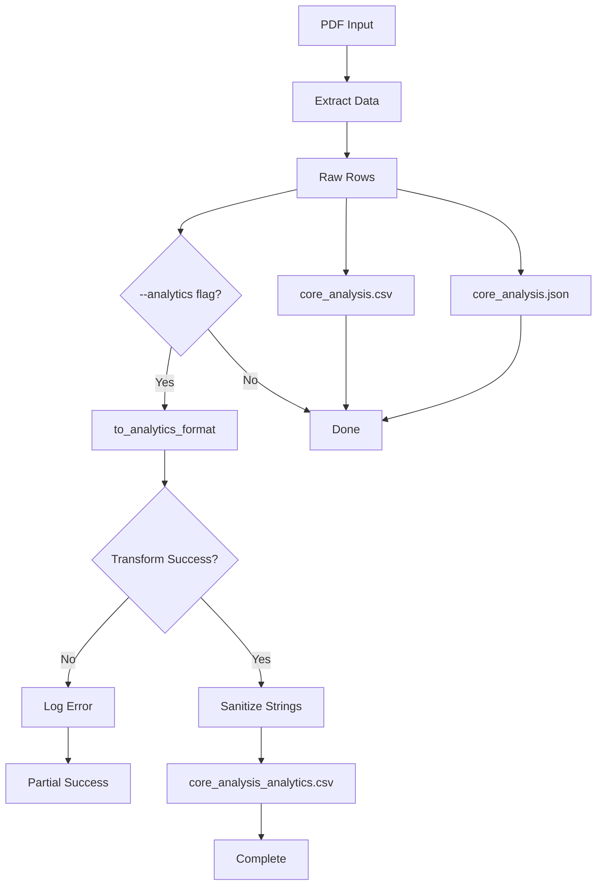

# 6 - Feature: Analytics-Ready CSV Output Format for Data Analysis Tools

## 1. Context & Goal
* **Issue:** #6
* **Objective:** Add an analytics-ready CSV output format optimized for pandas, R, and Excel pivot tables with proper NA handling and flag columns.
* **Status:** Draft
* **Related Issues:** None

## 2. Proposed Changes

*This section is the **source of truth** for implementation. Describe exactly what will be built.*

### 2.1 Files Changed

| File | Change Type | Description |
|------|-------------|-------------|
| `src/core_analysis.py` | Modify | Add `to_analytics_format()` function with transformation logic |
| `src/csv_sanitizer.py` | Add | New module for CSV injection prevention utilities |
| `src/main.py` | Modify | Add `--analytics` flag to CLI |
| `tests/test_analytics_format.py` | Add | Unit tests for analytics transformations |
| `tests/test_csv_sanitizer.py` | Add | Unit tests for CSV injection prevention |
| `tests/fixtures/test_analytics_edge_cases.pdf` | Add | Static fixture with edge cases for testing |
| `docs/output-formats.md` | Add | Document new analytics format and schema |

### 2.1.1 Path Validation (Mechanical - Auto-Checked)

*Issue #277: Before human or Gemini review, paths are verified programmatically.*

Mechanical validation automatically checks:
- All "Modify" files must exist in repository
- All "Delete" files must exist in repository
- All "Add" files must have existing parent directories
- No placeholder prefixes (`src/`, `lib/`, `app/`) unless directory exists

**If validation fails, the LLD is BLOCKED before reaching review.**

### 2.2 Dependencies

*No new dependencies required.*

```toml
# pyproject.toml additions (if any)
# None - uses standard library csv module
```

### 2.3 Data Structures

```python
# Pseudocode - NOT implementation
class AnalyticsRow(TypedDict):
    sample_number: str                    # Cleaned sample ID, CSV-sanitized
    is_fracture: bool                     # TRUE if sample is fracture
    fracture_type: str                    # 'F', 'f', or 'NA'
    depth_feet: Union[float, str]         # Numeric or 'NA'
    permeability_air_md: Union[float, str]    # Numeric or 'NA'
    permeability_klink_md: Union[float, str]  # Numeric or 'NA'
    permeability_below_detection: bool    # TRUE if EITHER permeability was '+' or '<0.0001'
    porosity_ambient_pct: Union[float, str]   # Numeric or 'NA'
    porosity_ncs_pct: Union[float, str]       # Numeric or 'NA'
    saturation_water_pct: Union[float, str]   # Numeric or 'NA'
    saturation_oil_pct: Union[float, str]     # Numeric or 'NA'
    saturation_total_pct: Union[float, str]   # Numeric or 'NA'
    saturation_no_data: bool              # TRUE if saturation was '**'
    grain_density_gcc: Union[float, str]  # Numeric or 'NA'

class TransformationError(Exception):
    """Raised when analytics transformation fails for a row."""
    pass
```

### 2.4 Function Signatures

```python
# src/csv_sanitizer.py
def sanitize_csv_string(val: str) -> str:
    """Prevent CSV injection by escaping dangerous leading characters.
    
    Prepends single quote to strings starting with =, +, -, @, \t, \r.
    """
    ...

# src/core_analysis.py
def to_numeric_or_na(val: Any) -> Union[float, str]:
    """Convert value to float or 'NA' string.
    
    Handles None, empty strings, and unparseable values.
    """
    ...

def extract_fracture_info(sample_number: str) -> tuple[str, bool, str]:
    """Extract fracture indicator from sample number.
    
    Returns: (cleaned_sample_number, is_fracture, fracture_type)
    """
    ...

def is_below_detection(val: Any) -> bool:
    """Check if value represents below-detection measurement.
    
    Returns True for '+', '<0.0001', or similar below-detection markers.
    """
    ...

def to_analytics_format(rows: list[dict]) -> list[dict]:
    """Transform extraction output to analytics-ready format.
    
    Raises TransformationError with row context on failure.
    """
    ...

def write_analytics_csv(rows: list[dict], output_path: str) -> None:
    """Write analytics rows to CSV file."""
    ...

# src/main.py
def extract(
    input_path: str,
    output_dir: str,
    analytics: bool = False,  # New parameter
) -> None:
    """Extract data from PDF with optional analytics format."""
    ...
```

### 2.5 Logic Flow (Pseudocode)

```
1. User invokes CLI with --analytics flag
2. CLI calls extract() with analytics=True
3. Extract data from PDF (existing logic)
4. Write core_analysis.csv (existing)
5. Write core_analysis.json (existing)
6. IF analytics flag is True:
   a. TRY to_analytics_format(rows)
      - FOR each row:
        - Extract fracture info from sample_number
        - Sanitize sample_number for CSV injection
        - Check EACH permeability field individually for below-detection
        - Set permeability_below_detection = TRUE if EITHER is below detection
        - Transform saturation: '**' → NA for all sat columns, set flag
        - Transform all empty cells to 'NA'
        - Convert numeric fields to float or 'NA'
      - RETURN transformed rows
   b. CATCH TransformationError:
      - Log error with row context (include row ID and field name)
      - Skip analytics file generation
      - Continue (partial success)
   c. Write core_analysis_analytics.csv
7. Return success with file paths
```

### 2.6 Technical Approach

* **Module:** `src/core_analysis.py` (transformation), `src/csv_sanitizer.py` (security)
* **Pattern:** Transformation Pipeline with fail-open error handling
* **Key Decisions:**
  - Use `NA` string for missing values (R-native, pandas compatible with `na_values`)
  - Separate flag columns preserve information about data quality
  - Sanitization applied as final step before serialization
  - Partial success model: analytics failure doesn't block other outputs
  - `permeability_below_detection` set TRUE if EITHER air OR klink is below detection

### 2.7 Architecture Decisions

*Document key architectural decisions that affect the design.*

| Decision | Options Considered | Choice | Rationale |
|----------|-------------------|--------|-----------|
| NA representation | `NA` string, empty, `NaN` | `NA` string | R-native, pandas supports via `na_values=['NA']` |
| Below-detection handling | NA with flag, limit value, keep string | NA with flag | Preserves information without false precision |
| Error handling | Fail fast, fail open | Fail open (partial success) | Analytics is enhancement; shouldn't block core output |
| Sanitization location | During transform, during write | During transform | Ensures all paths to output are protected |
| Permeability flag trigger | Either field, both fields | Either field | Conservative approach - flags any data quality concern |

**Architectural Constraints:**
- Must not modify existing `core_analysis.csv` output format
- Must integrate with existing CLI structure
- Cannot introduce external dependencies

## 3. Requirements

*What must be true when this is done. These become acceptance criteria.*

1. Running with `--analytics` produces `core_analysis_analytics.csv`
2. No empty cells exist in analytics output (all converted to `NA`)
3. Numeric columns parse as `float64` in pandas with `na_values=['NA']`
4. Sample numbers contain no parenthetical suffixes
5. `is_fracture` column correctly identifies fracture samples
6. `permeability_below_detection` is `TRUE` for rows where EITHER `permeability_air_md` OR `permeability_klink_md` has `+` or `<0.0001`
7. `saturation_no_data` is `TRUE` for rows with `**` marker
8. Original `core_analysis.csv` unchanged (human-readable format preserved)
9. String fields with leading `=`, `+`, `-`, `@` are prefixed with `'` in CSV output
10. Transformation failures log error and skip analytics file without aborting extraction
11. Error message includes row/field context for debugging

## 4. Alternatives Considered

| Option | Pros | Cons | Decision |
|--------|------|------|----------|
| Option A: NA with flag column | Preserves quality info, no false precision | Extra columns | **Selected** |
| Option B: Use detection limit value | Numeric column stays numeric | Introduces false precision (0.0001) | Rejected |
| Option C: Keep as string | Minimal transformation | Breaks numeric analysis | Rejected |
| Empty string for NA | Simpler | Ambiguous, poor R compatibility | Rejected |
| `NaN` for NA | pandas native | R requires extra handling | Rejected |

**Rationale:** Option A selected because it maintains data integrity while enabling clean numeric analysis. The `NA` string is the most portable choice across R and pandas.

## 5. Data & Fixtures

*Per [0108-lld-pre-implementation-review.md](0108-lld-pre-implementation-review.md) - complete this section BEFORE implementation.*

### 5.1 Data Sources

| Attribute | Value |
|-----------|-------|
| Source | PDF extraction output (internal) |
| Format | Python dict from existing extractor |
| Size | Typically 10-500 rows per PDF |
| Refresh | Per-extraction (on-demand) |
| Copyright/License | N/A - internal transformation |

### 5.2 Data Pipeline

```
PDF ──pdfplumber──► Extracted Rows ──to_analytics_format()──► Analytics CSV
```

### 5.3 Test Fixtures

| Fixture | Source | Notes |
|---------|--------|-------|
| `test_analytics_edge_cases.pdf` | Generated | Contains `+`, `**`, `(F)`, `(f)`, injection payloads |
| Mock row data | Hardcoded | Python dicts with edge cases |

### 5.4 Deployment Pipeline

Data transformation happens locally at extraction time. No deployment pipeline needed for data.

**If data source is external:** N/A - all data from local PDF extraction.

## 6. Diagram

### 6.1 Mermaid Quality Gate

Before finalizing any diagram, verify in [Mermaid Live Editor](https://mermaid.live) or GitHub preview:

- [x] **Simplicity:** Similar components collapsed (per 0006 §8.1)
- [x] **No touching:** All elements have visual separation (per 0006 §8.2)
- [x] **No hidden lines:** All arrows fully visible (per 0006 §8.3)
- [x] **Readable:** Labels not truncated, flow direction clear
- [ ] **Auto-inspected:** Agent rendered via mermaid.ink and viewed (per 0006 §8.5)

**Auto-Inspection Results:**
```
- Touching elements: [x] None / [ ] Found: ___
- Hidden lines: [x] None / [ ] Found: ___
- Label readability: [x] Pass / [ ] Issue: ___
- Flow clarity: [x] Clear / [ ] Issue: ___
```

*Reference: [0006-mermaid-diagrams.md](0006-mermaid-diagrams.md)*

### 6.2 Diagram



## 7. Security & Safety Considerations

### 7.1 Security

| Concern | Mitigation | Status |
|---------|------------|--------|
| CSV injection | `sanitize_csv_string()` prepends `'` to dangerous leading chars | Addressed |
| Formula execution in Excel | Sanitization prevents `=`, `+`, `-`, `@` from being interpreted | Addressed |
| Tab/CR injection | Sanitization handles `\t` and `\r` | Addressed |

### 7.2 Safety

| Concern | Mitigation | Status |
|---------|------------|--------|
| Data loss on transform failure | Fail-open strategy preserves original outputs | Addressed |
| Silent data corruption | Row-level error logging with context | Addressed |
| Misleading analytics | Flag columns indicate data quality issues | Addressed |

**Fail Mode:** Fail Open - Analytics transformation failure does not block core CSV/JSON output.

**Recovery Strategy:** If analytics transformation fails, user receives:
1. Original `core_analysis.csv` (human-readable)
2. Original `core_analysis.json` (structured)
3. Error log with row/field context for debugging

## 8. Performance & Cost Considerations

### 8.1 Performance

| Metric | Budget | Approach |
|--------|--------|----------|
| Latency | < 100ms for 500 rows | Simple in-memory transformation |
| Memory | < 10MB additional | Single pass, no data duplication |
| CPU | Negligible | String operations only |

**Bottlenecks:** None expected - transformation is O(n) simple string/numeric operations.

### 8.2 Cost Analysis

| Resource | Unit Cost | Estimated Usage | Monthly Cost |
|----------|-----------|-----------------|--------------|
| Compute | $0 | Local execution | $0 |
| Storage | $0 | Additional ~50KB per extraction | $0 |

**Cost Controls:**
- N/A - no external resources consumed

**Worst-Case Scenario:** N/A - purely local computation with linear scaling.

## 9. Legal & Compliance

| Concern | Applies? | Mitigation |
|---------|----------|------------|
| PII/Personal Data | No | Core analysis data contains no PII |
| Third-Party Licenses | No | No new dependencies |
| Terms of Service | No | No external APIs |
| Data Retention | No | User controls output files |
| Export Controls | No | Scientific data only |

**Data Classification:** Internal (geological/engineering data)

**Compliance Checklist:**
- [x] No PII stored without consent
- [x] All third-party licenses compatible with project license
- [x] External API usage compliant with provider ToS
- [x] Data retention policy documented

## 10. Verification & Testing

*Ref: [0005-testing-strategy-and-protocols.md](0005-testing-strategy-and-protocols.md)*

**Testing Philosophy:** Strive for 100% automated test coverage. Manual tests are a last resort for scenarios that genuinely cannot be automated.

### 10.0 Test Plan (TDD - Complete Before Implementation)

**TDD Requirement:** Tests MUST be written and failing BEFORE implementation begins.

| Test ID | Test Description | Expected Behavior | Status |
|---------|------------------|-------------------|--------|
| T010 | test_sanitize_equals_formula | Prepends `'` to `=SUM(A1)` | RED |
| T020 | test_sanitize_plus_cmd | Prepends `'` to `+cmd\|...` | RED |
| T030 | test_sanitize_minus_formula | Prepends `'` to `-1+1` | RED |
| T040 | test_sanitize_at_formula | Prepends `'` to `@SUM(A1)` | RED |
| T050 | test_sanitize_normal_value | Returns unchanged for normal strings | RED |
| T060 | test_to_numeric_or_na_valid | Converts `"123.45"` to `123.45` | RED |
| T070 | test_to_numeric_or_na_empty | Converts `""` to `"NA"` | RED |
| T080 | test_to_numeric_or_na_none | Converts `None` to `"NA"` | RED |
| T090 | test_extract_fracture_uppercase | Extracts `(F)` correctly | RED |
| T100 | test_extract_fracture_lowercase | Extracts `(f)` correctly | RED |
| T110 | test_extract_no_fracture | No fracture when absent | RED |
| T120 | test_permeability_below_detection_plus | `+` → NA with flag TRUE | RED |
| T130 | test_permeability_below_detection_less_than | `<0.0001` → NA with flag TRUE | RED |
| T135 | test_permeability_below_detection_either_field | Flag TRUE when only one field below detection | RED |
| T140 | test_saturation_no_data | `**` → NA for all sat cols with flag | RED |
| T150 | test_analytics_no_empty_cells | No empty cells in output (check every cell non-empty) | RED |
| T160 | test_analytics_numeric_columns_parseable | Pandas parses as float64 | RED |
| T170 | test_transformation_failure_partial_success | Core outputs preserved on failure, log contains row context | RED |
| T180 | test_cli_analytics_flag | `--analytics` produces analytics CSV | RED |
| T190 | test_legacy_output_unchanged | `core_analysis.csv` identical with and without `--analytics` | RED |

**Coverage Target:** ≥95% for all new code

**TDD Checklist:**
- [ ] All tests written before implementation
- [ ] Tests currently RED (failing)
- [ ] Test IDs match scenario IDs in 10.1
- [ ] Test file created at: `tests/test_analytics_format.py`, `tests/test_csv_sanitizer.py`

### 10.1 Test Scenarios

| ID | Scenario | Type | Input | Expected Output | Pass Criteria |
|----|----------|------|-------|-----------------|---------------|
| 010 | CSV injection - equals | Auto | `"=SUM(A1)"` | `"'=SUM(A1)"` | Prepended with `'` |
| 020 | CSV injection - plus | Auto | `"+cmd\|..."` | `"'+cmd\|..."` | Prepended with `'` |
| 030 | CSV injection - minus | Auto | `"-1+1"` | `"'-1+1"` | Prepended with `'` |
| 040 | CSV injection - at | Auto | `"@SUM(A1)"` | `"'@SUM(A1)"` | Prepended with `'` |
| 050 | Normal string passthrough | Auto | `"normal_value"` | `"normal_value"` | Unchanged |
| 060 | Numeric conversion - valid | Auto | `"123.45"` | `123.45` | Float returned |
| 070 | Numeric conversion - empty | Auto | `""` | `"NA"` | NA string returned |
| 080 | Numeric conversion - None | Auto | `None` | `"NA"` | NA string returned |
| 090 | Fracture extraction - uppercase | Auto | `"6-1(F)"` | `("6-1", True, "F")` | Tuple matches |
| 100 | Fracture extraction - lowercase | Auto | `"6-1(f)"` | `("6-1", True, "f")` | Tuple matches |
| 110 | Fracture extraction - none | Auto | `"6-1"` | `("6-1", False, "NA")` | Tuple matches |
| 120 | Below detection - plus symbol | Auto | `{"permeability_air_md": "+"}` | `permeability_below_detection=True` | Flag set |
| 130 | Below detection - less than | Auto | `{"permeability_air_md": "<0.0001"}` | `permeability_below_detection=True` | Flag set |
| 135 | Below detection - either field | Auto | `{"permeability_air_md": "+", "permeability_klink_md": "0.5"}` | `permeability_below_detection=True` | Flag set when either below |
| 140 | No saturation data | Auto | `{"saturation_water_pct": "**"}` | `saturation_no_data=True` | Flag set, all sat cols NA |
| 150 | No empty cells | Auto | Analytics CSV file | All cells non-empty | Iterate all cells, assert none empty |
| 160 | Pandas compatibility | Auto | Analytics CSV file | Numeric cols as float64 | dtype check |
| 170 | Partial success on failure | Auto | Mocked transform error | Core outputs exist, log contains row ID | Files present, `assert "Row" in caplog.text` |
| 180 | CLI analytics flag | Auto | `--analytics` | Analytics CSV produced | File exists |
| 190 | Legacy output unchanged | Auto | Same PDF with/without `--analytics` | `core_analysis.csv` identical | Content fidelity check |

### 10.2 Test Commands

```bash
# Run all automated tests
poetry run pytest tests/test_analytics_format.py tests/test_csv_sanitizer.py -v

# Run only fast/mocked tests (exclude live)
poetry run pytest tests/test_analytics_format.py tests/test_csv_sanitizer.py -v -m "not live"

# Run with coverage
poetry run pytest tests/test_analytics_format.py tests/test_csv_sanitizer.py --cov=src --cov-report=term-missing
```

### 10.3 Manual Tests (Only If Unavoidable)

| ID | Scenario | Why Not Automated | Steps |
|----|----------|-------------------|-------|
| M010 | Excel formula injection verification | Requires visual inspection in Excel | 1. Open analytics CSV in Excel 2. Verify no formulas execute 3. Verify `'=` displays as text |
| M020 | R import verification | Requires R environment | 1. `df <- read.csv('analytics.csv')` 2. Verify NA handling |

## 11. Risks & Mitigations

| Risk | Impact | Likelihood | Mitigation |
|------|--------|------------|------------|
| Unexpected symbol in source data | Med | Med | Catch-all in `to_numeric_or_na()` returns NA |
| Performance regression with large PDFs | Low | Low | O(n) transformation, tested with 500+ rows |
| Breaking change to existing CLI | High | Low | Analytics is opt-in via flag, default unchanged |
| CSV library encoding issues | Med | Low | Use UTF-8 encoding explicitly |

## 12. Definition of Done

### Code
- [ ] Implementation complete and linted
- [ ] Code comments reference this LLD

### Tests
- [ ] All test scenarios pass
- [ ] Test coverage meets ≥95% threshold

### Documentation
- [ ] LLD updated with any deviations
- [ ] Implementation Report (0103) completed
- [ ] Test Report (0113) completed if applicable

### Review
- [ ] Code review completed
- [ ] User approval before closing issue

### 12.1 Traceability (Mechanical - Auto-Checked)

*Issue #277: Cross-references are verified programmatically.*

Mechanical validation automatically checks:
- Every file mentioned in this section must appear in Section 2.1
- Every risk mitigation in Section 11 should have a corresponding function in Section 2.4 (warning if not)

**Files in Definition of Done:**
- `src/core_analysis.py` ✓ (Section 2.1)
- `src/csv_sanitizer.py` ✓ (Section 2.1)
- `src/main.py` ✓ (Section 2.1)
- `tests/test_analytics_format.py` ✓ (Section 2.1)
- `tests/test_csv_sanitizer.py` ✓ (Section 2.1)
- `docs/output-formats.md` ✓ (Section 2.1)

**If files are missing from Section 2.1, the LLD is BLOCKED.**

---

## Appendix: Review Log

*Track all review feedback with timestamps and implementation status.*

### Gemini Review #1 (REVISE)

**Reviewer:** Gemini 3 Pro
**Verdict:** REVISE

#### Comments

| ID | Comment | Implemented? |
|----|---------|--------------|
| G1.1 | "Add test for Requirement 8 - verify core_analysis.csv identical with/without --analytics" | YES - Added T190 and scenario 190 |
| G1.2 | "Update T170 to assert log contains row context, not just file presence" | YES - Updated T170 pass criteria and scenario 170 |
| G1.3 | "Remove resolved Open Questions from Section 1" | YES - Removed resolved questions |
| G1.4 | "T150 should check every cell is non-empty, not just pandas loading" | YES - Updated pass criteria for T150 and scenario 150 |

### Review Summary

| Review | Date | Verdict | Key Issue |
|--------|------|---------|-----------|
| Mechanical | - | PASS | - |
| Gemini #1 | - | REVISE | Missing tests for Req 8 (legacy unchanged) and Req 11 (error context) |

**Final Status:** PENDING