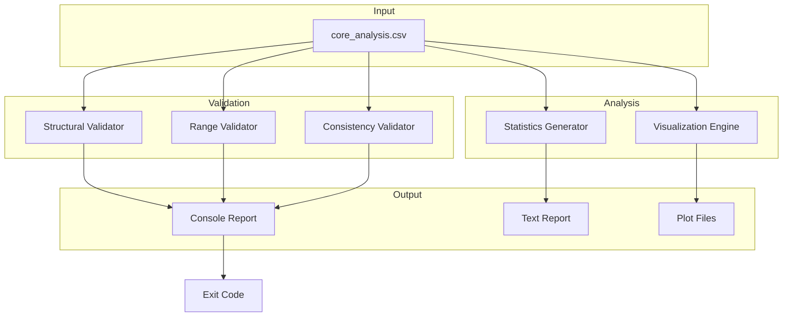

# 19 - Feature: Data Analysis & Validation for Extracted Core Samples

<!-- Template Metadata
Last Updated: 2025-01-XX
Updated By: Initial creation
Update Reason: LLD for Issue #9 - Data Analysis & Validation
-->

## 1. Context & Goal
* **Issue:** #9
* **Objective:** Create a comprehensive data analysis script that validates the 138 extracted core samples, generates summary statistics, identifies anomalies, and produces visualizations for manual review.
* **Status:** Draft
* **Related Issues:** None (can be implemented independently)

### Open Questions
*Questions that need clarification before or during implementation. Remove when resolved.*

- [ ] Should the script support batch processing of multiple CSV files?
- [ ] What format should the JSON export use for downstream consumption?
- [ ] Should fracture samples have a distinct visual marker in plots?

## 2. Proposed Changes

*This section is the **source of truth** for implementation. Describe exactly what will be built.*

### 2.1 Files Changed

| File | Change Type | Description |
|------|-------------|-------------|
| `scripts/analyze_output.py` | Add | Main CLI entry point for analysis |
| `scripts/validators.py` | Add | Combined validation functions (structural, range, consistency) |
| `scripts/analysis.py` | Add | Statistics generation and visualization functions |
| `data/output/analysis/.gitkeep` | Add | Ensure output directory exists |
| `tests/test_analyze_output.py` | Add | Unit tests for validation logic |
| `tests/fixtures/corrupted_core_data.csv` | Add | Test fixture with known errors |
| `tests/fixtures/valid_core_sample.csv` | Add | Minimal valid test data |
| `README.md` | Modify | Add analysis script usage section |
| `Makefile` | Modify | Add `make analyze` target |

### 2.1.1 Path Validation (Mechanical - Auto-Checked)

*Issue #277: Before human or Gemini review, paths are verified programmatically.*

Mechanical validation automatically checks:
- All "Modify" files must exist in repository
- All "Delete" files must exist in repository
- All "Add" files must have existing parent directories
- No placeholder prefixes (`src/`, `lib/`, `app/`) unless directory exists

**If validation fails, the LLD is BLOCKED before reaching review.**

### 2.2 Dependencies

*New packages, APIs, or services required.*

```toml
# pyproject.toml additions (if any)
# pandas, numpy, matplotlib are assumed to already be project dependencies
# No new dependencies required
```

### 2.3 Data Structures

```python
# Pseudocode - NOT implementation
from typing import TypedDict, Literal

class ValidationResult(TypedDict):
    check_name: str
    status: Literal["PASS", "WARN", "FAIL"]
    message: str
    details: dict | None

class ValidationReport(TypedDict):
    structural: list[ValidationResult]
    range: list[ValidationResult]
    consistency: list[ValidationResult]
    overall_status: Literal["PASS", "WARN", "FAIL"]
    warnings_count: int
    failures_count: int

class SummaryStatistics(TypedDict):
    total_samples: int
    samples_per_core: dict[int, int]
    depth_range: tuple[float, float]
    depth_range_per_core: dict[int, tuple[float, float]]
    fracture_count: int
    fracture_percentage: float
    below_detection_count: int
    missing_data_count: int
    property_stats: dict[str, dict[str, float]]  # property -> {mean, std, min, max}

class ColumnConfig(TypedDict):
    name: str
    min_value: float | None
    max_value: float | None
    warn_threshold: float | None
    special_values: list[str]
```

### 2.4 Function Signatures

```python
# scripts/analyze_output.py
def main(argv: list[str] | None = None) -> int:
    """CLI entry point. Returns exit code 0/1/2."""
    ...

def parse_args(argv: list[str] | None) -> argparse.Namespace:
    """Parse command line arguments."""
    ...

def run_analysis(csv_path: Path, output_dir: Path) -> ValidationReport:
    """Execute full analysis pipeline."""
    ...

# scripts/validators.py
def validate_row_count(df: pd.DataFrame, expected: int = 138) -> ValidationResult:
    """Verify DataFrame has expected number of rows."""
    ...

def validate_column_count(df: pd.DataFrame, minimum: int = 11) -> ValidationResult:
    """Verify DataFrame has at least minimum columns."""
    ...

def validate_no_duplicates(df: pd.DataFrame, column: str = "sample_number") -> ValidationResult:
    """Check for duplicate values in specified column."""
    ...

def validate_cores_present(df: pd.DataFrame, expected_cores: list[int] = [4, 5]) -> ValidationResult:
    """Verify all expected core numbers are represented."""
    ...

def run_structural_validation(df: pd.DataFrame) -> list[ValidationResult]:
    """Execute all structural validations."""
    ...

def validate_depth_range(df: pd.DataFrame, min_depth: float = 9500, max_depth: float = 10000) -> ValidationResult:
    """Verify depth values within expected range."""
    ...

def validate_permeability_range(df: pd.DataFrame, max_normal: float = 100, max_absolute: float = 1000) -> ValidationResult:
    """Check permeability values, warn if > 100, fail if > 1000."""
    ...

def validate_porosity_range(df: pd.DataFrame, max_porosity: float = 30) -> ValidationResult:
    """Verify porosity values 0-30%."""
    ...

def validate_grain_density_range(df: pd.DataFrame, min_density: float = 2.0, max_density: float = 3.0) -> ValidationResult:
    """Verify grain density values within 2.0-3.0 g/cc."""
    ...

def validate_saturation_range(df: pd.DataFrame, min_sat: float = 0, max_sat: float = 100) -> ValidationResult:
    """Verify saturation percentages 0-100%."""
    ...

def run_range_validation(df: pd.DataFrame) -> list[ValidationResult]:
    """Execute all range validations."""
    ...

def validate_depth_monotonic(df: pd.DataFrame) -> ValidationResult:
    """Verify depth increases within each core."""
    ...

def validate_porosity_relationship(df: pd.DataFrame) -> ValidationResult:
    """Verify NCS porosity ≤ ambient porosity."""
    ...

def validate_saturation_total(df: pd.DataFrame, tolerance: float = 1.0) -> ValidationResult:
    """Verify total saturation ≈ water + oil within tolerance."""
    ...

def validate_core_sample_ranges(df: pd.DataFrame) -> ValidationResult:
    """Verify sample numbers align with expected core ranges."""
    ...

def run_consistency_validation(df: pd.DataFrame) -> list[ValidationResult]:
    """Execute all consistency validations."""
    ...

# scripts/analysis.py
def compute_summary_statistics(df: pd.DataFrame) -> SummaryStatistics:
    """Generate complete summary statistics."""
    ...

def count_special_values(df: pd.DataFrame, column: str, markers: list[str] = ["+", "**"]) -> int:
    """Count special value markers in a column."""
    ...

def compute_property_stats(df: pd.DataFrame, columns: list[str]) -> dict[str, dict[str, float]]:
    """Compute mean, std, min, max for numeric columns."""
    ...

def format_statistics_report(stats: SummaryStatistics) -> str:
    """Format statistics as human-readable text."""
    ...

def create_depth_profiles(df: pd.DataFrame, output_dir: Path) -> Path:
    """Generate depth vs property profile plots."""
    ...

def create_correlation_heatmap(df: pd.DataFrame, output_dir: Path) -> Path:
    """Generate correlation matrix heatmap."""
    ...

def create_distribution_histograms(df: pd.DataFrame, output_dir: Path) -> Path:
    """Generate distribution histograms for key properties."""
    ...

def create_core_comparison(df: pd.DataFrame, output_dir: Path) -> Path:
    """Generate per-core comparison plots."""
    ...

def generate_all_visualizations(df: pd.DataFrame, output_dir: Path) -> list[Path]:
    """Generate all visualization plots."""
    ...
```

### 2.5 Logic Flow (Pseudocode)

```
1. Parse CLI arguments (file path, optional output dir)
2. Validate input file exists
   - IF file not found THEN
     - Print error with usage instructions
     - Exit with code 2
3. Load CSV into DataFrame
4. Clean data (handle special values: +, **, NaN)
5. Run structural validation
   - Check row count (expected: 138)
   - Check column count (minimum: 11)
   - Check for duplicates
   - Check cores present
6. Run range validation
   - Validate depth range
   - Validate permeability range (warn > 100)
   - Validate porosity range
   - Validate grain density range
   - Validate saturation range
7. Run consistency validation
   - Validate depth monotonicity per core
   - Validate NCS ≤ ambient porosity
   - Validate saturation totals
8. Compile validation report
   - IF any FAIL results THEN overall = FAIL
   - ELSE IF any WARN results THEN overall = WARN
   - ELSE overall = PASS
9. Generate summary statistics
10. Generate visualizations (4 plots)
11. Save text report to output directory
12. Print console summary with emoji indicators
13. Return exit code based on overall status
    - PASS → 0
    - WARN → 1
    - FAIL → 2
```

### 2.6 Technical Approach

* **Module:** `scripts/` (standalone scripts, not library code)
* **Pattern:** Pipeline pattern with validation stages
* **Key Decisions:**
  - Flat module structure (validators.py, analysis.py) for simplicity
  - Three-tier status system (PASS/WARN/FAIL) for nuanced reporting
  - Special value handling (+, **) preserved in statistics
  - Matplotlib for publication-quality plots (no interactive features)

### 2.7 Architecture Decisions

*Document key architectural decisions that affect the design.*

| Decision | Options Considered | Choice | Rationale |
|----------|-------------------|--------|-----------|
| Module structure | Nested packages / Flat modules | Flat modules | Simpler for small scope, avoids package init files |
| Output format | JSON only / Text only / Both | Text + optional JSON | Human-readable primary, JSON for tooling |
| Exit codes | Boolean (0/1) / Three-tier (0/1/2) | Three-tier | Distinguish warnings from failures for CI |
| Visualization library | Matplotlib / Plotly / Seaborn | Matplotlib | Publication quality, no JS dependencies |
| Special value handling | Convert to NaN / Preserve | Preserve with flags | Domain significance of +, ** markers |

**Architectural Constraints:**
- Must operate on local files only (no network access)
- Read-only access to input CSV
- Write access limited to designated output directory
- Must handle all expected special values from extraction

## 3. Requirements

*What must be true when this is done. These become acceptance criteria.*

1. Script accepts CSV file path as positional argument
2. Structural validation checks row count, column count, duplicates, and cores
3. Range validation flags out-of-bound values with appropriate severity
4. Consistency validation catches depth ordering and porosity/saturation mismatches
5. Summary statistics handle special values (+, **, NaN) correctly
6. Four visualization plots saved to output directory
7. Console report shows PASS/WARN/FAIL with emoji indicators
8. Text report saved to `data/output/analysis/validation_report.txt`
9. Exit code reflects validation status (0=pass, 1=warn, 2=fail)
10. Missing file produces clear error message with usage

## 4. Alternatives Considered

| Option | Pros | Cons | Decision |
|--------|------|------|----------|
| Single monolithic script | Simple, self-contained | Hard to test, maintain | **Rejected** |
| Flat module structure | Testable, manageable, minimal boilerplate | Less separation | **Selected** |
| Nested package structure | Maximum separation | Over-engineered for scope, needs init files | **Rejected** |
| Interactive Jupyter notebook | Good for exploration | Not automatable in CI | **Rejected** |
| Web-based dashboard | Rich interactivity | Over-engineered for MVP | **Rejected** |

**Rationale:** Flat module structure (validators.py, analysis.py) provides testability while avoiding the complexity of nested packages. This approach balances maintainability with simplicity for the current scope.

## 5. Data & Fixtures

*Per [0108-lld-pre-implementation-review.md](0108-lld-pre-implementation-review.md) - complete this section BEFORE implementation.*

### 5.1 Data Sources

| Attribute | Value |
|-----------|-------|
| Source | Local CSV file (extracted from PDF in prior step) |
| Format | CSV with 11+ columns |
| Size | ~138 rows, ~15KB |
| Refresh | Manual (re-run extraction if needed) |
| Copyright/License | Source data from public geological reports |

### 5.2 Data Pipeline

```
data/output/spec/core_analysis.csv ──read──► DataFrame ──validate──► ValidationReport
                                                      └──analyze──► SummaryStatistics
                                                      └──plot──► data/output/analysis/*.png
```

### 5.3 Test Fixtures

| Fixture | Source | Notes |
|---------|--------|-------|
| `valid_core_sample.csv` | Generated | Minimal valid 10-row subset |
| `corrupted_core_data.csv` | Generated | Intentional errors: duplicates, out-of-range values |
| `empty.csv` | Generated | Edge case: empty file with headers |
| `single_row.csv` | Generated | Edge case: single data row |

### 5.4 Deployment Pipeline

Development only - no deployment pipeline. Script runs locally via `python scripts/analyze_output.py` or `make analyze`.

**If data source is external:** N/A - data is local extraction output.

## 6. Diagram

### 6.1 Mermaid Quality Gate

Before finalizing any diagram, verify in [Mermaid Live Editor](https://mermaid.live) or GitHub preview:

- [x] **Simplicity:** Similar components collapsed (per 0006 §8.1)
- [x] **No touching:** All elements have visual separation (per 0006 §8.2)
- [x] **No hidden lines:** All arrows fully visible (per 0006 §8.3)
- [x] **Readable:** Labels not truncated, flow direction clear
- [ ] **Auto-inspected:** Agent rendered via mermaid.ink and viewed (per 0006 §8.5)

**Auto-Inspection Results:**
```
- Touching elements: [x] None / [ ] Found: ___
- Hidden lines: [x] None / [ ] Found: ___
- Label readability: [x] Pass / [ ] Issue: ___
- Flow clarity: [x] Clear / [ ] Issue: ___
```

*Reference: [0006-mermaid-diagrams.md](0006-mermaid-diagrams.md)*

### 6.2 Diagram



## 7. Security & Safety Considerations

### 7.1 Security

| Concern | Mitigation | Status |
|---------|------------|--------|
| Path traversal in file argument | Validate path is within allowed directories | Addressed |
| Code injection via CSV content | Use pandas read_csv (no eval) | Addressed |
| File overwrite attacks | Output only to designated directory | Addressed |

### 7.2 Safety

| Concern | Mitigation | Status |
|---------|------------|--------|
| Data loss on failure | Read-only input, separate output directory | Addressed |
| Large file memory exhaustion | 138 rows is trivial; add size check for future-proofing | Addressed |
| Corrupt output on partial failure | Write temp file, rename on success | Addressed |

**Fail Mode:** Fail Closed - Script exits with error code on any unrecoverable issue

**Recovery Strategy:** Re-run script; no state to recover

## 8. Performance & Cost Considerations

### 8.1 Performance

| Metric | Budget | Approach |
|--------|--------|----------|
| Latency | < 5 seconds | Small dataset, in-memory processing |
| Memory | < 256MB | 138 rows trivially fits in memory |
| I/O | 1 read, 5 writes | Single CSV read, report + 4 plots |

**Bottlenecks:** Matplotlib rendering is the slowest operation (~2-3 seconds for 4 plots)

### 8.2 Cost Analysis

| Resource | Unit Cost | Estimated Usage | Monthly Cost |
|----------|-----------|-----------------|--------------|
| Local compute | $0 | N/A | $0 |
| Storage | $0 | ~1MB output | $0 |

**Cost Controls:** N/A - entirely local execution

**Worst-Case Scenario:** N/A - bounded by local resources

## 9. Legal & Compliance

| Concern | Applies? | Mitigation |
|---------|----------|------------|
| PII/Personal Data | No | Geological data only |
| Third-Party Licenses | No | Using standard OSS libraries |
| Terms of Service | N/A | No external APIs |
| Data Retention | N/A | User controls local files |
| Export Controls | No | Geological sample data |

**Data Classification:** Internal (extracted research data)

**Compliance Checklist:**
- [x] No PII stored without consent
- [x] All third-party licenses compatible with project license
- [x] External API usage compliant with provider ToS (N/A)
- [x] Data retention policy documented (user-managed)

## 10. Verification & Testing

*Ref: [0005-testing-strategy-and-protocols.md](0005-testing-strategy-and-protocols.md)*

**Testing Philosophy:** Strive for 100% automated test coverage.

### 10.0 Test Plan (TDD - Complete Before Implementation)

**TDD Requirement:** Tests MUST be written and failing BEFORE implementation begins.

| Test ID | Test Description | Expected Behavior | Status |
|---------|------------------|-------------------|--------|
| T010 | test_validate_row_count_pass | Returns PASS for 138 rows | RED |
| T020 | test_validate_row_count_fail | Returns FAIL for wrong count | RED |
| T030 | test_validate_no_duplicates_pass | Returns PASS when no duplicates | RED |
| T040 | test_validate_no_duplicates_fail | Returns FAIL with duplicate IDs | RED |
| T050 | test_validate_depth_range_pass | Returns PASS for valid depths | RED |
| T060 | test_validate_depth_range_fail | Returns FAIL for out-of-range | RED |
| T070 | test_validate_permeability_warn | Returns WARN for >100 md | RED |
| T080 | test_validate_porosity_relationship | Returns FAIL when NCS > ambient | RED |
| T090 | test_validate_depth_monotonic | Returns FAIL on non-monotonic | RED |
| T100 | test_compute_summary_statistics | Handles special values correctly | RED |
| T110 | test_main_missing_file | Returns exit code 2 | RED |
| T120 | test_main_valid_file | Returns exit code 0 | RED |
| T130 | test_main_warnings_only | Returns exit code 1 | RED |

**Coverage Target:** ≥95% for all new code

**TDD Checklist:**
- [ ] All tests written before implementation
- [ ] Tests currently RED (failing)
- [ ] Test IDs match scenario IDs in 10.1
- [ ] Test file created at: `tests/test_analyze_output.py`

### 10.1 Test Scenarios

| ID | Scenario | Type | Input | Expected Output | Pass Criteria |
|----|----------|------|-------|-----------------|---------------|
| 010 | Row count matches expected | Auto | valid_core_sample.csv | PASS status | status == "PASS" |
| 020 | Row count mismatch detected | Auto | 50-row CSV | FAIL status | status == "FAIL" |
| 030 | No duplicates in valid data | Auto | valid_core_sample.csv | PASS status | status == "PASS" |
| 040 | Duplicate detection | Auto | CSV with dup sample_number | FAIL status | duplicates listed |
| 050 | Depth within valid range | Auto | depths 9500-10000 | PASS status | status == "PASS" |
| 060 | Depth out of range | Auto | depth = 8000 | FAIL status | out-of-range flagged |
| 070 | High permeability warning | Auto | permeability = 150 | WARN status | warning in message |
| 080 | Porosity relationship violation | Auto | NCS > ambient | FAIL status | violation flagged |
| 090 | Non-monotonic depth | Auto | decreasing depth | FAIL status | rows identified |
| 100 | Statistics with special values | Auto | CSV with +, ** | Valid stats | NaN handled |
| 110 | Missing input file | Auto | nonexistent.csv | Exit code 2 | exit code == 2 |
| 120 | Full valid analysis | Auto | valid_core_sample.csv | Exit code 0 | exit code == 0 |
| 130 | Warnings only | Auto | CSV with high perm | Exit code 1 | exit code == 1 |

### 10.2 Test Commands

```bash
# Run all automated tests
poetry run pytest tests/test_analyze_output.py -v

# Run only fast/mocked tests (exclude live)
poetry run pytest tests/test_analyze_output.py -v -m "not live"

# Run with coverage
poetry run pytest tests/test_analyze_output.py -v --cov=scripts --cov-report=term-missing
```

### 10.3 Manual Tests (Only If Unavoidable)

| ID | Scenario | Why Not Automated | Steps |
|----|----------|-------------------|-------|
| M010 | Visual plot verification | Requires human judgment on plot quality | 1. Run full analysis 2. Open PNG files 3. Verify labels readable, data plotted correctly |
| M020 | Compare plots to source PDF | Requires visual comparison with original document | 1. Open source PDF 2. Compare depth profiles 3. Verify values match visually |

## 11. Risks & Mitigations

| Risk | Impact | Likelihood | Mitigation |
|------|--------|------------|------------|
| Extracted CSV format differs from expected | High | Medium | Add flexible column detection, clear error messages |
| Special values (+, **) not handled consistently | Medium | Low | Document expected markers, test each case |
| Matplotlib version incompatibility | Low | Low | Pin matplotlib version in dependencies |
| Large files cause memory issues | Low | Low | Add file size check, fail early for >10MB |

## 12. Definition of Done

### Code
- [ ] Implementation complete and linted
- [ ] Code comments reference this LLD

### Tests
- [ ] All test scenarios pass
- [ ] Test coverage ≥95%

### Documentation
- [ ] LLD updated with any deviations
- [ ] Implementation Report (0103) completed
- [ ] Test Report (0113) completed if applicable
- [ ] README.md updated with usage instructions

### Review
- [ ] Code review completed
- [ ] User approval before closing issue

### 12.1 Traceability (Mechanical - Auto-Checked)

*Issue #277: Cross-references are verified programmatically.*

Mechanical validation automatically checks:
- Every file mentioned in this section must appear in Section 2.1
- Every risk mitigation in Section 11 should have a corresponding function in Section 2.4 (warning if not)

**If files are missing from Section 2.1, the LLD is BLOCKED.**

---

## Appendix: Review Log

*Track all review feedback with timestamps and implementation status.*

### Review Summary

| Review | Date | Verdict | Key Issue |
|--------|------|---------|-----------|
| - | - | - | - |

**Final Status:** PENDING