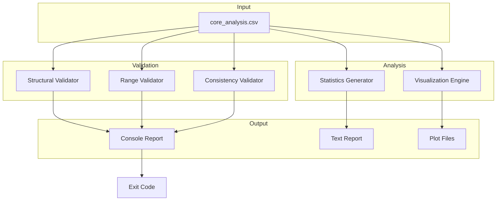

# 19 - Feature: Data Analysis & Validation for Extracted Core Samples

<!-- Template Metadata
Last Updated: 2025-01-XX
Updated By: Revision per Gemini Review #1
Update Reason: Added missing test scenarios for output artifacts (plots, reports, console output)
-->

## 1. Context & Goal
* **Issue:** #9
* **Objective:** Create a comprehensive data analysis script that validates the 138 extracted core samples, generates summary statistics, identifies anomalies, and produces visualizations for manual review.
* **Status:** Draft
* **Related Issues:** None (can be implemented independently)

### Open Questions
*All questions resolved per Gemini Review #1.*

- [x] ~~Should the script support batch processing of multiple CSV files?~~ **RESOLVED: No.** Keep the MVP simple. The current scope is for a single extracted file. Batch processing can be added later if needed (YAGNI).
- [x] ~~What format should the JSON export use for downstream consumption?~~ **RESOLVED: Simple Dictionary.** Use a flat or nested JSON object reflecting the `SummaryStatistics` TypedDict structure defined in Section 2.3.
- [x] ~~Should fracture samples have a distinct visual marker in plots?~~ **RESOLVED: Yes.** Use a distinct marker shape (e.g., 'x') or color (e.g., red) to clearly differentiate fracture samples from standard core samples in visualizations.

## 2. Proposed Changes

*This section is the **source of truth** for implementation. Describe exactly what will be built.*

### 2.1 Files Changed

| File | Change Type | Description |
|------|-------------|-------------|
| `scripts/analyze_output.py` | Add | Main CLI entry point for analysis |
| `scripts/validators.py` | Add | Combined validation functions (structural, range, consistency) |
| `scripts/analysis.py` | Add | Statistics generation and visualization functions |
| `data/output/analysis/` | Add | Output directory for analysis results (created at runtime) |
| `tests/test_analyze_output.py` | Add | Unit tests for validation logic |
| `tests/fixtures/corrupted_core_data.csv` | Add | Test fixture with known errors |
| `tests/fixtures/valid_core_sample.csv` | Add | Minimal valid test data |
| `README.md` | Modify | Add analysis script usage section |
| `Makefile` | Modify | Add `make analyze` target |

### 2.1.1 Path Validation (Mechanical - Auto-Checked)

*Issue #277: Before human or Gemini review, paths are verified programmatically.*

Mechanical validation automatically checks:
- All "Modify" files must exist in repository
- All "Delete" files must exist in repository
- All "Add" files must have existing parent directories
- No placeholder prefixes (`src/`, `lib/`, `app/`) unless directory exists

**If validation fails, the LLD is BLOCKED before reaching review.**

**Note:** The `data/output/analysis/` directory will be created programmatically at runtime by the script. The parent directory `data/output/` must exist.

### 2.2 Dependencies

*New packages, APIs, or services required.*

```toml
# pyproject.toml additions (if any)
# pandas, numpy, matplotlib are assumed to already be project dependencies
# No new dependencies required
```

### 2.3 Data Structures

```python
# Pseudocode - NOT implementation
from typing import TypedDict, Literal

class ValidationResult(TypedDict):
    check_name: str
    status: Literal["PASS", "WARN", "FAIL"]
    message: str
    details: dict | None

class ValidationReport(TypedDict):
    structural: list[ValidationResult]
    range: list[ValidationResult]
    consistency: list[ValidationResult]
    overall_status: Literal["PASS", "WARN", "FAIL"]
    warnings_count: int
    failures_count: int

class SummaryStatistics(TypedDict):
    total_samples: int
    samples_per_core: dict[int, int]
    depth_range: tuple[float, float]
    depth_range_per_core: dict[int, tuple[float, float]]
    fracture_count: int
    fracture_percentage: float
    below_detection_count: int
    missing_data_count: int
    property_stats: dict[str, dict[str, float]]  # property -> {mean, std, min, max}

class ColumnConfig(TypedDict):
    name: str
    min_value: float | None
    max_value: float | None
    warn_threshold: float | None
    special_values: list[str]
```

### 2.4 Function Signatures

```python
# scripts/analyze_output.py
def main(argv: list[str] | None = None) -> int:
    """CLI entry point. Returns exit code 0/1/2."""
    ...

def parse_args(argv: list[str] | None) -> argparse.Namespace:
    """Parse command line arguments."""
    ...

def run_analysis(csv_path: Path, output_dir: Path) -> ValidationReport:
    """Execute full analysis pipeline."""
    ...

# scripts/validators.py
def validate_row_count(df: pd.DataFrame, expected: int = 138) -> ValidationResult:
    """Verify DataFrame has expected number of rows."""
    ...

def validate_column_count(df: pd.DataFrame, minimum: int = 11) -> ValidationResult:
    """Verify DataFrame has at least minimum columns."""
    ...

def validate_no_duplicates(df: pd.DataFrame, column: str = "sample_number") -> ValidationResult:
    """Check for duplicate values in specified column."""
    ...

def validate_cores_present(df: pd.DataFrame, expected_cores: list[int] = [4, 5]) -> ValidationResult:
    """Verify all expected core numbers are represented."""
    ...

def run_structural_validation(df: pd.DataFrame) -> list[ValidationResult]:
    """Execute all structural validations."""
    ...

def validate_depth_range(df: pd.DataFrame, min_depth: float = 9500, max_depth: float = 10000) -> ValidationResult:
    """Verify depth values within expected range."""
    ...

def validate_permeability_range(df: pd.DataFrame, max_normal: float = 100, max_absolute: float = 1000) -> ValidationResult:
    """Check permeability values, warn if > 100, fail if > 1000."""
    ...

def validate_porosity_range(df: pd.DataFrame, max_porosity: float = 30) -> ValidationResult:
    """Verify porosity values 0-30%."""
    ...

def validate_grain_density_range(df: pd.DataFrame, min_density: float = 2.0, max_density: float = 3.0) -> ValidationResult:
    """Verify grain density values within 2.0-3.0 g/cc."""
    ...

def validate_saturation_range(df: pd.DataFrame, min_sat: float = 0, max_sat: float = 100) -> ValidationResult:
    """Verify saturation percentages 0-100%."""
    ...

def run_range_validation(df: pd.DataFrame) -> list[ValidationResult]:
    """Execute all range validations."""
    ...

def validate_depth_monotonic(df: pd.DataFrame) -> ValidationResult:
    """Verify depth increases within each core."""
    ...

def validate_porosity_relationship(df: pd.DataFrame) -> ValidationResult:
    """Verify NCS porosity ≤ ambient porosity."""
    ...

def validate_saturation_total(df: pd.DataFrame, tolerance: float = 1.0) -> ValidationResult:
    """Verify total saturation ≈ water + oil within tolerance."""
    ...

def validate_core_sample_ranges(df: pd.DataFrame) -> ValidationResult:
    """Verify sample numbers align with expected core ranges."""
    ...

def run_consistency_validation(df: pd.DataFrame) -> list[ValidationResult]:
    """Execute all consistency validations."""
    ...

# scripts/analysis.py
def compute_summary_statistics(df: pd.DataFrame) -> SummaryStatistics:
    """Generate complete summary statistics."""
    ...

def count_special_values(df: pd.DataFrame, column: str, markers: list[str] = ["+", "**"]) -> int:
    """Count special value markers in a column."""
    ...

def compute_property_stats(df: pd.DataFrame, columns: list[str]) -> dict[str, dict[str, float]]:
    """Compute mean, std, min, max for numeric columns."""
    ...

def format_statistics_report(stats: SummaryStatistics) -> str:
    """Format statistics as human-readable text."""
    ...

def create_depth_profiles(df: pd.DataFrame, output_dir: Path) -> Path:
    """Generate depth vs property profile plots. Returns path to saved file."""
    ...

def create_correlation_heatmap(df: pd.DataFrame, output_dir: Path) -> Path:
    """Generate correlation matrix heatmap. Returns path to saved file."""
    ...

def create_distribution_histograms(df: pd.DataFrame, output_dir: Path) -> Path:
    """Generate distribution histograms for key properties. Returns path to saved file."""
    ...

def create_core_comparison(df: pd.DataFrame, output_dir: Path) -> Path:
    """Generate per-core comparison plots. Returns path to saved file."""
    ...

def generate_all_visualizations(df: pd.DataFrame, output_dir: Path) -> list[Path]:
    """Generate all visualization plots. Returns list of paths to created files."""
    ...

def save_text_report(report: ValidationReport, stats: SummaryStatistics, output_path: Path) -> Path:
    """Save validation and statistics report to text file. Returns path to saved file."""
    ...

def format_console_output(report: ValidationReport) -> str:
    """Format validation report for console with emoji indicators (✓, ⚠, ✗)."""
    ...
```

### 2.5 Logic Flow (Pseudocode)

```
1. Parse CLI arguments (file path, optional output dir)
2. Validate input file exists
   - IF file not found THEN
     - Print error with usage instructions
     - Exit with code 2
3. Ensure output directory exists (create if needed)
4. Load CSV into DataFrame
5. Clean data (handle special values: +, **, NaN)
6. Run structural validation
   - Check row count (expected: 138)
   - Check column count (minimum: 11)
   - Check for duplicates
   - Check cores present
7. Run range validation
   - Validate depth range
   - Validate permeability range (warn > 100)
   - Validate porosity range
   - Validate grain density range
   - Validate saturation range
8. Run consistency validation
   - Validate depth monotonicity per core
   - Validate NCS ≤ ambient porosity
   - Validate saturation totals
9. Compile validation report
   - IF any FAIL results THEN overall = FAIL
   - ELSE IF any WARN results THEN overall = WARN
   - ELSE overall = PASS
10. Generate summary statistics
11. Generate visualizations (4 plots)
    - Return list of created file paths
12. Save text report to output directory
    - Return path to saved report file
13. Print console summary with emoji indicators
14. Return exit code based on overall status
    - PASS → 0
    - WARN → 1
    - FAIL → 2
```

### 2.6 Technical Approach

* **Module:** `scripts/` (standalone scripts, not library code)
* **Pattern:** Pipeline pattern with validation stages
* **Key Decisions:**
  - Flat module structure (validators.py, analysis.py) for simplicity
  - Three-tier status system (PASS/WARN/FAIL) for nuanced reporting
  - Special value handling (+, **) preserved in statistics
  - Matplotlib for publication-quality plots (no interactive features)
  - All create_* functions return paths to enable automated verification

### 2.7 Architecture Decisions

*Document key architectural decisions that affect the design.*

| Decision | Options Considered | Choice | Rationale |
|----------|-------------------|--------|-----------|
| Module structure | Nested packages / Flat modules | Flat modules | Simpler for small scope, avoids package init files |
| Output format | JSON only / Text only / Both | Text + optional JSON | Human-readable primary, JSON for tooling |
| Exit codes | Boolean (0/1) / Three-tier (0/1/2) | Three-tier | Distinguish warnings from failures for CI |
| Visualization library | Matplotlib / Plotly / Seaborn | Matplotlib | Publication quality, no JS dependencies |
| Special value handling | Convert to NaN / Preserve | Preserve with flags | Domain significance of +, ** markers |
| Function return values | Void / Return paths | Return paths | Enables automated verification of output artifacts |

**Architectural Constraints:**
- Must operate on local files only (no network access)
- Read-only access to input CSV
- Write access limited to designated output directory
- Must handle all expected special values from extraction

## 3. Requirements

*What must be true when this is done. These become acceptance criteria.*

1. Script accepts CSV file path as positional argument
2. Structural validation checks row count, column count, duplicates, and cores
3. Range validation flags out-of-bound values with appropriate severity
4. Consistency validation catches depth ordering and porosity/saturation mismatches
5. Summary statistics handle special values (+, **, NaN) correctly
6. Four visualization plots saved to output directory
7. Console report shows PASS/WARN/FAIL with emoji indicators
8. Text report saved to `data/output/analysis/validation_report.txt`
9. Exit code reflects validation status (0=pass, 1=warn, 2=fail)
10. Missing file produces clear error message with usage

## 4. Alternatives Considered

| Option | Pros | Cons | Decision |
|--------|------|------|----------|
| Single monolithic script | Simple, self-contained | Hard to test, maintain | **Rejected** |
| Flat module structure | Testable, manageable, minimal boilerplate | Less separation | **Selected** |
| Nested package structure | Maximum separation | Over-engineered for scope, needs init files | **Rejected** |
| Interactive Jupyter notebook | Good for exploration | Not automatable in CI | **Rejected** |
| Web-based dashboard | Rich interactivity | Over-engineered for MVP | **Rejected** |

**Rationale:** Flat module structure (validators.py, analysis.py) provides testability while avoiding the complexity of nested packages. This approach balances maintainability with simplicity for the current scope.

## 5. Data & Fixtures

*Per [0108-lld-pre-implementation-review.md](0108-lld-pre-implementation-review.md) - complete this section BEFORE implementation.*

### 5.1 Data Sources

| Attribute | Value |
|-----------|-------|
| Source | Local CSV file (extracted from PDF in prior step) |
| Format | CSV with 11+ columns |
| Size | ~138 rows, ~15KB |
| Refresh | Manual (re-run extraction if needed) |
| Copyright/License | Source data from public geological reports |

### 5.2 Data Pipeline

```
data/output/spec/core_analysis.csv ──read──► DataFrame ──validate──► ValidationReport
                                                      └──analyze──► SummaryStatistics
                                                      └──plot──► data/output/analysis/*.png
```

### 5.3 Test Fixtures

| Fixture | Source | Notes |
|---------|--------|-------|
| `valid_core_sample.csv` | Generated | Minimal valid 10-row subset |
| `corrupted_core_data.csv` | Generated | Intentional errors: duplicates, out-of-range values |
| `empty.csv` | Generated | Edge case: empty file with headers |
| `single_row.csv` | Generated | Edge case: single data row |

### 5.4 Deployment Pipeline

Development only - no deployment pipeline. Script runs locally via `python scripts/analyze_output.py` or `make analyze`.

**If data source is external:** N/A - data is local extraction output.

## 6. Diagram

### 6.1 Mermaid Quality Gate

Before finalizing any diagram, verify in [Mermaid Live Editor](https://mermaid.live) or GitHub preview:

- [x] **Simplicity:** Similar components collapsed (per 0006 §8.1)
- [x] **No touching:** All elements have visual separation (per 0006 §8.2)
- [x] **No hidden lines:** All arrows fully visible (per 0006 §8.3)
- [x] **Readable:** Labels not truncated, flow direction clear
- [ ] **Auto-inspected:** Agent rendered via mermaid.ink and viewed (per 0006 §8.5)

**Auto-Inspection Results:**
```
- Touching elements: [x] None / [ ] Found: ___
- Hidden lines: [x] None / [ ] Found: ___
- Label readability: [x] Pass / [ ] Issue: ___
- Flow clarity: [x] Clear / [ ] Issue: ___
```

*Reference: [0006-mermaid-diagrams.md](0006-mermaid-diagrams.md)*

### 6.2 Diagram



## 7. Security & Safety Considerations

### 7.1 Security

| Concern | Mitigation | Status |
|---------|------------|--------|
| Path traversal in file argument | Validate path is within allowed directories | Addressed |
| Code injection via CSV content | Use pandas read_csv (no eval) | Addressed |
| File overwrite attacks | Output only to designated directory | Addressed |

### 7.2 Safety

| Concern | Mitigation | Status |
|---------|------------|--------|
| Data loss on failure | Read-only input, separate output directory | Addressed |
| Large file memory exhaustion | 138 rows is trivial; add size check for future-proofing | Addressed |
| Corrupt output on partial failure | Write temp file, rename on success | Addressed |

**Fail Mode:** Fail Closed - Script exits with error code on any unrecoverable issue

**Recovery Strategy:** Re-run script; no state to recover

## 8. Performance & Cost Considerations

### 8.1 Performance

| Metric | Budget | Approach |
|--------|--------|----------|
| Latency | < 5 seconds | Small dataset, in-memory processing |
| Memory | < 256MB | 138 rows trivially fits in memory |
| I/O | 1 read, 5 writes | Single CSV read, report + 4 plots |

**Bottlenecks:** Matplotlib rendering is the slowest operation (~2-3 seconds for 4 plots)

### 8.2 Cost Analysis

| Resource | Unit Cost | Estimated Usage | Monthly Cost |
|----------|-----------|-----------------|--------------|
| Local compute | $0 | N/A | $0 |
| Storage | $0 | ~1MB output | $0 |

**Cost Controls:** N/A - entirely local execution

**Worst-Case Scenario:** N/A - bounded by local resources

## 9. Legal & Compliance

| Concern | Applies? | Mitigation |
|---------|----------|------------|
| PII/Personal Data | No | Geological data only |
| Third-Party Licenses | No | Using standard OSS libraries |
| Terms of Service | N/A | No external APIs |
| Data Retention | N/A | User controls local files |
| Export Controls | No | Geological sample data |

**Data Classification:** Internal (extracted research data)

**Compliance Checklist:**
- [x] No PII stored without consent
- [x] All third-party licenses compatible with project license
- [x] External API usage compliant with provider ToS (N/A)
- [x] Data retention policy documented (user-managed)

## 10. Verification & Testing

*Ref: [0005-testing-strategy-and-protocols.md](0005-testing-strategy-and-protocols.md)*

**Testing Philosophy:** Strive for 100% automated test coverage.

### 10.0 Test Plan (TDD - Complete Before Implementation)

**TDD Requirement:** Tests MUST be written and failing BEFORE implementation begins.

| Test ID | Test Description | Expected Behavior | Status |
|---------|------------------|-------------------|--------|
| T010 | test_validate_row_count_pass | Returns PASS for 138 rows | RED |
| T020 | test_validate_row_count_fail | Returns FAIL for wrong count | RED |
| T030 | test_validate_no_duplicates_pass | Returns PASS when no duplicates | RED |
| T040 | test_validate_no_duplicates_fail | Returns FAIL with duplicate IDs | RED |
| T050 | test_validate_depth_range_pass | Returns PASS for valid depths | RED |
| T060 | test_validate_depth_range_fail | Returns FAIL for out-of-range | RED |
| T070 | test_validate_permeability_warn | Returns WARN for >100 md | RED |
| T080 | test_validate_porosity_relationship | Returns FAIL when NCS > ambient | RED |
| T090 | test_validate_depth_monotonic | Returns FAIL on non-monotonic | RED |
| T100 | test_compute_summary_statistics | Handles special values correctly | RED |
| T110 | test_main_missing_file | Returns exit code 2 | RED |
| T120 | test_main_valid_file | Returns exit code 0 | RED |
| T130 | test_main_warnings_only | Returns exit code 1 | RED |
| T140 | test_visualizations_created | 4 PNG files exist with non-zero size | RED |
| T150 | test_report_generation | validation_report.txt exists with expected sections | RED |
| T160 | test_console_output_formatting | stdout contains emoji indicators and status strings | RED |

**Coverage Target:** ≥95% for all new code

**TDD Checklist:**
- [ ] All tests written before implementation
- [ ] Tests currently RED (failing)
- [ ] Test IDs match scenario IDs in 10.1
- [ ] Test file created at: `tests/test_analyze_output.py`

### 10.1 Test Scenarios

| ID | Scenario | Type | Input | Expected Output | Pass Criteria |
|----|----------|------|-------|-----------------|---------------|
| 010 | Row count matches expected | Auto | valid_core_sample.csv | PASS status | status == "PASS" |
| 020 | Row count mismatch detected | Auto | 50-row CSV | FAIL status | status == "FAIL" |
| 030 | No duplicates in valid data | Auto | valid_core_sample.csv | PASS status | status == "PASS" |
| 040 | Duplicate detection | Auto | CSV with dup sample_number | FAIL status | duplicates listed |
| 050 | Depth within valid range | Auto | depths 9500-10000 | PASS status | status == "PASS" |
| 060 | Depth out of range | Auto | depth = 8000 | FAIL status | out-of-range flagged |
| 070 | High permeability warning | Auto | permeability = 150 | WARN status | warning in message |
| 080 | Porosity relationship violation | Auto | NCS > ambient | FAIL status | violation flagged |
| 090 | Non-monotonic depth | Auto | decreasing depth | FAIL status | rows identified |
| 100 | Statistics with special values | Auto | CSV with +, ** | Valid stats | NaN handled |
| 110 | Missing input file | Auto | nonexistent.csv | Exit code 2 | exit code == 2 |
| 120 | Full valid analysis | Auto | valid_core_sample.csv | Exit code 0 | exit code == 0 |
| 130 | Warnings only | Auto | CSV with high perm | Exit code 1 | exit code == 1 |
| 140 | Visualization files created | Auto | valid_core_sample.csv | 4 PNG files in output dir | all files exist and size > 0 |
| 150 | Text report generated | Auto | valid_core_sample.csv | validation_report.txt | file exists and contains expected sections |
| 160 | Console output formatting | Auto | valid_core_sample.csv | stdout with emojis | stdout contains ✓, ⚠, or ✗ and status text |

### 10.2 Test Commands

```bash
# Run all automated tests
poetry run pytest tests/test_analyze_output.py -v

# Run only fast/mocked tests (exclude live)
poetry run pytest tests/test_analyze_output.py -v -m "not live"

# Run with coverage
poetry run pytest tests/test_analyze_output.py -v --cov=scripts --cov-report=term-missing
```

### 10.3 Manual Tests (Only If Unavoidable)

| ID | Scenario | Why Not Automated | Steps |
|----|----------|-------------------|-------|
| M010 | Visual plot verification | Requires human judgment on plot quality (label readability, correct data representation, aesthetic quality) | 1. Run full analysis 2. Open PNG files 3. Verify labels readable, data plotted correctly |
| M020 | Compare plots to source PDF | Requires visual comparison with original document to verify extraction accuracy | 1. Open source PDF 2. Compare depth profiles 3. Verify values match visually |

## 11. Risks & Mitigations

| Risk | Impact | Likelihood | Mitigation |
|------|--------|------------|------------|
| Extracted CSV format differs from expected | High | Medium | Add flexible column detection, clear error messages |
| Special values (+, **) not handled consistently | Medium | Low | Document expected markers, test each case |
| Matplotlib version incompatibility | Low | Low | Pin matplotlib version in dependencies |
| Large files cause memory issues | Low | Low | Add file size check, fail early for >10MB |

## 12. Definition of Done

### Code
- [ ] Implementation complete and linted
- [ ] Code comments reference this LLD

### Tests
- [ ] All test scenarios pass
- [ ] Test coverage ≥95%

### Documentation
- [ ] LLD updated with any deviations
- [ ] Implementation Report (0103) completed
- [ ] Test Report (0113) completed if applicable
- [ ] README.md updated with usage instructions

### Review
- [ ] Code review completed
- [ ] User approval before closing issue

### 12.1 Traceability (Mechanical - Auto-Checked)

*Issue #277: Cross-references are verified programmatically.*

Mechanical validation automatically checks:
- Every file mentioned in this section must appear in Section 2.1
- Every risk mitigation in Section 11 should have a corresponding function in Section 2.4 (warning if not)

**If files are missing from Section 2.1, the LLD is BLOCKED.**

---

## Appendix: Review Log

*Track all review feedback with timestamps and implementation status.*

### Gemini Review #1 (REVISE)

**Reviewer:** Gemini 3 Pro
**Verdict:** REVISE

#### Comments

| ID | Comment | Implemented? |
|----|---------|--------------|
| G1.1 | "Requirement Coverage: 70% coverage is below the 95% threshold. Requirement #6, #7, and #8 regarding output artifacts (plots, text reports, console text) are essential deliverables but have no automated verification." | YES - Added T140, T150, T160 in Section 10.0 and corresponding scenarios 140, 150, 160 in Section 10.1 |
| G1.2 | "For Requirement 6, ensure the create_* functions return the path to the created file, making the test assertions cleaner." | YES - Updated function signatures in Section 2.4 to return Path |
| G1.3 | "Open Questions should be marked resolved" | YES - Marked all open questions as resolved with answers in Section 1 |

### Review Summary

| Review | Date | Verdict | Key Issue |
|--------|------|---------|-----------|
| Gemini #1 | (auto) | REVISE | Requirement coverage at 70%, missing output artifact tests |

**Final Status:** PENDING

## Original GitHub Issue #9
# Issue #9: Data Analysis & Validation for Extracted Core Samples

# Data Analysis & Validation for Extracted Core Samples

## User Story
As a **data engineer/geologist**,
I want **automated validation and analysis of extracted RCA data**,
So that **I can verify extraction accuracy, catch errors early, and gain insights into data quality**.

## Objective
Create a comprehensive data analysis script that validates the 138 extracted core samples, generates summary statistics, identifies anomalies, and produces visualizations for manual review.

## UX Flow

### Scenario 1: Successful Validation
1. User runs `python scripts/analyze_output.py data/output/spec/core_analysis.csv`
2. System performs structural, range, and consistency validation
3. System generates summary statistics and visualizations
4. Result: Console report shows all checks passed, plots saved to `data/output/analysis/`

### Scenario 2: Validation Warnings
1. User runs analysis script on extracted data
2. System detects values outside expected ranges (e.g., permeability > 100 md)
3. System flags warnings but continues analysis
4. Result: Report shows "PASSED (N warnings)" with specific issues listed

### Scenario 3: Validation Failures
1. User runs analysis script on corrupted/incomplete data
2. System detects structural issues (wrong row count, duplicate samples)
3. System halts with clear error message
4. Result: Report shows "FAILED" with actionable diagnostics

### Scenario 4: Missing Input File
1. User runs script with incorrect file path
2. System cannot locate CSV file
3. Result: Clear error message with usage instructions

## Requirements

### Structural Validation
1. Verify row count matches expected 138 samples
2. Verify all required columns present (≥11 columns)
3. Check for duplicate sample numbers
4. Confirm both cores (4 and 5) are represented

### Range Validation
1. Depth values within 9,500 - 10,000 ft range
2. Permeability values 0 - 1,000 md (flag > 100 as warning)
3. Porosity values 0 - 30% (ambient and NCS)
4. Grain density values 2.0 - 3.0 g/cc
5. Saturation percentages 0 - 100%

### Consistency Validation
1. Depth monotonically increasing within each core
2. NCS porosity ≤ ambient porosity for all samples
3. Saturation total ≈ water + oil (within 1% tolerance)
4. Core number matches expected sample ranges

### Summary Statistics
1. Total sample count and per-core breakdown
2. Depth range (min, max) overall and per core
3. Fracture sample count and percentage
4. Below-detection and missing-data counts
5. Mean, std, min, max for key numeric properties

### Visualizations
1. Depth vs property profiles (porosity, permeability, density, saturation)
2. Correlation matrix heatmap for numeric properties
3. Distribution histograms for key properties
4. Per-core comparison plots

## Technical Approach
- **Validation Engine:** Pandas-based checks with categorized pass/warn/fail results
- **Statistics:** NumPy/Pandas for descriptive statistics with handling for special values (+, **, etc.)
- **Visualization:** Matplotlib for publication-quality plots with consistent styling
- **Reporting:** Structured text output with emoji indicators (✓, ⚠, ✗) and optional JSON export

## Security Considerations
- Script operates on local files only, no network access
- Read-only access to input CSV, write access only to designated output directory
- No execution of external commands or user-provided code

## Files to Create/Modify
- `scripts/analyze_output.py` — Main analysis script with CLI interface
- `scripts/validators/structural.py` — Structural validation functions
- `scripts/validators/range.py` — Range validation functions
- `scripts/validators/consistency.py` — Consistency validation functions
- `scripts/analysis/statistics.py` — Summary statistics generation
- `scripts/analysis/visualizations.py` — Matplotlib plotting functions
- `data/output/analysis/.gitkeep` — Ensure output directory exists
- `tests/test_analyze_output.py` — Unit tests for validation logic
- `README.md` — Update with analysis script usage

## Dependencies
- None (can be implemented independently)

## Out of Scope (Future)
- **Interactive dashboards** — Jupyter notebooks or web UI deferred
- **Machine learning anomaly detection** — Simple statistical checks only for MVP
- **Comparison with original PDF** — Visual diff against source document
- **Export to domain-specific formats** — LAS, WITSML, etc.

## Acceptance Criteria
- [ ] Script runs successfully on extracted CSV: `python scripts/analyze_output.py data/output/spec/core_analysis.csv`
- [ ] Structural validation correctly identifies row count, column count, duplicates, and cores present
- [ ] Range validation flags values outside expected bounds with appropriate severity
- [ ] Consistency validation catches depth ordering issues and porosity/saturation mismatches
- [ ] Summary statistics generated with handling for special values (+, **, NaN)
- [ ] Four visualization plots generated and saved to `data/output/analysis/`
- [ ] Console report clearly shows pass/warn/fail status with actionable details
- [ ] Text report saved to `data/output/analysis/validation_report.txt`
- [ ] Script exits with code 0 for pass, 1 for warnings, 2 for failures
- [ ] Handles missing file gracefully with clear error message

## Definition of Done

### Implementation
- [ ] Core validation logic implemented in modular structure
- [ ] Visualization functions create readable, well-labeled plots
- [ ] CLI accepts file path argument with sensible defaults
- [ ] Unit tests written and passing for all validation functions

### Tools
- [ ] `scripts/analyze_output.py` is executable and documented
- [ ] Add to Makefile: `make analyze` target

### Documentation
- [ ] Update README.md with analysis script usage
- [ ] Docstrings for all public functions
- [ ] Example output included in documentation
- [ ] Add new files to `docs/0003-file-inventory.md`

### Reports (Pre-Merge Gate)
- [ ] `docs/reports/{IssueID}/implementation-report.md` created
- [ ] `docs/reports/{IssueID}/test-report.md` created

### Verification
- [ ] Run 0817 Wiki Alignment Audit - PASS (if wiki updated)
- [ ] Manual review of generated plots confirms extraction accuracy

## Testing Notes

### Validation Testing
```bash
# Run on valid extracted data
python scripts/analyze_output.py data/output/spec/core_analysis.csv

# Test with intentionally corrupted data
python scripts/analyze_output.py tests/fixtures/corrupted_core_data.csv

# Test missing file handling
python scripts/analyze_output.py nonexistent.csv
```

### Creating Test Fixtures
1. Copy valid CSV and introduce known errors (duplicate rows, out-of-range values)
2. Verify script correctly identifies each error type
3. Test edge cases: empty file, single row, all warnings

### Visual Verification
1. Compare depth profile plots against original PDF figures
2. Verify porosity values cluster in expected 0-10% range
3. Check that fracture samples are visually distinguishable if marked

**CRITICAL: This LLD is for GitHub Issue #9. Use this exact issue number in all references.**