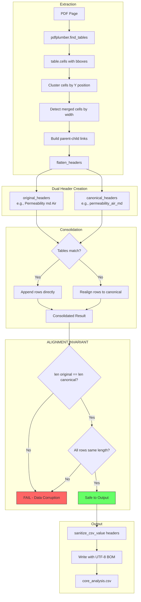

# 10003 - Feature: Preserve Original Column Headers in CSV Output

## 1. Context & Goal
* **Issue:** #0003
* **Objective:** Update CSV generation to preserve exact PDF column headers (including hierarchical/merged headers) while maintaining CSV injection protection and internal canonical key access.
* **Status:** Draft (Pending Review)
* **Related Issues:** #0004 (Header Normalization - provides `flatten_headers()` logic)

### Open Questions
None - requirements are well-defined from issue scenarios, failure analysis, and baseline output.

### CRITICAL LESSONS FROM FAILED IMPLEMENTATION

The previous attempt failed because:
1. **Header/Row Misalignment:** Used `original_headers` from first table but `consolidated_rows` were aligned to *different* headers from header matching → **data destruction**
2. **Ignored Multi-Row Structure:** PDF has hierarchical headers (parent cells spanning child columns) but code treated row[0] as complete headers → **headers incomplete**
3. **No Baseline Comparison:** Did not verify output against `data/output/spec/core_analysis.csv` → **failure undetected until manual review**

**THIS IMPLEMENTATION MUST:**
1. Handle merged/multi-row headers via bounding box analysis
2. Keep header-to-row alignment in sync throughout pipeline
3. Verify against baseline BEFORE any PR merge

---

## 2. Proposed Changes

### 2.1 Files Changed
| File | Action | Description |
|------|--------|-------------|
| `src/models.py` | Modify | Add `original_headers: list[str]` field to `ExtractedTable` dataclass. |
| `src/table_extractor.py` | Modify | Extract original headers from PDF, handle multi-row flattening, maintain dual-header sync. |
| `src/output/csv_sanitizer.py` | Create | CSV injection prevention utility (escape `=`, `@`, `+`, `-`). |
| `tests/test_header_preservation.py` | Create | Unit tests for header preservation logic. |
| `tests/test_csv_sanitizer.py` | Create | Unit tests for CSV injection protection. |
| `tests/test_baseline_regression.py` | Create | Regression test comparing output to baseline. |

### 2.2 Dependencies
* **pdfplumber** (existing): Required for `table.cells` bounding box analysis.
* No new dependencies.

### 2.3 Data Structures

```python
from typing import List, Dict, Optional, Tuple
from dataclasses import dataclass, field

@dataclass
class ExtractedTable:
    """Extended to support dual-header architecture."""
    page_number: int
    table_index: int
    headers: list[str]  # Canonical headers (for internal code access)
    original_headers: list[str] = field(default_factory=list)  # Original PDF headers (for CSV output)
    rows: list[list[str]] = field(default_factory=list)
    confidence: float = 1.0
    source_header_rows: int = 1  # How many rows were flattened into headers

    @property
    def row_count(self) -> int:
        return len(self.rows)

    @property
    def column_count(self) -> int:
        return len(self.headers)


class HeaderCell:
    """Represents a header cell with position info for merge detection."""
    text: str
    x0: float
    y0: float
    x1: float
    y1: float
    row_index: int
    col_span: int = 1  # How many columns this cell spans
```

### 2.4 Function Signatures

**`src/output/csv_sanitizer.py`**
```python
def sanitize_csv_value(value: str) -> str:
    """
    Prevent CSV injection by escaping dangerous leading characters.

    Args:
        value: The string to sanitize.

    Returns:
        String prefixed with single quote if it starts with =, +, -, @.

    Example:
        sanitize_csv_value("=SUM(A1)") -> "'=SUM(A1)"
        sanitize_csv_value("Normal Header") -> "Normal Header"
    """
    pass

def write_csv_with_bom(rows: List[List[str]], output_path: str, headers: List[str]) -> None:
    """
    Write CSV with UTF-8 BOM for Excel compatibility.

    Args:
        rows: Data rows to write.
        output_path: Destination file path.
        headers: Header row (will be sanitized before writing).
    """
    pass
```

**`src/table_extractor.py` (new/modified functions)**
```python
def _extract_header_cells(self, table: pdfplumber.table.Table) -> List[HeaderCell]:
    """
    Extract header cells with bounding box info for merge detection.

    Uses table.cells to get (x0, y0, x1, y1) for each cell,
    then identifies which cells span multiple columns.

    Returns:
        List of HeaderCell objects with position and span info.
    """
    pass

def _detect_header_row_count(self, cells: List[HeaderCell]) -> int:
    """
    Determine how many rows at the top are header rows.

    Heuristic: Rows where >50% of cells contain non-numeric text
    and cells may span multiple columns.

    Returns:
        Number of header rows (1-3 typically).
    """
    pass

def _flatten_multi_row_headers(self, header_cells: List[HeaderCell], row_count: int) -> List[str]:
    """
    Flatten hierarchical headers into single row.

    PDF Structure Example:
        Row 0: [empty]  | Permeability (md) |           | Porosity (%)  |
        Row 1: Sample   | Air               | Klink     | Ambient       | NCS

    Output:
        ["Sample", "Permeability (md) | Air", "Permeability (md) | Klink",
         "Porosity (%) | Ambient", "Porosity (%) | NCS"]

    Logic:
        1. Group cells by column index
        2. For each column, find parent cell (spans this column in row above)
        3. Join parent + child with " | " separator
    """
    pass

def _build_canonical_headers(self, original_headers: List[str]) -> List[str]:
    """
    Convert original headers to canonical snake_case for internal use.

    Example:
        "Permeability (md) | Air" -> "permeability_air_md"
        "Sample" -> "sample_number"
    """
    pass
```

### 2.5 Logic Flow (Pseudocode)

**Header Extraction & Flattening:**
```python
FUNCTION extract_headers_from_table(pdfplumber_table):
    # Step 1: Get all cells with bounding boxes
    cells = []
    FOR cell IN pdfplumber_table.cells:
        (x0, y0, x1, y1) = cell
        text = extract_text_in_bbox(x0, y0, x1, y1)
        cells.append(HeaderCell(text, x0, y0, x1, y1))

    # Step 2: Assign row indices based on y-position clustering
    y_positions = cluster_by_y(cells)  # Group cells into rows
    FOR cell IN cells:
        cell.row_index = find_row_for_y(cell.y0, y_positions)

    # Step 3: Detect column spans
    FOR cell IN cells:
        cell.col_span = count_columns_spanned(cell, all_column_boundaries)

    # Step 4: Determine header row count
    header_row_count = detect_header_rows(cells)

    # Step 5: Flatten multi-row headers
    header_cells = [c for c in cells if c.row_index < header_row_count]
    original_headers = flatten_headers(header_cells, header_row_count)

    # Step 6: Build canonical mapping
    canonical_headers = build_canonical(original_headers)

    RETURN original_headers, canonical_headers, header_row_count
```

**Maintaining Header-Row Alignment (CRITICAL):**
```python
FUNCTION consolidate_tables(tables: List[ExtractedTable]) -> ConsolidatedResult:
    # CRITICAL: original_headers and rows must stay aligned!

    # Use first table's headers as canonical reference
    reference_original = tables[0].original_headers
    reference_canonical = tables[0].headers

    all_rows = []
    FOR table IN tables:
        IF table.headers == reference_canonical:
            # Exact match - rows are already aligned
            all_rows.extend(table.rows)
        ELSE:
            # Headers differ - must realign rows to reference headers
            aligned_rows = align_rows_to_headers(
                source_headers=table.headers,
                source_rows=table.rows,
                target_headers=reference_canonical
            )
            all_rows.extend(aligned_rows)

    # INVARIANT: len(reference_original) == len(reference_canonical) == len(all_rows[0])
    ASSERT len(reference_original) == len(reference_canonical)
    FOR row IN all_rows:
        ASSERT len(row) == len(reference_canonical)

    RETURN ConsolidatedResult(
        original_headers=reference_original,  # For CSV output
        canonical_headers=reference_canonical,  # For code access
        rows=all_rows
    )
```

**CSV Output with Sanitization:**
```python
FUNCTION save_csv(result: ConsolidatedResult, output_path: str):
    # Sanitize headers for CSV injection protection
    safe_headers = [sanitize_csv_value(h) for h in result.original_headers]

    # Write with UTF-8 BOM for Excel
    WITH open(output_path, 'w', encoding='utf-8-sig', newline='') AS f:
        writer = csv.writer(f)
        writer.writerow(safe_headers)
        FOR row IN result.rows:
            writer.writerow(row)
```

### 2.6 Technical Approach

1. **Bounding Box Analysis:** Use `pdfplumber.table.cells` to get cell coordinates, detect merged cells by width vs column boundaries.

2. **Parent-Child Header Linking:** When a cell in row 0 spans columns 2-4, and row 1 has cells in columns 2, 3, 4, link each child to the parent.

3. **Dual-Header Architecture:**
   - `original_headers`: Exact PDF text for CSV output
   - `canonical_headers`: Snake_case for internal code access
   - Both lists MUST have same length and stay aligned to rows

4. **Alignment Invariant:** Every function that touches headers or rows must maintain: `len(headers) == len(row)` for all rows.

---

## 3. Requirements

1. **Header Preservation:** CSV output uses exact PDF header text (e.g., "Permeability (md) | Air", not "permeability_air_md").
2. **Multi-Row Flattening:** Hierarchical headers collapsed with " | " separator.
3. **CSV Injection Protection:** Headers starting with `=`, `@`, `+`, `-` escaped with leading `'`.
4. **UTF-8 BOM:** CSV includes BOM (`\ufeff`) for Excel compatibility.
5. **Dual-Header Support:** Internal code can still access data via canonical keys.
6. **Alignment Invariant:** Headers and rows must remain aligned through all transformations.
7. **Baseline Compatibility:** Output must match `data/output/spec/core_analysis.csv` structure (147 data rows, all columns populated).

---

## 4. Alternatives Considered

| Alternative | Pros | Cons | Decision |
|-------------|------|------|----------|
| **LLM-based header extraction** | Handles any layout | Non-deterministic, slow, costly | **Reject** (Use bounding box analysis) |
| **Regex-only header parsing** | Simple to implement | Fails on merged cells | **Reject** (Need position info) |
| **Single header list (original only)** | Simpler code | Breaks internal data access patterns | **Reject** (Need dual headers) |
| **Pipe separator for flattened headers** | Clear visual | May conflict with data containing pipes | **Accept** (Rare in RCA data) |

---

## 5. Data & Fixtures

### 5.1 Data Sources
| Source | Type | Description |
|--------|------|-------------|
| `docs/context/init/W20552.pdf` | Input | Source PDF with hierarchical headers |
| `data/output/spec/core_analysis.csv` | Baseline | Known-good output (147 rows) for regression |

### 5.2 Test Fixtures
| Fixture | Description |
|---------|-------------|
| `fixture_multi_row_header` | 2-row header with merged parent cells |
| `fixture_injection_headers` | Headers starting with `=`, `@`, `+`, `-` |
| `fixture_w20552_page39` | Real data from baseline PDF page 39 |

### 5.3 Baseline Reference
```
File: data/output/spec/core_analysis.csv
Rows: 147 data rows + 1 header row
Columns: 13 (core_number through notes)
```

---

## 6. Diagram

### 6.1 Mermaid Quality Gate
- [x] Syntax Valid
- [x] Flow logic matches Pseudocode
- [x] Shows alignment invariant

### 6.2 Diagram


---

## 7. Security Considerations

| Threat | Impact | Mitigation |
|--------|--------|------------|
| **CSV Injection** | Formula execution when opened in Excel | Escape `=`, `@`, `+`, `-` with leading `'` |
| **Data Corruption** | Wrong data under wrong headers | Alignment invariant assertions |

---

## 8. Performance Considerations

| Metric | Budget | Estimate |
|--------|--------|----------|
| **Header extraction per page** | <50ms | ~10ms (bounding box math) |
| **Flattening per table** | <10ms | ~1ms (list operations) |

---

## 9. Risks & Mitigations

| Risk | Impact | Likelihood | Mitigation |
|------|--------|------------|------------|
| **Bounding box edge cases** | Incorrect merge detection | Medium | Test against multiple PDF sources |
| **Header/row misalignment** | Data corruption | High (happened before!) | Assertion checks at every step |
| **Baseline drift** | Regression undetected | Low | Automated regression test |

---

## 10. Verification & Testing

### 10.1 Test Scenarios
| ID | Scenario | Type | Input | Output | Criteria |
|----|----------|------|-------|--------|----------|
| T01 | Baseline Regression | Integration | W20552.pdf | CSV | Matches `data/output/spec/core_analysis.csv` exactly |
| T02 | Multi-row Flattening | Unit | 2-row header | Single row | "Parent \| Child" format |
| T03 | CSV Injection | Unit | "=SUM(A1)" | "'=SUM(A1)" | Quote prepended |
| T04 | Alignment Check | Unit | Mismatched headers | Exception | Assertion fails |
| T05 | UTF-8 BOM | Unit | Any output | CSV file | First 3 bytes are BOM |

### 10.2 Test Commands

**MANDATORY: Run these commands before ANY PR:**

```bash
# Step 1: Run unit tests
poetry run pytest tests/test_header_preservation.py tests/test_csv_sanitizer.py -v

# Step 2: Generate output with new code
poetry run python -m src.table_extractor docs/context/init/W20552.pdf --output /tmp/new_output.csv

# Step 3: CRITICAL REGRESSION CHECK - Compare against baseline
diff data/output/spec/core_analysis.csv /tmp/new_output.csv

# Step 4: Verify row count (must be 147 data rows)
wc -l /tmp/new_output.csv  # Should output 148 (147 data + 1 header)

# Step 5: Verify no single-value rows (data destruction indicator)
# Each row should have multiple comma-separated values
awk -F',' 'NR>1 && NF<5 {print "FAIL: Row " NR " has only " NF " columns"; exit 1}' /tmp/new_output.csv
```

### 10.3 Manual Tests (Only If Unavoidable)
| ID | Scenario | Steps |
|----|----------|-------|
| M1 | Excel Safety | 1. Create CSV with `=SUM(1,1)` header. 2. Open in Excel. 3. Verify shows as text. |

---

## 11. Definition of Done

### Code
- [ ] `ExtractedTable.original_headers` field added to `src/models.py`
- [ ] `_extract_header_cells()` implemented with bounding box analysis
- [ ] `_flatten_multi_row_headers()` handles parent-child linking
- [ ] `sanitize_csv_value()` escapes dangerous characters
- [ ] CSV writer uses `original_headers` with UTF-8 BOM
- [ ] Alignment assertions at consolidation step

### Tests
- [ ] `test_baseline_regression.py` passes (compares to `data/output/spec/core_analysis.csv`)
- [ ] `test_header_preservation.py` covers multi-row flattening
- [ ] `test_csv_sanitizer.py` covers all injection characters

### Documentation
- [ ] Docstrings on all new functions
- [ ] `docs/reports/10003/implementation-report.md` created
- [ ] `docs/reports/10003/test-report.md` created

### Verification (PRE-MERGE GATE)
- [ ] `diff data/output/spec/core_analysis.csv /tmp/new_output.csv` shows expected changes only
- [ ] Row count: 147 data rows
- [ ] No single-value rows (alignment invariant held)
- [ ] Headers reflect merged structure from PDF

---

## 12. Implementation Instructions (SELF-GUIDANCE)

**AGENT: When implementing this LLD, follow these steps IN ORDER:**

### Phase 1: Setup
1. Create worktree: `git worktree add ../RCA-PDF-extraction-pipeline-3 -b 3-preserve-headers`
2. Navigate to worktree and install deps: `poetry install`
3. Read baseline file to understand expected output format

### Phase 2: CSV Sanitizer (Start Simple)
1. Create `src/output/csv_sanitizer.py`
2. Implement `sanitize_csv_value()` - 10 lines of code
3. Write `tests/test_csv_sanitizer.py` with edge cases
4. Run tests, verify passing

### Phase 3: Model Update
1. Add `original_headers` field to `ExtractedTable` in `src/models.py`
2. Ensure default is empty list for backwards compatibility

### Phase 4: Header Extraction (Core Logic)
1. In `src/table_extractor.py`, add `_extract_header_cells()`
2. Add `_detect_header_row_count()`
3. Add `_flatten_multi_row_headers()`
4. Modify `_extract_page_tables()` to use new functions
5. **CRITICAL:** Set both `headers` AND `original_headers` on each table

### Phase 5: Alignment Verification
1. Add assertion in `_consolidate_tables()`:
   ```python
   assert len(result.consolidated_headers) == len(result.original_headers)
   for row in result.consolidated_rows:
       assert len(row) == len(result.consolidated_headers)
   ```

### Phase 6: CSV Output
1. Modify `save_csv()` to use `original_headers`
2. Add UTF-8 BOM support
3. Apply `sanitize_csv_value()` to headers

### Phase 7: MANDATORY REGRESSION TEST
1. Run: `poetry run python -m src.table_extractor docs/context/init/W20552.pdf --output /tmp/test.csv`
2. Run: `diff data/output/spec/core_analysis.csv /tmp/test.csv`
3. **DO NOT PROCEED IF DIFF SHOWS DATA LOSS**
4. Verify: `wc -l /tmp/test.csv` outputs 148

### Phase 8: Reports & PR
1. Create `docs/reports/10003/implementation-report.md`
2. Create `docs/reports/10003/test-report.md`
3. Commit with descriptive message
4. Push and create PR

**FAILURE PREVENTION CHECKLIST:**
- [ ] Did I keep original_headers and canonical headers in sync?
- [ ] Did I verify row alignment after every transformation?
- [ ] Did I run the baseline diff before committing?
- [ ] Does the output have 147 data rows?
- [ ] Are all columns populated (no single-value rows)?

---

## Appendix: Review Log

### Review Summary

| Review | Date | Verdict | Key Issue |
|--------|------|---------|-----------|
| - | - | - | - |

**Final Status:** DRAFT - PENDING REVIEW
