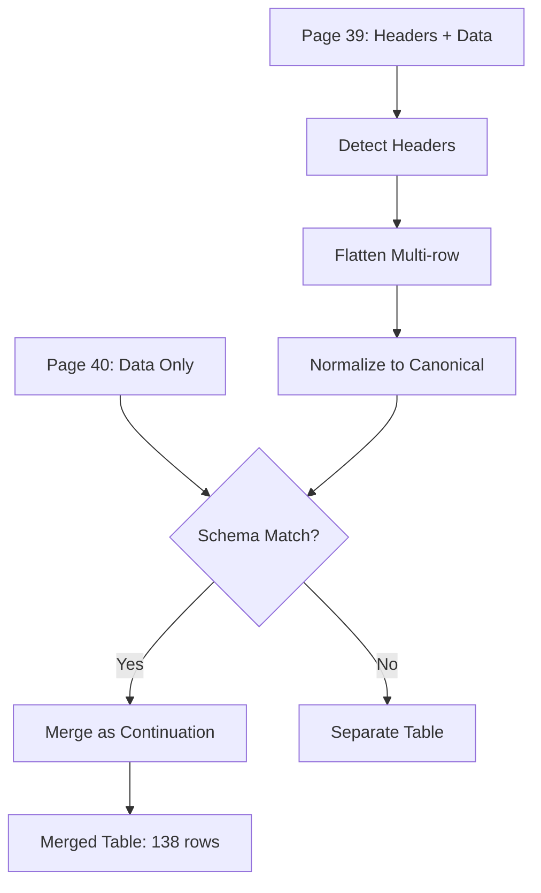

# 10005 - Feature: Header Normalization Across Pages

## 1. Context & Goal
* **Issue:** #5
* **Objective:** Implement header normalization that detects, flattens, and standardizes table headers across continuation pages
* **Status:** Approved
* **Related Issues:** #3 (depends on this), #4 (related)
* **Effort Estimate:** M (Medium)

### Open Questions
*Questions that need clarification before or during implementation. Remove when resolved.*

- [ ] What similarity threshold for fuzzy header matching? (Proposed: 0.8)
- [ ] Should we support user-defined canonical mappings or hardcode RCA mappings?

## 2. Proposed Changes

*This section is the **source of truth** for implementation. Describe exactly what will be built.*

### 2.1 Files Changed

| File | Change Type | Description |
|------|-------------|-------------|
| `src/header_normalizer.py` | Add | Header detection, flattening, normalization |
| `src/schema_matcher.py` | Add | Table schema comparison and merging |
| `src/canonical_headers.py` | Add | Canonical header mapping configuration |
| `src/table_extractor.py` | Modify | Integrate normalization pipeline |
| `tests/test_header_normalization.py` | Add | Unit tests for normalization |
| `tests/test_schema_matching.py` | Add | Unit tests for schema matching |
| `tests/fixtures/mock_raw_tables.json` | Add | Static fixture for offline development |

### 2.2 Offline Development Strategy

**Mock Mode:** The normalization and schema matching logic can be developed independently using static fixtures representing extracted raw tables.

```python
# tests/fixtures/mock_raw_tables.json - Raw tables for offline dev
{
    "tables": [
        {
            "page": 39,
            "header_rows": [["", "Permeability (md)", "", "Porosity (%)"], ["Sample", "Air", "Klink", "Ambient"]],
            "data_rows": [["6-1", "0.042", "0.038", "8.2"], ...]
        },
        {
            "page": 40,
            "header_rows": [],  # Continuation page - no headers
            "data_rows": [["6-10", "0.051", "0.045", "7.9"], ...]
        }
    ]
}
```

**Development Workflow:**
1. Create fixture with representative header patterns (multi-row, abbreviated, continuation)
2. Develop `header_normalizer.py` using fixture - no PDF extraction needed
3. Develop `schema_matcher.py` using fixture - no PDF extraction needed
4. Integration test with real PDF extraction as final step

### 2.3 Dependencies

*New packages, APIs, or services required.*

```toml
# No new dependencies - use difflib.SequenceMatcher for fuzzy matching
```

### 2.4 Data Structures

```python
# Pseudocode - NOT implementation

# Resource safety limit - prevent runaway memory on corrupted PDFs
MAX_CONTINUATION_PAGES = 50

CANONICAL_HEADERS = {
    "sample_number": ["Sample", "Sample No.", "Sample No", "Samp"],
    "depth_feet": ["Depth (ft)", "Depth", "Depth ft"],
    "permeability_air_md": ["Permeability Air", "Ka", "K Air", "Perm Air"],
    "permeability_klink_md": ["Permeability Klink", "Kk", "K Klink"],
    "porosity_ambient_pct": ["Porosity Ambient", "Porosity (%)", "Por Amb"],
    "porosity_ncs_pct": ["Porosity NCS", "NCS", "Por NCS"],
    # ... etc
}

@dataclass
class MergedTable:
    headers: list[str]
    original_headers: list[str]
    rows: list[dict]
    header_source_page: int
    pages_spanned: list[int]
```

### 2.5 Function Signatures

```python
# src/header_normalizer.py
def detect_header_rows(page_text: list[list[str]]) -> int:
    """Detect how many rows constitute the header (1-3 typically)."""
    ...

def flatten_headers(header_rows: list[list[str]]) -> list[str]:
    """Flatten multi-row headers into single row (e.g., 'Permeability (md)' + 'Air' -> 'Permeability (md) Air')."""
    ...

def normalize_header(raw_header: str) -> str:
    """Map raw header to canonical name using fuzzy matching."""
    ...

# src/schema_matcher.py
def tables_match_schema(table1: Table, table2: Table, threshold: float = 0.8) -> bool:
    """Check if two tables have compatible schemas for merging."""
    ...

def merge_continuation_tables(tables: list[Table]) -> MergedTable:
    """Merge continuation tables into single logical table."""
    ...
```

### 2.6 Logic Flow (Pseudocode)

```
1. For each page, extract raw table data
2. Detect header row count (1-3 rows)
3. IF multi-row header:
   - Flatten hierarchical headers into single row
4. Normalize each header to canonical name
5. continuation_count = 0
6. FOR consecutive tables:
   - IF continuation_count >= MAX_CONTINUATION_PAGES (50):
     - Log warning, treat remaining as separate table
     - BREAK merge loop
   - IF schema matches (>0.8 similarity):
     - IF column counts differ (structural mismatch):
       - FAIL CLOSED: Do NOT merge, treat as separate tables
       - Log warning with page numbers and column counts
     - ELSE:
       - Merge as continuation (skip duplicate headers)
       - continuation_count += 1
   - ELSE:
     - Treat as separate table
     - continuation_count = 0
7. Return merged tables with source metadata
```

### 2.7 Technical Approach

* **Module:** `src/header_normalizer.py`, `src/schema_matcher.py`
* **Pattern:** Pipeline pattern - detect -> flatten -> normalize -> merge
* **Key Decisions:**
  - Use difflib.SequenceMatcher for fuzzy matching (no external deps)
  - Hardcode RCA-specific canonical mappings for this project
  - Preserve original headers alongside canonical for #3

## 3. Requirements

*What must be true when this is done. These become acceptance criteria.*

1. Multi-row merged headers are flattened into single descriptive column names
2. "Permeability (md)" + "Air" becomes "permeability_air_md"
3. Tables from pages 39-42 merge into single table with 138 rows
4. Continuation pages without headers inherit schema from source table
5. Abbreviated headers ("Ka", "Sw") map to canonical names
6. Output includes `header_source_page` and `pages_spanned` metadata
7. Unknown headers are preserved (not dropped or errored)
8. `normalize_headers=False` bypasses all normalization (backward compatible)

## 4. Alternatives Considered

| Option | Pros | Cons | Decision |
|--------|------|------|----------|
| Exact match only | Simple | Fails on abbreviations | **Rejected** |
| AI-based inference | Flexible | Requires external API | **Rejected** |
| Fuzzy + canonical map | Good balance | Needs mapping maintenance | **Selected** |

**Rationale:** Fuzzy matching with predefined canonical mappings balances flexibility with determinism. No external dependencies needed.

## 5. Data & Fixtures

### 5.1 Data Sources

| Attribute | Value |
|-----------|-------|
| Source | W20552.pdf pages 39-42 |
| Format | PDF tables with multi-row headers |
| Size | 4 pages, ~138 rows total |
| Refresh | Manual (static document) |
| Copyright/License | Assignment material |

### 5.2 Data Pipeline

```
PDF pages ──extract──► Raw tables ──normalize──► Merged table ──output──► CSV/JSON
```

### 5.3 Test Fixtures

| Fixture | Source | Notes |
|---------|--------|-------|
| Multi-row header mock | Generated | Test flattening logic |
| Abbreviated header mock | Generated | Test fuzzy matching |
| Continuation page mock | Generated | Test schema matching |

### 5.4 Deployment Pipeline

Local development only - no deployment pipeline needed.

## 6. Diagram

### 6.1 Mermaid Quality Gate

- [ ] **Simplicity:** Similar components collapsed
- [ ] **No touching:** All elements have visual separation
- [ ] **No hidden lines:** All arrows fully visible
- [ ] **Readable:** Labels not truncated
- [ ] **Auto-inspected:** Skipped for draft

### 6.2 Diagram



## 7. Security Considerations

| Concern | Mitigation | Status |
|---------|------------|--------|
| No external data access | All processing local | Addressed |
| No user credentials | N/A | N/A |
| Runaway memory on corrupted PDF | MAX_CONTINUATION_PAGES = 50 limit | Addressed |
| Worktree scope | All temp files within project root | TODO |

**Fail Mode:**
- **Header normalization:** Fail Open - If normalization fails, preserve original headers and continue
- **Schema merge with structural mismatch:** Fail Closed - If column counts differ during merge, abort merge and treat as separate tables to prevent data misalignment

**Worktree Scope Requirement:**
All temporary files and intermediate extraction artifacts MUST reside within the project worktree. Use `pathlib.Path(__file__).parent.parent / "temp"` rather than system `tempfile`.

### 7.1 Logging Strategy

| Event | Level | Message Format |
|-------|-------|----------------|
| Schema match success | DEBUG | `Matched table on page {page} with score {score:.2f}` |
| Schema match failure | INFO | `Schema mismatch on page {page}: score {score:.2f} < threshold {threshold}` |
| Structural mismatch | WARNING | `Column count mismatch: page {p1} has {n1} cols, page {p2} has {n2} cols - not merging` |
| Continuation limit hit | WARNING | `Hit MAX_CONTINUATION_PAGES ({limit}) at page {page} - stopping merge` |
| Unknown header | INFO | `Unknown header preserved: '{header}'` |

## 8. Performance Considerations

| Metric | Budget | Approach |
|--------|--------|----------|
| Memory | < 100MB | Process page by page |
| Latency | < 10s | Sequential scan, no backtracking |

**Bottlenecks:** Fuzzy matching on many columns could be slow; mitigated by small column count (~15).

## 9. Risks & Mitigations

| Risk | Impact | Likelihood | Mitigation |
|------|--------|------------|------------|
| Unknown header not mapped | Med | Med | Preserve original, log warning |
| Wrong merge (false schema match) | High | Low | Require >0.8 threshold |
| Column order differs | Med | Low | Match by name not position |

## 10. Verification & Testing

### 10.1 Test Scenarios

| ID | Scenario | Type | Input | Expected Output | Pass Criteria |
|----|----------|------|-------|-----------------|---------------|
| 010 | Flatten 2-row header | Auto | [["Perm (md)"], ["Air"]] | "Permeability (md) Air" | Correct concatenation |
| 020 | Normalize abbreviated | Auto | "Ka" | "permeability_air_md" | Correct canonical |
| 030 | Merge continuation | Auto | 4 pages same schema | 1 table, 138 rows | Row count correct |
| 040 | Unknown header preserved | Auto | "Custom Col" | "Custom Col" | No error, preserved |
| 050 | Schema mismatch | Auto | Different column counts | 2 separate tables | Not merged |

### 10.2 Test Commands

```bash
# Run all automated tests
pytest tests/test_header_normalization.py tests/test_schema_matching.py -v
```

### 10.3 Manual Tests (Only If Unavoidable)

N/A - All scenarios automated.

## 11. Definition of Done

### Code
- [ ] Implementation complete and linted
- [ ] Code comments reference this LLD

### Tests
- [ ] All test scenarios pass
- [ ] Test coverage >90% on new modules

### Documentation
- [ ] LLD updated with any deviations
- [ ] Implementation Report completed
- [ ] Test Report completed if applicable

### Review
- [ ] Code review completed
- [ ] User approval before closing issue

---

## Appendix: Review Log

*Track all review feedback with timestamps and implementation status.*

### Gemini 3 Pro Review #1 (REVISE)

**Timestamp:** 2026-01-29
**Reviewer:** Gemini 3 Pro (Senior Software Architect & AI Governance Lead)
**Verdict:** REVISE

#### Comments

| ID | Comment | Implemented? |
|----|---------|--------------|
| G1.1 | "Loop Bounds Undefined (BLOCKING): Define MAX_CONTINUATION_PAGES to prevent runaway memory" | YES - Added constant = 50 in Section 2.4 |
| G1.2 | "Worktree Scope (BLOCKING): Mandate temp files within project root" | YES - Added to Section 7 |
| G1.3 | "Fail-Safe Strategy (BLOCKING): Define Fail Closed for structural mismatches" | YES - Added to Section 2.6 and 7 |
| G1.4 | "Offline Development (CRITICAL): Define Mock Mode for table_extractor" | YES - Added Section 2.2 with mock_raw_tables.json |
| G1.5 | "Logging Strategy: Add schema match score logging" | YES - Added Section 7.1 |
| G1.6 | "Test Data Hygiene: Use generated mocks, not actual PDF" | NOTED - Section 5.3 already specifies "Generated" fixtures |
| G1.7 | "Consider storing CANONICAL_HEADERS in config file" | DEFERRED - Hardcode for now, can refactor later |

---

### Gemini 3 Pro Review #2 (APPROVED)

**Timestamp:** 2026-01-30
**Reviewer:** Gemini 3 Pro (Senior Software Architect & AI Governance Lead)
**Verdict:** APPROVED

#### Comments

| ID | Comment | Implemented? |
|----|---------|--------------|
| G2.1 | "Keep external configuration for headers on backlog" | NOTED - Future enhancement |
| G2.2 | "Define MAX_CONTINUATION_PAGES in central constants.py" | NOTED - Implementation detail |

### Review Summary

| Review | Date | Verdict | Key Issue |
|--------|------|---------|-----------|
| Gemini 3 Pro #1 | 2026-01-29 | REVISE | Loop bounds, worktree scope, fail-safe |
| Gemini 3 Pro #2 | 2026-01-30 | APPROVED | No blocking issues |

**Final Status:** APPROVED
