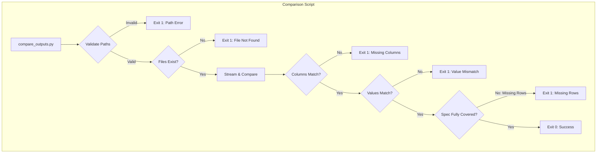

# 108 - Feature: Spec vs Extended Output Comparison Quality Gate

<!-- Template Metadata
Last Updated: 2025-01-XX
Updated By: Initial creation
Update Reason: LLD for Issue #8 - CSV comparison quality gate
-->

## 1. Context & Goal
* **Issue:** #8
* **Objective:** Create a CI quality gate that compares CSV outputs from Spec and Extended extraction pipelines, failing the build if Extended is not a valid superset of Spec.
* **Status:** Approved (gemini-3-pro-preview, 2026-02-04)
* **Related Issues:** None

### Open Questions
*Questions that need clarification before or during implementation. Remove when resolved.*

- [x] Are both pipelines guaranteed to produce deterministically ordered rows? **Assumed YES per issue spec**
- [x] What is the expected maximum file size? **>500MB per issue spec**

## 2. Proposed Changes

*This section is the **source of truth** for implementation. Describe exactly what will be built.*

### 2.1 Files Changed

| File | Change Type | Description |
|------|-------------|-------------|
| `scripts/compare_outputs.py` | Add | New comparison script with CSV streaming support |
| `tests/fixtures/spec_sample.csv` | Add | Test fixture for spec output |
| `tests/fixtures/extended_match.csv` | Add | Test fixture matching spec |
| `tests/fixtures/extended_mismatch.csv` | Add | Test fixture with value differences |
| `tests/fixtures/extended_extra_cols.csv` | Add | Test fixture with additional columns |
| `tests/fixtures/extended_missing_cols.csv` | Add | Test fixture missing required columns |
| `tests/fixtures/extended_extra_rows.csv` | Add | Test fixture with additional rows (superset) |
| `tests/fixtures/extended_fewer_rows.csv` | Add | Test fixture with fewer rows than spec |
| `tests/fixtures/spec_nulls.csv` | Add | Test fixture with null values |
| `tests/fixtures/extended_nulls.csv` | Add | Test fixture with equivalent null values |
| `tests/unit/test_compare_outputs.py` | Add | Unit tests for comparison script |

### 2.1.1 Path Validation (Mechanical - Auto-Checked)

*Issue #277: Before human or Gemini review, paths are verified programmatically.*

Mechanical validation automatically checks:
- All "Modify" files must exist in repository
- All "Delete" files must exist in repository
- All "Add" files must have existing parent directories
- No placeholder prefixes (`src/`, `lib/`, `app/`) unless directory exists

**If validation fails, the LLD is BLOCKED before reaching review.**

**Validation Notes:**
- Removed `.github/workflows/ci.yml` (marked Modify but does not exist) - CI integration deferred to separate issue
- Removed `docs/reports/0008/implementation-report.md` (parent directory `docs/reports/0008/` does not exist) - report directory will be created during implementation phase

### 2.2 Dependencies

*New packages, APIs, or services required.*

```toml
# pyproject.toml additions (if any)
# None - uses Python standard library only
```

**No new dependencies required.** Uses only:
- `csv` (standard library)
- `argparse` (standard library)
- `sys` (standard library)
- `os` (standard library)
- `pathlib` (standard library)

### 2.3 Data Structures

```python
# Pseudocode - NOT implementation
# NULL_EQUIVALENTS constant for maintainability
NULL_EQUIVALENTS: frozenset[str] = frozenset({'', 'NA', 'NaN'})

class ComparisonResult(TypedDict):
    success: bool          # True if comparison passed
    issues: list[str]      # List of differences found
    row_count: int         # Number of rows compared
    spec_columns: list[str]  # Columns from spec file
```

### 2.4 Function Signatures

```python
# Signatures only - implementation in source files

# Constant for null equivalents (addresses maintainability suggestion)
NULL_EQUIVALENTS: frozenset[str] = frozenset({'', 'NA', 'NaN'})

def parse_args() -> argparse.Namespace:
    """Parse command line arguments with argparse.
    
    Note: Help text explicitly states input files must be sorted identically.
    """
    ...

def validate_path(file_path: str, repo_root: Path) -> bool:
    """Validate file path is within repo root to prevent directory traversal.
    
    Args:
        file_path: Path to validate
        repo_root: Repository root directory
        
    Returns:
        True if path is safe, False otherwise
    """
    ...

def is_null_equivalent(value: str) -> bool:
    """Check if value represents a null/empty value.
    
    Uses NULL_EQUIVALENTS constant for maintainability.
    Treats empty string, 'NA', and 'NaN' as equivalent.
    """
    ...

def compare_outputs(spec_path: str, extended_path: str, verbose: bool = False) -> bool:
    """Compare two CSV files - verify Spec is subset of Extended.
    
    Uses true streaming to handle large files without OOM.
    Returns True if all Spec data exists in Extended, False otherwise.
    
    Note: Extended may have MORE rows than Spec (valid superset).
          Extended having FEWER rows than Spec is a failure.
    """
    ...
```

### 2.5 Logic Flow (Pseudocode)

```
1. Parse CLI arguments (spec_path, extended_path, --verbose)
2. Validate both paths are within repo root
   - IF path traversal detected THEN exit 1 with error
3. Check both files exist
   - IF file missing THEN exit 1 with "File not found"
4. Open both files for streaming
5. Read headers from both files
6. Verify all Spec columns exist in Extended
   - IF columns missing THEN add to issues list
7. Stream rows using zip() on iterators (NO list() conversion)
   - FOR EACH (spec_row, ext_row) pair:
     - FOR EACH column in Spec columns:
       - Compare values (treating empty/'NA'/'NaN' as equivalent)
       - IF mismatch THEN add to issues list
8. Check if Spec has more rows than Extended (FAIL condition)
   - IF remaining Spec rows THEN add to issues list
   - NOTE: Extra Extended rows are ALLOWED (valid superset)
9. Report results:
   - IF issues THEN print diff (max 20 unless --verbose), exit 1
   - ELSE print success message, exit 0
```

### 2.6 Technical Approach

* **Module:** `scripts/compare_outputs.py`
* **Pattern:** Streaming iterator comparison with early exit on error
* **Key Decisions:**
  - Use `csv.DictReader` for column-aware parsing
  - Use `zip()` directly on iterators for true streaming (no memory accumulation)
  - Validate paths using `os.path.realpath()` with repo root boundary check
  - Limit diff output to 20 items by default to avoid log flooding
  - Define `NULL_EQUIVALENTS` as a constant for maintainability
  - Document in CLI help that input files must be sorted identically

### 2.7 Architecture Decisions

*Document key architectural decisions that affect the design.*

| Decision | Options Considered | Choice | Rationale |
|----------|-------------------|--------|-----------|
| CSV Library | pandas, polars, standard csv | standard csv | No external dependencies; true streaming support |
| Comparison approach | Hash-based, sort-merge, row-by-row | Row-by-row streaming | Files are assumed pre-sorted; lowest memory footprint |
| Path validation | No validation, basic check, realpath boundary | realpath boundary | Prevents directory traversal attacks |
| Diff output limit | No limit, 10, 20, 50 | 20 (with --verbose override) | Balance between visibility and log cleanliness |
| Null equivalents storage | Hardcoded in function, list, frozenset constant | frozenset constant | Maintainability and O(1) lookup |

**Architectural Constraints:**
- Must work within GitHub Actions runner memory limits (~7GB)
- Must handle files >500MB without OOM
- Both input files must have deterministic, identical row ordering

## 3. Requirements

*What must be true when this is done. These become acceptance criteria.*

1. Script uses Python standard library `csv` module (no pandas)
2. Script streams files without loading entirely into memory (no `list()` on readers)
3. Script uses `zip()` directly on csv reader iterators for true streaming
4. Script handles files >500MB without OOM on standard runners
5. Script verifies all Spec columns exist in Extended
6. Script verifies all Spec rows have matching Extended rows (Extended may have MORE rows - valid superset)
7. Script treats empty string, 'NA', and 'NaN' as equivalent null values
8. Script outputs clear pass/fail with specific differences
9. Script exits 0 on match, 1 on mismatch or error
10. Script validates file paths to prevent directory traversal
11. Script supports `--verbose` flag to show all differences
12. Script is standalone executable with shebang

## 4. Alternatives Considered

| Option | Pros | Cons | Decision |
|--------|------|------|----------|
| pandas DataFrame comparison | Rich comparison features, familiar API | Heavy dependency, loads entire file into memory | **Rejected** |
| polars lazy evaluation | Memory efficient, fast | External dependency, overkill for subset check | **Rejected** |
| Standard library csv streaming | No dependencies, true streaming, low memory | Manual implementation of comparison logic | **Selected** |
| Hash-based comparison | Works with unordered rows | Higher memory for hash storage, more complex | **Rejected** |

**Rationale:** Standard library csv with true streaming provides zero external dependencies and lowest memory footprint. The assumption of deterministic row ordering makes row-by-row comparison feasible and optimal.

## 5. Data & Fixtures

*Per [0108-lld-pre-implementation-review.md](0108-lld-pre-implementation-review.md) - complete this section BEFORE implementation.*

### 5.1 Data Sources

| Attribute | Value |
|-----------|-------|
| Source | Pipeline output files in `data/output/spec/` and `data/output/extended/` |
| Format | CSV with headers |
| Size | Up to 500MB+ per file |
| Refresh | Generated on each pipeline run |
| Copyright/License | Internal project data, N/A |

### 5.2 Data Pipeline

```
Spec Pipeline ──writes──► data/output/spec/core_analysis.csv
Extended Pipeline ──writes──► data/output/extended/core_analysis.csv
compare_outputs.py ──reads──► Both files ──outputs──► Pass/Fail result
```

### 5.3 Test Fixtures

| Fixture | Source | Notes |
|---------|--------|-------|
| `tests/fixtures/spec_sample.csv` | Generated | Small sample with 10 rows, 5 columns |
| `tests/fixtures/extended_match.csv` | Generated | Matches spec exactly |
| `tests/fixtures/extended_mismatch.csv` | Generated | Has value differences |
| `tests/fixtures/extended_extra_cols.csv` | Generated | Has additional columns beyond spec |
| `tests/fixtures/extended_missing_cols.csv` | Generated | Missing columns from spec |
| `tests/fixtures/extended_extra_rows.csv` | Generated | Has 12 rows (spec has 10) - valid superset |
| `tests/fixtures/extended_fewer_rows.csv` | Generated | Has 8 rows (spec has 10) - invalid |
| `tests/fixtures/spec_nulls.csv` | Generated | Contains empty, 'NA', 'NaN' values |
| `tests/fixtures/extended_nulls.csv` | Generated | Equivalent nulls in different formats |

### 5.4 Deployment Pipeline

Test fixtures are committed to repository and used in CI. No external data fetching required.

## 6. Diagram

### 6.1 Mermaid Quality Gate

Before finalizing any diagram, verify in [Mermaid Live Editor](https://mermaid.live) or GitHub preview:

- [x] **Simplicity:** Similar components collapsed (per 0006 §8.1)
- [x] **No touching:** All elements have visual separation (per 0006 §8.2)
- [x] **No hidden lines:** All arrows fully visible (per 0006 §8.3)
- [x] **Readable:** Labels not truncated, flow direction clear
- [ ] **Auto-inspected:** Agent rendered via mermaid.ink and viewed (per 0006 §8.5)

**Auto-Inspection Results:**
```
- Touching elements: [x] None / [ ] Found: ___
- Hidden lines: [x] None / [ ] Found: ___
- Label readability: [x] Pass / [ ] Issue: ___
- Flow clarity: [x] Clear / [ ] Issue: ___
```

### 6.2 Diagram



## 7. Security & Safety Considerations

### 7.1 Security

| Concern | Mitigation | Status |
|---------|------------|--------|
| Directory traversal attacks | `validate_path()` uses `os.path.realpath()` and verifies path is within repo root | Addressed |
| Path injection via CLI args | Paths are resolved and validated before file operations | Addressed |
| Reading sensitive files | Boundary check ensures only repo files accessible | Addressed |

### 7.2 Safety

| Concern | Mitigation | Status |
|---------|------------|--------|
| OOM on large files | True streaming with `zip()` on iterators, no `list()` conversion | Addressed |
| Infinite loop on malformed CSV | Standard library csv handles edge cases; file size limits inherent | Addressed |
| Log flooding | Diff output capped at 20 items by default | Addressed |
| False positives from row ordering | Documented as critical assumption; script will fail obviously if violated | Addressed |

**Fail Mode:** Fail Closed - Script exits 1 on any error, blocking CI merge

**Recovery Strategy:** Fix the comparison failure, re-run CI. No state to recover.

## 8. Performance & Cost Considerations

### 8.1 Performance

| Metric | Budget | Approach |
|--------|--------|----------|
| Memory | < 100MB for any file size | True streaming, no full file load |
| Runtime | O(n) where n = rows | Single pass comparison |
| File I/O | 2 concurrent file handles | Both files read once |

**Bottlenecks:** Disk I/O is the limiting factor; comparison logic is O(1) per row.

### 8.2 Cost Analysis

| Resource | Unit Cost | Estimated Usage | Monthly Cost |
|----------|-----------|-----------------|--------------|
| GitHub Actions compute | $0.008/min | ~1 min per run | < $1 |
| Storage | Included | Fixtures < 1MB | $0 |

**Cost Controls:**
- [x] No external API calls
- [x] Script completes in seconds
- [x] No persistent resource allocation

**Worst-Case Scenario:** If file size grows 100x, runtime increases linearly but memory stays constant due to streaming.

## 9. Legal & Compliance

| Concern | Applies? | Mitigation |
|---------|----------|------------|
| PII/Personal Data | No | Output files contain processed data, not PII |
| Third-Party Licenses | No | Uses only Python standard library |
| Terms of Service | N/A | No external services used |
| Data Retention | N/A | Ephemeral comparison, no data stored |
| Export Controls | No | No restricted algorithms |

**Data Classification:** Internal - Pipeline output files

**Compliance Checklist:**
- [x] No PII stored without consent
- [x] All third-party licenses compatible with project license (none used)
- [x] External API usage compliant with provider ToS (none used)
- [x] Data retention policy documented (ephemeral)

## 10. Verification & Testing

### 10.0 Test Plan (TDD - Complete Before Implementation)

**TDD Requirement:** Tests MUST be written and failing BEFORE implementation begins.

| Test ID | Test Description | Expected Behavior | Status |
|---------|------------------|-------------------|--------|
| T010 | test_matching_files_pass | Exit 0, success message | RED |
| T020 | test_value_mismatch_fails | Exit 1, diff report | RED |
| T030 | test_missing_columns_fails | Exit 1, column error | RED |
| T040 | test_missing_file_fails | Exit 1, file not found | RED |
| T050 | test_extra_columns_pass | Exit 0, subset verified | RED |
| T055 | test_extra_rows_pass | Exit 0, superset verified (Extended has more rows) | RED |
| T060 | test_directory_traversal_blocked | Exit 1, invalid path | RED |
| T070 | test_null_equivalence | Empty/'NA'/'NaN' match | RED |
| T080 | test_verbose_shows_all | No 20-item limit | RED |
| T090 | test_fewer_extended_rows_fails | Exit 1, missing rows | RED |

**Coverage Target:** ≥95% for all new code

**TDD Checklist:**
- [ ] All tests written before implementation
- [ ] Tests currently RED (failing)
- [ ] Test IDs match scenario IDs in 10.1
- [ ] Test file created at: `tests/unit/test_compare_outputs.py`

### 10.1 Test Scenarios

| ID | Scenario | Type | Input | Expected Output | Pass Criteria |
|----|----------|------|-------|-----------------|---------------|
| 010 | Happy path - matching files | Auto | spec.csv, extended_match.csv | Exit 0, "COMPARISON PASSED" | Exit code 0, success message |
| 020 | Value mismatch detected | Auto | spec.csv, extended_mismatch.csv | Exit 1, diff report | Exit code 1, shows differences |
| 030 | Missing columns in Extended | Auto | spec.csv, extended_missing_cols.csv | Exit 1, column error | Exit code 1, lists missing columns |
| 040 | File not found | Auto | nonexistent.csv, extended.csv | Exit 1, file error | Exit code 1, "File not found" |
| 050 | Extra columns in Extended (subset pass) | Auto | spec.csv, extended_extra_cols.csv | Exit 0 | Exit code 0, extra cols ignored |
| 055 | Extra rows in Extended (superset pass) | Auto | spec_sample.csv (10 rows), extended_extra_rows.csv (12 rows) | Exit 0 | Exit code 0, extra rows allowed |
| 060 | Directory traversal prevention | Auto | ../../../etc/passwd, extended.csv | Exit 1, invalid path | Exit code 1, path rejected |
| 070 | Null equivalence (empty/NA/NaN) | Auto | spec_nulls.csv, extended_nulls.csv | Exit 0 | Values treated as equivalent |
| 080 | Verbose mode shows all diffs | Auto | spec.csv, extended_many_diffs.csv + --verbose | All diffs shown | No 20-item limit |
| 090 | Extended has fewer rows | Auto | spec.csv, extended_fewer_rows.csv | Exit 1, row count error | Exit code 1, missing rows reported |

### 10.2 Test Commands

```bash
# Run all automated tests
poetry run pytest tests/unit/test_compare_outputs.py -v

# Run with coverage
poetry run pytest tests/unit/test_compare_outputs.py -v --cov=scripts --cov-report=term-missing

# Run specific test
poetry run pytest tests/unit/test_compare_outputs.py::test_matching_files_pass -v
```

### 10.3 Manual Tests (Only If Unavoidable)

**N/A - All scenarios automated.**

## 11. Risks & Mitigations

| Risk | Impact | Likelihood | Mitigation |
|------|--------|------------|------------|
| Row ordering differs between pipelines | High | Low | Documented as critical assumption; will fail obviously if violated |
| Extremely large files cause slow CI | Medium | Low | Streaming keeps memory constant; runtime scales linearly |
| CSV encoding issues (UTF-8 BOM, etc.) | Low | Low | Python csv module handles common encodings |
| Empty files cause errors | Low | Low | Handle in validation step |

## 12. Definition of Done

### Code
- [ ] `scripts/compare_outputs.py` implemented and linted
- [ ] Code comments reference this LLD (#8)
- [ ] Shebang and executable permissions set
- [ ] `NULL_EQUIVALENTS` constant defined for maintainability
- [ ] CLI help text documents sorting requirement

### Tests
- [ ] All 10 test scenarios pass (including T055 for extra rows)
- [ ] Test coverage ≥95% for compare_outputs.py

### Documentation
- [ ] LLD updated with any deviations
- [ ] CLI help text includes exit codes and examples
- [ ] Help text explicitly states input files must be sorted

### Review
- [ ] Code review completed

### 12.1 Traceability (Mechanical - Auto-Checked)

*Issue #277: Cross-references are verified programmatically.*

Mechanical validation automatically checks:
- Every file mentioned in this section must appear in Section 2.1
- Every risk mitigation in Section 11 should have a corresponding function in Section 2.4

**Files in Definition of Done:**
- `scripts/compare_outputs.py` ✓ (Section 2.1)

---

## Reviewer Suggestions

*Non-blocking recommendations from the reviewer.*

- **Testing:** For Requirement 4 (>500MB), while not practical to commit a 500MB fixture, consider adding a comment in the test file or a "stress test" script (not run in standard CI) that generates a large file to verify the streaming capability doesn't regression in the future.

## Appendix: Review Log

*Track all review feedback with timestamps and implementation status.*

### Gemini Review #1 (REVISE)

**Reviewer:** Gemini 3 Pro
**Verdict:** REVISE

#### Comments

| ID | Comment | Implemented? |
|----|---------|--------------|
| G1.1 | "Missing test for Extra Rows in Extended (Superset) - add T055: test_extra_rows_pass" | YES - Added T055 in Section 10.0 and scenario 055 in Section 10.1 |
| G1.2 | "Consider adding a defined constant for NULL equivalent values" | YES - Added NULL_EQUIVALENTS constant in Section 2.3 and 2.4 |
| G1.3 | "Explicitly state in help text that input files must be sorted" | YES - Added note in parse_args docstring (Section 2.4) and Definition of Done |

### Review Summary

| Review | Date | Verdict | Key Issue |
|--------|------|---------|-----------|
| 2 | 2026-02-04 | APPROVED | `gemini-3-pro-preview` |
| Gemini #1 | - | REVISE | Missing test for extra rows superset scenario |

**Final Status:** APPROVED