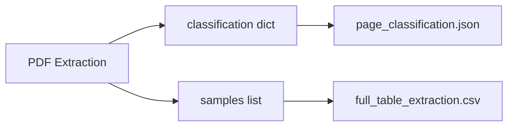

# 10015 - Feature: Rename Output Files to Match Assignment Terminology

## 1. Context & Goal
* **Issue:** #15
* **Objective:** Rename output files to align with assignment language ("Page Classification" and "Full Table Extraction") and separate bundled deliverables
* **Status:** Approved
* **Related Issues:** None
* **Effort Estimate:** S (Small)

### Open Questions
*Questions that need clarification before or during implementation. Remove when resolved.*

- [ ] Should we maintain backward compatibility with old filenames? (Proposed: No - clean break)
- [ ] Should `page_classification.json` include `table_pages` array or just the dict? (Proposed: Just the dict)

## 2. Proposed Changes

*This section is the **source of truth** for implementation. Describe exactly what will be built.*

### 2.1 Files Changed

| File | Change Type | Description |
|------|-------------|-------------|
| `src/main.py` | Modify | Update output filename constants |
| `src/table_extractor.py` | Modify | Split JSON output into classification-only file |
| `tests/test_output_format.py` | Add | Verify output file structure |
| `README.md` | Modify | Update output file references if present |

### 2.2 Offline Development Strategy

**Mock Mode:** This change is primarily string/path manipulation and can be tested without PDF extraction.

```python
# tests/fixtures/mock_classification.json - Expected output format
{
    "page_1": "other",
    "page_2": "other",
    "page_39": "table",
    "page_40": "table"
}
```

**Development Workflow:**
1. Update filename constants in `main.py`
2. Modify JSON write logic to output classification dict only
3. Run existing extraction to verify output structure
4. Update any documentation references

### 2.3 Dependencies

*New packages, APIs, or services required.*

```toml
# No new dependencies
```

### 2.4 Data Structures

```python
# Pseudocode - NOT implementation

# Old structure (core_analysis.json) - REMOVE
{
    "classification": {...},
    "table_pages": [...],
    "sample_count": 138,
    "samples": [...]
}

# New structure (page_classification.json) - ADD
{
    "page_1": "other",
    "page_39": "table",
    ...
}

# CSV unchanged, just renamed to full_table_extraction.csv
```

### 2.5 Function Signatures

```python
# src/main.py - Updated constants
OUTPUT_CLASSIFICATION_JSON = "page_classification.json"
OUTPUT_EXTRACTION_CSV = "full_table_extraction.csv"

# src/table_extractor.py
def write_classification(classification: dict[str, str], output_path: Path) -> None:
    """Write classification dict directly (not nested under 'classification' key)."""
    ...

def write_extraction_csv(samples: list[dict], output_path: Path) -> None:
    """Write extracted samples to CSV."""
    ...
```

### 2.6 Logic Flow (Pseudocode)

```
1. Run page classification (unchanged logic)
2. Run table extraction (unchanged logic)
3. Write outputs:
   - page_classification.json: Write classification dict directly
   - full_table_extraction.csv: Write samples (renamed from core_analysis.csv)
4. Log output file paths to console
```

### 2.7 Technical Approach

* **Module:** `src/main.py`, `src/table_extractor.py`
* **Pattern:** Configuration change with minor refactor
* **Key Decisions:**
  - Clean break from old filenames (no backward compatibility)
  - Classification JSON is flat dict, not nested under "classification" key
  - CSV content unchanged, only filename changes

## 3. Requirements

*What must be true when this is done. These become acceptance criteria.*

1. `page_classification.json` exists in output directory
2. `page_classification.json` contains flat dict: `{"page_1": "other", ...}`
3. `page_classification.json` does NOT contain `samples`, `sample_count`, or `table_pages`
4. `full_table_extraction.csv` exists in output directory
5. `full_table_extraction.csv` contains same data as old `core_analysis.csv`
6. Old filenames (`core_analysis.json`, `core_analysis.csv`) are no longer produced
7. CLI output messages reference new filenames
8. README updated if it mentions output filenames

## 4. Alternatives Considered

| Option | Pros | Cons | Decision |
|--------|------|------|----------|
| Keep bundled JSON | No code change | Doesn't match assignment | **Rejected** |
| Backward compat (write both) | Smooth transition | Confusing, unnecessary | **Rejected** |
| Rename only (keep bundled structure) | Minimal change | Still mixes deliverables | **Rejected** |
| Split and rename | Matches assignment exactly | Requires JSON restructure | **Selected** |

**Rationale:** The assignment explicitly describes two separate deliverables. Separating them makes grading straightforward.

## 5. Data & Fixtures

### 5.1 Data Sources

| Attribute | Value |
|-----------|-------|
| Source | Existing extraction output |
| Format | JSON dict, CSV |
| Size | ~3KB JSON, ~8KB CSV |
| Refresh | On each extraction run |

### 5.2 Data Pipeline

```
PDF ──extract──► classification dict ──write──► page_classification.json
                 samples list ──write──► full_table_extraction.csv
```

### 5.3 Test Fixtures

| Fixture | Source | Notes |
|---------|--------|-------|
| `mock_classification.json` | Generated | Verify flat dict structure |
| `mock_extraction.csv` | Generated | Verify CSV headers preserved |

### 5.4 Deployment Pipeline

Local development only - no deployment pipeline needed.

## 6. Diagram

### 6.1 Mermaid Quality Gate

- [x] **Simplicity:** Minimal elements
- [x] **No touching:** All elements separated
- [x] **No hidden lines:** All arrows visible
- [x] **Readable:** Labels clear
- [x] **Auto-inspected:** N/A for simple diagram

### 6.2 Diagram



## 7. Security Considerations

| Concern | Mitigation | Status |
|---------|------------|--------|
| Path traversal | Use pathlib, validate output dir | Existing |
| No new attack surface | Simple rename operation | N/A |

**Fail Mode:**
- **File write failure:** Fail Closed - Exit with error if cannot write output files

**Worktree Scope Requirement:**
All output files MUST reside within `data/output/` under project root.

### 7.1 Logging Strategy

| Event | Level | Message Format |
|-------|-------|----------------|
| Classification written | INFO | `Wrote classification to {path}` |
| Extraction written | INFO | `Wrote extraction to {path}` |
| Write failure | ERROR | `Failed to write {path}: {error}` |

## 8. Performance Considerations

| Metric | Budget | Approach |
|--------|--------|----------|
| Memory | Unchanged | No new data structures |
| Latency | Unchanged | Same I/O operations |

**Bottlenecks:** None - this is a simple rename/restructure.

## 9. Risks & Mitigations

| Risk | Impact | Likelihood | Mitigation |
|------|--------|------------|------------|
| Scripts depend on old filenames | Low | Low | Document in README, clean break |
| Grader expects old format | Med | Very Low | New format matches assignment language |

## 10. Verification & Testing

### 10.1 Test Scenarios

| ID | Scenario | Type | Input | Expected Output | Pass Criteria |
|----|----------|------|-------|-----------------|---------------|
| 010 | Classification JSON structure | Auto | Run extraction | Flat dict, no nesting | Keys are `page_N`, values are classifications |
| 020 | Classification JSON no samples | Auto | Run extraction | No `samples` key | `samples` key absent |
| 030 | CSV filename correct | Auto | Run extraction | `full_table_extraction.csv` | File exists with correct name |
| 040 | CSV content unchanged | Auto | Compare old/new | Same row count, same data | Diff shows no content changes |
| 050 | Old files not created | Auto | Run extraction | No `core_analysis.*` | Files do not exist |

### 10.2 Test Commands

```bash
# Run extraction and verify output
python -m src.main full docs/context/init/W20552.pdf --output data/output/spec/

# Verify files exist
ls data/output/spec/page_classification.json
ls data/output/spec/full_table_extraction.csv

# Verify old files don't exist
test ! -f data/output/spec/core_analysis.json
test ! -f data/output/spec/core_analysis.csv
```

### 10.3 Manual Tests (Only If Unavoidable)

N/A - All scenarios automated.

## 11. Definition of Done

### Code
- [ ] Implementation complete and linted
- [ ] Code comments reference this LLD

### Tests
- [ ] All test scenarios pass
- [ ] Output structure verified

### Documentation
- [ ] LLD updated with any deviations
- [ ] Implementation Report completed
- [ ] README updated if needed

### Review
- [ ] Code review completed
- [ ] User approval before closing issue

---

## Appendix: Review Log

*Track all review feedback with timestamps and implementation status.*

(No reviews yet)
