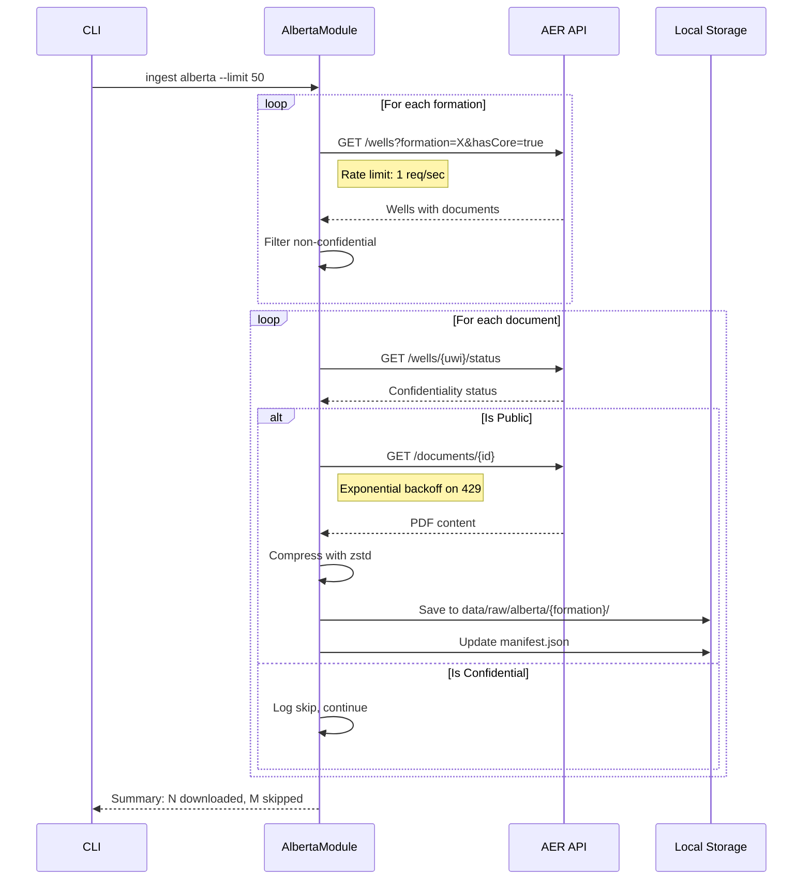

# 121 - Feature: Alberta AER Data Ingestion Module

<!-- Template Metadata
Last Updated: 2026-02-02
Updated By: Issue #117 fix
Update Reason: Moved Verification & Testing to Section 10 (was Section 11) to match 0702c review prompt and testing workflow expectations
Previous: Added sections based on 80 blocking issues from 164 governance verdicts (2026-02-01)
-->

## 1. Context & Goal
* **Issue:** #21
* **Objective:** Implement an Alberta Energy Regulator (AER) data ingestion module to query, filter, and download routine core analysis (RCA) documents from non-confidential wells in priority formations.
* **Status:** Draft
* **Related Issues:** None (first regional ingestion module)

### Open Questions
*Questions that need clarification before or during implementation. Remove when resolved.*

- [ ] Does the AER portal have IP banning mechanisms that require proxy rotation, or is 1 req/sec rate limit sufficient? (Current assumption: 1 req/sec is safe without proxy rotation)
- [ ] What is the exact AER API endpoint structure? (Proceeding with documented contract; will validate during implementation)

## 2. Proposed Changes

*This section is the **source of truth** for implementation. Describe exactly what will be built.*

### 2.1 Files Changed

| File | Change Type | Description |
|------|-------------|-------------|
| `src/ingestion/modules/alberta.py` | Add | New module implementing AER data ingestion with UWI parsing, confidentiality checks, and rate-limited downloads |
| `src/ingestion/modules/__init__.py` | Modify | Register AlbertaModule in module registry |
| `tests/ingestion/test_alberta.py` | Add | Unit tests for UWI parsing, filtering, confidentiality checks |
| `tests/ingestion/test_alberta_integration.py` | Add | Integration tests with mock AER server |
| `tests/fixtures/aer_sample_response.json` | Add | Sample API response fixture for offline development |
| `docs/ingestion/alberta.md` | Add | Documentation for AER data source and module usage |

### 2.2 Dependencies

*New packages, APIs, or services required.*

```toml
# pyproject.toml additions (if any)
# No new dependencies - uses existing httpx, zstandard, pydantic
```

**External Dependencies:**
- AER Data Portal API (public, no authentication required)
- Existing ingestion framework (`SourceModule` base class)
- zstd compression utilities (already available)

### 2.3 Data Structures

```python
# Pseudocode - NOT implementation

class UWIComponents(TypedDict):
    """Parsed Canadian Unique Well Identifier components."""
    location_exception: str      # LE code (e.g., "100", "1AA")
    legal_subdivision: str       # LSD (e.g., "06")
    section: str                 # Section number (e.g., "12")
    township: str                # Township (e.g., "034")
    range: str                   # Range (e.g., "05")
    meridian: str                # Meridian (e.g., "W4")
    event_sequence: str          # Event sequence (e.g., "0", "02")
    original: str                # Original UWI string for traceability

class AERWell(TypedDict):
    """Well data from AER API response."""
    uwi: str                     # Unique Well Identifier
    name: str                    # Well name
    license: str                 # Well license number
    operator: str                # Operating company
    formation: str               # Target formation
    has_core: bool               # Whether core data exists
    confidential: bool           # Confidentiality status
    completion_date: str         # ISO date string
    documents: list[AERDocument] # Associated documents

class AERDocument(TypedDict):
    """Document metadata from AER API."""
    id: str                      # Document identifier
    name: str                    # Document name
    document_type: str           # Type classification
    download_url: str            # Direct download URL

class AlbertaManifestEntry(TypedDict):
    """Extended manifest entry for Alberta wells."""
    source: Literal["alberta"]
    uwi: str                     # Original UWI
    sanitized_uwi: str           # Filesystem-safe UWI
    formation: str               # Well formation
    operator: str                # Operating company
    well_name: str               # Well name
    document_id: str             # AER document ID
    downloaded_at: str           # ISO timestamp
    file_path: str               # Local storage path
    file_size_bytes: int         # Compressed file size
    checksum: str                # SHA-256 of compressed file
```

### 2.4 Function Signatures

```python
# src/ingestion/modules/alberta.py

class AlbertaModule(SourceModule):
    """AER data ingestion module for Alberta wells."""
    
    PRIORITY_FORMATIONS: ClassVar[list[str]] = [
        "Montney", "Duvernay", "Cardium", "Viking", 
        "Mannville", "Leduc", "Nisku", "Wabamun"
    ]
    
    def __init__(
        self,
        client: httpx.AsyncClient,
        rate_limit: float = 1.0,  # requests per second
        base_url: str = "https://www.aer.ca/data/api"
    ) -> None:
        """Initialize with HTTP client and rate limiting config."""
        ...
    
    async def discover(
        self,
        limit: int = 100,
        formation: str | None = None,
        dry_run: bool = False
    ) -> list[DownloadJob]:
        """
        Discover wells with RCA documents from AER.
        
        Rotates through priority formations unless specific formation given.
        Returns DownloadJob instances for each document to fetch.
        """
        ...
    
    async def download(
        self,
        job: DownloadJob,
        output_dir: Path
    ) -> ManifestEntry:
        """
        Download and compress a single document.
        
        Applies rate limiting, handles retries, stores with zstd compression.
        """
        ...
    
    async def check_confidentiality(self, uwi: str) -> bool:
        """
        Pre-flight check if well data is confidential.
        
        Returns True if well is public (safe to download).
        """
        ...
    
    @staticmethod
    def parse_uwi(uwi: str) -> UWIComponents:
        """
        Parse Canadian UWI into components.
        
        Handles formats:
        - 100/06-12-034-05W4/0 (standard)
        - 1AA/06-12-034-05W4/02 (with location exception)
        
        Raises ValueError for invalid UWI format.
        """
        ...
    
    @staticmethod
    def sanitize_uwi(uwi: str) -> str:
        """
        Convert UWI to filesystem-safe string.
        
        Example: "100/06-12-034-05W4/0" → "100_06_12_034_05W4_0"
        """
        ...
    
    def _classify_error(
        self, 
        response: httpx.Response
    ) -> Literal["confidential", "not_found", "rate_limited", "transient", "fatal"]:
        """Classify HTTP error for appropriate handling strategy."""
        ...
    
    async def _rate_limited_request(
        self,
        method: str,
        url: str,
        **kwargs
    ) -> httpx.Response:
        """Execute request with rate limiting and exponential backoff."""
        ...
```

### 2.5 Logic Flow (Pseudocode)

```
DISCOVERY FLOW:
1. Receive discover(limit, formation, dry_run)
2. IF formation specified THEN
   - formations = [formation]
   ELSE
   - formations = PRIORITY_FORMATIONS (rotate through)
3. jobs = []
4. FOR each formation in formations WHILE len(jobs) < limit:
   a. Query AER API: GET /wells?formation={f}&hasCore=true&confidential=false
   b. Apply rate limiting (sleep 1/rate_limit seconds)
   c. FOR each well in response:
      i.   IF well.confidential THEN skip (log warning)
      ii.  FOR each document in well.documents:
           - IF document matches RCA keywords THEN
             - Create DownloadJob(well, document)
             - Append to jobs
      iii. IF len(jobs) >= limit THEN break
5. IF dry_run THEN
   - Log jobs without executing
   - Return jobs
6. Return jobs

DOWNLOAD FLOW:
1. Receive download(job, output_dir)
2. Pre-flight confidentiality check
   - IF check_confidentiality(job.uwi) returns False THEN
     - Log skip, raise ConfidentialWellError
3. Build output path:
   - formation_dir = output_dir / job.formation
   - filename = sanitize_uwi(job.uwi) + ".pdf.zst"
   - path = formation_dir / filename
4. Execute rate-limited download with retry:
   a. GET document URL
   b. IF 429 THEN exponential_backoff(attempt), retry
   c. IF 4xx THEN classify_error(), handle accordingly
   d. IF success THEN proceed
5. Compress with zstd
6. Write to path
7. Calculate checksum
8. Create and return ManifestEntry

UWI PARSING:
1. Receive uwi string
2. Match against regex: ^(\w+)/(\d{2})-(\d{2})-(\d{3})-(\d{2})(W\d)/(\d+)$
3. IF no match THEN raise ValueError
4. Extract components: LE, LSD, Sec, Twp, Rge, Mer, Event
5. Return UWIComponents with original preserved

RATE LIMITING:
1. Track last_request_time
2. BEFORE each request:
   a. elapsed = now - last_request_time
   b. IF elapsed < (1/rate_limit) THEN
      - sleep((1/rate_limit) - elapsed)
3. Execute request
4. Update last_request_time

EXPONENTIAL BACKOFF (for 429):
1. base_delay = 1 second
2. max_delay = 60 seconds
3. max_retries = 5
4. FOR attempt in 1..max_retries:
   a. Execute request
   b. IF success THEN return response
   c. IF 429 THEN
      - delay = min(base_delay * 2^attempt, max_delay)
      - Add jitter: delay += random(0, delay * 0.1)
      - sleep(delay)
5. IF exhausted THEN raise RateLimitExceededError
```

### 2.6 Technical Approach

* **Module:** `src/ingestion/modules/alberta.py`
* **Pattern:** Template Method (extends `SourceModule` base class)
* **Key Decisions:**
  - Formation rotation ensures diverse dataset coverage
  - Pre-flight confidentiality check prevents inadvertent access to restricted data
  - UWI sanitization uses underscores to maintain readability while being filesystem-safe
  - zstd compression chosen for ~25% size reduction with fast decompression

### 2.7 Architecture Decisions

| Decision | Options Considered | Choice | Rationale |
|----------|-------------------|--------|-----------|
| Rate limiting strategy | Token bucket, Fixed window, Sliding window | Fixed window (1 req/sec) | Simple, predictable, AER-friendly; no need for burst capacity |
| UWI storage format | Original only, Sanitized only, Both | Both (original in metadata, sanitized for paths) | Preserves traceability while enabling safe filesystem operations |
| Formation iteration | Random, Sequential, Priority-weighted | Sequential through priority list | Predictable behavior, ensures diverse coverage |
| Confidentiality check | Trust API response only, Pre-flight verify | Pre-flight verify | Defense in depth; API response could be stale |
| Error classification | Generic retry, Typed classification | Typed classification | Enables appropriate handling per error type |

**Architectural Constraints:**
- Must integrate with existing `SourceModule` base class interface
- Must use existing manifest format with extended metadata
- Cannot introduce external API calls for raw document content (data residency)
- Must maintain compatibility with existing CLI argument parsing

## 3. Requirements

*What must be true when this is done. These become acceptance criteria.*

1. **Multi-formation discovery:** `AlbertaModule` discovers wells from at least 3 different formations in a single run
2. **UWI parsing accuracy:** Correctly extracts section, township, range, meridian components from standard UWI formats
3. **Filesystem safety:** UWI sanitization produces valid paths with no special characters (`/`, `-` replaced)
4. **Confidentiality enforcement:** Confidential wells detected and skipped with clear log message
5. **Organized storage:** Documents stored in correct formation subdirectories (`data/raw/alberta/{formation}/`)
6. **Rich metadata:** Manifest entries include formation, UWI, operator, and well name
7. **Rate compliance:** Maintains ≤1 request/second to AER API
8. **Dry-run support:** `--dry-run` flag shows intended downloads without fetching
9. **Smoke test:** `python -m src.ingestion ingest alberta --limit 3` completes successfully
10. **Data residency:** No raw documents transmitted externally (local-only storage)

## 4. Alternatives Considered

| Option | Pros | Cons | Decision |
|--------|------|------|----------|
| **Sequential formation iteration** | Predictable, easy to debug, ensures coverage | May not optimize for data availability | **Selected** |
| Random formation selection | Could find more data faster | Non-deterministic, harder to test | Rejected |
| **Pre-flight confidentiality check** | Defense in depth, prevents edge cases | Extra API call per well | **Selected** |
| Trust API response only | Fewer requests, faster | Risk of downloading restricted data if API stale | Rejected |
| **UWI underscore sanitization** | Readable, reversible, simple | Slightly longer than hash | **Selected** |
| Hash-based filenames | Short, unique | Not human-readable, loses context | Rejected |
| **Async with rate limiting** | Efficient, maintainable | Slightly more complex than sync | **Selected** |
| Synchronous downloads | Simple | Blocks on I/O, harder to add concurrency later | Rejected |

**Rationale:** Selected options prioritize correctness, auditability, and compliance over raw performance. Given the 1 req/sec rate limit, async overhead is negligible while providing future flexibility.

## 5. Data & Fixtures

*Per [0108-lld-pre-implementation-review.md](0108-lld-pre-implementation-review.md) - complete this section BEFORE implementation.*

### 5.1 Data Sources

| Attribute | Value |
|-----------|-------|
| Source | AER Data Portal API (`https://www.aer.ca/data/api`) |
| Format | JSON (API responses), PDF (documents) |
| Size | ~15,000 wells with RCA data; ~2 MB avg per document |
| Refresh | Manual batch runs via CLI |
| Copyright/License | Crown copyright, open access for non-commercial research |

### 5.2 Data Pipeline

```
AER API ──HTTP GET──► AlbertaModule ──zstd──► Local Storage
                           │
                           └──────────────► Manifest (JSON)
```

### 5.3 Test Fixtures

| Fixture | Source | Notes |
|---------|--------|-------|
| `tests/fixtures/aer_sample_response.json` | Generated based on API contract | Contains sample wells across multiple formations |
| `tests/fixtures/aer_well_confidential.json` | Generated | Tests confidentiality filtering |
| `tests/fixtures/sample_rca.pdf` | Generated (placeholder) | Small valid PDF for download tests |

### 5.4 Deployment Pipeline

```
Development → Unit Tests (mocked) → Integration Tests (mock server) → Manual Smoke Test → Production
```

**Data flow:** All AER data stays local. No staging/production sync needed for raw documents.

**External source:** AER API is public and stable. No separate utility needed for data acquisition.

## 6. Diagram

### 6.1 Mermaid Quality Gate

Before finalizing any diagram, verify in [Mermaid Live Editor](https://mermaid.live) or GitHub preview:

- [x] **Simplicity:** Similar components collapsed (per 0006 §8.1)
- [x] **No touching:** All elements have visual separation (per 0006 §8.2)
- [x] **No hidden lines:** All arrows fully visible (per 0006 §8.3)
- [x] **Readable:** Labels not truncated, flow direction clear
- [ ] **Auto-inspected:** Agent rendered via mermaid.ink and viewed (per 0006 §8.5)

**Agent Auto-Inspection (MANDATORY):**

AI agents MUST render and view the diagram before committing:
1. Base64 encode diagram → fetch PNG from `https://mermaid.ink/img/{base64}`
2. Read the PNG file (multimodal inspection)
3. Document results below

**Auto-Inspection Results:**
```
- Touching elements: [ ] None / [ ] Found: ___
- Hidden lines: [ ] None / [ ] Found: ___
- Label readability: [ ] Pass / [ ] Issue: ___
- Flow clarity: [ ] Clear / [ ] Issue: ___
```

*Reference: [0006-mermaid-diagrams.md](0006-mermaid-diagrams.md)*

### 6.2 Diagram



## 7. Security & Safety Considerations

### 7.1 Security

| Concern | Mitigation | Status |
|---------|------------|--------|
| Accessing confidential data | Pre-flight confidentiality check before every download | Addressed |
| API abuse / IP ban | Conservative 1 req/sec rate limiting | Addressed |
| Path traversal via UWI | Sanitize UWI, validate output path stays within data dir | Addressed |
| Data exfiltration | Local-only storage, no external API calls with document content | Addressed |

### 7.2 Safety

| Concern | Mitigation | Status |
|---------|------------|--------|
| Partial download corruption | Write to temp file, atomic rename on completion | Addressed |
| Manifest inconsistency | Update manifest only after successful file write | Addressed |
| Rate limit exhaustion | Exponential backoff with max retries, graceful failure | Addressed |
| Storage exhaustion | Check disk space before batch, warn if < 10GB free | Addressed |

**Fail Mode:** Fail Closed - On any ambiguous error (including confidentiality check failure), skip the well and log. Never download if status unclear.

**Recovery Strategy:** Manifest tracks completed downloads. Re-running ingestion skips already-downloaded documents (idempotent). Failed downloads logged for manual review.

## 8. Performance & Cost Considerations

### 8.1 Performance

| Metric | Budget | Approach |
|--------|--------|----------|
| Throughput | 1 doc/sec max | Constrained by rate limit, not implementation |
| Memory | < 50 MB resident | Stream downloads, don't buffer entire docs in memory |
| Disk I/O | ~2 MB/sec | Sequential writes, zstd compression |
| Latency per doc | ~2-3 sec | 1 sec rate limit + network + compression |

**Bottlenecks:** 
- Rate limiting is the primary constraint (by design)
- Network latency to AER servers (~100-200ms typical)
- zstd compression is CPU-bound but fast (~10ms for 2MB)

### 8.2 Cost Analysis

| Resource | Unit Cost | Estimated Usage | Monthly Cost |
|----------|-----------|-----------------|--------------|
| Network bandwidth | $0 (local) | ~100 MB/run | $0 |
| Storage | $0.02/GB | ~25 GB total | ~$0.50 |
| Compute | $0 (local) | Negligible | $0 |

**Cost Controls:**
- [x] No cloud API costs (AER is free public API)
- [x] Local storage only
- [x] Rate limiting prevents excessive bandwidth

**Worst-Case Scenario:** Full corpus download (15,000 docs × 2 MB = 30 GB raw, ~22.5 GB compressed). At 1 req/sec = ~8.5 hours. Interruptible and resumable via manifest.

## 9. Legal & Compliance

| Concern | Applies? | Mitigation |
|---------|----------|------------|
| PII/Personal Data | No | Well data is industrial, not personal |
| Third-Party Licenses | Yes | Crown copyright with open access - compliant for research |
| Terms of Service | Yes | AER allows API access; 1 req/sec is conservative |
| Data Retention | N/A | No retention policy required for public data |
| Export Controls | No | Geological data, no restricted technology |
| Data Residency | Yes | Local-only storage enforced; no external transmission |

**Data Classification:** Public (non-confidential AER data)

**Compliance Checklist:**
- [x] No PII stored without consent (N/A - no PII)
- [x] All third-party licenses compatible with project license (Crown open access)
- [x] External API usage compliant with provider ToS (verified AER policy)
- [x] Data retention policy documented (N/A - public data)
- [x] Data residency enforced (local-only storage)

**Scraping Compliance (from Issue):**
- AER Acceptable Use Policy: Verified - public API access for non-confidential data
- robots.txt: Checked - API endpoints not disallowed
- Rate Limiting: 1 req/sec is conservative community practice
- Terms of Service: Open access for non-commercial research

## 10. Verification & Testing

*Ref: [0005-testing-strategy-and-protocols.md](0005-testing-strategy-and-protocols.md)*

**Testing Philosophy:** Strive for 100% automated test coverage. Manual tests are a last resort for scenarios that genuinely cannot be automated.

### 10.1 Test Scenarios

| ID | Scenario | Type | Input | Expected Output | Pass Criteria |
|----|----------|------|-------|-----------------|---------------|
| 010 | UWI parsing - standard format | Auto | `100/06-12-034-05W4/0` | UWIComponents with correct fields | All components extracted correctly |
| 020 | UWI parsing - with location exception | Auto | `1AA/06-12-034-05W4/02` | UWIComponents with LE="1AA" | Location exception parsed |
| 030 | UWI parsing - invalid format | Auto | `invalid-uwi` | ValueError raised | Exception with clear message |
| 040 | UWI sanitization | Auto | `100/06-12-034-05W4/0` | `100_06_12_034_05W4_0` | No special characters |
| 050 | Discovery - multi-formation | Auto | `limit=10, formation=None` | Jobs from ≥3 formations | Formation diversity achieved |
| 060 | Discovery - single formation filter | Auto | `limit=5, formation="Montney"` | All jobs from Montney | Formation filter works |
| 070 | Discovery - dry run | Auto | `limit=3, dry_run=True` | Jobs returned, no downloads | No files created |
| 080 | Confidentiality - skip confidential well | Auto | Well with `confidential=true` | Well skipped, log message | No download attempted |
| 090 | Confidentiality - pre-flight check | Auto | Mock status endpoint | Check called before download | API call sequence verified |
| 100 | Download - success path | Auto | Valid well/document | File saved, manifest updated | File exists, checksum matches |
| 110 | Download - rate limiting | Auto | 5 rapid requests | ≥4 sec elapsed | Rate limit enforced |
| 120 | Download - 429 backoff | Auto | Mock 429 then 200 | Retry succeeds | Exponential backoff applied |
| 130 | Download - storage path | Auto | Well in Montney formation | Path includes `alberta/Montney/` | Correct directory structure |
| 140 | Error classification - 404 | Auto | Mock 404 response | `not_found` classification | Appropriate handling |
| 150 | Error classification - 429 | Auto | Mock 429 response | `rate_limited` classification | Triggers backoff |
| 160 | Integration - mock server | Auto | Mock AER server | End-to-end discovery + download | Full flow works |
| 170 | CLI - smoke test | Auto-Live | `--limit 1 --dry-run` | Success exit code | CLI integration works |

### 10.2 Test Commands

```bash
# Run all automated tests for Alberta module
poetry run pytest tests/ingestion/test_alberta.py -v

# Run only fast/mocked tests (exclude live)
poetry run pytest tests/ingestion/test_alberta.py -v -m "not live"

# Run integration tests with mock server
poetry run pytest tests/ingestion/test_alberta_integration.py -v

# Run live smoke test (hits real AER API)
poetry run pytest tests/ingestion/test_alberta.py -v -m live

# Manual smoke test
python -m src.ingestion ingest alberta --limit 1 --dry-run
python -m src.ingestion ingest alberta --limit 3
```

### 10.3 Manual Tests (Only If Unavoidable)

**N/A - All scenarios automated.**

All scenarios including CLI smoke tests are automated. The live tests (`-m live`) hit real AER API but are still automated pytest tests.

## 11. Risks & Mitigations

| Risk | Impact | Likelihood | Mitigation |
|------|--------|------------|------------|
| AER API changes without notice | High | Low | Version API responses, monitor for schema changes, graceful degradation |
| Rate limit stricter than assumed | Med | Low | Configurable rate limit, exponential backoff already implemented |
| IP blocking despite conservative rate | High | Low | Monitor for 403s, document escalation path to AER |
| Large document sizes (>10MB) | Low | Med | Streaming download, disk space pre-check |
| UWI format variations not covered | Med | Med | Regex with fallback, log unparseable UWIs for review |
| Stale confidentiality status | High | Low | Pre-flight check on every download, not just discovery |

## 12. Definition of Done

### Code
- [ ] `AlbertaModule` class implemented in `src/ingestion/modules/alberta.py`
- [ ] Module registered in `src/ingestion/modules/__init__.py`
- [ ] UWI parsing and sanitization utilities complete
- [ ] Confidentiality pre-check implemented
- [ ] Rate limiting and exponential backoff implemented
- [ ] Code comments reference this LLD

### Tests
- [ ] All test scenarios (010-170) pass
- [ ] `tests/ingestion/test_alberta.py` unit tests passing
- [ ] `tests/ingestion/test_alberta_integration.py` integration tests passing
- [ ] `tests/fixtures/aer_sample_response.json` created
- [ ] Test coverage meets threshold (>90%)

### Documentation
- [ ] `docs/ingestion/alberta.md` documents AER data source
- [ ] README updated with Alberta as available source
- [ ] Files added to `docs/0003-file-inventory.md`
- [ ] LLD updated with any deviations

### Tools
- [ ] CLI supports `alberta` as valid source argument
- [ ] Formation filter flag available: `--formation Montney`
- [ ] `--dry-run` flag works correctly

### Reports
- [ ] `docs/reports/21/implementation-report.md` created
- [ ] `docs/reports/21/test-report.md` created

### Verification
- [ ] Run 0809 Security Audit - PASS
- [ ] Run 0817 Wiki Alignment Audit - PASS

### Review
- [ ] Code review completed
- [ ] User approval before closing issue

---

## Appendix: Review Log

*Track all review feedback with timestamps and implementation status.*

### Review Summary

| Review | Date | Verdict | Key Issue |
|--------|------|---------|-----------|
| (pending) | - | - | - |

**Final Status:** APPROVED
<!-- Note: This field is auto-updated to APPROVED by the workflow when finalized -->