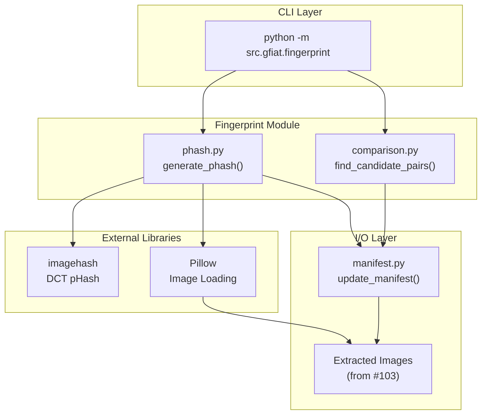
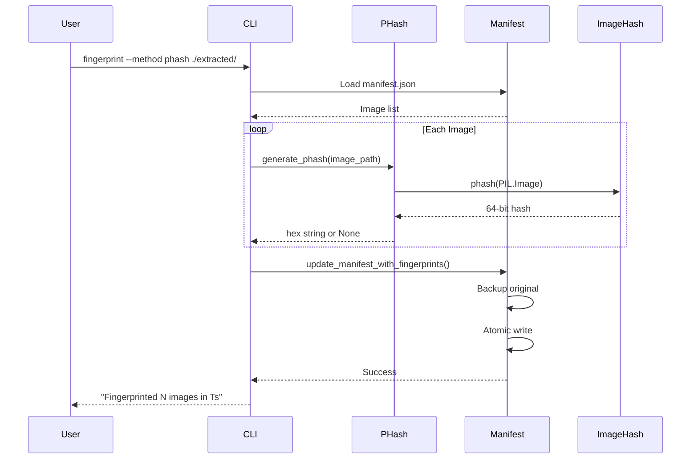

# 1028 - Feature: Perceptual Hash (pHash) Fingerprinting

<!-- Template Metadata
Last Updated: 2026-02-02
Updated By: Issue #117 fix
Update Reason: Moved Verification & Testing to Section 10 (was Section 11) to match 0702c review prompt and testing workflow expectations
Previous: Added sections based on 80 blocking issues from 164 governance verdicts (2026-02-01)
-->

## 1. Context & Goal
* **Issue:** #28
* **Objective:** Implement perceptual hashing to generate similarity-resistant fingerprints for extracted images, enabling fast pre-filtering of potential clone pairs before expensive SIFT analysis.
* **Status:** Draft
* **Related Issues:** #103 (Image extraction module - dependency)

### Open Questions
*Questions that need clarification before or during implementation. Remove when resolved.*

- [ ] Confirm #103 (Image extraction) is complete before starting implementation
- [ ] Verify `imagehash` BSD-2-Clause license is documented in project license inventory

## 2. Proposed Changes

*This section is the **source of truth** for implementation. Describe exactly what will be built.*

### 2.1 Files Changed

| File | Change Type | Description |
|------|-------------|-------------|
| `src/gfiat/fingerprint/__init__.py` | Add | Module initialization, expose public API |
| `src/gfiat/fingerprint/phash.py` | Add | Core pHash generation using DCT-based algorithm |
| `src/gfiat/fingerprint/comparison.py` | Add | Hamming distance calculation with null-check guards |
| `src/gfiat/fingerprint/cli.py` | Add | CLI interface for fingerprinting commands |
| `src/gfiat/manifest.py` | Modify | Add fingerprint field support (`phash`, `phash_timestamp`) |
| `src/gfiat/__main__.py` | Modify | Register fingerprint subcommand |
| `tests/test_fingerprint.py` | Add | Unit tests for fingerprinting module |
| `tests/test_fingerprint_integration.py` | Add | Integration tests for CLI and manifest updates |
| `tests/fixtures/fingerprint/` | Add | Test images for hash verification |
| `pyproject.toml` | Modify | Add `imagehash` dependency |
| `docs/0003-file-inventory.md` | Modify | Document new fingerprint module files |

### 2.2 Dependencies

*New packages, APIs, or services required.*

```toml
# pyproject.toml additions
imagehash = "^4.3.1"  # BSD-2-Clause license, DCT-based perceptual hashing
# Note: numpy and scipy already present (required by imagehash)
# Note: Pillow already present (image loading)
```

### 2.3 Data Structures

```python
# Pseudocode - NOT implementation
from typing import TypedDict, Optional, List

class ImageFingerprintEntry(TypedDict):
    path: str                    # Relative path to extracted image
    source_page: int             # PDF page number (from extraction)
    dimensions: List[int]        # [width, height]
    format: str                  # PNG, JPEG, TIFF, BMP
    phash: Optional[str]         # 16-char hex string or None if corrupted
    phash_timestamp: str         # ISO 8601 timestamp of fingerprinting

class ManifestSchema(TypedDict):
    images: List[ImageFingerprintEntry]
    extraction_timestamp: str    # From issue #103
    fingerprint_timestamp: Optional[str]  # When fingerprinting last ran

class CandidatePair(TypedDict):
    image_a: str                 # Path to first image
    image_b: str                 # Path to second image
    hamming_distance: int        # 0-64 bits difference
    
class ComparisonResult(TypedDict):
    threshold: int               # Hamming distance threshold used
    total_images: int            # Total images in manifest
    valid_images: int            # Images with non-null phash
    skipped_images: int          # Images with null phash
    candidate_pairs: List[CandidatePair]  # Sorted by distance ascending
```

### 2.4 Function Signatures

```python
# src/gfiat/fingerprint/phash.py
def generate_phash(image_path: Path) -> Optional[str]:
    """Generate 64-bit perceptual hash for an image.
    
    Returns 16-character hex string or None if image is corrupted/unreadable.
    """
    ...

def batch_generate_phash(
    image_paths: List[Path], 
    workers: int = 1
) -> Dict[Path, Optional[str]]:
    """Generate pHash for multiple images with optional parallel processing."""
    ...

# src/gfiat/fingerprint/comparison.py
def hamming_distance(hash_a: str, hash_b: str) -> int:
    """Compute Hamming distance between two 64-bit hashes (hex strings).
    
    Raises ValueError if either hash is invalid format.
    """
    ...

def find_candidate_pairs(
    manifest: ManifestSchema,
    threshold: int = 10
) -> ComparisonResult:
    """Find all image pairs with Hamming distance below threshold.
    
    Skips images where phash is None. Returns pairs sorted by distance ascending.
    """
    ...

# src/gfiat/fingerprint/cli.py
def fingerprint_command(
    directory: Path,
    method: str = "phash",
    compare: bool = False,
    threshold: int = 10,
    workers: int = 1,
    incremental: bool = True
) -> int:
    """CLI entry point for fingerprinting operations. Returns exit code."""
    ...

# src/gfiat/manifest.py (additions to existing)
def update_manifest_with_fingerprints(
    manifest_path: Path,
    fingerprints: Dict[str, Optional[str]],
    timestamp: str
) -> None:
    """Atomically update manifest.json with phash values, preserving existing fields."""
    ...

def get_images_needing_fingerprint(manifest: ManifestSchema) -> List[str]:
    """Return paths of images without phash or with stale phash."""
    ...
```

### 2.5 Logic Flow (Pseudocode)

```
FINGERPRINT GENERATION FLOW:
1. Receive directory path from CLI
2. Validate directory exists
   IF not exists THEN
   - Print error to stderr: "Error: Directory '{path}' not found"
   - Return exit code 1
3. Load manifest.json from directory
   IF manifest not found THEN
   - Print error: "Error: manifest.json not found in '{path}'"
   - Return exit code 1
4. IF incremental mode THEN
   - Filter to images without phash or with modified timestamp
5. FOR EACH image in batch:
   TRY:
     - Load image with PIL
     - Generate pHash using imagehash.phash()
     - Convert hash to 16-char hex string
   CATCH (corrupted/unreadable):
     - Log warning to stderr: "Skipping {path}: Unable to decode image"
     - Set phash = None
6. Create backup of manifest.json
7. Update manifest.json atomically with:
   - phash for each image
   - phash_timestamp for each image
   - fingerprint_timestamp at root level
8. Print summary: "Fingerprinted {N} images in {T}s"
9. Return exit code 0

COMPARISON FLOW:
1. Load manifest.json
2. Extract all image entries
3. Filter to entries where phash is NOT None
4. Log count of skipped entries with null phash
5. FOR EACH unique pair (i, j) where i < j:
   - Compute Hamming distance via XOR + popcount
   - IF distance < threshold THEN
     - Add to candidate_pairs list
6. Sort candidate_pairs by distance ascending
7. Output JSON result to stdout
8. Return exit code 0
```

### 2.6 Technical Approach

* **Module:** `src/gfiat/fingerprint/`
* **Pattern:** Pipeline stage pattern - fits between extraction (#103) and twin detection (SIFT)
* **Key Decisions:**
  - Use `imagehash` library for proven DCT-based pHash implementation
  - Store hashes as hex strings for JSON compatibility and human readability
  - Atomic manifest updates with backup to prevent data loss
  - Null-check guards in comparison to handle corrupted images gracefully

### 2.7 Architecture Decisions

| Decision | Options Considered | Choice | Rationale |
|----------|-------------------|--------|-----------|
| Hash storage format | Binary blob, Base64, Hex string | Hex string | Human-readable, JSON-native, easy debugging |
| Parallel processing | Threading, Multiprocessing, AsyncIO | Multiprocessing | CPU-bound task, GIL bypass needed |
| Manifest update strategy | In-place modify, Full rewrite, Diff patch | Full rewrite with backup | Simplest, atomic, preserves consistency |
| Hash algorithm library | imagehash, Custom DCT, OpenCV | imagehash | Proven, maintained, BSD-2-Clause license |
| Null handling | Skip silently, Raise exception, Mark as null | Mark as null + log warning | Graceful degradation, auditability |

**Architectural Constraints:**
- Must integrate with existing manifest.json schema from #103
- Cannot introduce new external service dependencies
- Must maintain backward compatibility with existing manifest consumers

## 3. Requirements

*What must be true when this is done. These become acceptance criteria.*

1. Generate valid 64-bit pHash for PNG, JPEG, TIFF, and BMP images
2. Store pHash as 16-character hex string in manifest.json under each image entry
3. Detect identical images (Hamming distance = 0) with 100% accuracy
4. Detect near-identical images (crops, minor edits) with Hamming distance < 10
5. Process 100 images (1080p resolution) in under 5 seconds on standard hardware
6. CLI command executes with exit code 0 on success, updates manifest.json correctly
7. Skip corrupted images with warning to stderr, continue processing (exit code 0)
8. Mark corrupted/unreadable images with `"phash": null` in manifest.json
9. Comparison logic explicitly skips entries where `phash` is null (no TypeError)
10. JSON output of candidate pairs includes image paths and distances, sorted ascending
11. Incremental mode only processes images without existing phash

## 4. Alternatives Considered

| Option | Pros | Cons | Decision |
|--------|------|------|----------|
| **imagehash library** | Proven, maintained, BSD license, DCT-based | External dependency | **Selected** |
| Custom DCT implementation | No dependencies, full control | Maintenance burden, potential bugs | Rejected |
| OpenCV pHash | Part of larger vision library | Heavy dependency, overkill for this use case | Rejected |
| Average Hash (aHash) | Faster computation | Less accurate for near-duplicates | Rejected |
| Difference Hash (dHash) | Good for gradients | Less robust than pHash for general images | Rejected |

**Rationale:** The `imagehash` library provides a battle-tested DCT-based pHash implementation with a permissive BSD-2-Clause license. It balances accuracy and performance while minimizing maintenance burden.

## 5. Data & Fixtures

### 5.1 Data Sources

| Attribute | Value |
|-----------|-------|
| Source | Local filesystem (extracted images from #103) |
| Format | PNG, JPEG, TIFF, BMP image files |
| Size | Variable, typically 100-1000 images per document |
| Refresh | On-demand via CLI execution |
| Copyright/License | N/A - user-provided document images |

### 5.2 Data Pipeline

```
Extracted Images (from #103) ──PIL.Image.open()──► 
  32x32 Grayscale ──DCT Transform──► 
  64-bit Hash ──hex()──► 
  manifest.json
```

### 5.3 Test Fixtures

| Fixture | Source | Notes |
|---------|--------|-------|
| `identical_pair/` | Generated | Two copies of same image |
| `cropped_pair/` | Generated | Original + 5% border crop |
| `compressed_pair/` | Generated | JPEG Q95 vs Q50 |
| `brightness_pair/` | Generated | Original + brightness adjusted |
| `different_pair/` | Downloaded (Unsplash, CC0) | Two unrelated photos |
| `corrupted.png` | Generated | Truncated PNG file |
| `empty.png` | Generated | Zero-byte file |
| `dark_image.png` | Generated | Uniform dark gray image |

### 5.4 Deployment Pipeline

Test fixtures are committed to `tests/fixtures/fingerprint/` and versioned with the codebase. No external data fetching required.

**External data source:** No separate utility needed - all fixtures are self-contained.

## 6. Diagram

### 6.1 Mermaid Quality Gate

Before finalizing any diagram, verify in [Mermaid Live Editor](https://mermaid.live) or GitHub preview:

- [ ] **Simplicity:** Similar components collapsed (per 0006 §8.1)
- [ ] **No touching:** All elements have visual separation (per 0006 §8.2)
- [ ] **No hidden lines:** All arrows fully visible (per 0006 §8.3)
- [ ] **Readable:** Labels not truncated, flow direction clear
- [ ] **Auto-inspected:** Agent rendered via mermaid.ink and viewed (per 0006 §8.5)

**Agent Auto-Inspection (MANDATORY):**

AI agents MUST render and view the diagram before committing:
1. Base64 encode diagram → fetch PNG from `https://mermaid.ink/img/{base64}`
2. Read the PNG file (multimodal inspection)
3. Document results below

**Auto-Inspection Results:**
```
- Touching elements: [ ] None / [ ] Found: ___
- Hidden lines: [ ] None / [ ] Found: ___
- Label readability: [ ] Pass / [ ] Issue: ___
- Flow clarity: [ ] Clear / [ ] Issue: ___
```

*Reference: [0006-mermaid-diagrams.md](0006-mermaid-diagrams.md)*

### 6.2 Diagram





## 7. Security & Safety Considerations

### 7.1 Security

| Concern | Mitigation | Status |
|---------|------------|--------|
| Directory traversal | Validate paths are within specified directory, use `Path.resolve()` | Addressed |
| Malicious image files | PIL handles parsing safely, no code execution from images | Addressed |
| Manifest injection | JSON schema validation before writing | Addressed |

### 7.2 Safety

| Concern | Mitigation | Status |
|---------|------------|--------|
| Data loss on manifest update | Create backup before write, atomic rename pattern | Addressed |
| Corrupted image crashes process | Try/except around PIL load, continue with null | Addressed |
| Memory exhaustion from large images | Process images sequentially or in bounded batches | Addressed |
| Partial fingerprinting on interrupt | Manifest only updated after all images processed | Addressed |

**Fail Mode:** Fail Closed - If any critical error occurs (manifest read failure, write failure), exit with code 1 and no partial writes.

**Recovery Strategy:** Backup manifest is preserved. If fingerprinting fails mid-process, user can re-run and incremental mode will resume from last successful state.

## 8. Performance & Cost Considerations

### 8.1 Performance

| Metric | Budget | Approach |
|--------|--------|----------|
| Throughput | 100 images (1080p) < 5 seconds | Batch processing, optional parallel workers |
| Memory | < 256MB peak | Process images one at a time, release after hash |
| CPU | Single core default | Optional `--workers N` for multiprocessing |

**Bottlenecks:** 
- Image loading/decoding is the primary bottleneck (I/O bound)
- DCT computation is CPU-bound but fast on 32x32 image
- Hamming distance comparison is O(n²) but trivial cost per comparison

### 8.2 Cost Analysis

| Resource | Unit Cost | Estimated Usage | Monthly Cost |
|----------|-----------|-----------------|--------------|
| Compute | $0 | Local CPU only | $0 |
| Storage | $0 | ~16 bytes per image hash | $0 |
| API calls | $0 | No external APIs | $0 |

**Cost Controls:**
- [x] No external API calls - fully local processing
- [x] No cloud resources required
- [x] Storage overhead is negligible (16 chars per image)

**Worst-Case Scenario:** Processing 10,000 images would take ~500 seconds (8 minutes) single-threaded. With `--workers 8`, approximately 1 minute. Memory stays bounded regardless of image count.

## 9. Legal & Compliance

| Concern | Applies? | Mitigation |
|---------|----------|------------|
| PII/Personal Data | No | Processes already-extracted images, no new data collection |
| Third-Party Licenses | Yes | imagehash is BSD-2-Clause, compatible with project |
| Terms of Service | N/A | No external services used |
| Data Retention | N/A | User controls their own data |
| Export Controls | No | No restricted algorithms |

**Data Classification:** Internal (user's own document data)

**Compliance Checklist:**
- [x] No PII stored without consent - N/A
- [x] All third-party licenses compatible with project license - imagehash BSD-2-Clause verified
- [x] External API usage compliant with provider ToS - N/A, no external APIs
- [x] Data retention policy documented - User controls, no server-side retention

## 10. Verification & Testing

*Ref: [0005-testing-strategy-and-protocols.md](0005-testing-strategy-and-protocols.md)*

**Testing Philosophy:** Strive for 100% automated test coverage. Manual tests are a last resort for scenarios that genuinely cannot be automated.

### 10.1 Test Scenarios

| ID | Scenario | Type | Input | Expected Output | Pass Criteria |
|----|----------|------|-------|-----------------|---------------|
| 010 | Identical images | Auto | Two copies of same PNG | Hamming distance = 0 | Exact match |
| 020 | Minor crop detection | Auto | Original + 5% border crop | Hamming distance < 5 | Below threshold |
| 030 | JPEG compression tolerance | Auto | Q95 vs Q50 versions | Hamming distance < 10 | Below threshold |
| 040 | Different images detection | Auto | Two unrelated photos | Hamming distance > 20 | Above threshold |
| 050 | PNG format support | Auto | Valid PNG file | 16-char hex hash | Non-null result |
| 060 | JPEG format support | Auto | Valid JPEG file | 16-char hex hash | Non-null result |
| 070 | TIFF format support | Auto | Valid TIFF file | 16-char hex hash | Non-null result |
| 080 | BMP format support | Auto | Valid BMP file | 16-char hex hash | Non-null result |
| 090 | Corrupted image handling | Auto | Truncated PNG | phash = null, warning logged | Graceful skip |
| 100 | Empty file handling | Auto | Zero-byte file | phash = null, warning logged | Graceful skip |
| 110 | Dark image edge case | Auto | Uniform dark gray image | Valid hash returned | DCT handles correctly |
| 120 | Null phash comparison skip | Auto | Manifest with null phash entry | Entry skipped, no TypeError | Comparison completes |
| 130 | Missing directory error | Auto | Non-existent path | Exit code 1, error message | Error handling |
| 140 | Manifest integration | Auto | Directory with manifest | manifest.json updated | Fields added correctly |
| 150 | Incremental mode | Auto | Pre-fingerprinted manifest | Only new images processed | Skips existing |
| 160 | Parallel workers | Auto | 10 images, --workers 2 | Same results as single thread | Deterministic output |
| 170 | Performance benchmark | Auto | 100 synthetic 1080p images | Complete < 5 seconds | Performance target |
| 180 | Comparison JSON output | Auto | Manifest with matches | Valid JSON with pairs | Schema valid |
| 190 | Grayscale image support | Auto | Grayscale PNG | Valid hash | Format agnostic |
| 200 | Color image support | Auto | RGB JPEG | Valid hash | Format agnostic |

### 10.2 Test Commands

```bash
# Run all automated tests
poetry run pytest tests/test_fingerprint.py tests/test_fingerprint_integration.py -v

# Run only fast/mocked tests (exclude live/slow)
poetry run pytest tests/test_fingerprint.py -v -m "not slow"

# Run performance benchmark tests
poetry run pytest tests/test_fingerprint.py -v -m slow

# Run with coverage
poetry run pytest tests/test_fingerprint.py --cov=src/gfiat/fingerprint --cov-report=term-missing
```

### 10.3 Manual Tests (Only If Unavoidable)

N/A - All scenarios automated.

## 11. Risks & Mitigations

| Risk | Impact | Likelihood | Mitigation |
|------|--------|------------|------------|
| False positives on homogeneous textures | Med | Med | Document as known limitation; SIFT stage will verify |
| imagehash library becomes unmaintained | Low | Low | Library is simple, could fork or reimplement if needed |
| #103 dependency not complete | High | Low | Verify status before starting; clear dependency documented |
| Performance regression on large batches | Med | Low | Benchmark tests guard against regression |
| Manifest schema conflicts with #103 | Med | Low | Schema extension is additive; coordinate with #103 |

## 12. Definition of Done

### Code
- [ ] Implementation complete and linted
- [ ] Code comments reference this LLD (Issue #28)
- [ ] All functions have docstrings with examples

### Tests
- [ ] All 20 test scenarios pass
- [ ] Test coverage > 90% for fingerprint module
- [ ] Performance test confirms < 5s for 100 images

### Documentation
- [ ] LLD updated with any deviations
- [ ] Implementation Report (0103) completed
- [ ] Test Report (0113) completed if applicable
- [ ] Update wiki with Fingerprinting module documentation
- [ ] Add algorithm explanation to technical docs
- [ ] Update README.md with new CLI command
- [ ] Add new files to `docs/0003-file-inventory.md`

### Verification
- [ ] Run 0809 Security Audit - PASS
- [ ] Run 0817 Wiki Alignment Audit - PASS

### Review
- [ ] Code review completed
- [ ] User approval before closing issue

---

## Appendix: Review Log

*Track all review feedback with timestamps and implementation status.*

### Review Summary

| Review | Date | Verdict | Key Issue |
|--------|------|---------|-----------|
| - | - | - | Awaiting initial review |

**Final Status:** APPROVED
<!-- Note: This field is auto-updated to APPROVED by the workflow when finalized -->