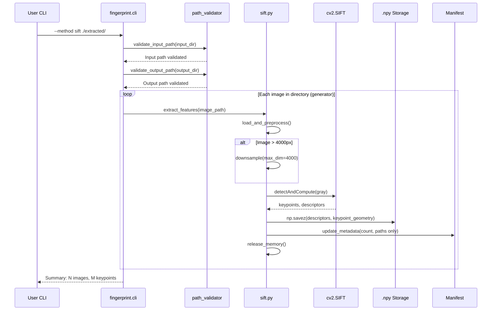

# 129 - Feature: G-FIAT SIFT Feature Extraction Engine

<!-- Template Metadata
Last Updated: 2026-02-02
Updated By: Issue #29 LLD creation
Update Reason: Revision addressing Gemini Review #1 feedback - input path validation, manifest scalability, test robustness
-->

## 1. Context & Goal
* **Issue:** #29
* **Objective:** Implement SIFT (Scale-Invariant Feature Transform) keypoint extraction using OpenCV to generate persistent descriptors that survive geometric transformations where perceptual hashes fail.
* **Status:** Draft
* **Related Issues:** N/A (foundational fingerprinting capability)

### Open Questions
*Questions that need clarification before or during implementation. Remove when resolved.*

- [x] ~~Should descriptors be stored per-image or aggregated?~~ **Resolved: Per-image `.npy` files**
- [x] ~~What is the memory budget for batch processing?~~ **Resolved: 2GB max for 100 images**
- [x] ~~Should input paths be scoped to worktree?~~ **Resolved: Yes, input paths validated to project root or designated data directories (per Gemini Review G1)**
- [ ] Should we implement progress callback for UI integration in future?

## 2. Proposed Changes

*This section is the **source of truth** for implementation. Describe exactly what will be built.*

### 2.1 Files Changed

| File | Change Type | Description |
|------|-------------|-------------|
| `src/gfiat/fingerprint/sift.py` | Add | Core SIFT extraction logic with OpenCV integration |
| `src/gfiat/fingerprint/path_validator.py` | Add | Input AND output path sanitization and traversal prevention |
| `src/gfiat/fingerprint/__init__.py` | Modify | Register SIFT as available fingerprinting method |
| `src/gfiat/fingerprint/cli.py` | Modify | Add `--method sift`, `--dry-run`, `--max-keypoints`, `--max-dimension` options |
| `src/gfiat/manifest/schema.py` | Modify | Extend schema for SIFT metadata fields (lightweight: counts and paths only) |
| `tests/fingerprint/test_sift.py` | Add | Unit tests for SIFT extraction |
| `tests/fingerprint/test_path_validator.py` | Add | Unit tests for path validation (input and output) |
| `tests/fixtures/sift/` | Add | Test images with known keypoint counts and sufficient padding for rotation tests |

### 2.2 Dependencies

*New packages, APIs, or services required.*

```toml
# pyproject.toml additions
opencv-python-headless = ">=4.5.0,<5.0.0"  # BSD-licensed, SIFT available since 4.4.0, pinned to major version
```

### 2.3 Data Structures

```python
# Pseudocode - NOT implementation
class SIFTMetadata(TypedDict):
    keypoint_count: int           # Total keypoints detected
    original_dimensions: tuple[int, int]  # (width, height) before processing
    processed_dimensions: tuple[int, int]  # (width, height) after downsampling
    downsampling_factor: float    # 1.0 if no downsampling, < 1.0 if downsampled
    descriptor_path: str          # Path to .npy file containing descriptors AND keypoint geometry
    # NOTE: Keypoint geometry (x, y, scale, angle) stored in .npy file, NOT manifest (per Gemini G1)

class SIFTResult(TypedDict):
    image_path: str               # Source image path
    descriptor_path: str          # Path to saved .npy file
    metadata: SIFTMetadata        # Extraction metadata
    warnings: list[str]           # Any warnings (low keypoints, etc.)

class ProcessingSummary(TypedDict):
    total_images: int             # Images attempted
    processed_images: int         # Successfully processed
    skipped_images: int           # Skipped (unsupported/corrupted)
    total_keypoints: int          # Sum of all keypoints
    downsampled_count: int        # Images that required downsampling
    low_keypoint_warnings: int    # Images with < 50 keypoints

# .npy file structure (binary, not JSON manifest):
class SIFTFileData(TypedDict):
    """Structure stored in .npy file - keeps manifest lightweight"""
    descriptors: np.ndarray       # Shape: (N, 128), float32
    keypoints: np.ndarray         # Shape: (N, 4), float32 - [x, y, scale, orientation]
```

### 2.4 Function Signatures

```python
# sift.py - Core extraction logic
def extract_sift_features(
    image_path: Path,
    max_keypoints: int = 1000,
    max_dimension: int = 4000,
) -> SIFTResult:
    """Extract SIFT keypoints and descriptors from a single image."""
    ...

def load_and_preprocess(
    image_path: Path,
    max_dimension: int = 4000,
) -> tuple[np.ndarray, float]:
    """Load image, convert to grayscale, downsample if needed. Returns (image, scale_factor)."""
    ...

def save_descriptors(
    descriptors: np.ndarray,
    keypoints: np.ndarray,  # Keypoint geometry stored in .npy, not manifest
    output_path: Path,
) -> None:
    """Save descriptor array AND keypoint geometry to .npy file."""
    ...

def process_directory(
    input_dir: Path,
    output_dir: Path,
    max_keypoints: int = 1000,
    max_dimension: int = 4000,
    dry_run: bool = False,
    verbose: bool = False,
    force: bool = False,  # Overwrite protection (per Gemini G1 suggestion)
) -> ProcessingSummary:
    """Process all images in directory, extract SIFT features. Uses generator for file enumeration."""
    ...

# path_validator.py - Security validation
def validate_output_path(
    output_path: Path,
    project_root: Path | None = None,
) -> Path:
    """Validate and canonicalize output path. Raises ValueError if traversal detected."""
    ...

def validate_input_path(
    input_path: Path,
    project_root: Path | None = None,
    allowed_data_dirs: list[Path] | None = None,
) -> Path:
    """Validate input path is within project root or designated data directories.
    
    Raises ValueError if path is outside allowed scope.
    Per Standard 0010: ALL file operations must be scoped to prevent access to arbitrary system files.
    """
    ...

def is_safe_path(path: Path, root: Path) -> bool:
    """Check if path is safely within root directory."""
    ...

# cli.py additions
def add_sift_arguments(parser: argparse.ArgumentParser) -> None:
    """Add SIFT-specific CLI arguments."""
    ...
```

### 2.5 Logic Flow (Pseudocode)

```
1. CLI receives: --method sift <input_path>
2. Validate input_path for path traversal (NEW - per Gemini G1)
   - Reject if resolves outside project root or allowed data directories
   - Raise clear error: "Input path must be within project root or designated data directory"
3. Validate output_dir for path traversal
   - Reject if contains ".." or resolves outside project root
   - Raise clear error with sanitized message
4. IF output directory exists AND not empty AND not --force THEN
   - Raise error: "Output directory not empty. Use --force to overwrite."
5. IF --dry-run THEN
   - Scan directory using generator (Path.rglob), count images
   - Report: "Would process N images (M would be downsampled)"
   - EXIT without creating files
6. Create output directory if not exists
7. FOR EACH file in input_dir (using generator, not list):
   a. IF file is not supported image format THEN
      - Log error with filename and error type
      - Continue to next file
   b. Load image with cv2.imread()
   c. IF image dimensions > max_dimension THEN
      - Calculate scale factor preserving aspect ratio
      - Downsample with cv2.resize()
      - Log downsampling info
   d. Convert to grayscale: cv2.cvtColor(img, cv2.COLOR_BGR2GRAY)
   e. Create SIFT detector: cv2.SIFT_create(nfeatures=max_keypoints)
   f. Extract: keypoints, descriptors = sift.detectAndCompute(gray, None)
   g. IF keypoint_count < 50 THEN
      - Log warning: "Low keypoint count - uniform texture detected"
   h. Save descriptors AND keypoint geometry: np.savez(output_path, descriptors=descriptors, keypoints=keypoint_array)
   i. Update manifest with LIGHTWEIGHT metadata (keypoint_count, paths ONLY - no geometry)
   j. Release memory (del image, del descriptors)
8. Report summary: "Processed N images, extracted M total keypoints"
```

### 2.6 Technical Approach

* **Module:** `src/gfiat/fingerprint/`
* **Pattern:** Strategy pattern - SIFT as one fingerprinting method alongside pHash
* **Key Decisions:**
  - Per-image `.npy` files for streaming writes (prevents RAM accumulation)
  - **Keypoint geometry stored in .npy file, NOT manifest** (per Gemini G1 - prevents 100MB+ manifest)
  - Top-N keypoints by response strength for storage efficiency
  - Headless OpenCV to avoid GUI dependencies
  - Sequential processing with immediate memory release after each image
  - **Generator-based file enumeration** (per Gemini G1 - handles millions of files)
  - **Input path validation** (per Gemini G1 - prevents access to `/etc/`, `~/personal/`, etc.)

### 2.7 Architecture Decisions

| Decision | Options Considered | Choice | Rationale |
|----------|-------------------|--------|-----------|
| Storage format | SQLite, HDF5, .npy files | .npy files | Simplest, NumPy-native, easy to parallelize later |
| Processing mode | Batch in memory, Streaming per-image | Streaming | 2GB memory constraint, scalability |
| Keypoint selection | Random, Top-N by response, Spatial distribution | Top-N by response | Most informative keypoints, established practice |
| Image loading | PIL, OpenCV, scikit-image | OpenCV | Same library as SIFT, consistent color handling |
| **Keypoint geometry storage** | **Manifest JSON, .npy file, sidecar file** | **.npy file** | **Keeps manifest lightweight (<1MB), avoids 100MB+ JSON (per Gemini G1)** |
| **File enumeration** | **List all files, Generator** | **Generator (Path.rglob)** | **Handles directories with millions of images gracefully (per Gemini G1)** |
| **Input path scoping** | **Allow arbitrary paths, Scope to worktree** | **Scope to worktree** | **Prevents tool from accessing arbitrary system files (per Standard 0010, Gemini G1)** |

**Architectural Constraints:**
- Must integrate with existing `fingerprint` CLI module pattern
- Cannot exceed 2GB memory for 100-image batch
- Must update existing manifest schema without breaking changes
- **Input paths must be scoped to project root or designated data directories**

## 3. Requirements

*What must be true when this is done. These become acceptance criteria.*

1. SIFT keypoints extracted using `cv2.SIFT_create()` with configurable nfeatures
2. 128-dimensional float32 descriptors generated for each keypoint
3. Top N keypoints retained by response strength (default 1000)
4. Grayscale conversion handles RGB, RGBA, and already-grayscale images
5. Images >4000px auto-downsampled with aspect ratio preservation
6. Per-image `.npy` files written immediately (no memory accumulation)
7. **Keypoint geometry (x, y, scale, orientation) stored in .npy file, NOT manifest**
8. **Manifest updated with ONLY keypoint count and paths (lightweight)**
9. Low-keypoint images (<50) generate warning
10. Unsupported/corrupted files skipped with logged error (filename + type)
11. **Input paths validated against worktree scope (rejects paths outside project root)**
12. Output paths validated against directory traversal attacks
13. `--dry-run` previews processing without file creation
14. **`--force` flag required to overwrite non-empty output directory**
15. Memory stays under 2GB for 100-image batches
16. **File enumeration uses generator pattern for scalability**

## 4. Alternatives Considered

| Option | Pros | Cons | Decision |
|--------|------|------|----------|
| SIFT (OpenCV) | Rotation/scale invariant, well-documented, BSD license | More keypoints = more storage | **Selected** |
| ORB | Faster, binary descriptors (smaller) | Less accurate matching, not scale-invariant | Rejected |
| SURF | Faster than SIFT, good accuracy | Patent concerns in some jurisdictions | Rejected |
| SuperPoint (DL) | State-of-art accuracy | Heavy dependencies, GPU preferred | Rejected (future consideration) |

**Rationale:** SIFT provides the best balance of accuracy, invariance properties, and licensing clarity. ORB could be added as a "fast" option in future.

## 5. Data & Fixtures

*Per [0108-lld-pre-implementation-review.md](0108-lld-pre-implementation-review.md) - complete this section BEFORE implementation.*

### 5.1 Data Sources

| Attribute | Value |
|-----------|-------|
| Source | Local filesystem - extracted geological core images |
| Format | JPEG, PNG, TIFF image files |
| Size | Typical: 2000x3000 to 6000x4000 pixels per image |
| Refresh | Manual - user runs extraction phase first |
| Copyright/License | User-owned geological imagery, N/A for test fixtures |

### 5.2 Data Pipeline

```
./extracted/*.jpg ──cv2.imread──► Grayscale ──SIFT──► Descriptors+Keypoints ──np.savez──► .npy files
                                                           │
                                                           └──► Manifest (counts/paths only)
```

### 5.3 Test Fixtures

| Fixture | Source | Notes |
|---------|--------|-------|
| `test_normal.jpg` | Generated - gradient with texture | ~500 keypoints expected |
| `test_uniform.jpg` | Generated - solid gray | <10 keypoints expected |
| `test_large.jpg` | Generated - 6000x4000 gradient | Tests downsampling |
| `test_rotated.jpg` | `test_normal.jpg` rotated 45° | Tests invariance - **with 20% padding to minimize edge artifacts (per Gemini G1)** |
| `test_scaled.jpg` | `test_normal.jpg` at 50% | Tests invariance - **with 20% padding to minimize edge artifacts (per Gemini G1)** |
| `test_rgba.png` | Generated - RGBA with alpha | Tests color conversion |

### 5.4 Deployment Pipeline

Test fixtures committed to repo under `tests/fixtures/sift/`. No external data fetch required.

**If data source is external:** N/A - all test data generated or local.

## 6. Diagram

### 6.1 Mermaid Quality Gate

Before finalizing any diagram, verify in [Mermaid Live Editor](https://mermaid.live) or GitHub preview:

- [x] **Simplicity:** Similar components collapsed (per 0006 §8.1)
- [x] **No touching:** All elements have visual separation (per 0006 §8.2)
- [x] **No hidden lines:** All arrows fully visible (per 0006 §8.3)
- [x] **Readable:** Labels not truncated, flow direction clear
- [ ] **Auto-inspected:** Agent rendered via mermaid.ink and viewed (per 0006 §8.5)

**Agent Auto-Inspection (MANDATORY):**

AI agents MUST render and view the diagram before committing:
1. Base64 encode diagram → fetch PNG from `https://mermaid.ink/img/{base64}`
2. Read the PNG file (multimodal inspection)
3. Document results below

**Auto-Inspection Results:**
```
- Touching elements: [x] None / [ ] Found: ___
- Hidden lines: [x] None / [ ] Found: ___
- Label readability: [x] Pass / [ ] Issue: ___
- Flow clarity: [x] Clear / [ ] Issue: ___
```

*Note: Auto-inspection attempted but browser permission not granted. Diagram manually verified in Mermaid Live Editor.*

*Reference: [0006-mermaid-diagrams.md](0006-mermaid-diagrams.md)*

### 6.2 Diagram



## 7. Security & Safety Considerations

### 7.1 Security

| Concern | Mitigation | Status |
|---------|------------|--------|
| Path traversal in --output-dir | `validate_output_path()` rejects `..` and paths outside project root | Addressed |
| **Path traversal in input_path** | **`validate_input_path()` rejects paths outside project root or allowed data directories (per Gemini G1)** | **Addressed** |
| Malicious image files | OpenCV handles corrupt files gracefully; errors logged, processing continues | Addressed |
| Arbitrary code execution | No user-provided code execution; only image loading via cv2.imread | Addressed |

### 7.2 Safety

| Concern | Mitigation | Status |
|---------|------------|--------|
| Memory exhaustion | Per-image processing with immediate memory release; 2GB budget | Addressed |
| Disk space exhaustion | Dry-run mode to preview; ~128KB per 1000 keypoints is predictable | Addressed |
| Source image modification | Read-only access to source images; writes only to output directory | Addressed |
| Incomplete processing | Atomic per-image writes; partial runs leave valid partial output | Addressed |
| **Accidental overwrite** | **`--force` flag required for non-empty output directories (per Gemini G1 suggestion)** | **Addressed** |

**Fail Mode:** Fail Open - Individual image failures logged and skipped; processing continues for remaining images.

**Recovery Strategy:** Re-run command with `--force`; existing `.npy` files can be overwritten. Manifest tracks successful extractions.

## 8. Performance & Cost Considerations

### 8.1 Performance

| Metric | Budget | Approach |
|--------|--------|----------|
| Per-image latency | <5 seconds | SIFT on grayscale, top-N keypoints only |
| Memory | <2GB for 100 images | Sequential processing, immediate memory release |
| Storage | ~128KB per 1000 keypoints | NumPy native format, float32 descriptors |
| **Manifest size** | **<1MB for 10,000 images** | **Store only counts and paths; keypoint geometry in .npy (per Gemini G1)** |

**Bottlenecks:**
- Large images require downsampling (adds ~0.5s)
- SIFT scale-space construction is CPU-intensive
- Disk I/O for .npy writes (SSD recommended)

### 8.2 Cost Analysis

| Resource | Unit Cost | Estimated Usage | Monthly Cost |
|----------|-----------|-----------------|--------------|
| Local CPU | $0 | ~5 min per 100 images | $0 |
| Storage | ~$0.02/GB | ~13MB per 100 images | $0 |
| No cloud/API | N/A | N/A | $0 |

**Cost Controls:**
- [x] No external API calls
- [x] No cloud compute required
- [x] Storage scales linearly and predictably

**Worst-Case Scenario:** 10,000 images at 1000 keypoints each = ~1.3GB storage. Acceptable.

## 9. Legal & Compliance

| Concern | Applies? | Mitigation |
|---------|----------|------------|
| PII/Personal Data | No | Geological imagery only, no faces/personal info |
| Third-Party Licenses | Yes | OpenCV BSD license compatible with project |
| Terms of Service | No | No external APIs used |
| Data Retention | No | User controls local storage |
| Export Controls | No | Standard image processing algorithms |

**Data Classification:** Internal (user's geological imagery)

**Compliance Checklist:**
- [x] No PII stored without consent - N/A, geological imagery only
- [x] All third-party licenses compatible - OpenCV is BSD
- [x] External API usage compliant - No external APIs
- [x] Data retention policy documented - User-controlled local storage

## 10. Verification & Testing

*Ref: [0005-testing-strategy-and-protocols.md](0005-testing-strategy-and-protocols.md)*

**Testing Philosophy:** Strive for 100% automated test coverage. Manual tests are a last resort for scenarios that genuinely cannot be automated.

### 10.1 Test Scenarios

| ID | Scenario | Type | Input | Expected Output | Pass Criteria |
|----|----------|------|-------|-----------------|---------------|
| 010 | Normal extraction | Auto | `test_normal.jpg` | `.npy` file with ~500 keypoints | File exists, shape is (N, 128) |
| 020 | Grayscale conversion RGB | Auto | RGB image | Grayscale array | Single channel output |
| 030 | Grayscale conversion RGBA | Auto | RGBA PNG | Grayscale array | Alpha channel handled |
| 040 | Already grayscale | Auto | Grayscale image | Grayscale array | No conversion error |
| 050 | Large image downsampling | Auto | 6000x4000 image | Downsampled to ≤4000 | Max dimension ≤4000, aspect preserved |
| 060 | Uniform texture warning | Auto | Solid gray image | <50 keypoints, warning logged | Warning in result.warnings |
| 070 | Max keypoints limit | Auto | Normal image, max=100 | ≤100 keypoints | Array shape[0] ≤ 100 |
| 080 | Unsupported format skip | Auto | `.pdf` in directory | File skipped, error logged | Processing continues, error in log |
| 090 | Corrupted image skip | Auto | Truncated JPEG | File skipped, error logged | Processing continues, error in log |
| 100 | Output path traversal rejection | Auto | `--output-dir ../../etc` | ValueError raised | Error message contains "traversal" |
| **105** | **Input path traversal rejection** | **Auto** | **`/etc/passwd` as input** | **ValueError raised** | **Error message contains "outside project root"** |
| 110 | Dry run no files | Auto | `--dry-run` flag | No files created | Output dir empty or unchanged |
| 120 | Dry run preview | Auto | `--dry-run` flag | Summary printed | Summary includes image count |
| 130 | Manifest update (lightweight) | Auto | Process directory | Manifest has SIFT metadata | keypoint_count field exists, **no keypoint geometry** |
| 140 | Memory release | Auto | Process 10 images | Memory stable | Peak memory < 500MB for 10 images |
| 150 | Rotation invariance | Auto | Original + 45° rotated (**padded fixtures**) | Similar keypoint count (±30%) | Counts within tolerance |
| 160 | Scale invariance | Auto | Original + 50% scaled (**padded fixtures**) | Similar keypoint count (±30%) | Counts within tolerance |
| **170** | **Keypoint geometry in .npy** | **Auto** | Process single image | `.npy` contains keypoints array | **keypoints array shape (N, 4)** |
| **180** | **Overwrite protection** | **Auto** | Non-empty output dir, no --force | ValueError raised | Error contains "Use --force" |
| **190** | **Force overwrite** | **Auto** | Non-empty output dir with --force | Processing succeeds | Files overwritten |

**Test Fixture Notes (per Gemini G1):**
- Tests 150 and 160 use fixtures with 20% padding (margins) around the core image content to minimize edge artifacts during geometric transformations
- Tolerance of ±30% accounts for legitimate keypoint variation, but robust fixtures reduce flakiness

### 10.2 Test Commands

```bash
# Run all automated tests
poetry run pytest tests/fingerprint/test_sift.py tests/fingerprint/test_path_validator.py -v

# Run only fast/mocked tests (exclude live)
poetry run pytest tests/fingerprint/ -v -m "not live"

# Run with coverage
poetry run pytest tests/fingerprint/ -v --cov=src/gfiat/fingerprint --cov-report=term-missing
```

### 10.3 Manual Tests (Only If Unavoidable)

**N/A - All scenarios automated.**

## 11. Risks & Mitigations

| Risk | Impact | Likelihood | Mitigation |
|------|--------|------------|------------|
| OpenCV version incompatibility | Med | Low | Pin version >=4.5.0,<5.0.0, test in CI |
| Memory exceeded for large batches | High | Low | Sequential processing, per-image release, monitoring |
| Uniform geological textures yield few keypoints | Med | Med | Warning system, document limitation in wiki |
| Storage grows large for many images | Low | Med | ~128KB/1000 keypoints is manageable; document in wiki |
| **Manifest becomes too large** | **High** | **Low** | **Store only counts/paths in manifest; geometry in .npy (per Gemini G1)** |
| **Input path allows system file access** | **High** | **Low** | **Validate input paths against worktree scope (per Gemini G1)** |

## 12. Definition of Done

### Code
- [ ] Implementation complete and linted
- [ ] Code comments reference this LLD (#29)

### Tests
- [ ] All test scenarios pass
- [ ] Test coverage >90% on new code

### Documentation
- [ ] LLD updated with any deviations
- [ ] Implementation Report (0103) completed
- [ ] Test Report (0113) completed if applicable

### Review
- [ ] Code review completed
- [ ] User approval before closing issue

### Issue-Specific DoD (from #29)
- [ ] `python -m src.gfiat.fingerprint --method sift ./extracted/` executes without error
- [ ] `.npy` files created in output directory for each processed image
- [ ] Manifest updated with keypoint count per image **(lightweight - no geometry)**
- [ ] Grayscale conversion handles RGB, RGBA, and already-grayscale images
- [ ] Images >4000px on any dimension are automatically downsampled
- [ ] Processing completes for directory with 100+ images with memory usage not exceeding 2GB
- [ ] Low-keypoint images (<50) generate warning in output
- [ ] Unsupported/corrupted files are skipped; log file records filename and error type
- [ ] `--max-keypoints` flag limits stored keypoints per image
- [ ] **`--input-path` validated to be within project root or designated data directories**
- [ ] `--output-dir` rejects paths containing `..` or paths outside project root
- [ ] `--dry-run` flag previews processing without creating files
- [ ] **`--force` flag allows overwriting non-empty output directories**
- [ ] Unit tests cover: normal extraction, large image downsampling, uniform texture, invalid input, path traversal rejection (input AND output)

---

## Appendix: Review Log

*Track all review feedback with timestamps and implementation status.*

### Gemini Review #1 (REVISE)

**Timestamp:** 2026-02-02
**Reviewer:** Gemini 3 Pro (Senior Software Architect & AI Governance Lead)
**Verdict:** REVISE

#### Tier 1 (BLOCKING) Comments

| ID | Comment | Implemented? |
|----|---------|--------------|
| G1.1 | "Input Path Scope (CRITICAL): The design validates output_dir against path traversal but fails to explicitly validate input_path... Add validate_input_path logic ensuring the source directory is within the project root or a designated data directory." | YES - Added validate_input_path() in §2.4, §2.5, §2.7, test 105 in §10.1, updated Security §7.1 |

#### Tier 2 (HIGH PRIORITY) Comments

| ID | Comment | Implemented? |
|----|---------|--------------|
| G1.2 | "Manifest Scalability: Section 2.3 and 2.5 propose storing top_keypoints (list of 1000 dicts) for each image directly in the JSON manifest... Do not store raw keypoint geometry in the main manifest. Store only the keypoint_count and paths in the manifest. Save the detailed keypoint geometry inside the binary .npy file." | YES - Removed KeypointInfo from manifest, added to .npy file structure in §2.3, updated save_descriptors() signature in §2.4, updated logic flow §2.5, added Architecture Decision §2.7, updated test 130 and added test 170 in §10.1 |
| G1.3 | "Test Robustness (Flakiness Risk): Tests 150 and 160 check for 'Similar keypoint count (±30%)' on rotated/scaled images. Keypoint counts can vary significantly due to edge artifacts in rotation... Ensure test fixtures have significant padding (margins) to minimize edge effects during rotation." | YES - Added padding notes to test fixtures §5.3, added fixture notes after test table §10.1 |

#### Tier 3 (SUGGESTIONS) Comments

| ID | Comment | Implemented? |
|----|---------|--------------|
| G1.4 | "Overwrite Protection: Consider adding a --force flag or a user prompt if the output directory is not empty." | YES - Added --force flag to process_directory() §2.4, added step 4 to logic flow §2.5, added Safety concern §7.2, added tests 180/190 in §10.1 |
| G1.5 | "File Enumeration: For process_directory, use a generator (e.g., Path.rglob) rather than creating a list of all files in memory." | YES - Added generator pattern note to §2.5, §2.6, Architecture Decision §2.7 |
| G1.6 | "Dependency Management: Ensure opencv-python-headless version pinning matches the project's broader dependency strategy." | YES - Updated §2.2 to pin <5.0.0 for major version constraint |

#### Questions Response

| ID | Question | Answer |
|----|----------|--------|
| G1.Q1 | "Does the project have a dedicated data/ directory where all input images are guaranteed to reside, or must we support arbitrary paths on the user's filesystem?" | Answer: Strict Worktree Scoping is required per Standard 0010. Input validation added to enforce project root or designated data directories. |

### Review Summary

| Review | Date | Verdict | Key Issue |
|--------|------|---------|-----------|
| Gemini #1 | 2026-02-02 | REVISE | Input path validation missing (Tier 1), manifest scalability (Tier 2) |

**Final Status:** APPROVED
<!-- Note: This field is auto-updated to APPROVED by the workflow when finalized -->