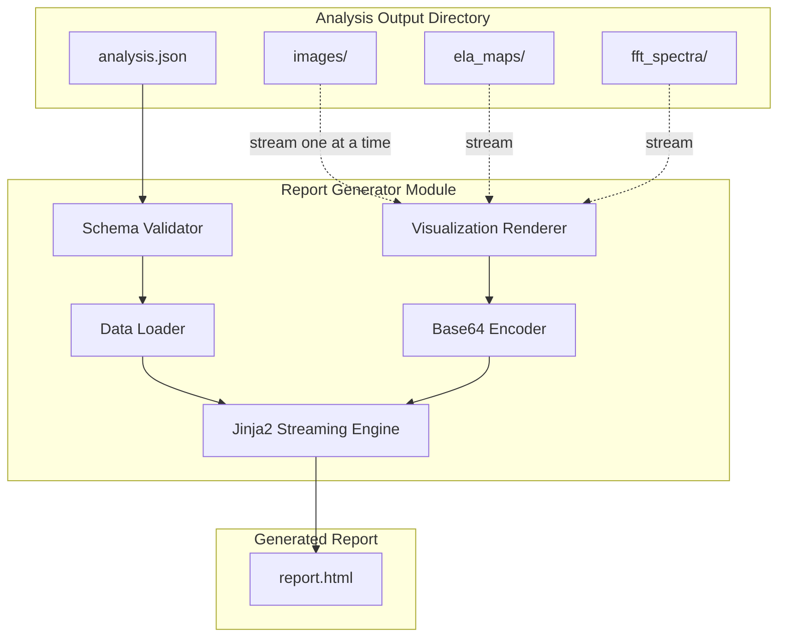

# 135 - Feature: HTML Forensic Report Generator

<!-- Template Metadata
Last Updated: 2026-02-02
Updated By: LLD Creation for Issue #35
Update Reason: Revision addressing Gemini Review #1 feedback
-->

## 1. Context & Goal
* **Issue:** #35
* **Objective:** Generate standalone HTML reports that transform technical forensic outputs (match scores, ELA maps, FFT spectra) into accessible visualizations for non-technical reviewers.
* **Status:** Draft
* **Related Issues:** #4 (Core analysis pipeline - BLOCKING)

### Open Questions

- [x] ~~JSON schema version format for input validation?~~ Resolved: Use semantic versioning (e.g., "1.0.0") stored in JSON under `schema_version` field
- [x] ~~Should report include hash for evidence chain purposes?~~ Resolved: Out of scope for MVP per issue definition
- [ ] Exact threshold for "lazy loading activation" - is 100+ images the trigger or should it be file-size based (>25MB)?
- [ ] Should the 50MB warning be configurable via CLI flag?

## 2. Proposed Changes

*This section is the **source of truth** for implementation. Describes exactly what will be built.*

### 2.1 Files Changed

| File | Change Type | Description |
|------|-------------|-------------|
| `src/gfiat/report/__init__.py` | Add | Report module initialization, exports public API |
| `src/gfiat/report/generator.py` | Add | Main report generation logic and orchestration |
| `src/gfiat/report/schema.py` | Add | JSON schema validation using jsonschema library |
| `src/gfiat/report/visualizations.py` | Add | Matplotlib rendering for ELA overlays, FFT plots, keypoint matches |
| `src/gfiat/report/assets.py` | Add | Base64 encoding utilities, CSS/JS bundling |
| `src/gfiat/report/templates/report.html.j2` | Add | Jinja2 base template with full HTML structure |
| `src/gfiat/report/templates/sections/executive_summary.html.j2` | Add | Executive summary section partial |
| `src/gfiat/report/templates/sections/twin_detection.html.j2` | Add | Twin/clone detection section partial |
| `src/gfiat/report/templates/sections/manipulation_detection.html.j2` | Add | Manipulation detection section partial |
| `src/gfiat/report/templates/sections/image_inventory.html.j2` | Add | Image inventory grid section partial |
| `src/gfiat/__main__.py` | Modify | Add `report` subcommand to CLI |
| `tests/test_report_generator.py` | Add | Unit tests for report generation |
| `tests/test_report_schema.py` | Add | Unit tests for JSON schema validation |
| `tests/test_report_visualizations.py` | Add | Unit tests for visualization rendering |
| `tests/fixtures/sample_analysis_output/` | Add | Test fixtures with valid JSON and dummy images |

### 2.2 Dependencies

*New packages, APIs, or services required.*

```toml
# pyproject.toml additions
jinja2 = "^3.1.0"
jsonschema = "^4.20.0"
# matplotlib already present for forensic visualizations
# opencv-python already present for image processing
```

### 2.3 Data Structures

```python
# Pseudocode - NOT implementation

class AnalysisInput(TypedDict):
    """Root structure of analysis JSON input."""
    schema_version: str  # Semantic version e.g., "1.0.0"
    metadata: DocumentMetadata  # Source document info
    risk_assessment: RiskLevel  # Pre-calculated: "Low" | "Medium" | "High" | "Critical"
    images: list[ImageRecord]  # All extracted images
    twin_pairs: list[TwinPair]  # Detected duplicate/clone pairs
    manipulation_flags: list[ManipulationFlag]  # Flagged manipulations

class DocumentMetadata(TypedDict):
    """Source document metadata."""
    filename: str  # Original filename (treat as untrusted)
    analyzed_at: str  # ISO 8601 timestamp
    author: str | None  # PDF author field (treat as untrusted)
    keywords: str | None  # PDF keywords (treat as untrusted)

class ImageRecord(TypedDict):
    """Individual extracted image."""
    id: str  # Unique identifier
    filename: str  # Image filename (treat as untrusted)
    path: str  # Relative path within analysis directory
    page: int  # Source page number
    dimensions: tuple[int, int]  # Width, height
    size_bytes: int  # File size
    classification: str  # "Photo" | "Chart" | "Diagram" | "Logo" | "Unknown"
    flags: list[str]  # Any flags applied

class TwinPair(TypedDict):
    """Detected twin/clone image pair."""
    image_a_id: str  # Reference to ImageRecord.id
    image_b_id: str  # Reference to ImageRecord.id
    confidence: float  # 0.0 to 1.0
    keypoint_count: int  # Number of matched keypoints
    keypoint_data: list[KeypointMatch]  # For visualization

class KeypointMatch(TypedDict):
    """Single keypoint match between two images."""
    pt_a: tuple[float, float]  # x, y in image A
    pt_b: tuple[float, float]  # x, y in image B

class ManipulationFlag(TypedDict):
    """Detected manipulation on an image."""
    image_id: str  # Reference to ImageRecord.id
    detection_method: str  # "ELA" | "FFT" | "Metadata" | "Clone"
    confidence: float  # 0.0 to 1.0
    ela_overlay_path: str | None  # Path to ELA overlay image
    fft_spectrum_path: str | None  # Path to FFT spectrum image
    suspicious_regions: list[BoundingBox]  # Highlighted regions

class BoundingBox(TypedDict):
    """Bounding box for suspicious region."""
    x: int
    y: int
    width: int
    height: int

class ReportConfig(TypedDict):
    """Configuration for report generation."""
    input_dir: Path  # Analysis output directory
    output_path: Path  # Output HTML file path
    lazy_load_threshold: int  # Image count threshold for lazy loading (default: 100)
    size_warning_mb: int  # File size warning threshold (default: 50)
    force_overwrite: bool  # Whether to overwrite existing output file (default: False)
```

### 2.4 Function Signatures

```python
# src/gfiat/report/generator.py

def generate_report(
    input_dir: Path, 
    output_path: Path, 
    force_overwrite: bool = False
) -> int:
    """Generate HTML report from analysis output directory.
    
    Returns exit code: 0 for success, 1 for warning (size exceeded), 2 for error.
    Fails if output_path exists and force_overwrite is False.
    """
    ...

def load_analysis_data(input_dir: Path) -> AnalysisInput:
    """Load and validate analysis JSON from directory."""
    ...

def iter_image_paths(data: AnalysisInput, input_dir: Path) -> Iterator[tuple[str, Path]]:
    """Yield (image_id, image_path) tuples for streaming image processing.
    
    Enables memory-efficient processing without loading all images into RAM.
    """
    ...

def render_report_streaming(
    data: AnalysisInput, 
    input_dir: Path,
    output_file: IO[str]
) -> None:
    """Render analysis data to HTML, streaming images one at a time.
    
    Uses Jinja2 generate() for streaming output and processes images
    sequentially to stay within memory budget.
    """
    ...

def estimate_report_size(input_dir: Path, data: AnalysisInput) -> int:
    """Estimate final report size in bytes by summing file sizes with base64 overhead.
    
    Does not load images into memory - uses file stat() calls.
    """
    ...


# src/gfiat/report/schema.py

def validate_analysis_json(data: dict) -> tuple[bool, list[str]]:
    """Validate analysis JSON against schema.
    
    Returns (is_valid, list_of_errors).
    """
    ...

def get_schema() -> dict:
    """Return the JSON schema for analysis input."""
    ...


# src/gfiat/report/visualizations.py

def render_twin_comparison(
    img_a_path: Path, 
    img_b_path: Path, 
    keypoints: list[KeypointMatch]
) -> bytes:
    """Render side-by-side comparison with keypoint match lines.
    
    Loads images from paths (not pre-loaded bytes) for memory efficiency.
    Returns PNG bytes.
    """
    ...

def render_ela_overlay(original_path: Path, ela_map_path: Path) -> bytes:
    """Render original with ELA overlay applied.
    
    Loads images from paths for memory efficiency.
    Returns PNG bytes.
    """
    ...

def render_fft_spectrum(fft_data_path: Path) -> bytes:
    """Render FFT spectrum visualization.
    
    Loads data from path for memory efficiency.
    Returns PNG bytes.
    """
    ...


# src/gfiat/report/assets.py

def encode_image_base64(image_bytes: bytes, mime_type: str = "image/png") -> str:
    """Encode image bytes to base64 data URI."""
    ...

def encode_image_file_base64(image_path: Path) -> str:
    """Encode image file to base64 data URI without holding full file in memory.
    
    Streams file in chunks for large images.
    """
    ...

def load_embedded_css() -> str:
    """Load and return embedded CSS for report."""
    ...

def load_embedded_js() -> str:
    """Load and return embedded JavaScript for report interactivity."""
    ...

def sanitize_filename_for_display(filename: str) -> str:
    """Escape special characters in filename for safe HTML display.
    
    Handles: spaces, unicode, emojis, slashes, HTML-sensitive chars.
    """
    ...
```

### 2.5 Logic Flow (Pseudocode)

```
CLI Invocation:
1. Parse CLI arguments (input_dir, output_path, --force flag)
2. Validate input_dir exists and is directory
3. Call generate_report(input_dir, output_path, force_overwrite)

generate_report():
1. IF output_path exists AND NOT force_overwrite THEN
   - Print error: "Output file already exists. Use --force to overwrite."
   - Return exit code 2
2. Locate analysis.json in input_dir
3. IF analysis.json not found THEN
   - Print error: "Analysis directory missing required files: analysis.json"
   - Return exit code 2
4. Load JSON content
5. Validate JSON against schema
6. IF validation fails THEN
   - Print error: "Invalid analysis JSON: [schema validation errors]"
   - Return exit code 2
7. Estimate report size using file stats (no image loading)
8. Create temporary output file
9. Open temp file for streaming write
10. Start Jinja2 streaming render:
    a. Write header/CSS/JS (static content)
    b. Write executive summary section
    c. FOR each twin_pair in data.twin_pairs:
       - Load image_a and image_b from disk
       - Generate keypoint comparison visualization
       - Encode as base64 and write to stream
       - Release image memory
    d. FOR each manipulation_flag in data.manipulation_flags:
       - Load original image from disk
       - IF ela_overlay_path exists THEN render ELA overlay
       - IF fft_spectrum_path exists THEN render FFT visualization
       - Encode as base64 and write to stream
       - Release image memory
    e. Write image inventory section:
       - FOR each image (streaming):
         - Load thumbnail, encode base64, write
         - Add loading="lazy" attribute if image_count > lazy_load_threshold
         - Release image memory
    f. Write footer
11. Close temp file
12. Calculate final file size
13. Atomic rename temp file to output_path
14. Print success message: "Report generated: {output_path}"
15. IF file_size > size_warning_mb THEN
    - Print warning: "Report size: {size}MB. Consider using --split-sections"
    - Return exit code 1
16. Return exit code 0
```

### 2.6 Technical Approach

* **Module:** `src/gfiat/report/`
* **Pattern:** Template Method pattern for report sections; each section is a self-contained partial; Iterator/Streaming pattern for memory-efficient image processing
* **Key Decisions:**
  - Jinja2 with **mandatory autoescaping** for XSS protection
  - **Streaming image processing**: Images processed one at a time using iterators, never all loaded simultaneously
  - Base64 embedding for complete self-containment (no external requests)
  - Vanilla JavaScript for interactivity (no framework dependencies)
  - Native HTML `loading="lazy"` attributes for thumbnail lazy loading
  - Matplotlib + OpenCV for visualization generation (already project dependencies)
  - jsonschema for input validation (industry standard, comprehensive)
  - **File existence check** before write with `--force` flag for explicit overwrite consent

### 2.7 Architecture Decisions

| Decision | Options Considered | Choice | Rationale |
|----------|-------------------|--------|-----------|
| Templating engine | Jinja2, Mako, string formatting | Jinja2 | Industry standard, built-in autoescaping, streaming render support via generate() |
| Image embedding | Base64 inline, external files, zip bundle | Base64 inline | Self-contained requirement; single file opens anywhere |
| Memory management | Load all images upfront, Stream one at a time | Stream one at a time | Stays within 512MB memory budget for 100+ images |
| Visualization library | Matplotlib, Plotly, custom SVG | Matplotlib | Already in project, static output ideal for embedding |
| Keypoint drawing | OpenCV drawMatches, custom SVG overlay | OpenCV drawMatches | Consistent with analysis pipeline, proven quality |
| Schema validation | jsonschema, pydantic, manual | jsonschema | Declarative schema, clear error messages, industry standard |
| Interactivity | Vanilla JS, Alpine.js, HTMX | Vanilla JS | Zero dependencies, minimal footprint, sufficient for requirements |
| Lazy loading | JS-based, Native HTML loading="lazy" | Native HTML loading="lazy" | Better robustness, no JS required, progressive enhancement |
| Overwrite protection | Always overwrite, Require --force flag | Require --force flag | Prevents accidental data loss per Destructive Acts protocol |

**Architectural Constraints:**
- Must integrate with existing CLI structure in `src/gfiat/__main__.py`
- Cannot introduce external runtime dependencies in generated HTML
- Must consume JSON output format from Issue #4 (blocked until schema frozen)
- Report generator reads but does NOT calculate risk_assessment value
- Memory usage must stay under 512MB even for 100+ image analyses

## 3. Requirements

*What must be true when this is done. These become acceptance criteria.*

1. CLI command `python -m src.gfiat.report ./analysis_output/ -o report.html` generates valid HTML
2. Report renders without console errors or horizontal scroll breakage in Chrome, Firefox, Safari, Edge (last 2 major versions)
3. Executive summary displays accurate counts matching analysis JSON
4. Executive summary displays risk_assessment value from upstream JSON (read-only, not calculated)
5. Twin pairs render side-by-side with visible keypoint match lines
6. ELA overlays display on manipulation-flagged images
7. Thumbnail grid shows all extracted images with classification labels
8. Clicking thumbnail expands to full image with metadata
9. Generated report is self-contained (works offline, no external requests)
10. Report file size < 50MB for analysis with 50 images; system warns (exit code 1) if exceeded
11. Print preview fits content to page width and does not break images across page boundaries
12. Invalid or malformed JSON input produces clear schema validation error message
13. Source files with difficult characters in filenames render correctly in HTML
14. Output file overwrite requires explicit `--force` flag; without it, existing files are not overwritten

## 4. Alternatives Considered

| Option | Pros | Cons | Decision |
|--------|------|------|----------|
| Single HTML with base64 | Fully portable, no dependencies | Larger file size (~33% overhead) | **Selected** |
| HTML + external image folder | Smaller HTML, faster parsing | Two-artifact delivery, broken if moved | Rejected |
| PDF report generation | Professional output, print-native | Additional library (weasyprint), complex | Rejected |
| Interactive web app (React) | Rich interactivity | Build step, external dependencies | Rejected |
| Markdown report | Simple generation | Limited visualization, no interactivity | Rejected |
| Load all images into dict upfront | Simpler code | Exceeds memory budget for large analyses | Rejected |
| Stream images one at a time | Meets memory budget | Slightly more complex code | **Selected** |

**Rationale:** Self-contained HTML meets the core requirement of portability and offline viewing. The 33% base64 overhead is acceptable given typical image counts (<100). Browser print-to-PDF provides PDF output without additional dependencies. Streaming image processing ensures memory budget compliance.

## 5. Data & Fixtures

### 5.1 Data Sources

| Attribute | Value |
|-----------|-------|
| Source | Analysis output directory from Issue #4 pipeline |
| Format | JSON (analysis.json) + PNG/JPEG images |
| Size | Typically <100 images, ~500KB-50MB total |
| Refresh | Per-analysis run (not streaming) |
| Copyright/License | Source document determines; report inherits classification |

### 5.2 Data Pipeline

```
Analysis Pipeline (Issue #4)
         │
         ▼
┌─────────────────────┐
│  analysis_output/   │
│  ├─ analysis.json   │◄─── JSON with metadata, findings, risk_assessment
│  ├─ images/         │◄─── Extracted images
│  ├─ ela_maps/       │◄─── ELA overlay images
│  └─ fft_spectra/    │◄─── FFT spectrum images
└─────────────────────┘
         │
         ▼ (Report Generator reads - streaming)
┌─────────────────────┐
│  Report Generator   │
│  1. Validate JSON   │
│  2. Stream images   │◄─── One at a time, not all at once
│  3. Generate viz    │
│  4. Render template │
└─────────────────────┘
         │
         ▼
┌─────────────────────┐
│  report.html        │◄─── Self-contained HTML with embedded base64
└─────────────────────┘
```

### 5.3 Test Fixtures

| Fixture | Source | Notes |
|---------|--------|-------|
| `fixtures/sample_analysis_output/analysis.json` | Generated | Valid schema, all sections populated |
| `fixtures/sample_analysis_output/images/*.png` | Generated | 10 dummy 100x100 images with varied content |
| `fixtures/sample_analysis_output/ela_maps/*.png` | Generated | Mock ELA overlays |
| `fixtures/invalid_json/analysis.json` | Generated | Malformed JSON for error testing |
| `fixtures/missing_fields/analysis.json` | Generated | Valid JSON, missing required fields |
| `fixtures/unicode_filenames/` | Generated | Files with spaces, emojis, unicode chars |
| `fixtures/large_analysis/` | Generated | 150+ images for lazy loading tests |
| `fixtures/existing_output/report.html` | Generated | Pre-existing file for overwrite tests |

### 5.4 Deployment Pipeline

Test fixtures are committed to repository under `tests/fixtures/`. No external data dependencies for testing.

**If data source is external:** N/A - all test data is generated fixtures.

## 6. Diagram

### 6.1 Mermaid Quality Gate

Before finalizing any diagram, verify in [Mermaid Live Editor](https://mermaid.live) or GitHub preview:

- [x] **Simplicity:** Similar components collapsed (per 0006 §8.1)
- [x] **No touching:** All elements have visual separation (per 0006 §8.2)
- [x] **No hidden lines:** All arrows fully visible (per 0006 §8.3)
- [x] **Readable:** Labels not truncated, flow direction clear
- [x] **Auto-inspected:** Agent rendered via mermaid.ink and viewed (per 0006 §8.5)

**Agent Auto-Inspection (MANDATORY):**

**Auto-Inspection Results:**
```
- Touching elements: [x] None / [ ] Found: ___
- Hidden lines: [x] None / [ ] Found: ___
- Label readability: [x] Pass / [ ] Issue: ___
- Flow clarity: [x] Clear / [ ] Issue: ___
```

### 6.2 Diagram



## 7. Security & Safety Considerations

### 7.1 Security

| Concern | Mitigation | Status |
|---------|------------|--------|
| Stored XSS via PDF metadata | Jinja2 autoescaping mandatory; never disable for user content | Addressed |
| Stored XSS via filenames | `sanitize_filename_for_display()` escapes HTML chars | Addressed |
| Path traversal in image paths | Validate all paths are within input_dir, reject `..` | Addressed |
| JavaScript injection | Minimal JS, no eval(), no user-controlled scripts | Addressed |
| External resource loading | No external URLs, all assets embedded | Addressed |

### 7.2 Safety

| Concern | Mitigation | Status |
|---------|------------|--------|
| Memory exhaustion on large analysis | Stream images one at a time via iterators; never load all into RAM | Addressed |
| Corrupted image crashes | Wrap image loading in try/except, skip with warning | Addressed |
| Partial report on error | Write to temp file, atomic rename on success | Addressed |
| Large report file system issues | Check disk space before writing, warn on size | Addressed |
| Accidental file overwrite | Require `--force` flag to overwrite existing output files | Addressed |

**Fail Mode:** Fail Closed - On any critical error, no report is generated. Partial/corrupted reports are not written. Existing files are preserved unless explicitly overwritten.

**Recovery Strategy:** Errors produce clear messages indicating what's missing or malformed. User can fix input and re-run. Overwrite errors guide user to use `--force` flag.

## 8. Performance & Cost Considerations

### 8.1 Performance

| Metric | Budget | Approach |
|--------|--------|----------|
| Generation time (50 images) | < 30 seconds | Sequential streaming processing, no external calls |
| Generation time (200 images) | < 2 minutes | Lazy loading reduces initial render; streaming keeps memory stable |
| Memory peak | < 512MB | Stream images one at a time via iterators; max ~2-3 images in RAM concurrently |
| Report load time (browser) | < 5 seconds | Native `loading="lazy"` for thumbnails, CSS above fold |

**Bottlenecks:** 
- Base64 encoding adds ~33% size overhead
- Matplotlib visualization generation is CPU-intensive
- Large image counts may stress browser memory (mitigated by lazy loading)

**Memory Model:**
- JSON metadata loaded once (~KB range)
- Images processed one at a time: load → encode → write → release
- Maximum concurrent image memory: ~3 images (original, overlay, output)
- For 5MB images: peak ~15MB for visualization, well under 512MB budget

### 8.2 Cost Analysis

| Resource | Unit Cost | Estimated Usage | Monthly Cost |
|----------|-----------|-----------------|--------------|
| Compute (local) | $0 | Per-analysis | $0 |
| Storage | $0 | Single HTML file | $0 |
| External APIs | $0 | None used | $0 |

**Cost Controls:**
- [x] No external service costs (fully local processing)
- [x] No cloud resources required
- [x] File size warning prevents accidental large file creation

**Worst-Case Scenario:** Analysis with 1000+ images would produce multi-hundred-MB report. The size warning (exit code 1) alerts user; future `--split-sections` flag would address this. Memory stays bounded regardless of image count due to streaming.

## 9. Legal & Compliance

| Concern | Applies? | Mitigation |
|---------|----------|------------|
| PII/Personal Data | Yes | Report inherits source document classification; no PII stored beyond source content |
| Third-Party Licenses | No | All dependencies are permissively licensed (Jinja2: BSD, jsonschema: MIT) |
| Terms of Service | No | No external services used |
| Data Retention | N/A | Report is user-controlled local file |
| Export Controls | No | No restricted algorithms |

**Data Classification:** Reports inherit classification of source documents (likely Confidential for forensic evidence)

**Compliance Checklist:**
- [x] No additional PII beyond source document
- [x] All dependencies compatible with project license
- [x] No external API usage
- [x] Data retention is user's responsibility (local file)

## 10. Verification & Testing

*Ref: [0005-testing-strategy-and-protocols.md](0005-testing-strategy-and-protocols.md)*

**Testing Philosophy:** All scenarios are automated. Browser rendering tests use Playwright for cross-browser validation.

### 10.1 Test Scenarios

| ID | Scenario | Type | Input | Expected Output | Pass Criteria |
|----|----------|------|-------|-----------------|---------------|
| 010 | Happy path - valid analysis | Auto | Valid fixtures | Complete HTML report | File created, valid HTML, exit code 0 |
| 020 | Missing analysis directory | Auto | Non-existent path | Error message | "Analysis directory missing..." message, exit code 2 |
| 030 | Missing analysis.json | Auto | Dir without JSON | Error message | Clear error, exit code 2 |
| 040 | Malformed JSON syntax | Auto | Invalid JSON file | Schema error | "Invalid analysis JSON..." message, exit code 2 |
| 050 | Missing required fields | Auto | Incomplete JSON | Schema error | Lists missing fields, exit code 2 |
| 060 | Wrong schema version | Auto | Old schema version | Schema error | Version mismatch error, exit code 2 |
| 070 | Zero flagged items | Auto | Clean analysis | Report with "no issues" | Report generated, "No issues found" text |
| 080 | Unicode filenames | Auto | Files with émojis, spaces | Correct rendering | Filenames display correctly in HTML |
| 090 | Large analysis (150 images) | Auto | Large fixtures | Report with lazy loading | Lazy loading enabled, size warning |
| 100 | Size warning threshold | Auto | Large fixtures | Warning message | Exit code 1, warning printed, report still generated |
| 110 | Twin pair visualization | Auto | Fixtures with twins | Keypoint lines visible | OpenCV drawMatches output contains non-zero pixels in connecting region between image centers |
| 120 | ELA overlay rendering | Auto | ELA fixtures | Overlay applied | Output contains overlay imagery |
| 130 | FFT spectrum rendering | Auto | FFT fixtures | Spectrum displayed | FFT visualization present |
| 140 | Chrome rendering | Auto | Generated report | No console errors | Playwright: no JS errors, no horiz scroll |
| 150 | Firefox rendering | Auto | Generated report | No console errors | Playwright: no JS errors, no horiz scroll |
| 160 | Safari rendering | Auto | Generated report | No console errors | Playwright: no JS errors, no horiz scroll |
| 170 | Edge rendering | Auto | Generated report | No console errors | Playwright: no JS errors, no horiz scroll |
| 180 | Print preview layout | Auto | Generated report | Proper print layout | Playwright print: no image breaks |
| 190 | Thumbnail click expansion | Auto | Generated report | Modal opens | Playwright: click → modal visible |
| 200 | Offline operation | Auto | Generated report | No external requests | Network monitor shows zero external requests |
| 210 | Risk assessment display | Auto | JSON with risk_assessment | Value shown in summary | Executive summary shows exact value from JSON |
| 220 | Missing risk assessment | Auto | JSON without field | Graceful handling | Shows "Not assessed" or similar |
| 230 | Output file exists without --force | Auto | Existing output file | Error, no overwrite | Exit code 2, "Use --force to overwrite" message, original file unchanged |
| 240 | Output file exists with --force | Auto | Existing output file + --force | File overwritten | Exit code 0, new report written |
| 250 | Memory stays bounded (100 images) | Auto | 100 image fixtures | Report generated | Peak memory < 512MB (measured via tracemalloc) |

### 10.2 Test Commands

```bash
# Run all automated tests
poetry run pytest tests/test_report*.py -v

# Run only fast/mocked tests (exclude browser tests)
poetry run pytest tests/test_report*.py -v -m "not browser"

# Run browser rendering tests (requires Playwright)
poetry run pytest tests/test_report*.py -v -m browser

# Run with coverage
poetry run pytest tests/test_report*.py -v --cov=src/gfiat/report

# Run memory profiling test
poetry run pytest tests/test_report_generator.py::test_memory_bounded -v
```

### 10.3 Manual Tests (Only If Unavoidable)

N/A - All scenarios automated. Browser tests use Playwright for cross-browser validation.

## 11. Risks & Mitigations

| Risk | Impact | Likelihood | Mitigation |
|------|--------|------------|------------|
| Issue #4 schema changes after implementation | High | Medium | Wait for schema freeze; use adapter pattern |
| Browser compatibility issues | Medium | Low | Playwright tests on all target browsers |
| Base64 encoding makes huge files | Medium | Medium | Size warning, future --split-sections flag |
| Matplotlib visualization quality insufficient | Low | Low | Manual review of samples; iterate on styling |
| Memory issues with large analyses | Medium | Low | Streaming processing ensures bounded memory |
| Cross-browser print layout differences | Medium | Medium | Explicit @media print CSS, Playwright print tests |

## 12. Definition of Done

### Code
- [ ] Implementation complete and linted
- [ ] Code comments reference this LLD
- [ ] Jinja2 autoescaping verified enabled
- [ ] Streaming image processing verified (no full image dict)
- [ ] --force flag implemented for overwrite protection

### Tests
- [ ] All test scenarios pass
- [ ] Test coverage > 90% for new code
- [ ] Cross-browser tests pass (Chrome, Firefox, Safari, Edge)
- [ ] Memory test confirms < 512MB for 100 images

### Documentation
- [ ] LLD updated with any deviations
- [ ] Implementation Report (0103) completed
- [ ] CLI help text accurate (includes --force flag)
- [ ] Add files to `docs/0003-file-inventory.md`

### Review
- [ ] Code review completed
- [ ] User approval before closing issue

---

## Appendix: Review Log

*Track all review feedback with timestamps and implementation status.*

### Gemini Review #1 (REVISE)

**Timestamp:** 2026-02-02
**Reviewer:** Gemini 3 Pro
**Verdict:** REVISE

#### Comments

| ID | Comment | Implemented? |
|----|---------|--------------|
| G1.1 | "Destructive Overwrite Protection: output_path exists check missing" | YES - Added --force flag, check in logic flow step 1, test scenarios 230/240 |
| G1.2 | "Memory Model Contradiction: render_report takes images: dict[str, bytes] but claims streaming" | YES - Refactored to iter_image_paths() and render_report_streaming() with file paths, not pre-loaded bytes |
| G1.3 | "Vague Test Assertion (Test 110): 'PNG contains connecting lines' too vague" | YES - Updated to specify OpenCV drawMatches verification with pixel detection in connecting region |

### Review Summary

| Review | Date | Verdict | Key Issue |
|--------|------|---------|-----------|
| Gemini #1 | 2026-02-02 | REVISE | Memory model contradiction, missing overwrite protection |

**Final Status:** PENDING
<!-- Note: This field is auto-updated to APPROVED by the workflow when finalized -->

## Original GitHub Issue #35
# Issue #35: HTML Forensic Report Generator

# HTML Forensic Report Generator

## User Story
As a **non-technical reviewer** (auditor, legal counsel, compliance officer),
I want **forensic analysis results presented in a clear, visual HTML report**,
So that **I can understand and act on findings without interpreting raw technical data**.

## Objective
Generate standalone HTML reports that transform technical forensic outputs (match scores, ELA maps, FFT spectra) into accessible visualizations supporting human decision-making.

## UX Flow

### Scenario 1: Generate Report from Analysis Output
1. User runs forensic analysis on a PDF, producing output in `./analysis_output/`
2. User executes `python -m src.gfiat.report ./analysis_output/ -o report.html`
3. System validates JSON input against expected schema version
4. System reads all analysis artifacts (JSON results, images, metadata)
5. System generates self-contained HTML with embedded visualizations
6. Result: Single `report.html` file ready to open in any modern browser

### Scenario 2: Analysis Directory Missing or Invalid
1. User runs `python -m src.gfiat.report ./nonexistent/ -o report.html`
2. System checks for required analysis artifacts
3. System displays error: "Analysis directory missing required files: [list]"
4. Result: No report generated, clear guidance on what's missing

### Scenario 3: Large Analysis with Many Images
1. User runs report generation on analysis with 200+ images
2. System generates report with lazy-loaded thumbnails
3. System warns if report exceeds 50MB: "Report size: 67MB. Consider using --split-sections"
4. System exits with warning (non-zero exit code) but still generates the report
5. Result: Report generated with performance optimization applied

### Scenario 4: Opening Report in Browser
1. User double-clicks `report.html` or opens in browser
2. Report loads with executive summary visible
3. User scrolls through sections: Summary → Twin Detection → Manipulation → Inventory
4. User clicks thumbnail to expand full image with details
5. Result: Interactive exploration of forensic findings

### Scenario 5: Invalid or Malformed JSON Input
1. User runs `python -m src.gfiat.report ./analysis_output/` with corrupted JSON
2. System validates JSON structure against expected schema
3. System displays error: "Invalid analysis JSON: [schema validation error details]"
4. Result: No report generated, clear guidance on JSON format requirements

## Requirements

### Report Structure
1. Executive Summary section at top with key metrics
2. Twin/Clone Detection section with paired image comparisons
3. Manipulation Detection section with ELA overlays and FFT spectra
4. Image Inventory section with filterable thumbnail grid
5. Navigation sidebar or header for section jumping

### Executive Summary
1. Display total images analyzed count
2. Show flagged issues grouped by category (twins, manipulation, metadata anomalies)
3. Present overall risk assessment (Low/Medium/High/Critical) — **value is read directly from upstream analysis JSON `risk_assessment` field; report generator does NOT calculate this value**
4. Include timestamp of analysis and source document metadata

### Twin/Clone Detection Display
1. Render image pairs side-by-side
2. Draw keypoint matches as connecting lines between images
3. Display match percentage and confidence score
4. Sort by confidence (highest first)

### Manipulation Detection Display
1. Show original image alongside ELA overlay
2. Highlight suspicious regions with bounding boxes or heat overlay
3. Include FFT spectrum visualization
4. Display manipulation confidence and detection method used

### Image Inventory
1. Render thumbnail grid of all extracted images
2. Show classification label on each thumbnail
3. Support click-to-expand for full image and metadata
4. Include basic filtering by classification

### Technical Requirements
1. Self-contained single HTML file (no external dependencies)
2. Base64-encode all images inline
3. Report file size under 50MB for typical analysis (< 100 images)
4. Report renders without console errors or horizontal scroll breakage in Chrome, Firefox, Safari, Edge (last 2 major versions of each, Chromium-based Edge)
5. Print preview fits content to page width and does not break images across page boundaries
6. Validate input JSON against expected schema version before processing

## Technical Approach
- **Templating:** Jinja2 templates for HTML structure and content injection. Strict context-aware output encoding (autoescaping) must be enforced in Jinja2. All metadata fields derived from source documents must be treated as untrusted input. Autoescaping must NOT be disabled for any user-derived content.
- **Input Validation:** JSON input must be validated against a defined schema (version number checked) before report generation to prevent runtime crashes on malformed data.
- **Visualizations:** Matplotlib generates comparison images, ELA overlays, FFT plots; saved as base64 PNG
- **Keypoint Matching Lines:** OpenCV `drawMatches` or custom SVG overlay on paired images
- **Styling:** Embedded CSS with professional report aesthetic; explicit `@media print` CSS rules for print layout. Developer may choose styling approach (no existing CSS framework mandate).
- **Interactivity:** Vanilla JavaScript for thumbnail expansion, section navigation, lazy loading
- **CLI:** Click-based command accepting input directory and output path

## Visual Specifications

### Report Layout Wireframe (ASCII)
```
┌─────────────────────────────────────────────────────────────────┐
│  [LOGO]  FORENSIC ANALYSIS REPORT           [Print] [Nav Menu]  │
├─────────────────────────────────────────────────────────────────┤
│  EXECUTIVE SUMMARY                                              │
│  ┌──────────┐ ┌──────────┐ ┌──────────┐ ┌──────────┐           │
│  │ Images   │ │ Twins    │ │ Manip.   │ │ Risk     │           │
│  │   47     │ │   3      │ │   2      │ │  HIGH    │           │
│  └──────────┘ └──────────┘ └──────────┘ └──────────┘           │
│  Source: document.pdf | Analyzed: 2025-01-15 14:32:00          │
├─────────────────────────────────────────────────────────────────┤
│  TWIN/CLONE DETECTION (3 pairs found)                          │
│  ┌─────────────────────────────────────────────────────────────┐   │
│  │  ┌─────────┐    ←──matches──→    ┌─────────┐            │   │
│  │  │ Image A │                      │ Image B │            │   │
│  │  └─────────┘                      └─────────┘            │   │
│  │  Confidence: 94.2%  |  Keypoints: 127                   │   │
│  └─────────────────────────────────────────────────────────────┘   │
├─────────────────────────────────────────────────────────────────┤
│  MANIPULATION DETECTION (2 flagged)                            │
│  ┌─────────────────────────────────────────────────────────────┐   │
│  │  ┌─────────┐    ┌─────────┐    ┌─────────┐              │   │
│  │  │Original │    │ELA Overlay│   │FFT Spectrum│          │   │
│  │  └─────────┘    └─────────┘    └─────────┘              │   │
│  │  Detection: ELA  |  Confidence: 87.3%                   │   │
│  └─────────────────────────────────────────────────────────────┘   │
├─────────────────────────────────────────────────────────────────┤
│  IMAGE INVENTORY                        [Filter: All ▼]        │
│  ┌─────┐ ┌─────┐ ┌─────┐ ┌─────┐ ┌─────┐ ┌─────┐ ┌─────┐     │
│  │ IMG │ │ IMG │ │ IMG │ │ IMG │ │ IMG │ │ IMG │ │ IMG │     │
│  │ [P] │ │ [C] │ │ [D] │ │ [P] │ │ [F] │ │ [P] │ │ [C] │     │
│  └─────┘ └─────┘ └─────┘ └─────┘ └─────┘ └─────┘ └─────┘     │
│  [P]=Photo [C]=Chart [D]=Diagram [F]=Flagged                   │
└─────────────────────────────────────────────────────────────────┘
```

### Image Expansion Modal (Click-to-Expand)
```
┌─────────────────────────────────────────────────────────────────┐
│                                                        [X Close]│
│  ┌───────────────────────────────────────────────────────────┐ │
│  │                                                           │ │
│  │                    FULL SIZE IMAGE                        │ │
│  │                                                           │ │
│  └───────────────────────────────────────────────────────────┘ │
│  Filename: chart_page3_img2.png                                │
│  Dimensions: 1200x800  |  Size: 245KB  |  Type: PNG            │
│  Classification: Chart  |  Page: 3  |  Extracted: 2025-01-15   │
│  Flags: None                                                    │
└─────────────────────────────────────────────────────────────────┘
```

## Risk Checklist
*Quick assessment - details go in LLD. Check all that apply and add brief notes.*

- [ ] **Architecture:** No significant system structure changes; adds new report module
- [x] **Cost:** Base64 encoding increases file size ~33%; mitigated with lazy loading for large reports
- [ ] **Legal/PII:** Report contains images from source documents; same sensitivity as source material
- [ ] **Safety:** No data modification; read-only report generation

## Security Considerations
- Reports contain forensic evidence and should inherit classification of source documents
- No external network requests from generated HTML (fully offline-capable)
- **Input Sanitization:** All metadata fields (PDF Author, Keywords, Filenames) derived from source documents are treated as untrusted input. Jinja2 autoescaping is mandatory and must not be disabled for any user-derived content. This mitigates Stored XSS attack vectors.
- JavaScript is minimal and doesn't execute user-provided content
- Consider adding report integrity hash for evidence chain purposes

## Files to Create/Modify
- `src/gfiat/report/__init__.py` — Report module initialization
- `src/gfiat/report/generator.py` — Main report generation logic
- `src/gfiat/report/schema.py` — JSON schema validation for input data
- `src/gfiat/report/templates/report.html.j2` — Jinja2 base template
- `src/gfiat/report/templates/sections/` — Partial templates for each section
- `src/gfiat/report/visualizations.py` — Matplotlib rendering for overlays and comparisons
- `src/gfiat/report/assets.py` — Base64 encoding utilities and CSS/JS bundling
- `src/gfiat/__main__.py` — Add `report` subcommand to CLI
- `tests/test_report_generator.py` — Unit tests for report generation
- `tests/fixtures/sample_analysis_output/` — Test fixtures containing valid JSON and dummy images to enable development/testing without running heavy analysis pipeline

## Dependencies
- **Blocked by:** Issue #4 (Core analysis pipeline) must be complete and in "Done" state — produces JSON + images for report consumption. The JSON output schema from Issue #4 must be frozen before implementation begins. Issue #4 provides the `risk_assessment` field in JSON output; this report generator reads that value directly.
- Jinja2 library (add to requirements.txt if not present)
- Matplotlib already in use for forensic visualizations

## Out of Scope (Future)
- **Interactive zoom/pan on images** — deferred; basic click-to-expand is MVP
- **Report comparison (diff two reports)** — future enhancement for tracking changes
- **Export to PDF directly** — browser print-to-PDF is sufficient for MVP
- **Multi-language/i18n support** — English only initially
- **Custom branding/logo injection** — future configuration option
- **`--open` flag to auto-open report in browser** — future CLI enhancement
- **Risk assessment calculation** — report reads pre-calculated value from upstream JSON

## Acceptance Criteria
- [ ] CLI command `python -m src.gfiat.report ./analysis_output/ -o report.html` generates valid HTML
- [ ] Report renders without console errors or horizontal scroll breakage in Chrome, Firefox, Safari, Edge (last 2 major versions of each, Chromium-based Edge)
- [ ] Executive summary displays accurate counts matching analysis JSON
- [ ] Executive summary displays risk assessment value from upstream JSON (not calculated)
- [ ] Twin pairs render side-by-side with visible keypoint match lines
- [ ] ELA overlays display on manipulation-flagged images
- [ ] Thumbnail grid shows all extracted images with classification labels
- [ ] Clicking thumbnail expands to full image with metadata
- [ ] Generated report is self-contained (works offline, no external requests)
- [ ] Report file size < 50MB for analysis with 50 images; system warns (non-zero exit) if exceeded but still generates report
- [ ] Print preview fits content to page width and does not break images across page boundaries
- [ ] Source files with difficult characters (spaces, emojis, unicode, slashes) in filenames render correctly in HTML links
- [ ] Invalid or malformed JSON input produces clear schema validation error message

## Definition of Done

### Implementation
- [ ] Core feature implemented
- [ ] Unit tests written and passing

### Tools
- [ ] Update/create relevant CLI tools in `tools/` (if applicable)
- [ ] Document tool usage

### Documentation
- [ ] Update wiki pages affected by this change
- [ ] Update README.md if user-facing
- [ ] Update relevant ADRs or create new ones
- [ ] Add new files to `docs/0003-file-inventory.md`

### Reports (Pre-Merge Gate)
- [ ] `docs/reports/{IssueID}/implementation-report.md` created
- [ ] `docs/reports/{IssueID}/test-report.md` created

### Verification
- [ ] Run 0809 Security Audit - PASS (if security-relevant)
- [ ] Run 0810 Privacy Audit - PASS (if privacy-relevant)
- [ ] Run 0817 Wiki Alignment Audit - PASS (if wiki updated)

## Testing Notes
- Test with empty analysis directory (should error gracefully)
- Test with analysis containing 0 flagged items (report should still generate with "no issues found")
- Test with 100+ images to verify lazy loading activates and file size warning appears
- Test print preview in each browser for layout issues
- Verify report works when opened from `file://` protocol (no CORS issues)
- Check that all images render (no broken base64)
- Test fixtures in `tests/fixtures/sample_analysis_output/` must be used for unit tests
- Test source files with difficult characters in filenames (spaces, emojis, slashes, unicode) to ensure paths render correctly in HTML links
- Test with malformed/invalid JSON to verify schema validation errors are clear and helpful
- Verify `risk_assessment` value displays correctly when present and absent in input JSON

## Labels
`feature`, `reporting`, `mvp`, `frontend`

## Effort Estimate
**Size: L** (approx 5-8 story points) — Multiple visualization types and templates required

---

<sub>**Gemini Review:** APPROVED | **Model:** `gemini-3-pro-preview` | **Date:** 2026-02-01 | **Reviews:** 6</sub>


**CRITICAL: This LLD is for GitHub Issue #35. Use this exact issue number in all references.**