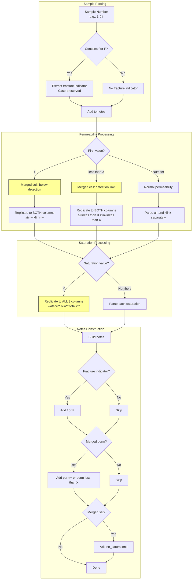

# 10004 - Feature: Improved Footnote Symbol Handling

## 1. Context & Goal

* **Issue:** #4
* **Objective:** Preserve the semantic distinction between footnote symbols `(f)`/`(F)` and correctly expand merged cell values (`+`, `<0.0001`, `**`) across their spanning columns during PDF table extraction.
* **Status:** Draft (Pending Review)
* **Depends On:** Issue #3 (completed) - header preservation and CSV sanitization

### Open Questions
None - requirements are well-defined from issue scenarios and baseline analysis.

### CRITICAL LESSONS FROM ISSUE #3 FAILURE

The previous implementation failed because:
1. **No Baseline Comparison:** Changes broke output without detection
2. **Wrong Module Modified:** Changed `table_extractor.py` when `core_analysis.py` was the actual module
3. **Silent Data Destruction:** Output had wrong data under wrong columns

**THIS IMPLEMENTATION MUST:**
1. **VERIFY baseline before AND after changes** - mandatory diff check
2. **Modify ONLY `src/core_analysis.py`** - this is where the parsing logic lives
3. **Preserve original header output** - Issue #3 work must remain intact

---

## 2. Current State Analysis

### 2.1 What the Code Does Now (VERIFIED)

**Location:** `src/core_analysis.py` lines 302-421

| Symbol | Current Behavior | Problem |
|--------|------------------|---------|
| `(f)` in sample_number | Ignored entirely | Not extracted to notes at all |
| `(F)` in sample_number | Ignored entirely | Not extracted to notes at all |
| `+` in permeability | Sets `notes = "fracture"`, skips both perm columns | WRONG: `+` means below detection, not fracture |
| `<0.0001` | Preserved in `permeability_air_md`, `klink` left empty | Should replicate to both columns |
| `**` in saturation | Sets `notes += "no_saturations"`, all sat columns empty | Should replicate `**` to all 3 columns |

### 2.2 Baseline Output Evidence

From `data/output/spec/core_analysis.csv`:
```
1-9(f),9588.5,0.0027,0.0009,...,no_saturations   # (f) NOT in notes
1-2(F),9581.5,,,1.2,,2.7,...,fracture            # (F) NOT in notes, just "fracture"
1-3,9582.1,<0.0001,,0.3,0.3,...                  # <0.0001 NOT replicated to klink
```

---

## 3. Proposed Changes

### 3.1 Files Changed

| File | Action | Description |
|------|--------|-------------|
| `src/core_analysis.py` | Modify | Update `_parse_sample_lines()` to handle footnote symbols correctly |
| `src/models.py` | Modify | Update `CoreSample.permeability_klink_md` to accept `str` for merged indicators |
| `tests/test_footnote_symbols.py` | Create | Unit tests for symbol handling |
| `tests/test_baseline_issue4.py` | Create | Regression test ensuring baseline compatibility |

### 3.2 Dependencies
* No new dependencies
* Uses existing CSV sanitization from Issue #3
* Uses standard library `logging` module (already available)
* Uses standard library `os` module for path validation

### 3.3 Data Structures

**`CoreSample` dataclass update:**
```python
@dataclass
class CoreSample:
    # ... existing fields ...
    permeability_air_md: Optional[float | str]  # Can be float or merged indicator
    permeability_klink_md: Optional[float | str]  # CHANGE: Was Optional[float]
    # Saturation fields remain Optional[float | str] to allow "**"
    saturation_water_pct: Optional[float | str]
    saturation_oil_pct: Optional[float | str]
    saturation_total_pct: Optional[float | str]
```

### 3.4 Constants to Add

**`src/core_analysis.py` - Add after imports:**
```python
import re

# Compiled regex for fracture indicator extraction (Tier 3 optimization)
FRACTURE_INDICATOR_RE = re.compile(r'\((f|F)\)$')

# Safety limits to prevent resource exhaustion on malformed input
MAX_SAMPLE_LINES = 20  # Maximum lines per sample before aborting parse

# Column groups for merged cell expansion
COLUMN_GROUPS = {
    'permeability': ['permeability_air_md', 'permeability_klink_md'],
    'saturation': ['saturation_water_pct', 'saturation_oil_pct', 'saturation_total_pct'],
}

# Expected column counts for fail-safe validation
EXPECTED_COLUMN_COUNTS = {
    'permeability': 2,
    'saturation': 3,
}

# Merged cell indicators that should be replicated across column groups
MERGED_INDICATORS = ['+', '**', '<0.0001', '<']
```

### 3.5 Function Signatures

**New helper function:**
```python
def _extract_fracture_indicator(self, sample_number: str) -> Optional[str]:
    """
    Extract case-sensitive fracture indicator from sample number.

    Args:
        sample_number: Sample number like "1-9(f)" or "1-2(F)"

    Returns:
        "(f)" or "(F)" if present, None otherwise.

    Example:
        _extract_fracture_indicator("1-9(f)") -> "(f)"
        _extract_fracture_indicator("1-2(F)") -> "(F)"
        _extract_fracture_indicator("1-8") -> None
    """
    pass
```

**Modified existing function:**
```python
def _parse_sample_lines(self, lines: list[str], page_num: int) -> Optional[CoreSample]:
    """
    Parse a sample's lines into a CoreSample object.

    CHANGES FOR ISSUE #4:
    1. Extract (f)/(F) from sample_number and add to notes (case-preserved)
    2. Replicate merged indicators across column groups
    3. Fix + handling: means "below detection", not "fracture"
    """
    pass
```

---

## 4. Logic Changes (Pseudocode)

### 4.0 Safety Guards (TIER 1 - BLOCKING)

**Add at start of `_parse_sample_lines()`:**
```python
def _parse_sample_lines(self, lines: list[str], page_num: int) -> Optional[CoreSample]:
    # SAFETY: Prevent unbounded loop on malformed input
    if len(lines) > MAX_SAMPLE_LINES:
        logging.warning(f"Page {page_num}: Sample exceeds {MAX_SAMPLE_LINES} lines, skipping")
        return None
```

**Add fail-safe for merged cell expansion:**
```python
def _expand_merged_indicator(self, value: str, group_name: str) -> list[str] | None:
    """
    Expand merged indicator to all columns in group.

    FAIL-SAFE: Returns None if column count mismatch (fail closed).
    """
    expected_count = EXPECTED_COLUMN_COUNTS.get(group_name)
    columns = COLUMN_GROUPS.get(group_name, [])

    if expected_count is None or len(columns) != expected_count:
        logging.error(f"Column group '{group_name}' count mismatch: expected {expected_count}, got {len(columns)}")
        return None  # FAIL CLOSED - do not proceed with misaligned data

    logging.debug(f"Expanding '{value}' to {group_name} columns: {columns}")
    return [value] * expected_count
```

### 4.1 Fracture Indicator Extraction

**Add to `_parse_sample_lines()` after parsing sample_number:**
```python
# ISSUE #4: Extract case-sensitive fracture indicator
# Strip whitespace to handle PDF extraction artifacts like "1-9(f) "
sample_num_clean = sample_num.strip()
fracture_indicator = self._extract_fracture_indicator(sample_num_clean)
if fracture_indicator:
    logging.debug(f"Extracted fracture indicator: {fracture_indicator}")
    notes = fracture_indicator  # Start notes with exact indicator
```

### 4.2 Merged Cell Expansion

**Replace the `+` handling block (lines 333-343):**
```python
# BEFORE (WRONG):
if val == '+':
    notes += "fracture"  # WRONG: + is below detection, not fracture
    idx += 1
    # Skip permeability columns...

# AFTER (CORRECT):
if val == '+':
    # + is a merged cell indicator meaning "below detection"
    # Replicate to BOTH permeability columns
    perm_air = '+'
    perm_klink = '+'
    idx += 1
```

**Replace the `<0.0001` handling block (lines 344-365):**
```python
# BEFORE:
elif val.startswith('<'):
    perm_air = val  # Only air gets the value
    notes += f"perm{val}"
    idx += 1
    # ... continues without setting perm_klink

# AFTER:
elif val.startswith('<') or val in MERGED_INDICATORS:
    # Replicate to BOTH permeability columns
    perm_air = val
    perm_klink = val
    idx += 1
    # Skip trying to find klinkenberg value - it's a merged cell
```

**Replace the `**` handling block (lines 392-395):**
```python
# BEFORE:
if val == '**':
    notes = (notes + "; no_saturations").strip("; ")
    # Saturations remain None

# AFTER:
if val == '**':
    # ** is a merged cell - replicate to ALL saturation columns
    sat_water = '**'
    sat_oil = '**'
    sat_total = '**'
```

### 4.3 Notes Field Construction

**Build notes from multiple sources:**
```python
notes_parts = []

# 1. Fracture indicator (case-preserved)
if fracture_indicator:
    notes_parts.append(fracture_indicator)

# 2. Below-detection indicator (if permeability is +, <, etc.)
if perm_air in MERGED_INDICATORS or (isinstance(perm_air, str) and perm_air.startswith('<')):
    notes_parts.append(f"perm{perm_air}")

# 3. No saturations (if ** was used)
if sat_water == '**':
    notes_parts.append("no_saturations")

notes = "; ".join(notes_parts)
```

---

## 5. Requirements

1. **Fracture Case Preservation:** `(f)` -> notes contains `(f)`, `(F)` -> notes contains `(F)`
2. **Merged Permeability:** `+` or `<0.0001` replicated to BOTH air and klink columns
3. **Merged Saturation:** `**` replicated to ALL THREE saturation columns
4. **Original Headers:** Issue #3's header preservation MUST remain intact
5. **Baseline Row Count:** Output must still have 138 data rows
6. **Backward Compatibility:** Rows without footnote symbols unchanged

---

## 6. Alternatives Considered

| Alternative | Pros | Cons | Decision |
|-------------|------|------|----------|
| **Separate fracture field** | Explicit | Breaks CSV structure | **Reject** |
| **Parse merged cells from PDF bounding boxes** | Accurate | Complex, different module | **Reject** (out of scope) |
| **Substring matching for indicators** | Catches variations | False positives | **Reject** (exact match only) |

---

## 7. Data & Fixtures

### 7.1 Data Sources

| Source | Type | Description |
|--------|------|-------------|
| `data/output/spec/core_analysis.csv` | Baseline | Known-good output for regression |
| `docs/context/init/W20552.pdf` | Input | Source PDF |

### 7.2 Test Fixtures

| Fixture | Description |
|---------|-------------|
| `sample_with_f` | Sample number ending in `(f)` |
| `sample_with_F` | Sample number ending in `(F)` |
| `sample_with_plus` | Sample with `+` merged permeability |
| `sample_with_detection_limit` | Sample with `<0.0001` permeability |
| `sample_with_star` | Sample with `**` merged saturation |

### 7.3 Expected Output Changes

**Sample 1-9(f) (row in baseline):**
- Before: `notes = "no_saturations"`
- After: `notes = "(f); no_saturations"`

**Sample 1-2(F):**
- Before: `permeability_air_md = "", permeability_klink_md = "", notes = "fracture"`
- After: `permeability_air_md = "+", permeability_klink_md = "+", notes = "(F); perm+"`

**Sample 1-3 (with `<0.0001`):**
- Before: `permeability_air_md = "<0.0001", permeability_klink_md = ""`
- After: `permeability_air_md = "<0.0001", permeability_klink_md = "<0.0001"`

---

## 8. Diagram

### 8.1 Mermaid Quality Gate
- [x] Syntax Valid
- [x] Flow logic matches Pseudocode
- [x] Shows merged cell expansion

### 8.2 Diagram



---

## 9. Security Considerations

| Threat | Impact | Mitigation |
|--------|--------|------------|
| **CSV Injection from `+`** | Formula execution | **CRITICAL:** `sanitize_csv_value()` from Issue #3 MUST be applied to ALL replicated string values (`+`, `**`, `<0.0001`) in `save_csv()` |
| **CSV Injection from `**`** | Formula execution | Same as above - sanitize before writing |
| **Data Corruption** | Wrong values in wrong columns | Alignment assertions, baseline regression, fail-closed expansion |
| **Arbitrary File Write** | Write outside project | Output path validation (see 9.1) |

### 9.1 Output Path Safety (TIER 1 - BLOCKING)

**Add validation in `save_csv()` and `save_json()`:**
```python
import os

ALLOWED_OUTPUT_ROOTS = [
    '/c/Users/mcwiz/Projects/RCA-PDF-extraction-pipeline/data/output/',
    '/tmp/',  # Allowed for testing only
]

def _validate_output_path(self, output_path: str) -> bool:
    """Ensure output path is within allowed directories."""
    abs_path = os.path.abspath(output_path)
    for allowed_root in ALLOWED_OUTPUT_ROOTS:
        if abs_path.startswith(os.path.abspath(allowed_root)):
            return True
    raise ValueError(f"Output path '{output_path}' outside allowed directories")
```

---

## 10. Performance Considerations

| Metric | Budget | Estimate |
|--------|--------|----------|
| **Fracture extraction per row** | <1ms | ~0.1ms (regex match) |
| **Merged cell expansion** | <1ms | ~0.1ms (string comparison) |

---

## 11. Risks & Mitigations

| Risk | Impact | Likelihood | Mitigation |
|------|--------|------------|------------|
| **Break existing output** | High | Medium | Mandatory baseline diff check |
| **Incorrect notes format** | Medium | Low | Explicit test cases |
| **False positive expansion** | Medium | Low | Exact string match only |

---

## 12. Verification & Testing

### 12.1 Test Scenarios

| ID | Scenario | Type | Input | Expected Output |
|----|----------|------|-------|-----------------|
| T01 | Fracture (f) preserved | Unit | `1-9(f)` | notes contains `(f)` |
| T02 | Fracture (F) preserved | Unit | `1-2(F)` | notes contains `(F)` |
| T03 | + replicated to both perm | Unit | `+` value | air=`+`, klink=`+` |
| T04 | <0.0001 replicated | Unit | `<0.0001` value | air=`<0.0001`, klink=`<0.0001` |
| T05 | ** replicated to all sat | Unit | `**` value | water=`**`, oil=`**`, total=`**` |
| T06 | No change to normal rows | Unit | Normal numeric | Unchanged from baseline |
| T07 | Baseline row count | Integration | Full PDF | 138 rows |
| T08 | Original headers preserved | Integration | Full extraction | Headers match Issue #3 format |
| T09 | Case NOT converted (negative) | Unit | `1-9(f)` | notes does NOT contain `(F)` |
| T10 | MAX_SAMPLE_LINES exceeded | Unit | 25 lines | Returns None, logs warning |
| T11 | Output path validation | Unit | `/etc/passwd` | Raises ValueError |

### 12.1.1 Offline Test Mode (Mock Fixtures)

**For unit tests without database dependency, define stub data:**

```python
# tests/fixtures/stub_samples.py
"""Stub data for offline testing without W20552.db"""

STUB_SAMPLE_LINES_F_LOWERCASE = [
    "1",           # core_number
    "1-9(f)",      # sample_number with lowercase fracture
    "9,588.50",    # depth
    "0.0027",      # perm_air
    "0.0009",      # perm_klink
    "0.9",         # porosity_amb
    "0.9",         # porosity_ncs
    "2.71",        # grain_density
    "**",          # saturation (merged)
]

STUB_SAMPLE_LINES_F_UPPERCASE = [
    "1",
    "1-2(F)",      # sample_number with UPPERCASE fracture
    "9,581.50",
    "+",           # merged permeability indicator
    "1.2",         # porosity_amb (only one value for fracture samples)
    "2.7",
    "76.4",
    "0.8",
    "77.2",
]

STUB_SAMPLE_LINES_DETECTION_LIMIT = [
    "1",
    "1-3",
    "9,582.10",
    "<0.0001",     # below detection limit
    "0.3",
    "0.3",
    "2.69",
    "**",
]
```

**Usage in tests:**
```python
from tests.fixtures.stub_samples import STUB_SAMPLE_LINES_F_LOWERCASE

def test_fracture_f_lowercase_preserved():
    extractor = CoreAnalysisExtractor.__new__(CoreAnalysisExtractor)
    sample = extractor._parse_sample_lines(STUB_SAMPLE_LINES_F_LOWERCASE, page_num=39)
    assert "(f)" in sample.notes
    assert "(F)" not in sample.notes  # T09: Negative case
```

### 12.2 MANDATORY Test Commands

**EXECUTE THESE IN ORDER BEFORE ANY PR:**

```bash
# === PHASE 1: BASELINE CAPTURE ===
# Save current baseline output for comparison
cp /c/Users/mcwiz/Projects/RCA-PDF-extraction-pipeline/data/output/spec/core_analysis.csv /tmp/baseline_before.csv

# === PHASE 2: RUN UNIT TESTS ===
poetry run --directory /c/Users/mcwiz/Projects/RCA-PDF-extraction-pipeline-4 pytest tests/test_footnote_symbols.py -v

# === PHASE 3: GENERATE NEW OUTPUT ===
# Use the WORKTREE code to generate output
poetry run --directory /c/Users/mcwiz/Projects/RCA-PDF-extraction-pipeline-4 python -m src.core_analysis /c/Users/mcwiz/Projects/RCA-PDF-extraction-pipeline/data/output/spec/W20552.db --output /tmp/issue4 --original-headers

# === PHASE 4: ROW COUNT CHECK ===
# MUST be 139 lines (138 data + 1 header)
wc -l /tmp/issue4/core_analysis.csv
# Expected: 139 /tmp/issue4/core_analysis.csv

# === PHASE 5: DIFF CHECK (MUST PASS) ===
# Examine differences - should ONLY be:
# 1. (f)/(F) in notes column where not previously present
# 2. Values in permeability_klink_md where previously empty (for merged cells)
# 3. ** in saturation columns where previously empty
#
# CRITICAL: After reviewing expected changes, the final regression test
# must use a NEW baseline that incorporates Issue #4 changes.
# The diff against the NEW baseline MUST return exit code 0.
diff /tmp/baseline_before.csv /tmp/issue4/core_analysis.csv

# === PHASE 5b: REGRESSION TEST (EXIT CODE 0 REQUIRED) ===
# After updating baseline with Issue #4 changes, this MUST pass:
# diff /c/Users/mcwiz/Projects/RCA-PDF-extraction-pipeline-4/data/output/spec/core_analysis.csv /tmp/issue4/core_analysis.csv
# echo $?  # MUST output 0

# === PHASE 6: SPECIFIC CHECKS ===
# Check that (f) samples now have (f) in notes
grep "(f)" /tmp/issue4/core_analysis.csv

# Check that <0.0001 is in BOTH permeability columns
grep "<0.0001" /tmp/issue4/core_analysis.csv

# Check original headers are still correct
head -1 /tmp/issue4/core_analysis.csv
# Expected: Core Number,Sample Number,Depth (ft),...
```

### 12.3 Acceptance Criteria Checklist

Before creating PR, verify each:

- [ ] `1-9(f)` row notes column contains `(f)`
- [ ] `1-2(F)` row notes column contains `(F)`
- [ ] Rows with `+` permeability have `+` in BOTH air AND klink columns
- [ ] Rows with `<0.0001` have value in BOTH permeability columns
- [ ] Rows with `**` saturation have `**` in ALL THREE saturation columns
- [ ] Total row count: 138 data rows (unchanged)
- [ ] Headers match Issue #3 format (original PDF headers)
- [ ] CSV opens in Excel without formula execution warnings

---

## 13. Definition of Done

### Code
- [ ] `_extract_fracture_indicator()` helper added
- [ ] `_parse_sample_lines()` updated for merged cell expansion
- [ ] `CoreSample.permeability_klink_md` type updated to `Optional[float | str]`
- [ ] Saturation fields type updated to `Optional[float | str]`
- [ ] `MERGED_INDICATORS` constant defined
- [ ] `MAX_SAMPLE_LINES` safety constant added
- [ ] `_validate_output_path()` added to prevent arbitrary file writes
- [ ] `_expand_merged_indicator()` with fail-closed behavior added
- [ ] `import logging` added; `logging.debug()` calls for indicator extraction
- [ ] `sanitize_csv_value()` applied to ALL replicated string values in CSV output

### Tests
- [ ] `test_footnote_symbols.py` covers all 11 scenarios (T01-T11)
- [ ] T09 negative test verifies (f) is NOT converted to (F)
- [ ] Stub fixtures defined for offline testing without database
- [ ] All unit tests pass
- [ ] Baseline regression passes with exit code 0

### Documentation
- [ ] `docs/reports/10004/implementation-report.md` created
- [ ] `docs/reports/10004/test-report.md` created

### Verification (PRE-MERGE GATE)
- [ ] Baseline diff shows ONLY expected changes
- [ ] Row count: 138 data rows
- [ ] Original headers preserved
- [ ] Gemini review: APPROVED

---

## 14. Implementation Instructions (SELF-GUIDANCE)

**AGENT: When implementing this LLD, follow these steps IN ORDER:**

### Phase 0: Baseline Capture (CRITICAL - DO FIRST)
1. **BEFORE ANY CODE CHANGES**, capture baseline:
   ```bash
   cp /c/Users/mcwiz/Projects/RCA-PDF-extraction-pipeline/data/output/spec/core_analysis.csv /tmp/baseline_before.csv
   ```
2. Count rows: `wc -l /tmp/baseline_before.csv` (expect 139)

### Phase 1: Worktree Setup
1. Create worktree: `git worktree add ../RCA-PDF-extraction-pipeline-4 -b 4-footnote-symbols`
2. Push branch: `git -C ../RCA-PDF-extraction-pipeline-4 push -u origin HEAD`
3. Install deps: `poetry install --directory ../RCA-PDF-extraction-pipeline-4`

### Phase 2: Update Data Model
1. In `src/models.py` (if `CoreSample` is there) or `src/core_analysis.py`:
   - Change `permeability_klink_md: Optional[float]` to `Optional[float | str]`
   - Verify saturation fields accept `str` for `**`

### Phase 3: Add Helper Function
1. Add `_extract_fracture_indicator()` to `CoreAnalysisExtractor`
2. Use regex: `r'\((f|F)\)$'` to match end of sample number

### Phase 4: Modify Parsing Logic
1. Update `_parse_sample_lines()`:
   - Extract fracture indicator at start
   - Fix `+` handling to replicate to both perm columns
   - Fix `<0.0001` handling to replicate to both perm columns
   - Fix `**` handling to replicate to all sat columns
   - Build notes from multiple parts

### Phase 5: Write Tests
1. Create `tests/test_footnote_symbols.py`
2. Test each of the 8 scenarios from section 12.1

### Phase 6: MANDATORY Verification
1. Run: `poetry run --directory ../RCA-PDF-extraction-pipeline-4 python -m src.core_analysis data/output/spec/W20552.db --output /tmp/issue4 --original-headers`
2. Run: `diff /tmp/baseline_before.csv /tmp/issue4/core_analysis.csv`
3. **STOP IF:** Unexpected changes detected
4. Run: `wc -l /tmp/issue4/core_analysis.csv` (expect 139)

### Phase 7: Update Baseline (After Verification)
1. If all checks pass, copy new output to baseline:
   ```bash
   cp /tmp/issue4/core_analysis.csv /c/Users/mcwiz/Projects/RCA-PDF-extraction-pipeline-4/data/output/spec/core_analysis.csv
   ```

### Phase 8: Reports & PR
1. Create `docs/reports/10004/implementation-report.md`
2. Create `docs/reports/10004/test-report.md`
3. Commit all changes
4. Push and create PR

### FAILURE PREVENTION CHECKLIST
- [ ] Did I capture baseline BEFORE making changes?
- [ ] Did I run diff to see EXACTLY what changed?
- [ ] Is the row count still 138 data rows? (HARD GATE - halt if not)
- [ ] Are headers still in original format (Issue #3)?
- [ ] Did I replicate merged values to ALL columns in the group?
- [ ] Did I preserve (f) vs (F) case exactly?
- [ ] Did I add `MAX_SAMPLE_LINES` check in `_parse_sample_lines()`?
- [ ] Did I add `_validate_output_path()` to `save_csv()` and `save_json()`?
- [ ] Did I apply `sanitize_csv_value()` to replicated `+`, `**`, `<0.0001` values?
- [ ] Did I add `logging.debug()` for indicator extraction audit trail?
- [ ] Does `diff` return exit code 0 against updated baseline?

---

## Appendix: Review Log

### Review Summary

| Review | Date | Verdict | Key Issue |
|--------|------|---------|-----------|
| Gemini 3 Pro #1 | 2026-01-30 | REVISE | Tier 1: Unbounded loop, output path safety, fail-safe expansion, CSV sanitization for replicated values |
| Gemini 3 Pro #2 | 2026-01-30 | **APPROVED** | All Tier 1/2 resolved. Tier 3: Compile regex at module level |

### Gemini Review #1 - Issues Addressed

**Tier 1 (BLOCKING) - FIXED:**
- [x] Unbounded Loop: Added `MAX_SAMPLE_LINES = 20` constant (Section 3.4)
- [x] Output Path Safety: Added `_validate_output_path()` (Section 9.1)
- [x] Fail-Safe Expansion: Added `_expand_merged_indicator()` with fail-closed behavior (Section 4.0)
- [x] CSV Injection: Explicitly documented `sanitize_csv_value()` MUST apply to replicated values (Section 9)

**Tier 2 (HIGH PRIORITY) - FIXED:**
- [x] Offline Development: Added stub fixtures for pytest without DB (Section 12.1.1)
- [x] Logging: Added `logging.debug()` for indicator extraction (Section 4.1)
- [x] Test Integrity: Added T09 negative test for case preservation (Section 12.1)

**Tier 3 (SUGGESTIONS) - ADDRESSED:**
- [x] Regex Robustness: Added `.strip()` before regex match (Section 4.1)
- [x] Python 3.10+ type hints: Already in place

### Orchestrator Response Required

**Gemini Question:** If row count deviates from 138 during Phase 6, is the agent authorized to halt the PR process automatically?

**Answer:** YES - Agent MUST halt PR process if row count != 138. This is a hard gate.

### Gemini Review #2 - Tier 3 Suggestion

**Regex Performance:** Compile regex at module level for optimal bulk extraction:
```python
# At module level (top of core_analysis.py)
import re
FRACTURE_INDICATOR_RE = re.compile(r'\((f|F)\)$')
```

**Final Status:** APPROVED - Ready for Implementation (2026-01-30)
