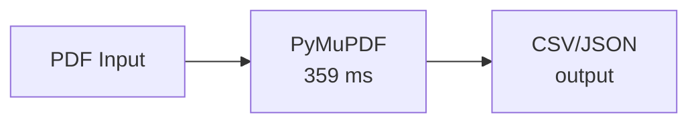
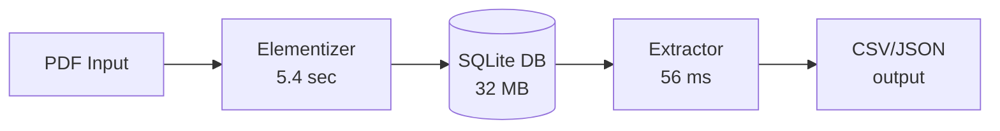
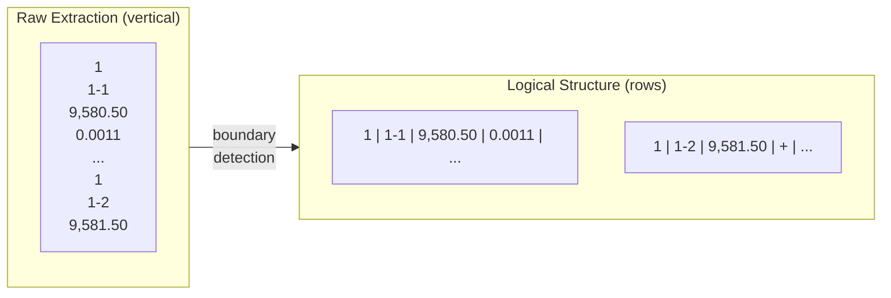

# Architecture & Trade-offs

## Solution Approaches

Two solutions were implemented:

| Approach | Pipeline | Use Case |
|----------|----------|----------|
| **Minimal** | PDF → PyMuPDF → CSV/JSON | Grading, batch processing |
| **Database** | PDF → Elementizer → SQLite → Extractor → CSV/JSON | Development, debugging |

## Minimal Approach (Recommended for Grading)

**Advantages:**
- Single file (~200 lines)
- Single dependency (PyMuPDF)
- No intermediate storage
- 359 ms total processing

**Disadvantages:**
- No intermediate inspection
- Must reprocess PDF for each run
- Harder to debug parsing issues

## Database Approach (Development)

**Advantages:**
- Inspect intermediate state
- Fast repeated queries (56 ms vs 359 ms)
- Web viewer for exploration
- Debug-friendly

**Disadvantages:**
- 6.7 second first-run overhead
- 32 MB disk usage
- More dependencies (flask, click)

## Tool Selection

### PDF Parsing: PyMuPDF

| Tool | Speed | Features | License |
|------|-------|----------|---------|
| **PyMuPDF** ✓ | Fast (C library) | Text + images + vectors | AGPL |
| pdfplumber | Medium | Good table detection | MIT |
| PyPDF2 | Fast | Text only | BSD |
| pdfminer | Slow | Detailed layout | MIT |

**Why PyMuPDF:**
- Fastest extraction (253 pages in <400ms)
- Access to all elements (text, images, lines, paths)
- Preserves position information for table reconstruction

### Data Extraction: Text Parsing vs OCR

| Approach | Latency | Cost | Accuracy |
|----------|---------|------|----------|
| **Text extraction** ✓ | 359 ms | $0 | 100% |
| Tesseract OCR | ~30 sec | $0 | 95-99% |
| OpenAI Vision | ~10 sec | ~$0.50/doc | 98-99% |
| AWS Textract | ~5 sec | ~$1.50/doc | 99%+ |

**Why text extraction:**
- PDF has embedded text (not scanned)
- Zero cost, fastest option
- 100% accuracy for extractable text

**When to use OCR:**
- Scanned documents
- Mixed format (some pages scanned)
- Quality assurance cross-check

### Storage: SQLite

| Storage | Query Speed | Setup | Portability |
|---------|-------------|-------|-------------|
| **SQLite** ✓ | Fast | Zero-config | Single file |
| PostgreSQL | Fast | Server required | Connection string |
| JSON files | Slow for large | None | Multiple files |
| Parquet | Fast | pandas required | Single file |

**Why SQLite:**
- Zero configuration
- Single file (easy to share/backup)
- 224K records with fast queries
- Built into Python stdlib

## Text Extraction Challenge

PyMuPDF extracts text vertically (column-by-column), not row-by-row:

**Solution:** Find sample boundaries by detecting the pattern:
1. Core number (1-2 digits alone)
2. Sample number (X-Y format)
3. Depth (X,XXX.XX format)

Then collect all values until next boundary.

## Error Handling Strategy

| Error Type | Handling | Rationale |
|------------|----------|-----------|
| Missing fields | Empty string | Preserve row structure |
| Below detection (`<X`) | Keep as string | Preserve semantic meaning |
| No saturation (`**`) | Empty string | Consistent with missing |
| Fracture (`+`) | Note in metadata | Preserve relationship to measurement |
| Malformed page | Skip, log warning | Don't fail entire extraction |

## Extensibility Points

| Extension | Approach |
|-----------|----------|
| New document types | Add keyword patterns to classifier |
| Different table formats | Create new parser in `_parse_sample_lines()` |
| OCR fallback | Add `--ocr` flag, route non-text pages to Tesseract |
| Batch processing | Wrap in loop, parallelize with multiprocessing |
| API deployment | Wrap in Flask/FastAPI endpoint |
